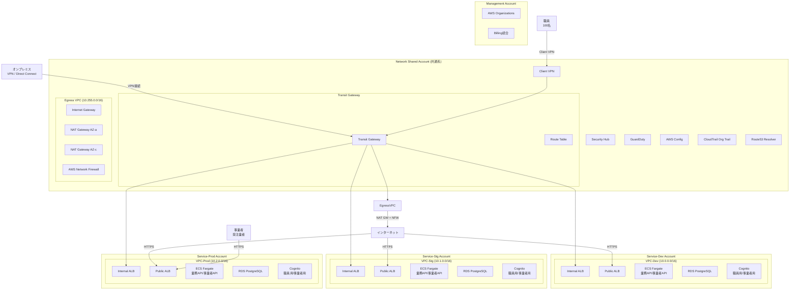
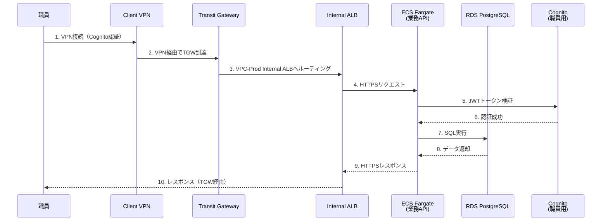
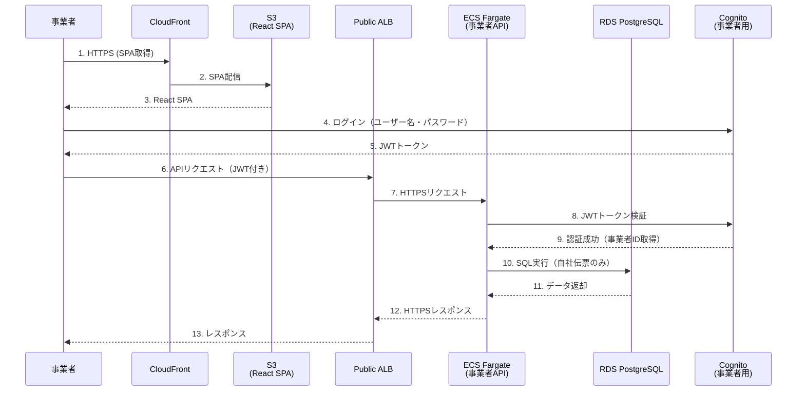
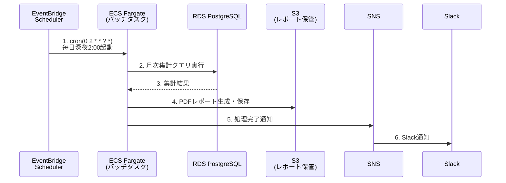
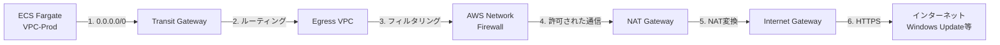

# 01_システムアーキテクチャ

**作成日**: 2025-10-25
**バージョン**: 1.0
**ステータス**: レビュー待ち

---

## 目次
1. [全体構成](#全体構成)
2. [マルチアカウント戦略](#マルチアカウント戦略)
3. [システム構成要素](#システム構成要素)
4. [データフロー](#データフロー)
5. [技術スタック](#技術スタック)

---

## 全体構成

### システム構成図



### アーキテクチャの特徴

1. **マルチアカウント構成**
   - Management Account: AWS Organizations管理、Billing統合
   - Network Shared Account: ネットワーク基盤、セキュリティ、監査
   - Service Accounts (Dev/Stg/Prod): アプリケーション実行環境

2. **Transit Gateway ハブ構成**
   - すべてのVPCを Transit Gateway で接続
   - ルーティングの一元管理
   - 新規VPC追加が容易（拡張性）

3. **Egress VPC による集中化**
   - インターネット向け通信を Egress VPC に集約
   - AWS Network Firewall による通信制御
   - NAT Gateway の共通化（コスト最適化）

4. **セキュリティの多層防御**
   - Security Hub による一元監視
   - GuardDuty による脅威検出
   - AWS Config による構成監査
   - CloudTrail による証跡管理

---

## マルチアカウント戦略

### アカウント構成

| アカウント名 | 目的 | 主要リソース |
|------------|------|------------|
| **Management** | AWS Organizations管理、Billing統合 | AWS Organizations、Cost Explorer |
| **Network Shared** | 共通基盤（ネットワーク、セキュリティ、監査） | Transit Gateway、Egress VPC、Network Firewall、Client VPN、Security Hub、GuardDuty、AWS Config、CloudTrail（Org Trail）、Systems Manager、Route53 Resolver |
| **Service-Dev** | 開発環境 | VPC (10.0.0.0/16)、ECS、RDS、ALB、Cognito |
| **Service-Stg** | ステージング環境 | VPC (10.1.0.0/16)、ECS、RDS、ALB、Cognito |
| **Service-Prod** | 本番環境 | VPC (10.2.0.0/16)、ECS、RDS、ALB、Cognito |

### マルチアカウントのメリット

| メリット | 説明 |
|---------|------|
| **セキュリティ境界の明確化** | 環境間の完全分離（dev環境の問題が本番に影響しない） |
| **請求の分離** | 環境別コスト把握（Cost Explorer、Billing Alerts） |
| **IAM権限の分離** | 開発者は本番アカウントにアクセスできない |
| **リソース制限の分離** | 環境ごとのService Quotas管理 |
| **コンプライアンス対応** | ISMAP準拠（政府情報システムの推奨構成） |

### AWS Organizations OU 構造

```
Root
├── Management
│   └── Management Account
├── Infrastructure
│   └── Network Shared Account
└── Workloads
    ├── Service-Dev Account
    ├── Service-Stg Account
    └── Service-Prod Account
```

### Service Control Policies (SCP)

**適用範囲**: Workloads OU（Dev/Stg/Prod）

```json
{
  "Version": "2012-10-17",
  "Statement": [
    {
      "Effect": "Deny",
      "Action": [
        "ec2:RunInstances"
      ],
      "Resource": "*",
      "Condition": {
        "StringNotEquals": {
          "ec2:InstanceType": [
            "t3.micro",
            "t3.small",
            "t3.medium"
          ]
        }
      }
    },
    {
      "Effect": "Deny",
      "Action": [
        "rds:CreateDBInstance"
      ],
      "Resource": "*",
      "Condition": {
        "StringNotEquals": {
          "rds:DatabaseEngine": "postgres"
        }
      }
    }
  ]
}
```

**意図**: PostgreSQL以外のDBエンジン作成を禁止、承認されたインスタンスタイプのみ許可

---

## システム構成要素

### Management Account

| コンポーネント | 説明 | 備考 |
|--------------|------|------|
| AWS Organizations | マルチアカウント管理 | OU、SCP |
| Cost Explorer | コスト分析 | 環境別コスト把握 |
| Budgets | 予算アラート | 月額100万円超過時に通知 |

### Network Shared Account

| コンポーネント | 説明 | AZ配置 | 備考 |
|--------------|------|--------|------|
| **Transit Gateway** | ハブアンドスポーク型ネットワーク | リージョン | 64,512 ASN |
| **Egress VPC** | インターネット向け通信の集約 | マルチAZ | 10.255.0.0/16 |
| **NAT Gateway** | プライベートサブネットからのインターネット通信 | AZ-a, AZ-c | 冗長化 |
| **Internet Gateway** | パブリックサブネットのインターネット接続 | リージョン | - |
| **AWS Network Firewall** | L3-L7ファイアウォール | マルチAZ | ドメインフィルタリング |
| **Direct Connect Gateway** | オンプレミス接続（VPN） | リージョン | フレッツワイドVPN |
| **Client VPN** | リモートアクセス（管理・検証用） | マルチAZ | Cognito認証 |
| **Security Hub** | セキュリティ一元監視 | リージョン | - |
| **GuardDuty** | 脅威検出 | リージョン | - |
| **AWS Config** | 構成監査 | リージョン | - |
| **CloudTrail (Org Trail)** | 全アカウントの証跡管理 | リージョン | 2年保管 |
| **Systems Manager** | パラメータストア、Session Manager | リージョン | - |
| **Route53 Resolver** | DNS解決 | マルチAZ | オンプレミスDNS転送 |

### Service Accounts (Dev/Stg/Prod)

各環境で以下のコンポーネントを配置：

| コンポーネント | 説明 | AZ配置 | 備考 |
|--------------|------|--------|------|
| **VPC** | 3層サブネット構成 | マルチAZ | Dev: 10.0.0.0/16<br/>Stg: 10.1.0.0/16<br/>Prod: 10.2.0.0/16 |
| **Internal ALB** | 職員向けトラフィック分散 | マルチAZ | internet-facing: false |
| **Public ALB** | 事業者向けトラフィック分散 | マルチAZ | internet-facing: true |
| **ECS Fargate** | コンテナ実行環境 | マルチAZ | 業務API、事業者API、バッチ |
| **RDS PostgreSQL** | データベース | マルチAZ | Stg/ProdのみMulti-AZ |
| **Amazon Cognito** | 認証基盤 | リージョン | 職員用・事業者用で分離 |
| **CloudFront** | CDN（事業者向けSPA配信） | グローバル | - |
| **S3** | 静的コンテンツ、ログ保管 | リージョン | - |
| **ECR** | コンテナイメージレジストリ | リージョン | - |
| **Secrets Manager** | DB接続情報等 | リージョン | - |
| **CloudWatch** | 監視、ログ | リージョン | - |
| **SNS** | アラート通知 | リージョン | メール、Slack、Teams |

---

## データフロー

### 職員向けトラフィック（内部ALB経由）



### 事業者向けトラフィック（Public ALB経由）



### バッチ処理フロー



### インターネット向け通信（Egress VPC経由）



---

## 技術スタック

### インフラ（AWS）

| カテゴリ | サービス | 用途 |
|---------|---------|------|
| **コンピューティング** | ECS Fargate | コンテナ実行環境 |
| **データベース** | RDS PostgreSQL 14 | データ永続化 |
| **ネットワーク** | VPC、Transit Gateway、NAT Gateway | ネットワーク基盤 |
| **ロードバランサー** | ALB | トラフィック分散 |
| **認証** | Amazon Cognito | ユーザー認証 |
| **DNS** | Route53 | ドメイン管理 |
| **CDN** | CloudFront | 静的コンテンツ配信 |
| **ストレージ** | S3 | ログ保管、SPA配信 |
| **コンテナレジストリ** | ECR | Dockerイメージ管理 |
| **シークレット管理** | Secrets Manager | DB接続情報等 |
| **監視・ログ** | CloudWatch | メトリクス、ログ、アラート |
| **セキュリティ** | WAF、Network Firewall、Security Hub、GuardDuty | 多層防御 |
| **証明書** | ACM | TLS証明書 |
| **変更管理** | CloudTrail | API呼び出し履歴 |

### アプリケーション

| レイヤー | 技術 | バージョン |
|---------|------|----------|
| **フロントエンド** | React | 18 |
| **バックエンド** | Node.js + Express | 18 |
| **データベース** | PostgreSQL | 14 |
| **コンテナ** | Docker | - |

### CI/CD

| カテゴリ | ツール | 用途 |
|---------|--------|------|
| **CI/CD** | GitHub Actions | ビルド、テスト、デプロイ自動化 |
| **IaC** | CloudFormation | インフラのコード管理 |
| **コンテナビルド** | Docker | コンテナイメージ作成 |

---

## 設計の妥当性

### Well-Architected Framework 準拠

| 柱 | 実現方法 |
|----|---------|
| **セキュリティ** | 多層防御、暗号化、最小権限の原則、監査ログ |
| **信頼性** | マルチAZ構成、自動フェイルオーバー、バックアップ |
| **パフォーマンス効率** | オートスケーリング、RDSリードレプリカ（将来） |
| **コスト最適化** | リソースサイジング、ストレージライフサイクル |
| **運用上の優秀性** | CloudWatch監視、自動アラート、IaC |
| **持続可能性** | Fargateによるリソース効率化 |

### ISMAP準拠

| 要件 | 実現方法 |
|------|---------|
| **アクセス制御** | Cognito認証、IAMロール、Security Groups |
| **暗号化** | 保存時暗号化（RDS、S3）、転送時暗号化（TLS 1.3） |
| **監査ログ** | CloudTrail、VPCフローログ、ALBアクセスログ（2年保管） |
| **構成監査** | AWS Config、Security Hub |
| **脅威検出** | GuardDuty |

---

## 次のステップ

- [02_ネットワーク設計.md](02_ネットワーク設計.md): VPC、サブネット、ルーティングの詳細
- [03_セキュリティ設計.md](03_セキュリティ設計.md): Security Groups、WAF、認証、暗号化
- [06_コンピュート設計.md](06_コンピュート設計.md): ECS、ALB、AutoScalingの詳細

---

**作成者**: Architect（Claude）
**レビュー状態**: レビュー待ち
