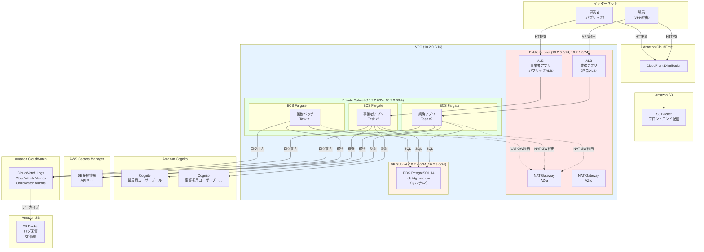
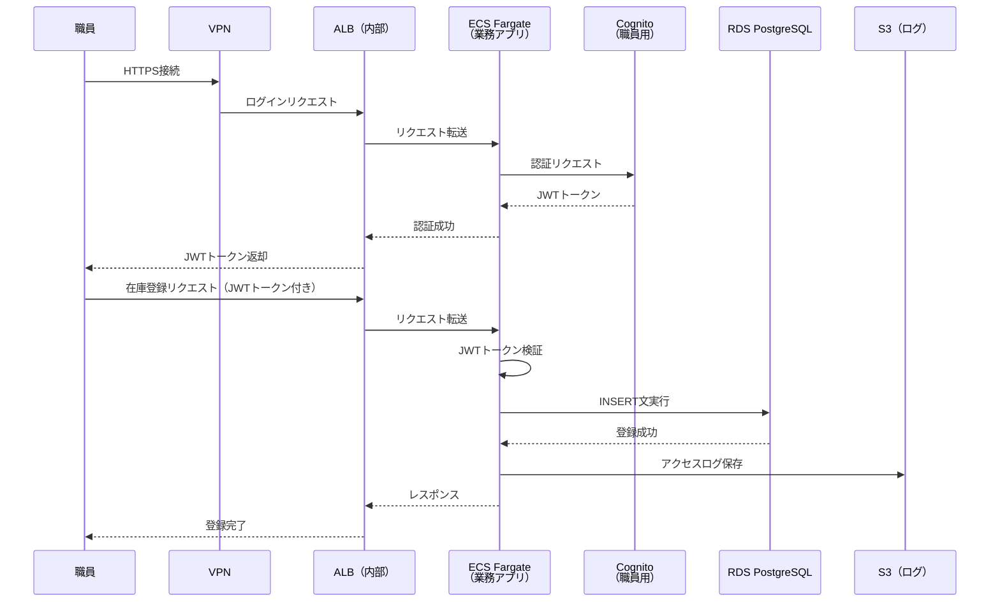
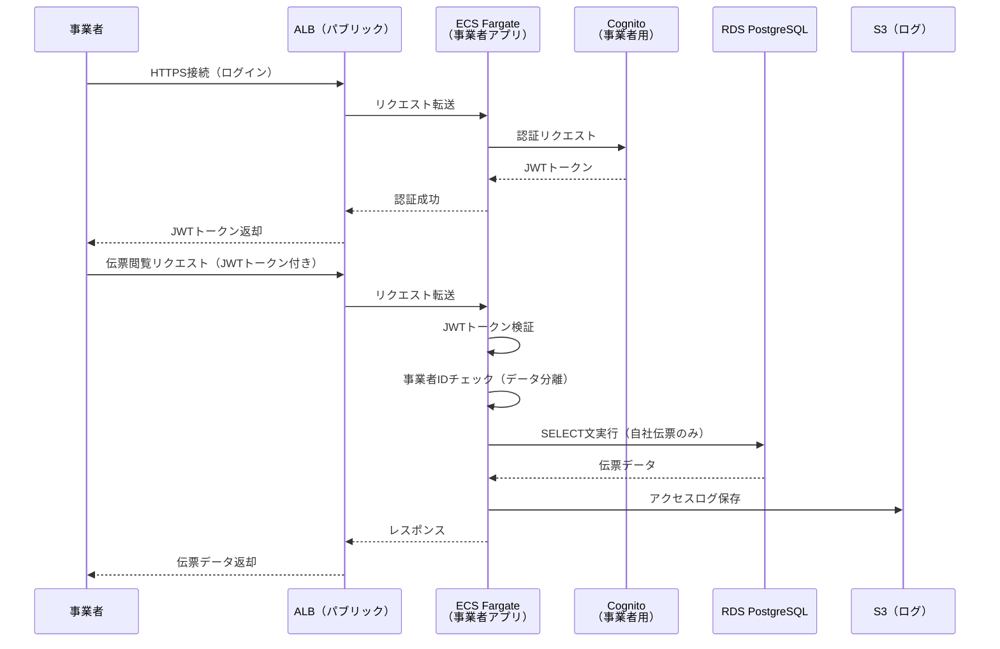
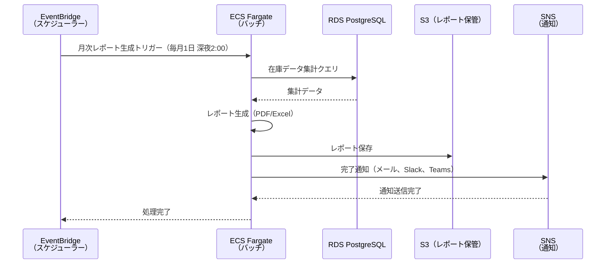
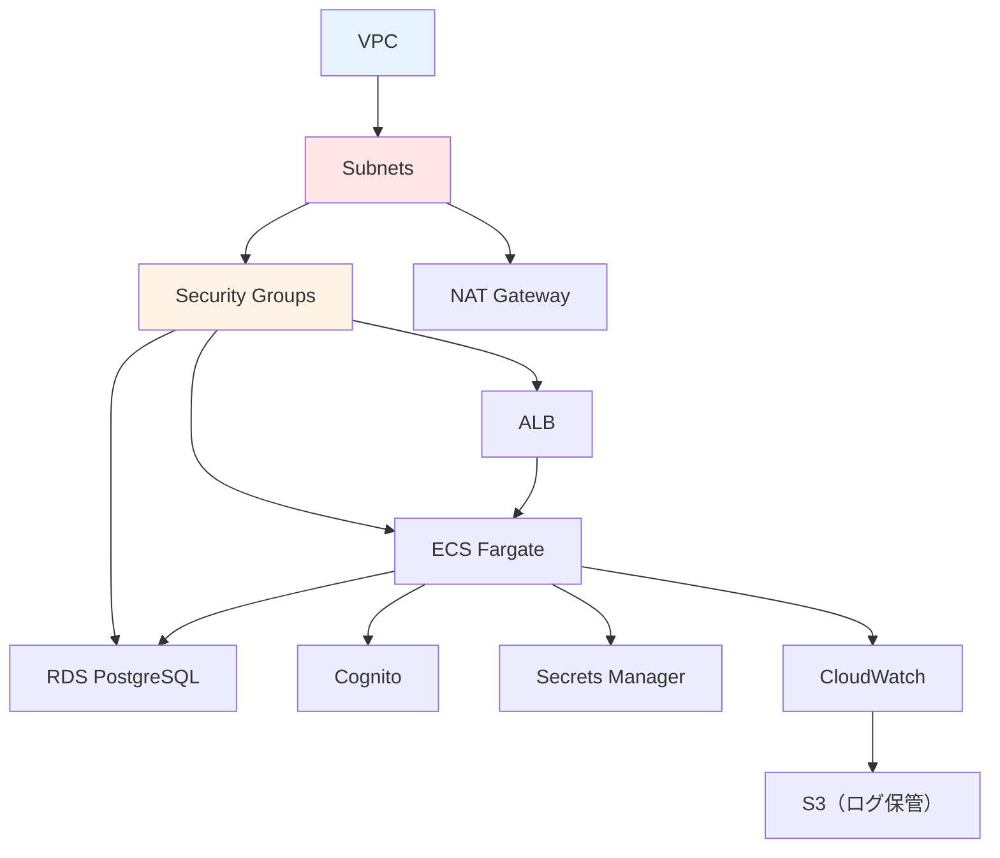
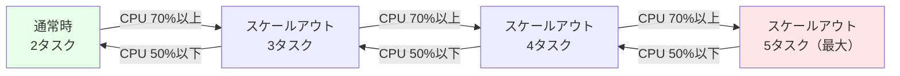

# 01. システム構成設計

**作成日**: 2025-10-25
**バージョン**: 1.0
**ステータス**: PM レビュー待ち

---

## 1.1 システム概要

### システム名称
役所設備管理システム

### システムの目的
公共施設・庁舎の設備機器（空調、電気、消防設備等）の在庫管理、発注管理、レポート出力を行う業務システムをAWS ECS（Fargate）に移行する。

### システム構成の概要
本システムは、以下の3つのアプリケーションで構成される：

1. **業務アプリ（職員向けAPI）**
   - アクセス方式: 閉域（VPN経由）
   - 利用者: 職員100名
   - 主要機能: 在庫管理、発注管理、承認、レポート出力

2. **事業者アプリ（発注業者向けAPI）**
   - アクセス方式: パブリック（インターネット経由）
   - 利用者: 事業者（変動）
   - 主要機能: 伝票閲覧、伝票入力

3. **業務バッチ**
   - アクセス方式: 閉域（定期実行）
   - 利用者: システム（自動実行）
   - 主要機能: 月次・年次集計、レポート自動生成

---

## 1.2 システム構成図

### 全体構成図（prod 環境）

### コンポーネント一覧

| # | コンポーネント | 種別 | 用途 | 冗長化 |
|---|--------------|------|------|--------|
| 1 | CloudFront | CDN | フロントエンド配信 | AWS標準（グローバル） |
| 2 | S3（フロントエンド） | ストレージ | React SPA 配信 | AWS標準（11 9's） |
| 3 | ALB（業務アプリ） | ロードバランサー | 職員向けAPIトラフィック分散（内部ALB） | マルチAZ（2AZ） |
| 4 | ALB（事業者アプリ） | ロードバランサー | 事業者向けAPIトラフィック分散（パブリックALB） | マルチAZ（2AZ） |
| 5 | ECS Fargate（業務アプリ） | コンテナ | 職員向けAPI実行環境 | マルチAZ（2タスク、最大5タスク） |
| 6 | ECS Fargate（事業者アプリ） | コンテナ | 事業者向けAPI実行環境 | マルチAZ（2タスク、最大5タスク） |
| 7 | ECS Fargate（業務バッチ） | コンテナ | バッチ処理実行環境 | 単一タスク |
| 8 | RDS PostgreSQL 14 | データベース | データ永続化 | マルチAZ |
| 9 | Cognito（職員用） | 認証基盤 | 職員認証 | AWS標準 |
| 10 | Cognito（事業者用） | 認証基盤 | 事業者認証 | AWS標準 |
| 11 | Secrets Manager | シークレット管理 | DB接続情報、APIキー | AWS標準 |
| 12 | CloudWatch | 監視・ログ | メトリクス、ログ、アラート | AWS標準 |
| 13 | S3（ログ保管） | ストレージ | 監査ログ2年間保管 | AWS標準（11 9's） |
| 14 | NAT Gateway | ネットワーク | プライベートサブネットからのインターネットアクセス | マルチAZ（2AZ） |

---

## 1.3 環境別構成

### 3環境の構成

| 環境 | 用途 | VPC CIDR | ECS タスク数 | RDS インスタンス | 備考 |
|------|------|---------|------------|---------------|------|
| **dev** | 開発環境 | 10.0.0.0/16 | 1（固定） | db.t4g.micro（シングルAZ） | コスト最小化 |
| **stg** | ステージング（本番前検証） | 10.1.0.0/16 | 2（固定） | db.t4g.small（マルチAZ） | 本番構成の縮小版 |
| **prod** | 本番環境 | 10.2.0.0/16 | 2-5（オートスケーリング） | db.t4g.medium（マルチAZ） | 本番スペック |

### 環境別リソーススペック

#### ECS Fargate

| 環境 | CPU | メモリ | タスク数（最小-最大） | 備考 |
|------|-----|--------|---------------------|------|
| dev | 0.25 vCPU | 0.5GB | 1（固定） | 開発用 |
| stg | 0.25 vCPU | 0.5GB | 2（固定） | 検証用 |
| prod | 0.5 vCPU | 1GB | 2-5（オートスケーリング） | CPU 70%でスケール |

**注**: 業務API、事業者API、バッチで個別にタスク定義を作成する。

#### RDS PostgreSQL

| 環境 | インスタンスタイプ | ストレージ | マルチAZ | 備考 |
|------|------------------|----------|---------|------|
| dev | db.t4g.micro | 20GB（gp3） | 無効 | 開発用（コスト削減） |
| stg | db.t4g.small | 50GB（gp3） | 有効 | 検証用 |
| prod | db.t4g.medium | 100GB（gp3） | 有効 | 本番用（初期値） |

**注**: 実運用後、CloudWatchメトリクスを見て調整する。

---

## 1.4 データフロー

### 業務アプリ（職員向け）のデータフロー

### 事業者アプリ（発注業者向け）のデータフロー

### 業務バッチのデータフロー

---

## 1.5 コンポーネント間の依存関係

### 依存関係図

### 構築順序

1. **ネットワーク層**
   - VPC
   - Subnets（Public、Private、DB）
   - Internet Gateway
   - NAT Gateway
   - Route Tables
   - Security Groups

2. **データベース層**
   - RDS PostgreSQL（マルチAZ）

3. **認証層**
   - Cognito ユーザープール（職員用・事業者用）

4. **シークレット管理層**
   - Secrets Manager（DB接続情報）

5. **コンピューティング層**
   - ECR リポジトリ
   - ECS Cluster
   - ECS Task Definition
   - ALB
   - ECS Service

6. **フロントエンド配信層**
   - S3 Bucket（フロントエンド）
   - CloudFront Distribution

7. **監視・ログ層**
   - CloudWatch Log Groups
   - CloudWatch Alarms
   - SNS Topics
   - S3 Bucket（ログ保管）

---

## 1.6 スケーラビリティ設計

### ECS Fargate オートスケーリング

#### オートスケーリング設定（prod環境）

| 項目 | 設定値 | 備考 |
|------|--------|------|
| 最小タスク数 | 2 | 通常時は2タスク |
| 最大タスク数 | 5 | ピーク時は5タスクまで拡張 |
| スケールアウト閾値 | CPU使用率 70% | 2分間連続で超えた場合 |
| スケールイン閾値 | CPU使用率 50% | 5分間連続で下回った場合 |
| クールダウン期間 | 300秒（5分） | 頻繁なスケールを防止 |

#### スケーリングシミュレーション

### RDS スケーラビリティ

#### リードレプリカ（将来の拡張）

現時点では不要だが、将来的にリード負荷が高くなった場合、以下の拡張を検討：

- **リードレプリカの追加**: レポート生成用の読み取り専用レプリカ
- **Aurora PostgreSQL への移行**: より高いスケーラビリティが必要な場合

---

## 1.7 ヒアリング事項（仮決定）

以下の項目は、本来ユーザーに確認すべきですが、合理的な仮決定をしました：

| 項目 | 仮決定内容 | 理由 | ユーザー確認推奨度 |
|------|----------|------|------------------|
| VPC CIDR設計 | dev: 10.0.0.0/16, stg: 10.1.0.0/16, prod: 10.2.0.0/16 | 標準的な分割、重複なし | 中 |
| ECS タスク数（prod） | 最小2、最大5 | 可用性と性能要件のバランス | 低 |
| ECS CPU/メモリ（prod） | 0.5vCPU/1GB | 要件定義書の記載に基づく | 低 |
| RDS インスタンスタイプ（prod） | db.t4g.medium | 性能要件とコストのバランス | 中 |
| RDS ストレージ（prod） | 100GB（初期値） | データ量の見積もりに基づく | 中 |
| オートスケーリング閾値 | CPU 70%でスケールアウト | 一般的な閾値 | 中 |
| ALB の構成 | 業務アプリ用と事業者アプリ用で分離 | セキュリティ分離とアクセス制御の明確化 | 低 |

---

**作成者**: architect サブエージェント
**最終更新**: 2025-10-25
