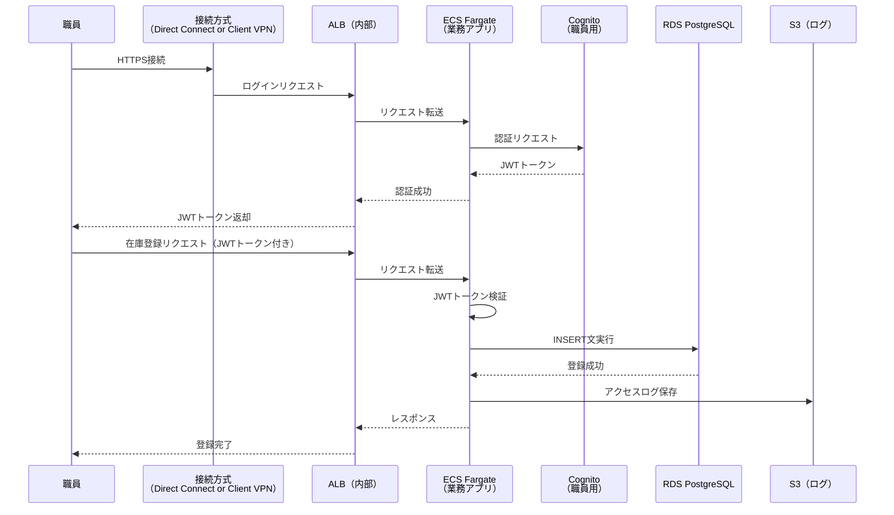
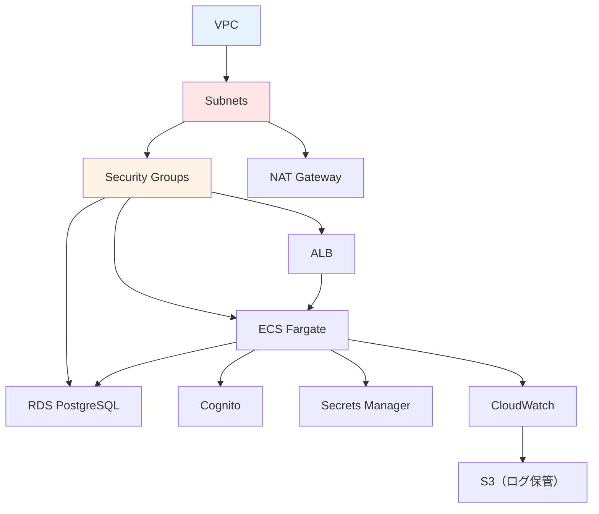
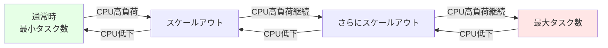

# 01. システム構成設計

**作成日**: 2025-10-25
**バージョン**: 1.2
**ステータス**: PM レビュー待ち

**更新履歴**:
- v1.2 (2025-10-29): **重要な修正** - アカウント構成を4つに修正（Shared + dev/stg/prod）、接続方式の環境別差分を明記
- v1.1 (2025-10-25): マルチアカウント構成追加（Shared Account + Transit Gateway + Direct Connect）
- v1.0 (2025-10-25): 初版作成

---

## 1.0 マルチアカウント構成概要

### アカウント構成

本システムは、**Shared Account（共有基盤）** と **Service Account（サービスアカウント）×3環境** の **4アカウント構成** で設計されています。

| アカウント | 役割 | 主要リソース | VPC CIDR | 拠点接続方式 | 開発会社接続方式 |
|-----------|------|------------|---------|------------|--------------|
| **Shared Account** | ネットワークハブ・監査基盤・組織管理 | Transit Gateway、Direct Connect Gateway、Client VPN Endpoint（拠点用）、Client VPN Endpoint（開発会社用）、CloudTrail、Config、GuardDuty、Security Hub、AWS Organizations | - | - | - |
| **Service Account (dev)** | 開発環境専用アカウント | VPC、ECS、RDS、ALB、Cognito | 10.0.0.0/16 | **Client VPN または Direct Connect**（回線契約の時期次第） | **Client VPN**（開発会社専用） |
| **Service Account (stg)** | ステージング環境専用アカウント | VPC、ECS、RDS、ALB、Cognito | 10.1.0.0/16 | **Direct Connect**（本番共有） | **Client VPN**（開発会社専用） |
| **Service Account (prod)** | 本番環境専用アカウント | VPC、ECS、RDS、ALB、Cognito | 10.2.0.0/16 | **Direct Connect**（本番運用） | **検討中**（セキュリティ要件次第） |

### 拠点との接続方式（環境別）

#### 本番環境（prod）・ステージング環境（stg）
- **拠点数**: 20拠点（各拠点100台の端末）
- **利用者**: 職員100名
- **接続方式**: AWS Direct Connect（100Mbps Hosted Connection）経由
- **ネットワークハブ**: Transit Gateway（Shared Account）
- **備考**: prod と stg で Direct Connect を共有（本番運用）

#### 開発環境（dev）
- **拠点数**: 20拠点（各拠点100台の端末）
- **利用者**: 職員100名
- **接続方式**: **Client VPN または Direct Connect**（回線契約の時期次第で変更）
- **ネットワークハブ**: Transit Gateway（Shared Account）
- **備考**: 回線契約完了後は Direct Connect を prod/stg/dev で共有可能

### 開発会社の接続方式（環境別）

#### 開発環境（dev）・ステージング環境（stg）
- **接続方式**: AWS Client VPN（開発会社専用）
- **ネットワークハブ**: Transit Gateway（Shared Account）
- **備考**: 開発会社による開発・検証用アクセス

#### 本番環境（prod）
- **接続方式**: 検討中（セキュリティ要件次第）
- **備考**: 本番環境へのアクセスは慎重に判断

### AWS Organizations 構成

```
AWS Organizations（Shared Account が管理アカウント）
├── Shared Account（ou=shared）
├── Service Account (dev)（ou=services/dev）
├── Service Account (stg)（ou=services/stg）
└── Service Account (prod)（ou=services/prod）
```

---

## 1.1 システム概要

### システム名称
役所設備管理システム

### システムの目的
公共施設・庁舎の設備機器（空調、電気、消防設備等）の在庫管理、発注管理、レポート出力を行う業務システムをAWS ECS（Fargate）に移行する。

### システム構成の概要
本システムは、以下の3つのアプリケーションで構成される：

1. **業務アプリ（職員向けAPI）**
   - アクセス方式: 閉域（拠点からの接続）
     - **prod/stg**: Direct Connect 経由
     - **dev**: Client VPN 経由
   - 利用者: 職員100名（20拠点に分散）
   - 主要機能: 在庫管理、発注管理、承認、レポート出力

2. **事業者アプリ（発注業者向けAPI）**
   - アクセス方式: パブリック（インターネット経由）
   - 利用者: 事業者（変動）
   - 主要機能: 伝票閲覧、伝票入力

3. **業務バッチ**
   - アクセス方式: 閉域（定期実行）
   - 利用者: システム（自動実行）
   - 主要機能: 月次・年次集計、レポート自動生成

---

## 1.2 システム構成図

### マルチアカウント全体構成図（4アカウント構成）

```mermaid
graph TB
    subgraph OnPremises["拠点（20拠点）"]
        Branch["拠点端末<br/>（各拠点100台）"]
    end

    subgraph Internet["インターネット"]
        User2["事業者<br/>（パブリック）"]
    end

    subgraph SharedAccount["Shared Account（共有基盤）"]
        subgraph DX["Direct Connect 接続（prod/stg 共有）"]
            DXConn["Direct Connect<br/>100Mbps<br/>Hosted Connection"]
            DXGW["Direct Connect<br/>Gateway"]
            VIF["Transit VIF<br/>（プライベート）"]
        end

        subgraph VPN["Client VPN（dev 専用）"]
            CVPN["Client VPN<br/>Endpoint"]
        end

        subgraph TGW["Transit Gateway（すべての環境のハブ）"]
            TGWHub["TGW<br/>ネットワークハブ"]
        end

        subgraph Audit["監査・セキュリティ"]
            CloudTrailOrg["CloudTrail<br/>（組織全体）"]
            ConfigOrg["Config<br/>（組織全体）"]
            GuardDutyOrg["GuardDuty<br/>（組織全体）"]
            SecurityHubOrg["Security Hub<br/>（組織全体）"]
        end

        subgraph Org["AWS Organizations"]
            OrgRoot["Organizations<br/>（管理アカウント）"]
        end
    end

    subgraph ServiceAccountDev["Service Account (dev)<br/>開発環境専用アカウント"]
        subgraph VPCDev["VPC (10.0.0.0/16)"]
            TGWATTDev["Transit Gateway<br/>Attachment"]

            subgraph PublicSubnetDev["Public Subnet"]
                ALB1Dev["ALB<br/>業務アプリ<br/>（内部）"]
                ALB2Dev["ALB<br/>事業者アプリ<br/>（パブリック）"]
                NATGWDev["NAT Gateway"]
            end

            subgraph PrivateSubnetDev["Private Subnet"]
                ECS1Dev["ECS Fargate<br/>業務API"]
                ECS2Dev["ECS Fargate<br/>事業者API"]
                ECS3Dev["ECS Fargate<br/>バッチ"]
            end

            subgraph DBSubnetDev["DB Subnet"]
                RDSDev["RDS PostgreSQL<br/>シングルAZ"]
            end
        end
    end

    subgraph ServiceAccountStg["Service Account (stg)<br/>ステージング環境専用アカウント"]
        subgraph VPCStg["VPC (10.1.0.0/16)"]
            TGWATTStg["Transit Gateway<br/>Attachment"]

            subgraph PublicSubnetStg["Public Subnet"]
                ALB1Stg["ALB<br/>業務アプリ<br/>（内部）"]
                ALB2Stg["ALB<br/>事業者アプリ<br/>（パブリック）"]
                NATGWStg["NAT Gateway"]
            end

            subgraph PrivateSubnetStg["Private Subnet"]
                ECS1Stg["ECS Fargate<br/>業務API"]
                ECS2Stg["ECS Fargate<br/>事業者API"]
                ECS3Stg["ECS Fargate<br/>バッチ"]
            end

            subgraph DBSubnetStg["DB Subnet"]
                RDSStg["RDS PostgreSQL<br/>マルチAZ"]
            end
        end
    end

    subgraph ServiceAccountProd["Service Account (prod)<br/>本番環境専用アカウント"]
        subgraph VPCProd["VPC (10.2.0.0/16)"]
            TGWATTProd["Transit Gateway<br/>Attachment"]

            subgraph PublicSubnetProd["Public Subnet"]
                ALB1Prod["ALB<br/>業務アプリ<br/>（内部）"]
                ALB2Prod["ALB<br/>事業者アプリ<br/>（パブリック）"]
                NATGWProd["NAT Gateway"]
            end

            subgraph PrivateSubnetProd["Private Subnet"]
                ECS1Prod["ECS Fargate<br/>業務API"]
                ECS2Prod["ECS Fargate<br/>事業者API"]
                ECS3Prod["ECS Fargate<br/>バッチ"]
            end

            subgraph DBSubnetProd["DB Subnet"]
                RDSProd["RDS PostgreSQL<br/>マルチAZ"]
            end
        end
    end

    %% Direct Connect フロー（prod/stg）
    Branch -->|BGP| DXConn
    DXConn --> VIF
    VIF --> DXGW
    DXGW --> TGWHub
    TGWHub -->|Direct Connect 経由<br/>（太線・実線）| TGWATTStg
    TGWHub -->|Direct Connect 経由<br/>（太線・実線）| TGWATTProd

    %% Client VPN フロー（dev）
    Branch -.->|VPN接続<br/>（点線）| CVPN
    CVPN -.->|Client VPN 経由<br/>（コスト削減）| TGWHub
    TGWHub -.->|Client VPN 経由<br/>（点線）| TGWATTDev

    %% インターネットフロー（すべての環境）
    User2 -->|HTTPS| ALB2Dev
    User2 -->|HTTPS| ALB2Stg
    User2 -->|HTTPS| ALB2Prod

    %% dev 環境内部フロー
    TGWATTDev --> ALB1Dev
    ALB1Dev --> ECS1Dev
    ALB2Dev --> ECS2Dev
    ECS1Dev --> RDSDev
    ECS2Dev --> RDSDev
    ECS3Dev --> RDSDev

    %% stg 環境内部フロー
    TGWATTStg --> ALB1Stg
    ALB1Stg --> ECS1Stg
    ALB2Stg --> ECS2Stg
    ECS1Stg --> RDSStg
    ECS2Stg --> RDSStg
    ECS3Stg --> RDSStg

    %% prod 環境内部フロー
    TGWATTProd --> ALB1Prod
    ALB1Prod --> ECS1Prod
    ALB2Prod --> ECS2Prod
    ECS1Prod --> RDSProd
    ECS2Prod --> RDSProd
    ECS3Prod --> RDSProd

    %% 監査フロー
    OrgRoot -.->|管理| ServiceAccountDev
    OrgRoot -.->|管理| ServiceAccountStg
    OrgRoot -.->|管理| ServiceAccountProd
    CloudTrailOrg -.->|監査ログ収集| ServiceAccountDev
    CloudTrailOrg -.->|監査ログ収集| ServiceAccountStg
    CloudTrailOrg -.->|監査ログ収集| ServiceAccountProd
    ConfigOrg -.->|設定変更記録| ServiceAccountDev
    ConfigOrg -.->|設定変更記録| ServiceAccountStg
    ConfigOrg -.->|設定変更記録| ServiceAccountProd
    GuardDutyOrg -.->|脅威検知| ServiceAccountDev
    GuardDutyOrg -.->|脅威検知| ServiceAccountStg
    GuardDutyOrg -.->|脅威検知| ServiceAccountProd
    SecurityHubOrg -.->|セキュリティ統合| ServiceAccountDev
    SecurityHubOrg -.->|セキュリティ統合| ServiceAccountStg
    SecurityHubOrg -.->|セキュリティ統合| ServiceAccountProd

    %% スタイル
    style SharedAccount fill:#e6f3ff
    style ServiceAccountDev fill:#e6ffe6
    style ServiceAccountStg fill:#ffe6cc
    style ServiceAccountProd fill:#ffe6e6
    style OnPremises fill:#fff3e6
    style DX stroke:#ff6600,stroke-width:3px
    style VPN stroke:#0066ff,stroke-width:3px,stroke-dasharray: 5 5
```



### 拠点接続フローの詳細

#### Direct Connect フロー（prod/stg 共有）

```
拠点（20拠点）
  ↓
  BGP ピアリング
  ↓
Direct Connect（100Mbps Hosted Connection）- Shared Account
  ↓
Transit Virtual Interface（VIF）
  ↓
Direct Connect Gateway - Shared Account
  ↓
Transit Gateway - Shared Account
  ├─→ Transit Gateway Attachment - Service Account (stg)
  │     ↓
  │   VPC (10.1.0.0/16) - stg 環境
  │
  └─→ Transit Gateway Attachment - Service Account (prod)
        ↓
      VPC (10.2.0.0/16) - prod 環境
```

#### Client VPN フロー（dev 専用）

```
拠点（開発者）
  ↓
  VPN クライアント接続
  ↓
Client VPN Endpoint - Shared Account
  ↓
Transit Gateway - Shared Account
  ↓
Transit Gateway Attachment - Service Account (dev)
  ↓
VPC (10.0.0.0/16) - dev 環境
```

---

## 1.3 環境別構成

### 3環境の構成

本システムは、dev（開発）、stg（ステージング）、prod（本番）の3環境で構成されます。

**環境別の方針**:
- **dev環境**: コスト最小化（シングルAZ、最小スペック、Client VPN）
- **stg環境**: 本番構成の縮小版（検証用、Direct Connect 共有）
- **prod環境**: 本番スペック（マルチAZ、オートスケーリング、Direct Connect）

### 環境別の設定値

| 設定項目 | dev | stg | prod |
|---------|-----|-----|------|
| **VPC CIDR** | 10.0.0.0/16 | 10.1.0.0/16 | 10.2.0.0/16 |
| **拠点接続方式** | **Client VPN または Direct Connect** | **Direct Connect** | **Direct Connect** |
| **開発会社接続方式** | **Client VPN** | **Client VPN** | **検討中** |
| **RDS 構成** | シングルAZ | マルチAZ | マルチAZ |
| **ECS タスク数（最小）** | 1 | 1 | 2 |
| **ECS タスク数（最大）** | 2 | 4 | 10 |
| **ALB スキーム（業務アプリ）** | internal | internal | internal |
| **ALB スキーム（事業者アプリ）** | internet-facing | internet-facing | internet-facing |

---

## 1.4 データフロー

### 業務アプリ（職員向け）のデータフロー



**注**: 接続方式は環境により異なります:
- **dev**: Client VPN 経由
- **stg**: Direct Connect 経由
- **prod**: Direct Connect 経由

---

## 1.5 コンポーネント間の依存関係

### 依存関係図



### 構築順序（マルチアカウント対応）

#### フェーズ1: Shared Account 基盤構築

1. **組織管理層**
   - AWS Organizations 作成（Shared Account を管理アカウントに設定）
   - 組織ユニット（OU）作成
   - Service Account (dev/stg/prod) を組織に招待・追加

2. **ネットワークハブ層**
   - Transit Gateway 作成
   - Transit Gateway Route Table 作成

3. **Direct Connect 接続層（prod/stg 用）**
   - Direct Connect Connection（100Mbps Hosted Connection）作成
   - Direct Connect Gateway 作成
   - Transit Virtual Interface（VIF）作成
   - Direct Connect Gateway と Transit Gateway の関連付け

4. **Client VPN 接続層（dev 用）**
   - Client VPN Endpoint 作成
   - Transit Gateway との関連付け

5. **監査・セキュリティ層**
   - CloudTrail（組織全体）有効化
   - Config（組織全体）有効化
   - GuardDuty（組織全体）有効化
   - Security Hub（組織全体）有効化
   - S3 Bucket（監査ログ保管）作成

#### フェーズ2: Service Account アプリケーション構築（dev/stg/prod 各環境）

1. **ネットワーク層**
   - VPC
   - Subnets（Public、Private、DB）
   - Internet Gateway
   - NAT Gateway
   - Route Tables（Transit Gateway ルート含む）
   - Security Groups
   - Transit Gateway Attachment（Shared Account の TGW に接続）

2. **データベース層**
   - RDS PostgreSQL（dev: シングルAZ、stg/prod: マルチAZ）

3. **認証層**
   - Cognito ユーザープール（職員用・事業者用）

4. **シークレット管理層**
   - Secrets Manager（DB接続情報）

5. **コンピューティング層**
   - ECR リポジトリ
   - ECS Cluster
   - ECS Task Definition
   - ALB
   - ECS Service

6. **フロントエンド配信層**
   - S3 Bucket（フロントエンド）
   - CloudFront Distribution

7. **監視・ログ層**
   - CloudWatch Log Groups
   - CloudWatch Alarms
   - SNS Topics
   - S3 Bucket（ローカルログ保管）

**構築の優先順位**:
1. **まず本番（prod）を構築**
2. その構成を3環境（dev/stg/prod）に展開
3. 接続方式のみ環境別に差分を設定（dev: Client VPN、stg/prod: Direct Connect）

**注**: Shared Account（フェーズ1）を先に構築してから、Service Account（フェーズ2）を構築する必要があります。

---

## 1.6 スケーラビリティ設計

### ECS Fargate オートスケーリング

**オートスケーリングの方針**:
- 通常時は最小タスク数で運用
- CPU使用率が一定値を超えた場合、自動的にタスク数を増やす
- CPU使用率が下がった場合、自動的にタスク数を減らす
- クールダウン期間を設けて、頻繁なスケールを防止

**スケーリングシミュレーション**:


### RDS スケーラビリティ

**リードレプリカ（将来の拡張）**:
現時点では不要だが、将来的にリード負荷が高くなった場合、以下の拡張を検討：
- リードレプリカの追加: レポート生成用の読み取り専用レプリカ
- Aurora PostgreSQL への移行: より高いスケーラビリティが必要な場合

---

## 1.7 ヒアリング結果と仮決定

### ユーザー確認済み事項

以下の項目は、ユーザーとのヒアリングで確定しました：

| 項目 | 確定内容 | 確認日 |
|------|---------|-------|
| **マルチアカウント構成** | **4アカウント構成（Shared + dev/stg/prod）** | 2025-10-29 |
| **拠点接続方式（prod/stg）** | AWS Direct Connect（100Mbps Hosted Connection） | 2025-10-29 |
| **拠点接続方式（dev）** | **Client VPN または Direct Connect**（回線契約の時期次第） | 2025-10-29 |
| **開発会社接続方式（dev/stg）** | AWS Client VPN（開発会社専用） | 2025-10-29 |
| **開発会社接続方式（prod）** | 検討中（セキュリティ要件次第） | 2025-10-29 |
| Direct Connect構成 | Direct Connect Gateway + Transit Gateway | 2025-10-25 |
| 拠点数・端末数 | 20拠点、各拠点100台（合計2,000台） | 2025-10-25 |
| 監査ログ集約 | Shared Account で組織全体のログを集約 | 2025-10-25 |
| AWS Organizations | 使用する（Shared Account を管理アカウントに設定） | 2025-10-25 |

### 仮決定事項

以下の項目は、本来ユーザーに確認すべきですが、合理的な仮決定をしました：

| 項目 | 仮決定内容 | 理由 | ユーザー確認推奨度 |
|------|----------|------|------------------|
| ALB の構成 | 業務アプリ用と事業者アプリ用で分離 | セキュリティ分離とアクセス制御の明確化 | 低 |
| Direct Connect 冗長化 | 初期は単一接続、将来的に冗長化を検討 | コストとリスクのバランス | 中 |

**注**: 具体的な設定値（CIDR、インスタンスタイプ、タスク数等）は、パラメーターシートを参照してください。

---

**作成者**: architect サブエージェント
**最終更新**: 2025-10-29
