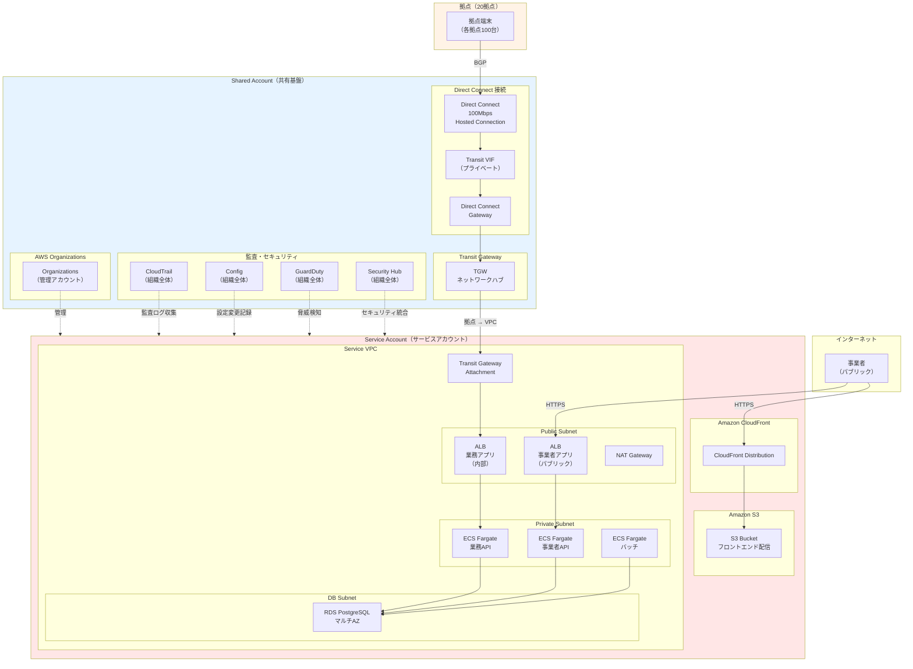
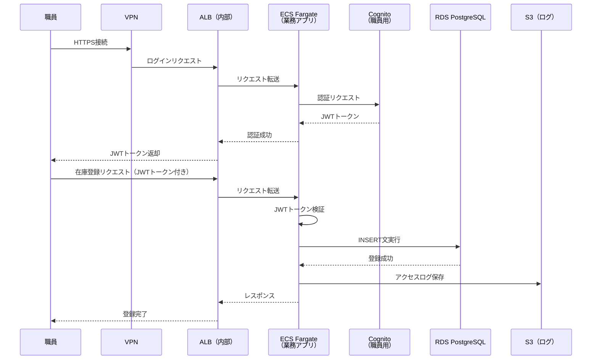
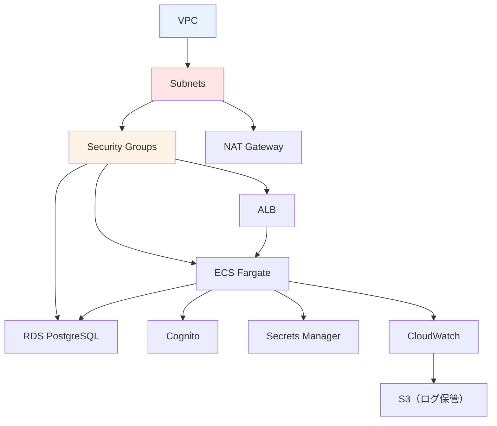
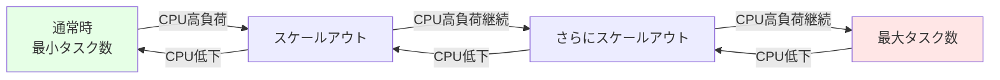

# 01. システム構成設計

**作成日**: 2025-10-25
**バージョン**: 1.1
**ステータス**: PM レビュー待ち

**更新履歴**:
- v1.1 (2025-10-25): マルチアカウント構成追加（Shared Account + Transit Gateway + Direct Connect）
- v1.0 (2025-10-25): 初版作成

---

## 1.0 マルチアカウント構成概要

### アカウント構成

本システムは、**Shared Account（共有基盤）** と **Service Account（サービスアカウント）** の2アカウント構成で設計されています。

| アカウント | 役割 | 主要リソース | 備考 |
|-----------|------|------------|------|
| **Shared Account** | ネットワークハブ・監査基盤・組織管理 | Transit Gateway、Direct Connect Gateway、CloudTrail、Config、GuardDuty、Security Hub、AWS Organizations | 今後他サービスが追加される際の共通基盤 |
| **Service Account** | 設備管理アプリケーション実行環境 | VPC、ECS、RDS、ALB、Cognito | 本システムのアプリケーションとデータ |

### 拠点との接続

- **拠点数**: 20拠点（各拠点100台の端末）
- **接続方式**: AWS Direct Connect（100Mbps Hosted Connection）経由
- **ネットワークハブ**: Transit Gateway（Shared Account）

### AWS Organizations 構成

```
AWS Organizations（Shared Account が管理アカウント）
├── Shared Account（ou=shared）
└── Service Account（ou=services）
```

---

## 1.1 システム概要

### システム名称
役所設備管理システム

### システムの目的
公共施設・庁舎の設備機器（空調、電気、消防設備等）の在庫管理、発注管理、レポート出力を行う業務システムをAWS ECS（Fargate）に移行する。

### システム構成の概要
本システムは、以下の3つのアプリケーションで構成される：

1. **業務アプリ（職員向けAPI）**
   - アクセス方式: 閉域（拠点からのDirect Connect経由）
   - 利用者: 職員100名（20拠点に分散）
   - 主要機能: 在庫管理、発注管理、承認、レポート出力

2. **事業者アプリ（発注業者向けAPI）**
   - アクセス方式: パブリック（インターネット経由）
   - 利用者: 事業者（変動）
   - 主要機能: 伝票閲覧、伝票入力

3. **業務バッチ**
   - アクセス方式: 閉域（定期実行）
   - 利用者: システム（自動実行）
   - 主要機能: 月次・年次集計、レポート自動生成

---

## 1.2 システム構成図

### マルチアカウント全体構成図



---

## 1.3 環境別構成

### 3環境の構成

本システムは、dev（開発）、stg（ステージング）、prod（本番）の3環境で構成されます。

**環境別の方針**:
- **dev環境**: コスト最小化（シングルAZ、最小スペック）
- **stg環境**: 本番構成の縮小版（検証用）
- **prod環境**: 本番スペック（マルチAZ、オートスケーリング）

---

## 1.4 データフロー

### 業務アプリ（職員向け）のデータフロー



---

## 1.5 コンポーネント間の依存関係

### 依存関係図



### 構築順序（マルチアカウント対応）

#### フェーズ1: Shared Account 基盤構築

1. **組織管理層**
   - AWS Organizations 作成（Shared Account を管理アカウントに設定）
   - 組織ユニット（OU）作成
   - Service Account を組織に招待・追加

2. **ネットワークハブ層**
   - Transit Gateway 作成
   - Transit Gateway Route Table 作成

3. **Direct Connect 接続層**
   - Direct Connect Connection（100Mbps Hosted Connection）作成
   - Direct Connect Gateway 作成
   - Transit Virtual Interface（VIF）作成
   - Direct Connect Gateway と Transit Gateway の関連付け

4. **監査・セキュリティ層**
   - CloudTrail（組織全体）有効化
   - Config（組織全体）有効化
   - GuardDuty（組織全体）有効化
   - Security Hub（組織全体）有効化
   - S3 Bucket（監査ログ保管）作成

#### フェーズ2: Service Account アプリケーション構築

1. **ネットワーク層**
   - VPC
   - Subnets（Public、Private、DB）
   - Internet Gateway
   - NAT Gateway
   - Route Tables（Transit Gateway ルート含む）
   - Security Groups
   - Transit Gateway Attachment（Shared Account の TGW に接続）

2. **データベース層**
   - RDS PostgreSQL（マルチAZ）

3. **認証層**
   - Cognito ユーザープール（職員用・事業者用）

4. **シークレット管理層**
   - Secrets Manager（DB接続情報）

5. **コンピューティング層**
   - ECR リポジトリ
   - ECS Cluster
   - ECS Task Definition
   - ALB
   - ECS Service

6. **フロントエンド配信層**
   - S3 Bucket（フロントエンド）
   - CloudFront Distribution

7. **監視・ログ層**
   - CloudWatch Log Groups
   - CloudWatch Alarms
   - SNS Topics
   - S3 Bucket（ローカルログ保管）

**注**: Shared Account（フェーズ1）を先に構築してから、Service Account（フェーズ2）を構築する必要があります。

---

## 1.6 スケーラビリティ設計

### ECS Fargate オートスケーリング

**オートスケーリングの方針**:
- 通常時は最小タスク数で運用
- CPU使用率が一定値を超えた場合、自動的にタスク数を増やす
- CPU使用率が下がった場合、自動的にタスク数を減らす
- クールダウン期間を設けて、頻繁なスケールを防止

**スケーリングシミュレーション**:


### RDS スケーラビリティ

**リードレプリカ（将来の拡張）**:
現時点では不要だが、将来的にリード負荷が高くなった場合、以下の拡張を検討：
- リードレプリカの追加: レポート生成用の読み取り専用レプリカ
- Aurora PostgreSQL への移行: より高いスケーラビリティが必要な場合

---

## 1.7 ヒアリング結果と仮決定

### ユーザー確認済み事項

以下の項目は、ユーザーとのヒアリングで確定しました：

| 項目 | 確定内容 | 確認日 |
|------|---------|-------|
| マルチアカウント構成 | Shared Account + Service Account（このプロジェクトに含める） | 2025-10-25 |
| 拠点接続方式 | AWS Direct Connect（100Mbps Hosted Connection） | 2025-10-25 |
| Direct Connect構成 | Direct Connect Gateway + Transit Gateway | 2025-10-25 |
| 拠点数・端末数 | 20拠点、各拠点100台（合計2,000台） | 2025-10-25 |
| 監査ログ集約 | Shared Account で組織全体のログを集約 | 2025-10-25 |
| AWS Organizations | 使用する（Shared Account を管理アカウントに設定） | 2025-10-25 |

### 仮決定事項

以下の項目は、本来ユーザーに確認すべきですが、合理的な仮決定をしました：

| 項目 | 仮決定内容 | 理由 | ユーザー確認推奨度 |
|------|----------|------|------------------|
| ALB の構成 | 業務アプリ用と事業者アプリ用で分離 | セキュリティ分離とアクセス制御の明確化 | 低 |
| Direct Connect 冗長化 | 初期は単一接続、将来的に冗長化を検討 | コストとリスクのバランス | 中 |

**注**: 具体的な設定値（CIDR、インスタンスタイプ、タスク数等）は、パラメーターシートを参照してください。

---

**作成者**: architect サブエージェント
**最終更新**: 2025-10-25
