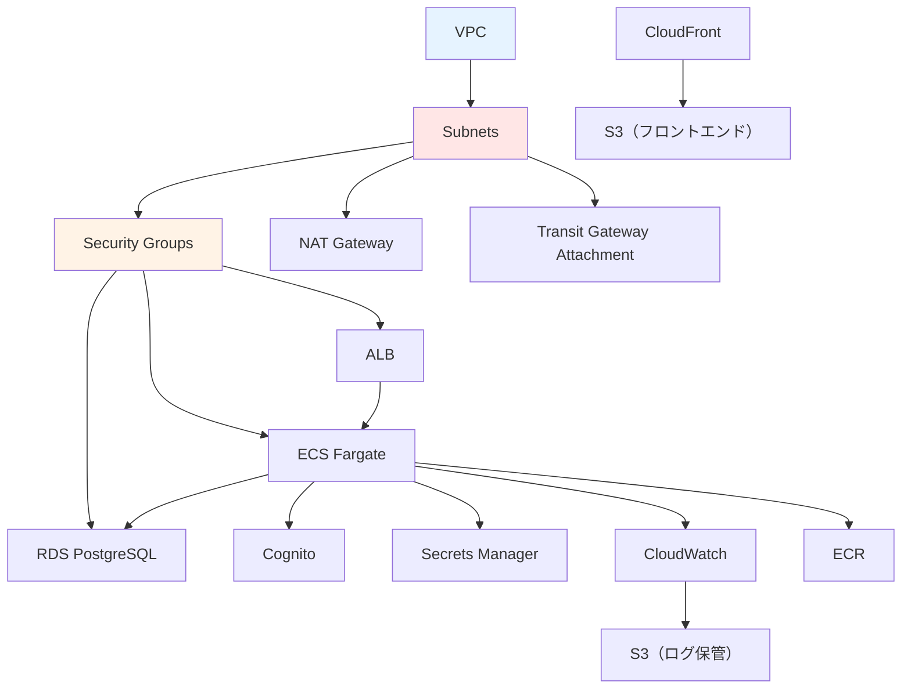
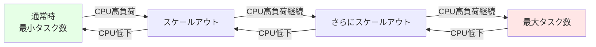

# 01. システム構成設計（マルチアカウント全体構成図）

**作成日**: 2025-10-29
**バージョン**: 1.2
**ステータス**: PM レビュー待ち

**更新履歴**:
- v1.2 (2025-10-29): マルチアカウント全体構成図を再設計（3環境VPC表現、Client VPN暫定実装、全AWSサービス網羅）
- v1.1 (2025-10-25): マルチアカウント構成追加（Shared Account + Transit Gateway + Direct Connect）
- v1.0 (2025-10-25): 初版作成

---

## 1.0 マルチアカウント構成概要

### アカウント構成

本システムは、**Shared Account（共有基盤）** と **Service Account（サービスアカウント）** の2アカウント構成で設計されています。

| アカウント | 役割 | 主要リソース | 備考 |
|-----------|------|------------|------|
| **Shared Account** | ネットワークハブ・監査基盤・組織管理 | Transit Gateway、Client VPN Endpoint、CloudTrail、Config、GuardDuty、Security Hub、AWS Organizations | 今後他サービスが追加される際の共通基盤 |
| **Service Account** | 設備管理アプリケーション実行環境 | 3つのVPC（dev/stg/prod）、ECS、RDS、ALB、Cognito | 本システムのアプリケーションとデータ |

### 拠点との接続

- **拠点数**: 20拠点（各拠点100台の端末、合計2,000台）
- **CIDR**: 172.16.0.0/16
- **接続方式（現在）**: AWS Client VPN（暫定実装）
- **接続方式（将来）**: AWS Direct Connect（100Mbps Hosted Connection）- BGP ASN確定後に移行
- **ネットワークハブ**: Transit Gateway（Shared Account）

### AWS Organizations 構成

```
AWS Organizations（Shared Account が管理アカウント）
├── Shared Account（ou=shared）
└── Service Account（ou=services）
```

---

## 1.1 システム概要

### システム名称
役所設備管理システム

### システムの目的
公共施設・庁舎の設備機器（空調、電気、消防設備等）の在庫管理、発注管理、レポート出力を行う業務システムをAWS ECS（Fargate）に移行する。

### システム構成の概要
本システムは、以下の3つのアプリケーションで構成される：

1. **業務アプリ（職員向けAPI）**
   - アクセス方式: 閉域（拠点からのClient VPN経由）
   - 利用者: 職員100名（20拠点に分散）
   - 主要機能: 在庫管理、発注管理、承認、レポート出力

2. **事業者アプリ（発注業者向けAPI）**
   - アクセス方式: パブリック（インターネット経由）
   - 利用者: 事業者（変動）
   - 主要機能: 伝票閲覧、伝票入力

3. **業務バッチ**
   - アクセス方式: 閉域（定期実行）
   - 利用者: システム（自動実行）
   - 主要機能: 月次・年次集計、レポート自動生成

---

## 1.2 マルチアカウント全体構成図（v1.2）

### 設計方針

1. **3つのVPC（dev/stg/prod）を明示的に表現**
2. **Client VPN（暫定実装）を明記し、将来のDirect Connect移行を注釈**
3. **すべてのAWSサービスを網羅**（ネットワーク、コンピューティング、データベース、認証、監視、フロントエンド配信）
4. **データフロー2種類を明確に表現**
   - 拠点 → Client VPN → Transit Gateway → Service VPC → 業務アプリ（閉域接続）
   - 事業者 → インターネット → CloudFront/ALB → 事業者アプリ（パブリック接続）

### 全体構成図（Mermaid）

```mermaid
graph TB
    subgraph OnPremises["拠点（20拠点、172.16.0.0/16）"]
        Branch["拠点端末<br/>（各拠点100台、計2,000台）"]
    end

    subgraph Internet["インターネット"]
        User2["事業者<br/>（パブリック）"]
    end

    subgraph SharedAccount["Shared Account（共有基盤）"]
        subgraph VPN["Client VPN（暫定実装）"]
            ClientVPN["Client VPN Endpoint<br/>（証明書認証）<br/>172.16.0.0/22"]
            VPNNote["⚠️ 暫定実装<br/>将来 Direct Connect に移行<br/>（BGP ASN確定後）"]
        end

        subgraph TGW["Transit Gateway"]
            TGWHub["Transit Gateway<br/>（ネットワークハブ）<br/>ASN: 64512"]
        end

        subgraph Audit["監査・セキュリティ"]
            CloudTrailOrg["CloudTrail<br/>（組織全体）"]
            ConfigOrg["Config<br/>（組織全体）"]
            GuardDutyOrg["GuardDuty<br/>（組織全体）"]
            SecurityHubOrg["Security Hub<br/>（組織全体）"]
            S3Audit["S3 Bucket<br/>（監査ログ集約）"]
        end

        subgraph Org["AWS Organizations"]
            OrgRoot["Organizations<br/>（管理アカウント）"]
        end
    end

    subgraph ServiceAccount["Service Account（サービスアカウント）"]
        subgraph CloudFront["Amazon CloudFront"]
            CF["CloudFront Distribution<br/>（事業者向けフロントエンド配信）"]
        end

        subgraph S3Frontend["Amazon S3"]
            S3Web["S3 Bucket<br/>フロントエンド配信"]
        end

        subgraph VPCDev["VPC（dev - 10.0.0.0/16）"]
            TGWATTDev["Transit Gateway<br/>Attachment"]

            subgraph PublicSubnetDev["Public Subnet（10.0.0.0/24）"]
                IGWDev["Internet Gateway"]
                ALB1Dev["ALB (Internal)<br/>業務アプリ"]
                ALB2Dev["ALB (Public)<br/>事業者アプリ"]
                NATGWDev["NAT Gateway"]
            end

            subgraph PrivateSubnetDev["Private Subnet（10.0.2.0/24）"]
                ECS1Dev["ECS Fargate<br/>業務API"]
                ECS2Dev["ECS Fargate<br/>事業者API"]
                ECS3Dev["ECS Fargate<br/>バッチ"]
            end

            subgraph DBSubnetDev["DB Subnet（10.0.4.0/24）"]
                RDSDev["RDS PostgreSQL<br/>（シングルAZ）"]
            end
        end

        subgraph VPCStg["VPC（stg - 10.1.0.0/16）"]
            TGWATTStg["Transit Gateway<br/>Attachment"]

            subgraph PublicSubnetStg["Public Subnet（10.1.0.0/24, 10.1.1.0/24）"]
                IGWStg["Internet Gateway"]
                ALB1Stg["ALB (Internal)<br/>業務アプリ"]
                ALB2Stg["ALB (Public)<br/>事業者アプリ"]
                NATGWStg1["NAT Gateway<br/>（AZ-a）"]
                NATGWStg2["NAT Gateway<br/>（AZ-c）"]
            end

            subgraph PrivateSubnetStg["Private Subnet（10.1.2.0/24, 10.1.3.0/24）"]
                ECS1Stg["ECS Fargate<br/>業務API"]
                ECS2Stg["ECS Fargate<br/>事業者API"]
                ECS3Stg["ECS Fargate<br/>バッチ"]
            end

            subgraph DBSubnetStg["DB Subnet（10.1.4.0/24, 10.1.5.0/24）"]
                RDSStg["RDS PostgreSQL<br/>（マルチAZ）"]
            end
        end

        subgraph VPCProd["VPC（prod - 10.2.0.0/16）"]
            TGWATTProd["Transit Gateway<br/>Attachment"]

            subgraph PublicSubnetProd["Public Subnet（10.2.0.0/24, 10.2.1.0/24）"]
                IGWProd["Internet Gateway"]
                ALB1Prod["ALB (Internal)<br/>業務アプリ"]
                ALB2Prod["ALB (Public)<br/>事業者アプリ"]
                NATGWProd1["NAT Gateway<br/>（AZ-a）"]
                NATGWProd2["NAT Gateway<br/>（AZ-c）"]
            end

            subgraph PrivateSubnetProd["Private Subnet（10.2.2.0/24, 10.2.3.0/24）"]
                ECS1Prod["ECS Fargate<br/>業務API"]
                ECS2Prod["ECS Fargate<br/>事業者API"]
                ECS3Prod["ECS Fargate<br/>バッチ"]
            end

            subgraph DBSubnetProd["DB Subnet（10.2.4.0/24, 10.2.5.0/24）"]
                RDSProd["RDS PostgreSQL<br/>（マルチAZ）"]
            end
        end

        subgraph SharedServices["共通サービス（全環境共通）"]
            CognitoStaff["Cognito<br/>ユーザープール<br/>（職員用）"]
            CognitoVendor["Cognito<br/>ユーザープール<br/>（事業者用）"]
            SecretsManager["Secrets Manager<br/>（DB接続情報）"]
            ECR["ECR<br/>（コンテナレジストリ）"]
            CloudWatch["CloudWatch Logs"]
            S3Logs["S3 Bucket<br/>（ログ保管）"]
        end
    end

    %% データフロー: 拠点 → 業務アプリ（閉域接続）
    Branch -->|"Client VPN接続<br/>（証明書認証）"| ClientVPN
    ClientVPN -.->|"⚠️ 将来 Direct Connect に移行"| VPNNote
    ClientVPN -->|"Transit Gateway<br/>Attachment"| TGWHub

    TGWHub -->|"TGW Attachment<br/>（dev）"| TGWATTDev
    TGWHub -->|"TGW Attachment<br/>（stg）"| TGWATTStg
    TGWHub -->|"TGW Attachment<br/>（prod）"| TGWATTProd

    TGWATTDev --> ALB1Dev
    TGWATTStg --> ALB1Stg
    TGWATTProd --> ALB1Prod

    ALB1Dev --> ECS1Dev
    ALB1Stg --> ECS1Stg
    ALB1Prod --> ECS1Prod

    %% データフロー: 事業者 → 事業者アプリ（パブリック接続）
    User2 -->|"HTTPS<br/>（静的コンテンツ）"| CF
    CF --> S3Web
    User2 -->|"HTTPS<br/>（API）"| ALB2Dev
    User2 -->|"HTTPS<br/>（API）"| ALB2Stg
    User2 -->|"HTTPS<br/>（API）"| ALB2Prod

    ALB2Dev --> ECS2Dev
    ALB2Stg --> ECS2Stg
    ALB2Prod --> ECS2Prod

    %% データベース接続
    ECS1Dev --> RDSDev
    ECS2Dev --> RDSDev
    ECS3Dev --> RDSDev

    ECS1Stg --> RDSStg
    ECS2Stg --> RDSStg
    ECS3Stg --> RDSStg

    ECS1Prod --> RDSProd
    ECS2Prod --> RDSProd
    ECS3Prod --> RDSProd

    %% 認証・シークレット・監視
    ECS1Dev -.->|"認証"| CognitoStaff
    ECS2Dev -.->|"認証"| CognitoVendor
    ECS1Dev -.->|"シークレット取得"| SecretsManager
    ECS1Dev -.->|"ログ送信"| CloudWatch

    ECS1Stg -.->|"認証"| CognitoStaff
    ECS2Stg -.->|"認証"| CognitoVendor
    ECS1Stg -.->|"シークレット取得"| SecretsManager
    ECS1Stg -.->|"ログ送信"| CloudWatch

    ECS1Prod -.->|"認証"| CognitoStaff
    ECS2Prod -.->|"認証"| CognitoVendor
    ECS1Prod -.->|"シークレット取得"| SecretsManager
    ECS1Prod -.->|"ログ送信"| CloudWatch

    CloudWatch --> S3Logs

    %% 監査ログ集約
    VPCDev -.->|"監査ログ転送"| CloudTrailOrg
    VPCStg -.->|"監査ログ転送"| ConfigOrg
    VPCProd -.->|"監査ログ転送"| GuardDutyOrg
    CloudTrailOrg --> S3Audit
    ConfigOrg --> S3Audit
    GuardDutyOrg --> S3Audit
    SecurityHubOrg --> S3Audit

    %% AWS Organizations
    OrgRoot -.->|"管理"| ServiceAccount

    %% スタイル設定
    style SharedAccount fill:#e6f3ff,stroke:#0066cc,stroke-width:3px
    style ServiceAccount fill:#ffe6e6,stroke:#cc0000,stroke-width:3px
    style OnPremises fill:#fff3e6,stroke:#ff9900,stroke-width:3px
    style Internet fill:#e6ffe6,stroke:#00cc00,stroke-width:2px

    style VPN fill:#ffebcc,stroke:#ff6600,stroke-width:2px
    style VPNNote fill:#ffffcc,stroke:#ffaa00,stroke-width:1px,stroke-dasharray: 5 5

    style VPCDev fill:#f0f0f0,stroke:#666666,stroke-width:2px
    style VPCStg fill:#f0f0f0,stroke:#666666,stroke-width:2px
    style VPCProd fill:#f0f0f0,stroke:#666666,stroke-width:2px
```



---

## 1.3 データフロー詳細

### 1.3.1 業務アプリ（職員向け）のデータフロー

```
拠点端末（20拠点、計2,000台）
  ↓ Client VPN接続（証明書認証）
Client VPN Endpoint（Shared Account）
  ↓ Transit Gateway Attachment
Transit Gateway（Shared Account）
  ↓ Transit Gateway Attachment
VPC（Service Account - dev/stg/prod）
  ↓ Private Subnet
ALB (Internal)
  ↓
ECS Fargate（業務API）
  ↓ 認証
Cognito ユーザープール（職員用）
  ↓
ECS Fargate（業務API）
  ↓ シークレット取得
Secrets Manager（DB接続情報）
  ↓
RDS PostgreSQL
  ↓ ログ送信
CloudWatch Logs → S3 Bucket（ログ保管）
```

### 1.3.2 事業者アプリ（事業者向け）のデータフロー

```
事業者（インターネット）
  ↓ HTTPS（静的コンテンツ）
CloudFront Distribution
  ↓
S3 Bucket（フロントエンド配信）

事業者（インターネット）
  ↓ HTTPS（API）
ALB (Public)
  ↓
ECS Fargate（事業者API）
  ↓ 認証
Cognito ユーザープール（事業者用）
  ↓
ECS Fargate（事業者API）
  ↓
RDS PostgreSQL
  ↓ ログ送信
CloudWatch Logs → S3 Bucket（ログ保管）
```

### 1.3.3 監査ログ集約フロー

```
Service Account（CloudTrail、Config、GuardDuty、Security Hub）
  ↓ ログ転送
Shared Account（CloudTrail組織証跡、S3バケット）
  ↓
S3 Bucket（監査ログ集約）
```

---

## 1.4 環境別構成

### 3環境の構成

本システムは、dev（開発）、stg（ステージング）、prod（本番）の3環境で構成されます。

**環境別の方針**:
- **dev環境**: コスト最小化（シングルAZ、最小スペック）
- **stg環境**: 本番構成の縮小版（検証用）
- **prod環境**: 本番スペック（マルチAZ、オートスケーリング）

| 環境 | VPC CIDR | AZ構成 | RDS構成 | NAT Gateway | 用途 |
|-----|----------|--------|---------|-------------|------|
| dev | 10.0.0.0/16 | シングルAZ（ap-northeast-1a） | シングルAZ | 1台 | 開発・検証 |
| stg | 10.1.0.0/16 | マルチAZ（a, c） | マルチAZ | 2台 | 本番構成の検証 |
| prod | 10.2.0.0/16 | マルチAZ（a, c） | マルチAZ | 2台 | 本番運用 |

---

## 1.5 使用するAWSサービス一覧

### Shared Account

| サービス | 用途 | 備考 |
|---------|------|------|
| AWS Organizations | アカウント管理 | Shared Account を管理アカウントに設定 |
| Transit Gateway | ネットワークハブ | 拠点とService VPCを接続 |
| Client VPN Endpoint | 拠点接続（暫定実装） | 将来 Direct Connect に移行 |
| CloudTrail | 監査ログ（組織全体） | すべてのアカウントのAPIコールを記録 |
| AWS Config | 設定変更記録（組織全体） | リソース変更履歴を記録 |
| GuardDuty | 脅威検知（組織全体） | 異常なアクティビティを検知 |
| Security Hub | セキュリティ統合（組織全体） | セキュリティ状況を統合管理 |
| S3 | 監査ログ保管 | CloudTrail、Config、GuardDuty のログを集約 |
| AWS RAM | リソース共有 | Transit Gateway を Service Account に共有 |

### Service Account

| レイヤー | サービス | 用途 | 備考 |
|---------|---------|------|------|
| **ネットワーク** | VPC | アプリケーション実行環境 | dev/stg/prod の3つ |
| | Internet Gateway | パブリックアクセス | 各VPCに1つ |
| | NAT Gateway | プライベートサブネットからのインターネットアクセス | dev: 1台、stg/prod: 2台（マルチAZ） |
| | Transit Gateway Attachment | Shared Account の Transit Gateway に接続 | 各VPCから接続 |
| | Route Tables | ルーティング管理 | Public、Private、DB Subnet毎 |
| | Security Groups | ファイアウォール | ALB、ECS、RDS毎に設定 |
| **コンピューティング** | ECS Fargate | コンテナ実行環境 | 業務API、事業者API、バッチ |
| | ALB | ロードバランサー | Internal（業務アプリ）、Public（事業者アプリ） |
| | ECR | コンテナレジストリ | コンテナイメージ保管 |
| **データベース** | RDS PostgreSQL | リレーショナルデータベース | dev: シングルAZ、stg/prod: マルチAZ |
| **認証** | Cognito ユーザープール | 認証・認可 | 職員用、事業者用の2つ |
| **シークレット管理** | Secrets Manager | DB接続情報保管 | 環境別に管理 |
| **フロントエンド配信** | CloudFront | CDN | 事業者向けフロントエンド配信 |
| | S3 | 静的ファイル配信 | フロントエンド（React等）のホスティング |
| **監視・ログ** | CloudWatch Logs | ログ集約 | ECS、RDS、ALB のログ |
| | CloudWatch Alarms | アラート | CPU、メモリ、エラー率の監視 |
| | SNS | 通知 | アラート通知先 |
| | S3 | ログ保管 | CloudWatch Logs の長期保管 |

---

## 1.6 コンポーネント間の依存関係

### 依存関係図



### 構築順序（マルチアカウント対応）

#### フェーズ1: Shared Account 基盤構築

1. **組織管理層**
   - AWS Organizations 作成（Shared Account を管理アカウントに設定）
   - 組織ユニット（OU）作成
   - Service Account を組織に招待・追加

2. **ネットワークハブ層**
   - Transit Gateway 作成
   - Transit Gateway Route Table 作成

3. **Client VPN 接続層（暫定実装）**
   - ACM 証明書発行（サーバー証明書、クライアント証明書）
   - Client VPN Endpoint 作成
   - Transit Gateway Attachment 作成（Client VPN → TGW）
   - 認証ルール設定

4. **監査・セキュリティ層**
   - CloudTrail（組織全体）有効化
   - Config（組織全体）有効化
   - GuardDuty（組織全体）有効化
   - Security Hub（組織全体）有効化
   - S3 Bucket（監査ログ保管）作成

5. **リソース共有**
   - AWS RAM で Transit Gateway を Service Account に共有

#### フェーズ2: Service Account アプリケーション構築

1. **ネットワーク層**
   - VPC（dev/stg/prod）
   - Subnets（Public、Private、DB）
   - Internet Gateway
   - NAT Gateway
   - Route Tables（Transit Gateway ルート含む）
   - Security Groups
   - Transit Gateway Attachment（Shared Account の TGW に接続）

2. **データベース層**
   - RDS PostgreSQL（dev: シングルAZ、stg/prod: マルチAZ）

3. **認証層**
   - Cognito ユーザープール（職員用・事業者用）

4. **シークレット管理層**
   - Secrets Manager（DB接続情報）

5. **コンピューティング層**
   - ECR リポジトリ
   - ECS Cluster
   - ECS Task Definition
   - ALB
   - ECS Service

6. **フロントエンド配信層**
   - S3 Bucket（フロントエンド）
   - CloudFront Distribution

7. **監視・ログ層**
   - CloudWatch Log Groups
   - CloudWatch Alarms
   - SNS Topics
   - S3 Bucket（ローカルログ保管）

**注**: Shared Account（フェーズ1）を先に構築してから、Service Account（フェーズ2）を構築する必要があります。

---

## 1.7 スケーラビリティ設計

### ECS Fargate オートスケーリング

**オートスケーリングの方針**:
- 通常時は最小タスク数で運用
- CPU使用率が一定値を超えた場合、自動的にタスク数を増やす
- CPU使用率が下がった場合、自動的にタスク数を減らす
- クールダウン期間を設けて、頻繁なスケールを防止

**スケーリングシミュレーション**:


### RDS スケーラビリティ

**リードレプリカ（将来の拡張）**:
現時点では不要だが、将来的にリード負荷が高くなった場合、以下の拡張を検討：
- リードレプリカの追加: レポート生成用の読み取り専用レプリカ
- Aurora PostgreSQL への移行: より高いスケーラビリティが必要な場合

---

## 1.8 ヒアリング結果と仮決定

### ユーザー確認済み事項

以下の項目は、ユーザーとのヒアリングで確定しました：

| 項目 | 確定内容 | 確認日 |
|------|---------|-------|
| マルチアカウント構成 | Shared Account + Service Account（このプロジェクトに含める） | 2025-10-25 |
| 拠点接続方式（暫定） | AWS Client VPN（暫定実装） | 2025-10-29 |
| 拠点接続方式（将来） | AWS Direct Connect（100Mbps Hosted Connection）- BGP ASN確定後に移行 | 2025-10-29 |
| Transit Gateway構成 | Transit Gateway + Client VPN Attachment | 2025-10-29 |
| 拠点数・端末数 | 20拠点、各拠点100台（合計2,000台） | 2025-10-25 |
| 監査ログ集約 | Shared Account で組織全体のログを集約 | 2025-10-25 |
| AWS Organizations | 使用する（Shared Account を管理アカウントに設定） | 2025-10-25 |
| 3環境構成 | dev/stg/prod の3つのVPC | 2025-10-29 |

### 仮決定事項

以下の項目は、本来ユーザーに確認すべきですが、合理的な仮決定をしました：

| 項目 | 仮決定内容 | 理由 | ユーザー確認推奨度 |
|------|----------|------|------------------|
| ALB の構成 | 業務アプリ用と事業者アプリ用で分離 | セキュリティ分離とアクセス制御の明確化 | 低 |
| Client VPN 認証方式 | 証明書ベース認証（ACM） | セキュリティベストプラクティス | 低 |

**注**: 具体的な設定値（CIDR、インスタンスタイプ、タスク数等）は、パラメーターシートを参照してください。

---

**作成者**: architect サブエージェント
**最終更新**: 2025-10-29 v1.2（3環境VPC表現、Client VPN暫定実装、全AWSサービス網羅）
