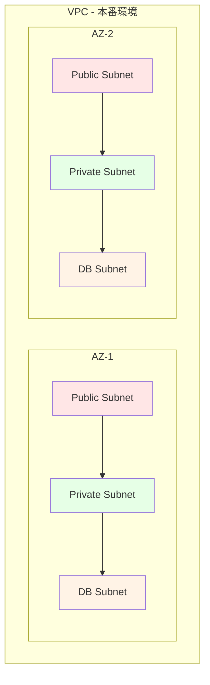
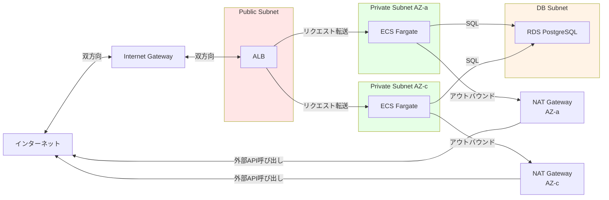
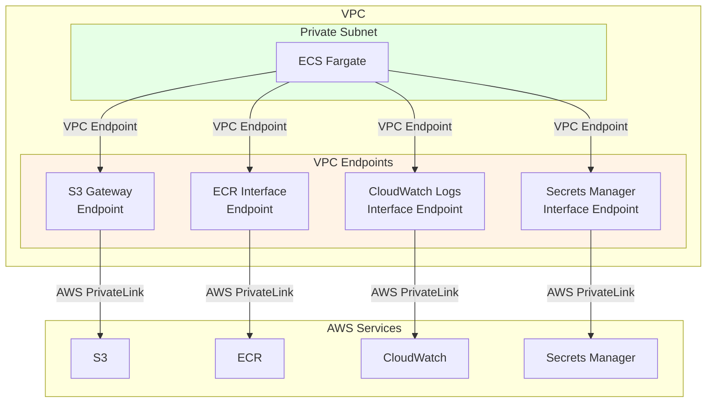
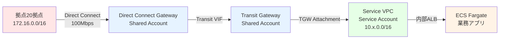

# 02. ネットワーク設計

**作成日**: 2025-10-25
**バージョン**: 1.1
**ステータス**: PM レビュー待ち
**更新履歴**:
- v1.1 (2025-10-25): マルチアカウント構成、Transit Gateway、拠点接続（Direct Connect）を追加

---

## 2.0 ネットワーク全体構成

### マルチアカウント・マルチVPC構成

本プロジェクトは、以下の2つのAWSアカウントで構成されます：

| アカウント | 役割 | 主要リソース |
|----------|------|-------------|
| **Shared Account** | ネットワークハブ・監査ログ集約 | Transit Gateway、Direct Connect Gateway、Organizations（管理アカウント）、CloudTrail組織証跡、AWS Config、GuardDuty、Security Hub |
| **Service Account** | アプリケーション実行環境 | VPC、ECS、RDS、ALB、Cognito等 |

### ネットワーク接続構成

```
拠点（20拠点、計2,000台）
  ↓ Direct Connect（100Mbps）
Direct Connect Gateway（Shared Account）
  ↓
Transit Gateway（Shared Account）
  ↓ Transit Gateway Attachment
Service VPC（Service Account）
  ↓
  ├─ 閉域接続: 拠点 ⇔ 業務アプリ（内部ALB）
  └─ インターネット接続: 事業者 → 事業者アプリ（パブリックALB）
```

---

## 2.1 VPC設計

### VPC CIDR設計方針

**設計方針**:
- 各環境（dev/stg/prod）で独立したVPCを作成
- CIDRブロックは重複しないように設計（拠点側とService VPC側で明確に分離）
- Transit Gateway で拠点とService VPCを接続
- 将来的な拡張性を考慮したCIDR設計

**理由**:
- 環境分離によるセキュリティ向上
- 拠点側（オンプレミス）とクラウド側のCIDR重複回避
- 各環境で十分なIPアドレス空間を確保

### VPC設定

**DNS設定**:
- DNS resolution: 有効（RDSエンドポイントの名前解決に必要）
- DNS hostnames: 有効（ECS Taskに DNS名を割り当てるため）
- DHCP Options: AWSデフォルト使用

**注**: 具体的なVPC CIDR、拠点CIDR、IPアドレス数は、パラメーターシートを参照してください。

---

## 2.2 サブネット設計

### サブネット設計方針

**3層サブネット構成**:
本システムでは、セキュリティ層を分離するため、3種類のサブネットを配置します。

### サブネット配置図



### サブネット種別の役割

#### Public Subnet
- **用途**: インターネットに直接接続するリソース
- **配置するリソース**:
  - ALB（Application Load Balancer）
  - NAT Gateway
- **インターネットアクセス**: Internet Gateway経由

#### Private Subnet
- **用途**: インターネットに直接公開しないリソース
- **配置するリソース**:
  - ECS Fargate タスク
- **インターネットアクセス**: NAT Gateway経由（アウトバウンドのみ）

#### DB Subnet
- **用途**: データベース専用サブネット
- **配置するリソース**:
  - RDS PostgreSQL
- **インターネットアクセス**: 不可（完全閉域）

### 環境別サブネット設計の方針

**dev環境**:
- シングルAZ構成でコスト削減
- 開発・検証用途のため、可用性要件は低い

**stg環境**:
- マルチAZ構成（本番構成の検証用）
- 本番と同等の構成で動作確認

**prod環境**:
- マルチAZ構成（可用性優先）
- 2つのAZに冗長配置

**注**: 具体的なサブネットCIDR、AZ配置は、パラメーターシートを参照してください。

---

## 2.3 ルーティング設計

### ルーティング設計方針

**Public Subnet のルーティング**:
- VPC内通信: local
- インターネット向け通信: Internet Gateway 経由

**Private Subnet のルーティング**:
- VPC内通信: local
- 拠点向け通信: Transit Gateway 経由
- インターネット向け通信: NAT Gateway 経由（アウトバウンドのみ）
- **AZ毎に独立したNAT Gateway** を使用（クロスAZ通信を最小化）

**DB Subnet のルーティング**:
- VPC内通信のみ（local）
- インターネットアクセス不可（完全閉域）

**セキュリティ設計**:
- DB SubnetはPrivate Subnetからのみアクセス可能
- Private SubnetはPublic Subnet経由でインターネットアクセス
- 多層防御によるセキュリティ強化

**注**: 具体的なルート設定（Destination、Target）は、パラメーターシートを参照してください。

### ルーティングフロー図



---

## 2.4 Internet Gateway / NAT Gateway 設計

### Internet Gateway 設計方針

**役割**:
- VPCとインターネットの間のゲートウェイ
- パブリックサブネットからのインターネット双方向通信を実現

**配置**:
- VPCに1つアタッチ
- ALBへの外部アクセス、NAT Gatewayからの外部通信に使用

### NAT Gateway 設計方針

**マルチAZ配置による高可用性**:
- 各AZ に独立したNAT Gateway を配置
- AZ障害時も他のAZのNAT Gatewayが動作継続
- クロスAZ通信を最小化（コスト削減・レイテンシ低減）

**環境別の配置方針**:
- **dev環境**: シングルAZ構成（コスト削減）
- **stg/prod環境**: マルチAZ構成（可用性優先）

**注**: 具体的なNAT Gateway配置（AZ、サブネット、Elastic IP）は、パラメーターシートを参照してください。

---

## 2.5 VPC エンドポイント設計

### VPC エンドポイント設計方針

**目的**:
- NAT Gateway 経由の通信を削減
- データ転送コストの削減
- 低レイテンシなAWSサービス接続

**推奨するVPCエンドポイント**:
- **S3（Gateway Endpoint）**: コンテナログ保存時の通信（無料）
- **ECR（Interface Endpoint）**: コンテナイメージPull時の通信
- **CloudWatch Logs（Interface Endpoint）**: ログ送信時の通信
- **Secrets Manager（Interface Endpoint）**: シークレット取得時の通信

**採用判断**:
- 初期実装ではオプション（運用開始後のデータ転送量を見て判断）
- S3 Gateway Endpointは無料のため、初期から導入推奨
- Interface Endpointは有料だが、NAT Gatewayデータ転送料と比較して判断

**VPCエンドポイント設計図**



**注**: VPCエンドポイントの採用は、運用開始後のデータ転送量を見て判断可能。コスト試算は、パラメーターシートを参照してください。

---

## 2.6 ネットワークACL（NACL）設計

### NACL 設計方針

**デフォルトNACL使用の理由**:
- NACLはステートレスで管理が複雑
- Security Groupで十分なセキュリティ制御が可能
- シンプルな構成を優先

**セキュリティ制御の方針**:
- ネットワークセキュリティは **Security Group** で実施
- NACLはデフォルト（全許可）を使用
- 必要に応じて将来的にNACLで追加制御可能

---

## 2.7 Transit Gateway 設計（Shared Account）

### Transit Gateway 設計方針

**役割**:
- Shared Account に配置するネットワークハブ
- 拠点（Direct Connect経由）と Service VPC を接続
- 複数VPC間のルーティング管理を集中化

**構成方針**:
- デフォルトルートテーブル使用（自動伝播）
- DNS サポート有効（名前解決）
- VPN ECMP サポート有効（将来の冗長化対応）

**Transit Gateway Attachment**:
- Service Account の各VPC（dev/stg/prod）からAttachment作成
- Private Subnet に配置（閉域接続）
- マルチAZ構成（stg/prod）で可用性確保

**クロスアカウント共有（AWS RAM）**:
- Shared Account の Transit Gateway を Service Account に共有
- AWS Organizations 経由で共有（プリンシパル: Service Account ID または OU ID）

**注**: 具体的なTransit Gateway設定（ASN、Attachment名、ルートテーブル）は、パラメーターシートを参照してください。

---

## 2.8 Direct Connect 設計（Shared Account）

### Direct Connect 設計方針

**接続方式**:
- Hosted Connection（キャリア提供の専用線サービス）
- 拠点側ルーターとBGPで接続

**Direct Connect Gateway**:
- Transit Gateway と Direct Connect を接続
- BGP による動的ルーティング
- 拠点CIDR を許可プレフィックスとして登録

**Virtual Interface（VIF）**:
- Transit Virtual Interface タイプ使用
- BGP MD5 認証によるセキュリティ強化
- VLAN ID は工事完了次第確定

**注**: 具体的なDirect Connect設定（帯域、ロケーション、ASN、料金）は、パラメーターシートを参照してください。

### 拠点接続フロー



### 冗長化構成（将来の拡張）

**現状**: 単一のDirect Connect接続

**将来の拡張オプション**:
- **Direct Connect 冗長化**: 2本目のDirect Connect追加（可用性向上）
- **VPN バックアップ**: Site-to-Site VPN を追加（バックアップ回線）

**判断基準**: 運用開始後、業務への影響度とコストを考慮して判断

---

## 2.9 ネットワーク設計のベストプラクティス

### AWS Well-Architected Framework 準拠

| 柱 | 実装内容 |
|----|----------|
| **セキュリティ** | ✅ プライベートサブネットでECS配置<br/>✅ DB Subnetは完全閉域<br/>✅ Security Groupで最小権限 |
| **信頼性** | ✅ マルチAZ構成（2AZ）<br/>✅ NAT Gatewayも冗長化 |
| **パフォーマンス** | ✅ VPCエンドポイントで低レイテンシ |
| **コスト最適化** | ✅ dev環境はシングルAZ<br/>✅ VPCエンドポイントでNAT Gateway料金削減 |

### セキュリティベストプラクティス

1. **最小権限の原則**:
   - DB SubnetはVPC内通信のみ
   - Private SubnetはNAT Gateway経由のアウトバウンドのみ

2. **多層防御**:
   - ネットワーク層（Subnet分離）
   - トランスポート層（Security Group）
   - アプリケーション層（WAF）

3. **監視と記録**:
   - VPC Flow Logs 有効化（すべてのサブネット）
   - CloudTrail で AWS API 呼び出しを記録

---

## 2.10 ヒアリング事項

以下の項目は、ユーザーヒアリングで確定しました：

| 項目 | 確定内容 | ヒアリング結果 |
|------|---------|--------------|
| ✅ 拠点接続方式 | AWS Direct Connect（100Mbps） | ユーザー確認済み |
| ✅ 拠点数・端末数 | 20拠点、各100台（計2,000台） | ユーザー確認済み |
| ✅ 拠点CIDR | 172.16.0.0/16（各拠点 /24） | ユーザー確認済み |
| ✅ アクセス方向 | 双方向（拠点 ⇔ Service Account） | ユーザー確認済み |
| ✅ Shared Account構築 | 今回のプロジェクトに含める | ユーザー確認済み |
| ✅ 監査ログ集約 | Shared Accountで集約 | ユーザー確認済み |
| ✅ AWS Organizations | 使用する（Shared Accountが管理アカウント） | ユーザー確認済み |
| ✅ Direct Connect接続方式 | Direct Connect Gateway + Transit Gateway | ユーザー確認済み |

以下の項目は、本来ユーザーに確認すべきですが、合理的な仮決定をしました：

| 項目 | 仮決定内容 | ユーザー確認推奨度 |
|------|----------|------------------|
| VPC CIDR設計 | 標準的な分割、重複なし | 低 |
| サブネット分割 | ECS タスク数を考慮して十分な余裕 | 低 |
| NAT Gateway 配置 | マルチAZ（可用性向上） | 低 |
| Transit Gateway ASN | AWS デフォルトASN | 低 |
| 拠点ルーター ASN | プライベートASN範囲 | 中（拠点側ネットワーク担当に確認） |
| BGP 認証 | MD5 認証（セキュリティベストプラクティス） | 低 |

**注**: 具体的な設定値は、パラメーターシートを参照してください。

---

**作成者**: PM（architect サブエージェント監修）
**最終更新**: 2025-10-25 v1.1（マルチアカウント構成、Transit Gateway、Direct Connect追加）
