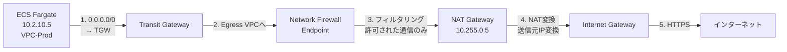

# 02_ネットワーク設計

**作成日**: 2025-10-25
**バージョン**: 1.0
**ステータス**: レビュー待ち

---

## 目次
1. [VPC設計](#vpc設計)
2. [サブネット設計](#サブネット設計)
3. [Transit Gateway設計](#transit-gateway設計)
4. [ルーティング設計](#ルーティング設計)
5. [Egress VPC設計](#egress-vpc設計)
6. [Client VPN設計](#client-vpn設計)

---

## VPC設計

### VPC一覧

| VPC名 | AWSアカウント | CIDR | 用途 | AZ構成 |
|-------|-------------|------|------|--------|
| **Egress VPC** | Network Shared | 10.255.0.0/16 | インターネット向け通信集約 | AZ-a, AZ-c |
| **VPC-Dev** | Service-Dev | 10.0.0.0/16 | 開発環境 | AZ-a, AZ-c |
| **VPC-Stg** | Service-Stg | 10.1.0.0/16 | ステージング環境 | AZ-a, AZ-c |
| **VPC-Prod** | Service-Prod | 10.2.0.0/16 | 本番環境 | AZ-a, AZ-c |

### CIDR割り当て方針

**設計原則**:
- /16 で各VPCに十分なIPアドレス空間を確保
- 環境間でCIDRが重複しないように割り当て
- 将来の拡張を考慮（追加VPCのための空間確保）

**予約済みCIDR**:
- 10.0.0.0/16: VPC-Dev
- 10.1.0.0/16: VPC-Stg
- 10.2.0.0/16: VPC-Prod
- 10.255.0.0/16: Egress VPC

**拡張用CIDR**:
- 10.3.0.0/16 - 10.254.0.0/16: 将来の追加VPC用（未使用）

---

## サブネット設計

### Service VPC サブネット構成（3層）

各環境（Dev/Stg/Prod）で同じサブネット構成を使用：

#### VPC-Prod (10.2.0.0/16) の例

| サブネット名 | CIDR | AZ | 用途 | インターネット接続 |
|------------|------|----|----- |-----------------|
| **Public-AZ-a** | 10.2.0.0/24 | ap-northeast-1a | Public ALB | IGW経由（直接） |
| **Public-AZ-c** | 10.2.1.0/24 | ap-northeast-1c | Public ALB | IGW経由（直接） |
| **Private-AZ-a** | 10.2.10.0/24 | ap-northeast-1a | ECS Fargate | NAT GW（Egress VPC経由）|
| **Private-AZ-c** | 10.2.11.0/24 | ap-northeast-1c | ECS Fargate | NAT GW（Egress VPC経由）|
| **Data-AZ-a** | 10.2.20.0/24 | ap-northeast-1a | RDS PostgreSQL | なし（閉域） |
| **Data-AZ-c** | 10.2.21.0/24 | ap-northeast-1c | RDS PostgreSQL | なし（閉域） |

#### VPC-Stg (10.1.0.0/16)

| サブネット名 | CIDR | AZ | 用途 |
|------------|------|----|----- |
| Public-AZ-a | 10.1.0.0/24 | ap-northeast-1a | Public ALB |
| Public-AZ-c | 10.1.1.0/24 | ap-northeast-1c | Public ALB |
| Private-AZ-a | 10.1.10.0/24 | ap-northeast-1a | ECS Fargate |
| Private-AZ-c | 10.1.11.0/24 | ap-northeast-1c | ECS Fargate |
| Data-AZ-a | 10.1.20.0/24 | ap-northeast-1a | RDS PostgreSQL |
| Data-AZ-c | 10.1.21.0/24 | ap-northeast-1c | RDS PostgreSQL |

#### VPC-Dev (10.0.0.0/16)

| サブネット名 | CIDR | AZ | 用途 |
|------------|------|----|----- |
| Public-AZ-a | 10.0.0.0/24 | ap-northeast-1a | Public ALB |
| Public-AZ-c | 10.0.1.0/24 | ap-northeast-1c | Public ALB |
| Private-AZ-a | 10.0.10.0/24 | ap-northeast-1a | ECS Fargate |
| Private-AZ-c | 10.0.11.0/24 | ap-northeast-1c | ECS Fargate |
| Data-AZ-a | 10.0.20.0/24 | ap-northeast-1a | RDS PostgreSQL |
| Data-AZ-c | 10.0.21.0/24 | ap-northeast-1c | RDS PostgreSQL |

### Egress VPC サブネット構成

| サブネット名 | CIDR | AZ | 用途 | インターネット接続 |
|------------|------|----|----- |-----------------|
| **Public-AZ-a** | 10.255.0.0/24 | ap-northeast-1a | NAT Gateway | IGW経由 |
| **Public-AZ-c** | 10.255.1.0/24 | ap-northeast-1c | NAT Gateway | IGW経由 |
| **Firewall-AZ-a** | 10.255.10.0/24 | ap-northeast-1a | Network Firewall | - |
| **Firewall-AZ-c** | 10.255.11.0/24 | ap-northeast-1c | Network Firewall | - |
| **TGW-Attach-AZ-a** | 10.255.20.0/24 | ap-northeast-1a | TGW Attachment | - |
| **TGW-Attach-AZ-c** | 10.255.21.0/24 | ap-northeast-1c | TGW Attachment | - |

### サブネット設計の考慮事項

**Public サブネット**:
- Public ALB配置
- Internet Gateway経由でインターネット接続
- NAT Gateway配置（Egress VPCのみ）

**Private サブネット**:
- ECS Fargate配置
- インターネット向け通信はEgress VPCのNAT Gateway経由
- Transit Gateway経由でオンプレミスアクセス

**Data サブネット**:
- RDS PostgreSQL配置
- インターネット接続なし（完全閉域）
- ECS Fargateからのみアクセス可能

---

## Transit Gateway設計

### Transit Gateway構成

| 項目 | 設定値 | 備考 |
|------|--------|------|
| **ASN** | 64,512 | プライベートASN |
| **配置リージョン** | ap-northeast-1 | 東京リージョン |
| **デフォルトルートテーブル** | 無効 | カスタムルートテーブル使用 |
| **DNS サポート** | 有効 | Route53 Resolver使用 |
| **VPN ECMP サポート** | 有効 | VPN冗長化 |
| **マルチキャスト** | 無効 | 不要 |

### Transit Gateway Attachments

| VPC | アカウント | サブネット | ルートテーブル |
|-----|----------|----------|--------------|
| Egress VPC | Network Shared | TGW-Attach-AZ-a, TGW-Attach-AZ-c | Egress RT |
| VPC-Dev | Service-Dev | Private-AZ-a, Private-AZ-c | Service RT |
| VPC-Stg | Service-Stg | Private-AZ-a, Private-AZ-c | Service RT |
| VPC-Prod | Service-Prod | Private-AZ-a, Private-AZ-c | Service RT |
| VPN Connection | Network Shared | - | OnPremise RT |
| Client VPN | Network Shared | - | Service RT |

### Transit Gateway Route Tables

#### Service RT（サービス系VPC用）

| Destination | Target | 用途 |
|-------------|--------|------|
| 10.0.0.0/16 | VPC-Dev Attachment | Dev環境へ |
| 10.1.0.0/16 | VPC-Stg Attachment | Stg環境へ |
| 10.2.0.0/16 | VPC-Prod Attachment | Prod環境へ |
| 0.0.0.0/0 | Egress VPC Attachment | インターネット向け通信 |
| 192.168.0.0/16 | VPN Attachment | オンプレミスへ |

#### Egress RT（Egress VPC用）

| Destination | Target | 用途 |
|-------------|--------|------|
| 10.0.0.0/16 | VPC-Dev Attachment | DevからのReturn |
| 10.1.0.0/16 | VPC-Stg Attachment | StgからのReturn |
| 10.2.0.0/16 | VPC-Prod Attachment | ProdからのReturn |

#### OnPremise RT（VPN/Direct Connect用）

| Destination | Target | 用途 |
|-------------|--------|------|
| 10.0.0.0/16 | VPC-Dev Attachment | Dev環境へ |
| 10.1.0.0/16 | VPC-Stg Attachment | Stg環境へ |
| 10.2.0.0/16 | VPC-Prod Attachment | Prod環境へ |

### RAM (Resource Access Manager) 共有

**共有リソース**: Transit Gateway
**共有元**: Network Shared Account
**共有先**: Service-Dev, Service-Stg, Service-Prod

```yaml
# RAMリソース共有設定
ResourceShareName: TGW-Share
Resources:
  - TransitGatewayId
Principals:
  - "arn:aws:organizations::123456789012:ou/o-xxxxx/ou-xxxxx"  # Workloads OU
Permissions:
  - AWSRAMDefaultPermissionTransitGateway
```

---

## ルーティング設計

### VPC-Prod ルートテーブル

#### Public サブネット Route Table

| Destination | Target | 用途 |
|-------------|--------|------|
| 10.2.0.0/16 | local | VPC内通信 |
| 0.0.0.0/0 | Internet Gateway | インターネット向け通信 |

#### Private サブネット Route Table

| Destination | Target | 用途 |
|-------------|--------|------|
| 10.2.0.0/16 | local | VPC内通信 |
| 0.0.0.0/0 | Transit Gateway | インターネット向け通信（Egress VPC経由） |
| 192.168.0.0/16 | Transit Gateway | オンプレミス向け通信 |

#### Data サブネット Route Table

| Destination | Target | 用途 |
|-------------|--------|------|
| 10.2.0.0/16 | local | VPC内通信のみ |

**注意**: Dataサブネットは完全閉域。インターネット・オンプレミスへのルートなし。

### Egress VPC ルートテーブル

#### Public サブネット Route Table

| Destination | Target | 用途 |
|-------------|--------|------|
| 10.255.0.0/16 | local | VPC内通信 |
| 0.0.0.0/0 | Internet Gateway | インターネット向け通信 |
| 10.0.0.0/8 | Transit Gateway | サービスVPCからのReturn |

#### Firewall サブネット Route Table

| Destination | Target | 用途 |
|-------------|--------|------|
| 10.255.0.0/16 | local | VPC内通信 |
| 0.0.0.0/0 | NAT Gateway | インターネット向け通信 |
| 10.0.0.0/8 | Transit Gateway | サービスVPCへ |

#### TGW Attachment サブネット Route Table

| Destination | Target | 用途 |
|-------------|--------|------|
| 10.255.0.0/16 | local | VPC内通信 |
| 0.0.0.0/0 | Network Firewall Endpoint | フィルタリング後にNAT GWへ |

### ルーティングフロー例（ECSからインターネットへ）



---

## Egress VPC設計

### 目的
- インターネット向け通信の集約（セキュリティ強化）
- AWS Network Firewall によるL3-L7フィルタリング
- NAT Gateway の共通化（コスト最適化）

### 構成要素

| コンポーネント | 数量 | 配置 | 備考 |
|--------------|------|------|------|
| **Internet Gateway** | 1 | リージョン | VPC全体で共有 |
| **NAT Gateway** | 2 | AZ-a, AZ-c | 冗長化 |
| **Network Firewall** | 1 | マルチAZ | Endpoint は各AZ |
| **Network Firewall Endpoint** | 2 | AZ-a, AZ-c | - |

### Network Firewall ルール

#### ドメインフィルタリング（許可リスト）

```yaml
AllowedDomains:
  # Windows Update
  - "*.windowsupdate.microsoft.com"
  - "*.update.microsoft.com"
  - "*.download.windowsupdate.com"

  # AWS API
  - "*.amazonaws.com"
  - "*.aws.amazon.com"

  # Docker Hub（開発環境のみ）
  - "registry-1.docker.io"
  - "auth.docker.io"
  - "production.cloudflare.docker.com"

  # GitHub（開発環境のみ）
  - "github.com"
  - "api.github.com"

  # npm / Node.js
  - "registry.npmjs.org"
  - "nodejs.org"
```

#### ポートフィルタリング

| プロトコル | ポート | 方向 | 用途 |
|----------|-------|------|------|
| TCP | 443 | Egress | HTTPS（許可） |
| TCP | 80 | Egress | HTTP（許可、HTTPSリダイレクト用） |
| TCP | 22 | Egress | SSH（拒否） |
| TCP | 3389 | Egress | RDP（拒否） |

#### IP フィルタリング

- デフォルト: すべて拒否
- 許可リストに登録されたIPのみ許可

### コスト試算（Egress VPC）

| リソース | 環境 | 月額コスト（概算） |
|---------|------|------------------|
| NAT Gateway | 2台（AZ-a, AZ-c） | 約10,000円 |
| データ転送（NAT GW処理） | 100GB想定 | 約1,000円 |
| Network Firewall | 1個（マルチAZ） | 約40,000円 |
| データ転送（NFW処理） | 100GB想定 | 約1,500円 |
| **合計** | - | **約52,500円/月** |

---

## Client VPN設計

### 目的
- リモートから開発・検証環境へのアクセス
- 管理作業（RDS接続、ECS Exec等）

### 構成

| 項目 | 設定値 | 備考 |
|------|--------|------|
| **認証方式** | Cognito | ユーザー管理が容易 |
| **クライアントCIDR** | 172.16.0.0/16 | VPCと重複しない範囲 |
| **DNS サーバー** | VPC DNSサーバー | Route53 Resolver経由 |
| **スプリットトンネル** | 有効 | VPCトラフィックのみVPN経由 |
| **セッションタイムアウト** | 8時間 | 業務時間内 |

### Client VPN Endpoint

| 項目 | 設定値 |
|------|--------|
| **配置サブネット** | TGW-Attach-AZ-a, TGW-Attach-AZ-c |
| **接続先** | Transit Gateway経由でDev/Stg/Prod VPCへ |
| **セキュリティグループ** | ClientVPN-SG（後述） |

### 認証設定

```yaml
AuthenticationType: certificate-authentication + cognito-authentication
CognitoUserPool: ClientVPN-Users
MutualAuthentication: 必須（クライアント証明書 + Cognitoパスワード）
```

### Authorization Rules

| Destination | Access Group | 説明 |
|-------------|--------------|------|
| 10.0.0.0/16 | DevTeam | Dev環境のみアクセス |
| 10.1.0.0/16 | DevTeam, QATeam | Stg環境アクセス |
| 10.2.0.0/16 | AdminTeam | 本番環境アクセス（管理者のみ） |

---

## DNS設計（Route53 Resolver）

### 目的
- オンプレミスDNSとの連携
- VPC間のDNS解決

### Route53 Resolver Inbound Endpoint

| 項目 | 設定値 |
|------|--------|
| **配置VPC** | Egress VPC |
| **配置サブネット** | TGW-Attach-AZ-a, TGW-Attach-AZ-c |
| **IPアドレス** | 10.255.20.10, 10.255.21.10 |

**用途**: オンプレミスからAWS VPCへのDNSクエリ受信

### Route53 Resolver Outbound Endpoint

| 項目 | 設定値 |
|------|--------|
| **配置VPC** | Egress VPC |
| **配置サブネット** | TGW-Attach-AZ-a, TGW-Attach-AZ-c |
| **転送先** | オンプレミスDNSサーバー（192.168.x.x） |

**用途**: AWS VPCからオンプレミスへのDNSクエリ転送

### Resolver Rules

| ドメイン | 転送先 | 用途 |
|---------|--------|------|
| `on-premise.local` | 192.168.1.53 | オンプレミスDNS |
| `*.compute.internal` | VPC DNSサーバー | EC2/ECS内部DNS |

---

## ネットワーク設計の検証項目

### 疎通確認チェックリスト

- [ ] ECS Fargate → RDS PostgreSQL（同一VPC内）
- [ ] ECS Fargate → インターネット（Egress VPC経由）
- [ ] オンプレミス → Internal ALB（VPN経由）
- [ ] Client VPN → ECS Exec（Session Manager経由）
- [ ] 事業者 → Public ALB（インターネット経由）
- [ ] ECS Fargate → Secrets Manager（VPC Endpoint経由）

### セキュリティ検証

- [ ] Data サブネットからインターネット接続不可
- [ ] Private サブネットから直接インターネット接続不可（TGW経由のみ）
- [ ] Network Firewall でSSH/RDP拒否
- [ ] Security Group による最小権限設定

---

## 次のステップ

- [03_セキュリティ設計.md](03_セキュリティ設計.md): Security Groups、NACLの詳細設計
- [10_CloudFormation構成方針.md](10_CloudFormation構成方針.md): ネットワークスタックの分割方針

---

**作成者**: Architect（Claude）
**レビュー状態**: レビュー待ち
