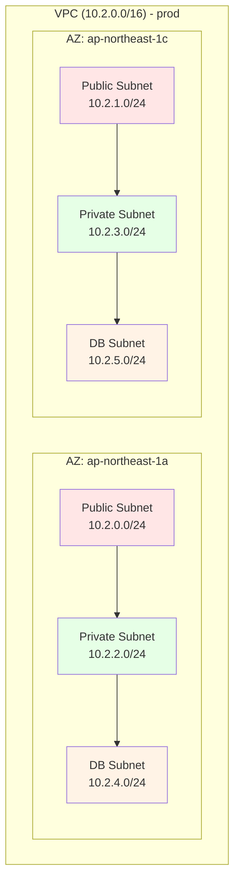
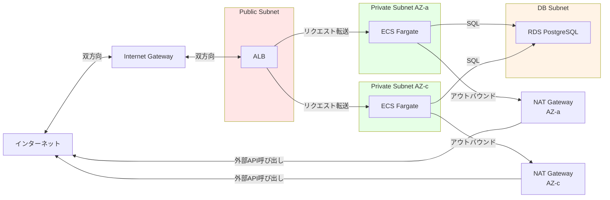
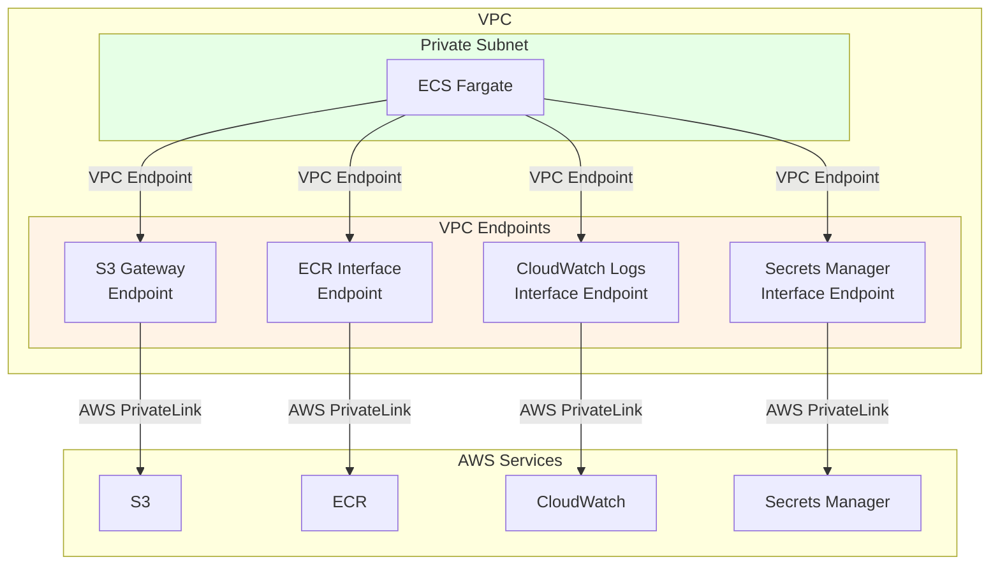

# 02. ネットワーク設計

**作成日**: 2025-10-25
**バージョン**: 1.0
**ステータス**: PM レビュー待ち

---

## 2.1 VPC設計

### VPC CIDR設計

| 環境 | VPC CIDR | 説明 | IPアドレス数 |
|------|----------|------|-------------|
| **dev** | 10.0.0.0/16 | 開発環境 | 65,536 |
| **stg** | 10.1.0.0/16 | ステージング環境 | 65,536 |
| **prod** | 10.2.0.0/16 | 本番環境 | 65,536 |

**設計方針**:
- 各環境で独立したVPCを作成（VPC Peeringなし）
- CIDRブロックは重複しないように設計
- 将来的なVPC Peering / Transit Gateway 接続を考慮した設計

### VPC設定

| 項目 | 設定値 | 備考 |
|------|--------|------|
| DNS resolution | 有効 | RDSエンドポイント名前解決のため |
| DNS hostnames | 有効 | ECS TaskにDNS名を割り当てるため |
| DHCP Options | デフォルト | AWS提供のDHCPオプション使用 |

---

## 2.2 サブネット設計

### サブネット構成（prod環境: 10.2.0.0/16）

| サブネット種別 | AZ | CIDR | 用途 | IPアドレス数 |
|-------------|----|----|------|-------------|
| **Public Subnet 1** | ap-northeast-1a | 10.2.0.0/24 | ALB、NAT Gateway | 256 |
| **Public Subnet 2** | ap-northeast-1c | 10.2.1.0/24 | ALB、NAT Gateway | 256 |
| **Private Subnet 1** | ap-northeast-1a | 10.2.2.0/24 | ECS Fargate | 256 |
| **Private Subnet 2** | ap-northeast-1c | 10.2.3.0/24 | ECS Fargate | 256 |
| **DB Subnet 1** | ap-northeast-1a | 10.2.4.0/24 | RDS PostgreSQL | 256 |
| **DB Subnet 2** | ap-northeast-1c | 10.2.5.0/24 | RDS PostgreSQL | 256 |

### サブネット配置図

### サブネット種別の役割

#### Public Subnet
- **用途**: インターネットに直接接続するリソース
- **配置するリソース**:
  - ALB（Application Load Balancer）
  - NAT Gateway
- **インターネットアクセス**: Internet Gateway経由

#### Private Subnet
- **用途**: インターネットに直接公開しないリソース
- **配置するリソース**:
  - ECS Fargate タスク
- **インターネットアクセス**: NAT Gateway経由（アウトバウンドのみ）

#### DB Subnet
- **用途**: データベース専用サブネット
- **配置するリソース**:
  - RDS PostgreSQL
- **インターネットアクセス**: 不可（完全閉域）

### dev/stg環境のサブネット設計

#### dev環境（10.0.0.0/16）

| サブネット種別 | AZ | CIDR | 用途 |
|-------------|----|----|------|
| Public Subnet 1 | ap-northeast-1a | 10.0.0.0/24 | ALB、NAT Gateway |
| Private Subnet 1 | ap-northeast-1a | 10.0.2.0/24 | ECS Fargate |
| DB Subnet 1 | ap-northeast-1a | 10.0.4.0/24 | RDS PostgreSQL |

**注**: dev環境はシングルAZ構成でコスト削減

#### stg環境（10.1.0.0/16）

| サブネット種別 | AZ | CIDR | 用途 |
|-------------|----|----|------|
| Public Subnet 1 | ap-northeast-1a | 10.1.0.0/24 | ALB、NAT Gateway |
| Public Subnet 2 | ap-northeast-1c | 10.1.1.0/24 | ALB、NAT Gateway |
| Private Subnet 1 | ap-northeast-1a | 10.1.2.0/24 | ECS Fargate |
| Private Subnet 2 | ap-northeast-1c | 10.1.3.0/24 | ECS Fargate |
| DB Subnet 1 | ap-northeast-1a | 10.1.4.0/24 | RDS PostgreSQL |
| DB Subnet 2 | ap-northeast-1c | 10.1.5.0/24 | RDS PostgreSQL |

---

## 2.3 ルーティング設計

### ルートテーブル構成（prod環境）

#### Public Subnet ルートテーブル

| Destination | Target | 説明 |
|------------|--------|------|
| 10.2.0.0/16 | local | VPC内通信 |
| 0.0.0.0/0 | igw-xxxxx | インターネット向け通信（Internet Gateway） |

**関連付けサブネット**:
- Public Subnet 1 (10.2.0.0/24)
- Public Subnet 2 (10.2.1.0/24)

#### Private Subnet 1 ルートテーブル（AZ-a）

| Destination | Target | 説明 |
|------------|--------|------|
| 10.2.0.0/16 | local | VPC内通信 |
| 0.0.0.0/0 | nat-xxxxx (AZ-a) | インターネット向け通信（NAT Gateway AZ-a） |

**関連付けサブネット**:
- Private Subnet 1 (10.2.2.0/24)

#### Private Subnet 2 ルートテーブル（AZ-c）

| Destination | Target | 説明 |
|------------|--------|------|
| 10.2.0.0/16 | local | VPC内通信 |
| 0.0.0.0/0 | nat-yyyyy (AZ-c) | インターネット向け通信（NAT Gateway AZ-c） |

**関連付けサブネット**:
- Private Subnet 2 (10.2.3.0/24)

#### DB Subnet ルートテーブル

| Destination | Target | 説明 |
|------------|--------|------|
| 10.2.0.0/16 | local | VPC内通信のみ |

**関連付けサブネット**:
- DB Subnet 1 (10.2.4.0/24)
- DB Subnet 2 (10.2.5.0/24)

**注**: DB Subnetはインターネットアクセス不可（完全閉域）

### ルーティングフロー図

---

## 2.4 Internet Gateway / NAT Gateway 設計

### Internet Gateway

| 項目 | 設定値 | 備考 |
|------|--------|------|
| 配置場所 | VPC | VPCに1つアタッチ |
| 用途 | パブリックサブネットからのインターネット双方向通信 | ALBへのアクセス、NAT Gatewayからの外部通信 |

### NAT Gateway

#### NAT Gateway 配置（prod環境）

| NAT Gateway | 配置AZ | 配置サブネット | Elastic IP | 用途 |
|------------|--------|---------------|-----------|------|
| NAT GW 1 | ap-northeast-1a | Public Subnet 1 | eipalloc-xxxxx | Private Subnet 1 からのインターネットアクセス |
| NAT GW 2 | ap-northeast-1c | Public Subnet 2 | eipalloc-yyyyy | Private Subnet 2 からのインターネットアクセス |

**設計方針**:
- **マルチAZ配置**: AZ障害時にも他のAZのNAT Gatewayが動作
- **AZ毎にNAT Gateway**: クロスAZ通信を最小化し、可用性向上
- **コスト**: 月額約26,800円（2AZ × $0.062/h × 24h × 30日）

#### dev環境のNAT Gateway

| NAT Gateway | 配置AZ | 配置サブネット | 備考 |
|------------|--------|---------------|------|
| NAT GW 1 | ap-northeast-1a | Public Subnet 1 | シングルAZ構成（コスト削減） |

---

## 2.5 VPC エンドポイント設計

### VPC エンドポイント（オプション、コスト最適化）

VPC エンドポイントを使用することで、NAT Gateway 経由の通信を削減し、コストを削減できます。

#### 推奨するVPCエンドポイント（prod環境）

| サービス | エンドポイントタイプ | 用途 | コスト削減効果 |
|---------|------------------|------|---------------|
| S3 | Gateway | ECS → S3 通信（ログ保管） | NAT Gateway データ転送料削減 |
| ECR (API) | Interface | ECS → ECR 通信（イメージPull） | NAT Gateway データ転送料削減 |
| ECR (DKR) | Interface | ECS → ECR 通信（イメージPull） | NAT Gateway データ転送料削減 |
| CloudWatch Logs | Interface | ECS → CloudWatch Logs 通信 | NAT Gateway データ転送料削減 |
| Secrets Manager | Interface | ECS → Secrets Manager 通信 | NAT Gateway データ転送料削減 |

**VPCエンドポイント設計図**

**コスト試算（VPCエンドポイント使用時）**:
- S3 Gateway Endpoint: 無料
- Interface Endpoint（ECR、CloudWatch、Secrets Manager）: 約$0.01/h × 3サービス × 24h × 30日 = 約21.6ドル/月（約3,200円/月）
- NAT Gateway データ転送料削減: 約10,000円/月削減（見積もり）
- **差引: 約6,800円/月のコスト削減**

**注**: VPCエンドポイントの採用は、運用開始後のデータ転送量を見て判断可能。

---

## 2.6 ネットワークACL（NACL）設計

### NACL 設計方針

- **デフォルトNACL使用**: すべてのサブネットでデフォルトNACL（全許可）を使用
- **Security Groupで制御**: ネットワークセキュリティはSecurity Groupで実施
- **理由**: NACLはステートレスで管理が複雑になるため、よりシンプルなSecurity Groupで制御

### NACL ルール（デフォルト）

#### Inbound

| ルール# | タイプ | プロトコル | ポート | ソース | 許可/拒否 |
|---------|--------|----------|--------|--------|---------|
| 100 | すべて | すべて | すべて | 0.0.0.0/0 | 許可 |
| * | すべて | すべて | すべて | 0.0.0.0/0 | 拒否 |

#### Outbound

| ルール# | タイプ | プロトコル | ポート | 送信先 | 許可/拒否 |
|---------|--------|----------|--------|--------|---------|
| 100 | すべて | すべて | すべて | 0.0.0.0/0 | 許可 |
| * | すべて | すべて | すべて | 0.0.0.0/0 | 拒否 |

---

## 2.7 ネットワーク設計のベストプラクティス

### AWS Well-Architected Framework 準拠

| 柱 | 実装内容 |
|----|----------|
| **セキュリティ** | ✅ プライベートサブネットでECS配置 ✅ DB Subnetは完全閉域 ✅ Security Groupで最小権限 |
| **信頼性** | ✅ マルチAZ構成（2AZ） ✅ NAT Gatewayも冗長化 |
| **パフォーマンス** | ✅ VPCエンドポイントで低レイテンシ |
| **コスト最適化** | ✅ dev環境はシングルAZ ✅ VPCエンドポイントでNAT Gateway料金削減 |

### セキュリティベストプラクティス

1. **最小権限の原則**:
   - DB SubnetはVPC内通信のみ
   - Private SubnetはNAT Gateway経由のアウトバウンドのみ

2. **多層防御**:
   - ネットワーク層（Subnet分離）
   - トランスポート層（Security Group）
   - アプリケーション層（WAF）

3. **監視と記録**:
   - VPC Flow Logs 有効化（すべてのサブネット）
   - CloudTrail で AWS API 呼び出しを記録

---

## 2.8 ヒアリング事項（仮決定）

以下の項目は、本来ユーザーに確認すべきですが、合理的な仮決定をしました：

| 項目 | 仮決定内容 | 理由 | ユーザー確認推奨度 |
|------|----------|------|------------------|
| VPC CIDR設計 | dev: 10.0.0.0/16, stg: 10.1.0.0/16, prod: 10.2.0.0/16 | 標準的な分割、重複なし、将来のVPC Peering/TGW接続を考慮 | 中 |
| サブネット分割 | /24 単位（256 IPアドレス） | ECS タスク数を考慮して十分な余裕 | 低 |
| NAT Gateway 配置 | マルチAZ（2AZ） | 可用性向上のため必須 | 低 |
| VPCエンドポイント | 運用開始後に検討 | コスト削減効果を実測してから判断 | 中 |
| DB Subnet インターネットアクセス | 不可（完全閉域） | セキュリティベストプラクティス | 低 |
| DNS resolution / DNS hostnames | 有効 | RDS、ECS の名前解決のため必須 | 低 |

---

**作成者**: architect サブエージェント
**最終更新**: 2025-10-25
