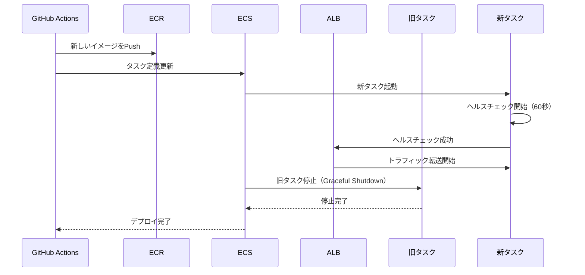

# 03. コンピューティング設計

**作成日**: 2025-10-25
**バージョン**: 1.1
**ステータス**: PM レビュー待ち

**更新履歴**:
- v1.1 (2025-10-25): AWS X-Ray サイドカーコンテナ設定を追加
- v1.0 (2025-10-25): 初版作成

---

## 3.1 ECS Fargate 概要

### 採用理由（ADR-001参照）

- サーバーレスコンテナによる運用負荷削減（OSレベルの管理が不要）
- 月20時間 → 月5時間に削減（75%削減）
- オートスケーリングによるピーク時対応
- AWS マネージドサービスによる可用性向上

---

## 3.2 ECS Cluster 設計

### Cluster 設計方針

**環境別構成**:
- 3環境（dev/stg/prod）でそれぞれ独立したクラスター
- すべて Fargate 起動タイプ（サーバーレスコンテナ）

**Container Insights**:
- すべての環境で有効化（コンテナレベルのメトリクス取得）

**FARGATE_SPOT の活用**:
- dev/stg 環境: FARGATE_SPOT 使用（最大70%コスト削減）
- prod 環境: FARGATE のみ（可用性優先）

**注**: 具体的なクラスター名、設定は、パラメーターシートを参照してください。

---

## 3.3 ECS Task Definition 設計

### Task Definition 設計方針

**アプリケーション別Task Definition**:
本システムは3つのアプリケーションで構成されるため、それぞれにTask Definitionを作成します。

1. **業務アプリ（職員向けAPI）**
   - 閉域接続（Transit Gateway経由）
   - 通常負荷のAPI処理

2. **事業者アプリ（発注業者向けAPI）**
   - パブリック接続（インターネット経由）
   - 通常負荷のAPI処理

3. **業務バッチ**
   - 月次・年次集計等の重い処理
   - APIより多くのCPU/メモリを割り当て

**Task Definition 構成要素**:
- **ネットワークモード**: awsvpc（VPC統合）
- **起動タイプ**: Fargate（サーバーレス）
- **実行ロール**: ECRイメージPull、CloudWatch Logs書き込み権限
- **タスクロール**: Secrets Manager、RDS等へのアクセス権限
- **環境変数**: Secrets Manager で機密情報管理（ハードコード禁止）
- **ログ**: CloudWatch Logs に集約
- **ヘルスチェック**: `/health` エンドポイントで死活監視
- **X-Ray サイドカーコンテナ**: 分散トレーシング、パフォーマンス分析

**X-Ray サイドカーコンテナの追加**:
各ECS Taskに X-Ray デーモンをサイドカーコンテナとして追加します。

| 項目 | 設定値 | 備考 |
|------|--------|------|
| イメージ | `public.ecr.aws/xray/aws-xray-daemon:latest` | 公式イメージ |
| CPU | 32 | 軽量（0.03125 vCPU） |
| メモリ | 256MB | 軽量 |
| ポート | 2000/udp | X-Ray デーモン |
| ログ | CloudWatch Logs | `/ecs/xray-daemon` |
| コンテナ名 | `xray-daemon` | アプリケーションコンテナから参照 |

**X-Ray サイドカーコンテナのメリット**:
- アプリケーションコードへの影響を最小化（サイドカーパターン）
- 各タスクが独立してトレースデータを送信
- アプリケーションコンテナの再起動時もトレースが継続

**アプリケーションコンテナの環境変数**:
X-Ray サイドカーコンテナと連携するため、以下の環境変数を追加します。

| 環境変数 | 設定値 | 備考 |
|---------|--------|------|
| `AWS_XRAY_DAEMON_ADDRESS` | `xray-daemon:2000` | サイドカーコンテナのホスト名 |
| `AWS_XRAY_CONTEXT_MISSING` | `LOG_ERROR` | トレースコンテキストがない場合はログ出力 |
| `AWS_XRAY_TRACING_NAME` | `facilities-staff-api` | サービス名（X-Ray Service Map で表示） |

**IAM Permissions（Task Execution Role）**:
X-Ray への書き込み権限を追加します。

```json
{
  "Version": "2012-10-17",
  "Statement": [
    {
      "Effect": "Allow",
      "Action": [
        "xray:PutTraceSegments",
        "xray:PutTelemetryRecords"
      ],
      "Resource": "*"
    }
  ]
}
```

**注**: 具体的なTask Definition（JSON定義、CPU/メモリ割り当て）は、パラメーターシートを参照してください。

---

## 3.4 ECS Service 設計

### Service 設計方針

**Service 構成**:
- APIアプリ: 常時稼働（オートスケーリング対応）
- バッチアプリ: EventBridge による定期実行

**デプロイ方式**:
- ローリングアップデート（ダウンタイム最小化）
- 最小ヘルス率100%（新タスク起動後に旧タスク停止）
- 最大率200%（新旧タスクが同時稼働）

**ネットワーク設定**:
- Private Subnet に配置（閉域配置）
- パブリックIP割り当て無効
- マルチAZ配置（可用性向上）

**ロードバランサー接続**:
- ALB経由でトラフィック分散
- ターゲットグループによるヘルスチェック
- ヘルスチェック猶予期間設定（アプリケーション起動時間を考慮）

**注**: 具体的なService設定（タスク数、デプロイ設定、サブネット）は、パラメーターシートを参照してください。

### ローリングアップデートのフロー



**ダウンタイムの考慮**:
- メンテナンス時間中（日曜日または平日夜間）のデプロイのため、数分のダウンタイムは許容
- 最小ヘルス率100%により、新タスクが起動してから旧タスクを停止

---

## 3.5 Application Load Balancer (ALB) 設計

### ALB 設計方針

**2つのALB構成**:
1. **業務アプリ用ALB（internal）**: 閉域接続（Transit Gateway経由のみアクセス可能）
2. **事業者アプリ用ALB（internet-facing）**: インターネット公開

**共通設定方針**:
- **マルチAZ配置**: Public Subnet 1, 2 に配置（可用性向上）
- **HTTPS リスナー**: TLS 1.3 使用（セキュリティ強化）
- **ヘルスチェック**: `/health` エンドポイントで ECS タスクの死活監視
- **アクセスログ**: S3 に保存（監査要件）

**事業者アプリ用ALBの追加設定**:
- **AWS WAF 有効化**: OWASP ルールセットによる脅威防御

**ターゲットグループ設定**:
- **ターゲットタイプ**: IP（Fargate タスクのIPを登録）
- **登録解除の遅延（Deregistration Delay）**: Graceful Shutdown を実現（既存接続を処理し終えるまで待機）

**注**: 具体的なALB設定（ALB名、ヘルスチェック間隔、ポート番号等）は、パラメーターシートを参照してください。

---

## 3.6 オートスケーリング設計

### オートスケーリング方針

**ターゲット追跡スケーリング**:
- CPU使用率をメトリクスとして自動スケーリング
- スケールアウト: CPU使用率が閾値を超えた場合、タスク数を増やす
- スケールイン: CPU使用率が閾値を下回った場合、タスク数を減らす
- クールダウン期間: 頻繁なスケールを防止

**スケーリング範囲**:
- 最小タスク数: 通常時の基本タスク数
- 最大タスク数: ピーク時の拡張上限

**環境別方針**:
- **dev環境**: 最小限（コスト削減）
- **stg/prod環境**: 適切な範囲で設定（性能とコストのバランス）

**注**: 具体的なオートスケーリング設定（タスク数範囲、閾値、クールダウン期間）は、パラメーターシートを参照してください。

---

## 3.7 バッチ処理設計

### バッチ実行方針

**EventBridge によるスケジュール実行**:
- 定期実行: cron式でスケジュール設定（月次、年次、日次等）
- ECS Fargate タスクとして実行
- Private Subnet に配置（閉域実行）

**バッチ処理の種類**:
- 月次レポート生成
- 年次レポート生成
- 発注期限アラート（日次）

**実行時刻**:
- 業務時間外（深夜）に実行
- EventBridge のスケジュール式はUTC時刻（JST → UTC 変換が必要）

**注**: 具体的なバッチスケジュール（cron式、実行時刻）は、パラメーターシートを参照してください。

---

## 3.8 ヒアリング事項（仮決定）

以下の項目は、本来ユーザーに確認すべきですが、合理的な仮決定をしました：

| 項目 | 仮決定内容 | ユーザー確認推奨度 |
|------|----------|------------------|
| ECS タスク CPU/メモリ（API） | 要件定義書の記載に基づく | 低 |
| ECS タスク CPU/メモリ（バッチ） | 大量データ処理のため、APIより多く割り当て | 中 |
| オートスケーリング閾値 | 一般的な閾値 | 中 |
| ローリングアップデート方式 | ダウンタイム最小化 | 低 |
| ALB ヘルスチェック間隔 | 一般的な設定 | 低 |
| バッチ実行時刻 | 業務時間外の低負荷時間帯 | 低 |
| FARGATE_SPOT の活用 | dev/stg のみ（prod は可用性優先） | 中 |
| **X-Ray サイドカーコンテナ** | **全タスクに追加** | **中** |
| **X-Ray サンプリング率** | **環境別（dev:100%, stg:10%, prod:5%）** | **中** |

**注**: 具体的な設定値は、パラメーターシートを参照してください。

---

**作成者**: architect サブエージェント
**最終更新**: 2025-10-25
