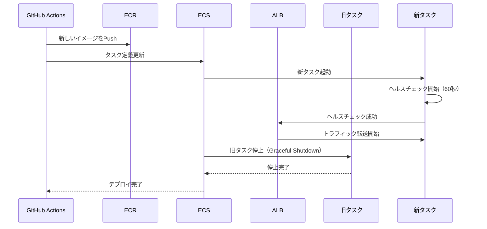

# 03. コンピューティング設計

**作成日**: 2025-10-25
**バージョン**: 1.0
**ステータス**: PM レビュー待ち

---

## 3.1 ECS Fargate 概要

### 採用理由（ADR-001参照）

- サーバーレスコンテナによる運用負荷削減（OSレベルの管理が不要）
- 月20時間 → 月5時間に削減（75%削減）
- オートスケーリングによるピーク時対応
- AWS マネージドサービスによる可用性向上

---

## 3.2 ECS Cluster 設計

### Cluster 構成

| 環境 | Cluster 名 | 起動タイプ | 備考 |
|------|----------|----------|------|
| dev | facilities-dev-cluster | Fargate | 開発環境 |
| stg | facilities-stg-cluster | Fargate | ステージング環境 |
| prod | facilities-prod-cluster | Fargate | 本番環境 |

### Cluster 設定

| 項目 | 設定値 | 備考 |
|------|--------|------|
| Container Insights | 有効 | コンテナレベルのメトリクス取得 |
| デフォルトキャパシティプロバイダー | FARGATE, FARGATE_SPOT | FARGATE_SPOT は dev/stg のみ |

**FARGATE_SPOT の活用**:
- dev/stg 環境でコスト削減（最大70%削減）
- prod 環境は FARGATE のみ（可用性優先）

---

## 3.3 ECS Task Definition 設計

### Task Definition 一覧

本システムには、3つのアプリケーションがあるため、それぞれにTask Definitionを作成します。

| # | Task Definition 名 | 用途 | 環境 | CPU | メモリ |
|---|-------------------|------|------|-----|--------|
| 1 | facilities-staff-api | 業務アプリ（職員向けAPI） | prod | 0.5vCPU | 1GB |
| 2 | facilities-vendor-api | 事業者アプリ（発注業者向けAPI） | prod | 0.5vCPU | 1GB |
| 3 | facilities-batch | 業務バッチ | prod | 2vCPU | 4GB |

### Task Definition 詳細（業務アプリ: facilities-staff-api）

```json
{
  "family": "facilities-staff-api",
  "networkMode": "awsvpc",
  "requiresCompatibilities": ["FARGATE"],
  "cpu": "512",
  "memory": "1024",
  "executionRoleArn": "arn:aws:iam::ACCOUNT_ID:role/ecsTaskExecutionRole",
  "taskRoleArn": "arn:aws:iam::ACCOUNT_ID:role/facilitiesStaffApiTaskRole",
  "containerDefinitions": [
    {
      "name": "staff-api",
      "image": "ACCOUNT_ID.dkr.ecr.ap-northeast-1.amazonaws.com/facilities-staff-api:latest",
      "portMappings": [
        {
          "containerPort": 3000,
          "protocol": "tcp"
        }
      ],
      "essential": true,
      "environment": [
        {
          "name": "NODE_ENV",
          "value": "production"
        },
        {
          "name": "APP_NAME",
          "value": "staff-api"
        }
      ],
      "secrets": [
        {
          "name": "DATABASE_URL",
          "valueFrom": "arn:aws:secretsmanager:ap-northeast-1:ACCOUNT_ID:secret:facilities/prod/database:DATABASE_URL::"
        },
        {
          "name": "JWT_SECRET",
          "valueFrom": "arn:aws:secretsmanager:ap-northeast-1:ACCOUNT_ID:secret:facilities/prod/jwt:JWT_SECRET::"
        }
      ],
      "logConfiguration": {
        "logDriver": "awslogs",
        "options": {
          "awslogs-group": "/ecs/facilities-staff-api",
          "awslogs-region": "ap-northeast-1",
          "awslogs-stream-prefix": "ecs"
        }
      },
      "healthCheck": {
        "command": ["CMD-SHELL", "curl -f http://localhost:3000/health || exit 1"],
        "interval": 30,
        "timeout": 5,
        "retries": 3,
        "startPeriod": 60
      }
    }
  ]
}
```

### Task Definition 詳細（事業者アプリ: facilities-vendor-api）

```json
{
  "family": "facilities-vendor-api",
  "networkMode": "awsvpc",
  "requiresCompatibilities": ["FARGATE"],
  "cpu": "512",
  "memory": "1024",
  "executionRoleArn": "arn:aws:iam::ACCOUNT_ID:role/ecsTaskExecutionRole",
  "taskRoleArn": "arn:aws:iam::ACCOUNT_ID:role/facilitiesVendorApiTaskRole",
  "containerDefinitions": [
    {
      "name": "vendor-api",
      "image": "ACCOUNT_ID.dkr.ecr.ap-northeast-1.amazonaws.com/facilities-vendor-api:latest",
      "portMappings": [
        {
          "containerPort": 3000,
          "protocol": "tcp"
        }
      ],
      "essential": true,
      "environment": [
        {
          "name": "NODE_ENV",
          "value": "production"
        },
        {
          "name": "APP_NAME",
          "value": "vendor-api"
        }
      ],
      "secrets": [
        {
          "name": "DATABASE_URL",
          "valueFrom": "arn:aws:secretsmanager:ap-northeast-1:ACCOUNT_ID:secret:facilities/prod/database:DATABASE_URL::"
        },
        {
          "name": "JWT_SECRET",
          "valueFrom": "arn:aws:secretsmanager:ap-northeast-1:ACCOUNT_ID:secret:facilities/prod/jwt:JWT_SECRET::"
        }
      ],
      "logConfiguration": {
        "logDriver": "awslogs",
        "options": {
          "awslogs-group": "/ecs/facilities-vendor-api",
          "awslogs-region": "ap-northeast-1",
          "awslogs-stream-prefix": "ecs"
        }
      },
      "healthCheck": {
        "command": ["CMD-SHELL", "curl -f http://localhost:3000/health || exit 1"],
        "interval": 30,
        "timeout": 5,
        "retries": 3,
        "startPeriod": 60
      }
    }
  ]
}
```

### Task Definition 詳細（業務バッチ: facilities-batch）

```json
{
  "family": "facilities-batch",
  "networkMode": "awsvpc",
  "requiresCompatibilities": ["FARGATE"],
  "cpu": "2048",
  "memory": "4096",
  "executionRoleArn": "arn:aws:iam::ACCOUNT_ID:role/ecsTaskExecutionRole",
  "taskRoleArn": "arn:aws:iam::ACCOUNT_ID:role/facilitiesBatchTaskRole",
  "containerDefinitions": [
    {
      "name": "batch",
      "image": "ACCOUNT_ID.dkr.ecr.ap-northeast-1.amazonaws.com/facilities-batch:latest",
      "essential": true,
      "environment": [
        {
          "name": "NODE_ENV",
          "value": "production"
        },
        {
          "name": "APP_NAME",
          "value": "batch"
        }
      ],
      "secrets": [
        {
          "name": "DATABASE_URL",
          "valueFrom": "arn:aws:secretsmanager:ap-northeast-1:ACCOUNT_ID:secret:facilities/prod/database:DATABASE_URL::"
        }
      ],
      "logConfiguration": {
        "logDriver": "awslogs",
        "options": {
          "awslogs-group": "/ecs/facilities-batch",
          "awslogs-region": "ap-northeast-1",
          "awslogs-stream-prefix": "ecs"
        }
      }
    }
  ]
}
```

**バッチのCPU/メモリ設定理由**:
- バッチ処理は月次・年次集計で大量データを処理
- APIより重い処理のため、2vCPU / 4GB を割り当て
- 実運用後、CloudWatchメトリクスを見て調整

---

## 3.4 ECS Service 設計

### Service 構成（prod環境）

| # | Service 名 | Task Definition | タスク数（最小-最大） | デプロイ方式 |
|---|-----------|----------------|---------------------|------------|
| 1 | facilities-staff-api-service | facilities-staff-api | 2-5 | ローリングアップデート |
| 2 | facilities-vendor-api-service | facilities-vendor-api | 2-5 | ローリングアップデート |
| 3 | facilities-batch-service | facilities-batch | 1 | 手動起動（EventBridge） |

### Service 設定（業務アプリ: facilities-staff-api-service）

| 項目 | 設定値 | 備考 |
|------|--------|------|
| 起動タイプ | Fargate | |
| タスク定義 | facilities-staff-api:latest | |
| 希望するタスク数 | 2 | オートスケーリングで2-5に変動 |
| デプロイメント構成タイプ | ローリングアップデート | |
| 最小ヘルス率 | 100% | デプロイ中もすべてのタスクが稼働 |
| 最大率 | 200% | 新旧タスクが同時稼働 |
| ヘルスチェック猶予期間 | 60秒 | アプリケーション起動時間を考慮 |
| ネットワーク構成 | awsvpc | |
| サブネット | Private Subnet 1, 2 | マルチAZ |
| セキュリティグループ | ecs-staff-api-sg | |
| パブリックIPの自動割り当て | 無効 | プライベートサブネット配置 |
| ロードバランサー | ALB（業務アプリ用） | |
| ターゲットグループ | staff-api-tg | |

### ローリングアップデートのフロー



**ダウンタイムの考慮**:
- メンテナンス時間中（日曜日または平日夜間）のデプロイのため、数分のダウンタイムは許容
- 最小ヘルス率100%により、新タスクが起動してから旧タスクを停止

---

## 3.5 Application Load Balancer (ALB) 設計

### ALB 構成

| # | ALB 名 | スキーム | サブネット | 用途 |
|---|--------|---------|----------|------|
| 1 | facilities-staff-alb | internal | Public Subnet 1, 2 | 業務アプリ（VPN経由のみアクセス） |
| 2 | facilities-vendor-alb | internet-facing | Public Subnet 1, 2 | 事業者アプリ（インターネット公開） |

### ALB 設定（業務アプリ: facilities-staff-alb）

| 項目 | 設定値 | 備考 |
|------|--------|------|
| スキーム | internal | 内部ALB（VPN経由のみ） |
| IPアドレスタイプ | IPv4 | |
| サブネット | Public Subnet 1, 2 | マルチAZ |
| セキュリティグループ | alb-staff-sg | |
| リスナー | HTTPS (443) | TLS 1.3 |
| ターゲットグループ | staff-api-tg | |
| ヘルスチェック | /health | GET リクエスト |
| ヘルスチェック間隔 | 30秒 | |
| ヘルスチェックタイムアウト | 5秒 | |
| 正常判定しきい値 | 2回連続成功 | |
| 異常判定しきい値 | 2回連続失敗 | |
| アクセスログ | S3 に保存 | 2年間保管 |

### ALB 設定（事業者アプリ: facilities-vendor-alb）

| 項目 | 設定値 | 備考 |
|------|--------|------|
| スキーム | internet-facing | パブリックALB |
| IPアドレスタイプ | IPv4 | |
| サブネット | Public Subnet 1, 2 | マルチAZ |
| セキュリティグループ | alb-vendor-sg | |
| リスナー | HTTPS (443) | TLS 1.3 |
| ターゲットグループ | vendor-api-tg | |
| ヘルスチェック | /health | GET リクエスト |
| ヘルスチェック間隔 | 30秒 | |
| ヘルスチェックタイムアウト | 5秒 | |
| 正常判定しきい値 | 2回連続成功 | |
| 異常判定しきい値 | 2回連続失敗 | |
| アクセスログ | S3 に保存 | 2年間保管 |
| WAF | 有効 | AWS WAF（OWASPルールセット） |

### ターゲットグループ設定

| ターゲットグループ名 | ターゲットタイプ | プロトコル | ポート | VPC | 登録解除の遅延 |
|-------------------|---------------|----------|--------|-----|--------------|
| staff-api-tg | ip | HTTP | 3000 | facilities-prod-vpc | 300秒 |
| vendor-api-tg | ip | HTTP | 3000 | facilities-prod-vpc | 300秒 |

**登録解除の遅延（Deregistration Delay）**:
- 300秒: ECS タスク停止時、既存の接続を処理し終えるまで待機
- Graceful Shutdown を実現

---

## 3.6 オートスケーリング設計

### オートスケーリング設定（prod環境）

#### 業務アプリ（facilities-staff-api-service）

| 項目 | 設定値 | 備考 |
|------|--------|------|
| 最小タスク数 | 2 | 通常時は2タスク |
| 最大タスク数 | 5 | ピーク時は5タスクまで拡張 |
| スケールアウト閾値 | CPU使用率 70% | 2分間連続で超えた場合 |
| スケールイン閾値 | CPU使用率 50% | 5分間連続で下回った場合 |
| クールダウン期間 | 300秒（5分） | 頻繁なスケールを防止 |

#### 事業者アプリ（facilities-vendor-api-service）

| 項目 | 設定値 | 備考 |
|------|--------|------|
| 最小タスク数 | 2 | 通常時は2タスク |
| 最大タスク数 | 5 | ピーク時は5タスクまで拡張 |
| スケールアウト閾値 | CPU使用率 70% | 2分間連続で超えた場合 |
| スケールイン閾値 | CPU使用率 50% | 5分間連続で下回った場合 |
| クールダウン期間 | 300秒（5分） | 頻繁なスケールを防止 |

### オートスケーリングポリシー（CloudFormation例）

```yaml
StaffApiScalingTarget:
  Type: AWS::ApplicationAutoScaling::ScalableTarget
  Properties:
    ServiceNamespace: ecs
    ScalableDimension: ecs:service:DesiredCount
    ResourceId: !Sub service/${ECSCluster}/${StaffApiService}
    MinCapacity: 2
    MaxCapacity: 5

StaffApiScalingPolicyScaleOut:
  Type: AWS::ApplicationAutoScaling::ScalingPolicy
  Properties:
    PolicyName: staff-api-scale-out
    PolicyType: TargetTrackingScaling
    ScalingTargetId: !Ref StaffApiScalingTarget
    TargetTrackingScalingPolicyConfiguration:
      TargetValue: 70.0
      PredefinedMetricSpecification:
        PredefinedMetricType: ECSServiceAverageCPUUtilization
      ScaleOutCooldown: 60
      ScaleInCooldown: 300
```

---

## 3.7 バッチ処理の実行方法

### EventBridge によるスケジュール実行

| バッチ処理 | スケジュール | 実行タスク定義 | 備考 |
|----------|-----------|--------------|------|
| 月次レポート生成 | cron(0 17 1 * ? *) | facilities-batch | 毎月1日 深夜2:00（JST） |
| 年次レポート生成 | cron(0 17 1 1 ? *) | facilities-batch | 毎年1月1日 深夜2:00（JST） |
| 発注期限アラート | cron(0 8 * * ? *) | facilities-batch | 毎日 17:00（JST） |

**注**: EventBridge のスケジュール式はUTC時刻のため、JST → UTC に変換（-9時間）

### EventBridge ルール設定

```yaml
MonthlyReportRule:
  Type: AWS::Events::Rule
  Properties:
    Name: facilities-monthly-report
    ScheduleExpression: "cron(0 17 1 * ? *)"
    State: ENABLED
    Targets:
      - Arn: !GetAtt ECSCluster.Arn
        RoleArn: !GetAtt EventBridgeECSRole.Arn
        EcsParameters:
          TaskDefinitionArn: !Ref BatchTaskDefinition
          LaunchType: FARGATE
          NetworkConfiguration:
            AwsvpcConfiguration:
              AssignPublicIp: DISABLED
              SecurityGroups:
                - !Ref BatchSecurityGroup
              Subnets:
                - !Ref PrivateSubnet1
                - !Ref PrivateSubnet2
        Input: |
          {
            "task": "monthly_report"
          }
```

---

## 3.8 ヒアリング事項（仮決定）

以下の項目は、本来ユーザーに確認すべきですが、合理的な仮決定をしました：

| 項目 | 仮決定内容 | 理由 | ユーザー確認推奨度 |
|------|----------|------|------------------|
| ECS タスク CPU/メモリ（API） | 0.5vCPU/1GB | 要件定義書の記載に基づく | 低 |
| ECS タスク CPU/メモリ（バッチ） | 2vCPU/4GB | 大量データ処理のため、APIより多く割り当て | 中 |
| オートスケーリング閾値 | CPU 70%でスケールアウト | 一般的な閾値 | 中 |
| ローリングアップデート方式 | 最小ヘルス率100%、最大率200% | ダウンタイム最小化 | 低 |
| ALB ヘルスチェック間隔 | 30秒 | 一般的な設定 | 低 |
| バッチ実行時刻 | 深夜2:00（JST） | 業務時間外の低負荷時間帯 | 低 |
| FARGATE_SPOT の活用 | dev/stg のみ | prod は可用性優先 | 中 |

---

**作成者**: architect サブエージェント
**最終更新**: 2025-10-25
