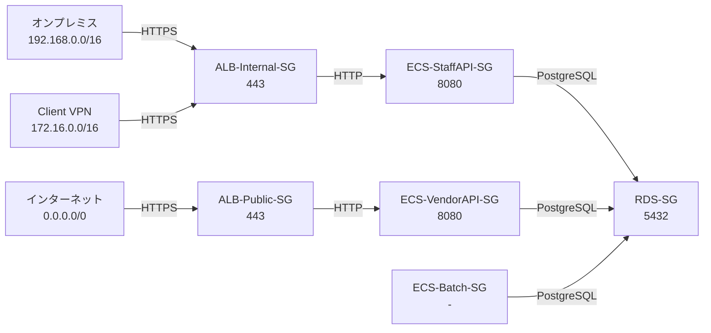
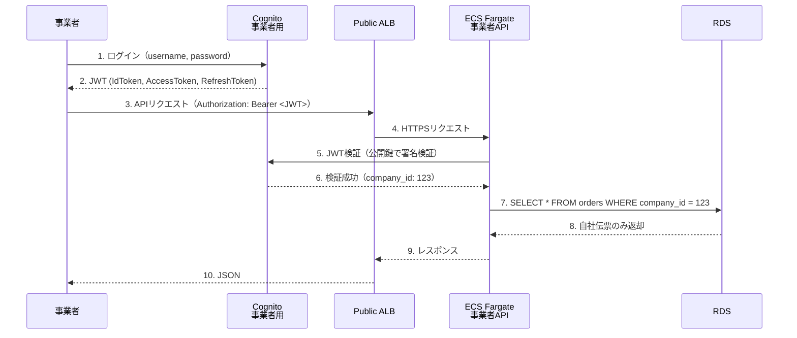

# 03_セキュリティ設計

**作成日**: 2025-10-25
**バージョン**: 1.0
**ステータス**: レビュー待ち

---

## 目次
1. [セキュリティグループ設計](#セキュリティグループ設計)
2. [WAF設計](#waf設計)
3. [認証設計](#認証設計)
4. [暗号化設計](#暗号化設計)
5. [ISMAP準拠事項](#ismap準拠事項)

---

## セキュリティグループ設計

### 設計原則

1. **最小権限の原則**: 必要最小限の通信のみ許可
2. **Ingress ルールのみ**: Egress は原則すべて許可（※）
3. **Security Group 参照**: IP直指定ではなくSG参照推奨

※ 高セキュリティ環境では Egress も制限するが、運用複雑性とのトレードオフ

### VPC-Prod Security Groups

#### ALB-Internal-SG（職員向け内部ALB）

| Direction | Protocol | Port | Source | 用途 |
|-----------|----------|------|--------|------|
| Inbound | TCP | 443 | 192.168.0.0/16（オンプレミス）| VPN経由のHTTPS |
| Inbound | TCP | 443 | 172.16.0.0/16（Client VPN）| Client VPN経由のHTTPS |
| Outbound | All | All | 0.0.0.0/0 | すべて許可 |

**タグ**:
```yaml
Name: myapp-prod-alb-internal-sg
Environment: prod
Purpose: Internal ALB for staff access
```

#### ALB-Public-SG（事業者向けパブリックALB）

| Direction | Protocol | Port | Source | 用途 |
|-----------|----------|------|--------|------|
| Inbound | TCP | 443 | 0.0.0.0/0 | インターネットからのHTTPS |
| Inbound | TCP | 80 | 0.0.0.0/0 | HTTPSリダイレクト用 |
| Outbound | All | All | 0.0.0.0/0 | すべて許可 |

**WAF適用**: 必須（後述）

#### ECS-StaffAPI-SG（職員向けAPIコンテナ）

| Direction | Protocol | Port | Source | 用途 |
|-----------|----------|------|--------|------|
| Inbound | TCP | 8080 | sg-ALB-Internal-SG | ALBからのHTTP |
| Outbound | All | All | 0.0.0.0/0 | すべて許可 |

**説明**: ALBからのトラフィックのみ許可（SG参照）

#### ECS-VendorAPI-SG（事業者向けAPIコンテナ）

| Direction | Protocol | Port | Source | 用途 |
|-----------|----------|------|--------|------|
| Inbound | TCP | 8080 | sg-ALB-Public-SG | ALBからのHTTP |
| Outbound | All | All | 0.0.0.0/0 | すべて許可 |

#### RDS-SG（PostgreSQL）

| Direction | Protocol | Port | Source | 用途 |
|-----------|----------|------|--------|------|
| Inbound | TCP | 5432 | sg-ECS-StaffAPI-SG | 職員APIからのPostgreSQL |
| Inbound | TCP | 5432 | sg-ECS-VendorAPI-SG | 事業者APIからのPostgreSQL |
| Inbound | TCP | 5432 | sg-ECS-Batch-SG | バッチからのPostgreSQL |
| Outbound | All | All | 0.0.0.0/0 | すべて許可 |

**重要**: インターネットからのアクセス不可（Dataサブネット配置）

#### VPC Endpoint-SG（S3、Secrets Manager等）

| Direction | Protocol | Port | Source | 用途 |
|-----------|----------|------|--------|------|
| Inbound | TCP | 443 | 10.2.0.0/16 | VPC内からのHTTPS |
| Outbound | All | All | 0.0.0.0/0 | すべて許可 |

### Security Group 依存関係



---

## WAF設計

### AWS WAF適用範囲

| リソース | WAF適用 | 理由 |
|---------|--------|------|
| Public ALB（事業者向け） | ✅ 必須 | インターネット公開 |
| Internal ALB（職員向け） | ❌ 不要 | VPN経由のみ、閉域 |
| CloudFront | ✅ 必須 | SPA配信、インターネット公開 |

### WAF WebACL設定

#### Rule Priority（優先度順）

| Priority | Rule | Action | 説明 |
|----------|------|--------|------|
| 1 | **Rate Limiting** | Block | 同一IPから5分間に2000リクエスト超過でブロック |
| 2 | **AWS Managed Rules - Core** | Block | SQLインジェクション、XSS対策 |
| 3 | **AWS Managed Rules - Known Bad Inputs** | Block | 既知の脆弱性対策 |
| 4 | **Geographic Restriction** | Block | 日本国外からのアクセスをブロック（※） |
| 5 | **IP Reputation List** | Block | AWS Threat Intelligence による悪意のあるIP |
| 6 | **Default Action** | Allow | 上記に該当しない場合は許可 |

※ 事業者が海外からアクセスする可能性がある場合は除外

#### Rate Limiting詳細

```yaml
RateLimitRule:
  Name: RateLimit-2000-per-5min
  Priority: 1
  RateLimit: 2000
  EvaluationWindowSec: 300
  Action: Block
  Scope: IP
  Statement:
    RateBasedStatement:
      Limit: 2000
      AggregateKeyType: IP
```

**意図**: DDoS攻撃対策、1IPあたり5分間で2000リクエスト（平均6.6req/sec）まで許可

#### Geographic Restriction

```yaml
GeoMatchRule:
  Name: AllowJapanOnly
  Priority: 4
  Action: Block
  Statement:
    NotStatement:
      Statement:
        GeoMatchStatement:
          CountryCodes:
            - JP
```

**意図**: 日本国内からのアクセスのみ許可（海外IPをブロック）

### WAF Logging

| 項目 | 設定値 |
|------|--------|
| **ログ出力先** | CloudWatch Logs |
| **ログ保持期間** | 2年（S3ライフサイクルポリシー適用） |
| **ログ内容** | すべてのリクエスト（Block、Allow両方） |

**ログフォーマット**:
```json
{
  "timestamp": 1698000000000,
  "action": "BLOCK",
  "ruleGroupList": ["AWS-AWSManagedRulesCommonRuleSet"],
  "rateBasedRuleList": [],
  "nonTerminatingMatchingRules": [],
  "requestHeadersInserted": null,
  "responseCodeSent": 403,
  "httpRequest": {
    "clientIp": "203.0.113.1",
    "country": "JP",
    "uri": "/api/v1/users",
    "httpMethod": "POST"
  }
}
```

---

## 認証設計

### Amazon Cognito構成

#### 職員用ユーザープール

| 項目 | 設定値 |
|------|--------|
| **UserPool名** | myapp-prod-staff-userpool |
| **サインインオプション** | username（メールアドレス） |
| **パスワードポリシー** | 最小8文字、英数字記号混在 |
| **MFA** | 任意（推奨：有効） |
| **パスワード有効期限** | 90日 |
| **アカウントロックアウト** | 5回失敗で15分間ロック |
| **JWTトークン有効期限** | 30分（Refresh Token: 30日） |

**カスタム属性**:
```yaml
CustomAttributes:
  - Name: department
    Type: String
    Mutable: true
  - Name: role
    Type: String
    Mutable: true
```

#### 事業者用ユーザープール

| 項目 | 設定値 |
|------|--------|
| **UserPool名** | myapp-prod-vendor-userpool |
| **サインインオプション** | username（メールアドレス） |
| **パスワードポリシー** | 最小8文字、英数字記号混在 |
| **MFA** | 任意 |
| **パスワード有効期限** | 90日 |
| **JWTトークン有効期限** | 30分（Refresh Token: 30日） |

**カスタム属性**:
```yaml
CustomAttributes:
  - Name: company_id
    Type: String
    Mutable: false  # 変更不可（事業者ID固定）
```

**重要**: `company_id` で事業者を識別し、RDSクエリで自社伝票のみフィルタリング

### JWT認証フロー



### API側のJWT検証実装（TypeScript）

```typescript
// ❌ Bad: JWT検証なし
app.get('/api/orders', async (req, res) => {
  const orders = await db.query('SELECT * FROM orders');
  res.json(orders);
});

// ✅ Good: JWT検証 + company_idフィルタリング
import jwt from 'jsonwebtoken';
import jwksClient from 'jwks-rsa';

const client = jwksClient({
  jwksUri: `https://cognito-idp.ap-northeast-1.amazonaws.com/${USER_POOL_ID}/.well-known/jwks.json`
});

async function verifyToken(token: string): Promise<any> {
  const decoded = jwt.decode(token, { complete: true });
  const kid = decoded?.header.kid;
  const key = await client.getSigningKey(kid);
  const publicKey = key.getPublicKey();

  return jwt.verify(token, publicKey, {
    issuer: `https://cognito-idp.ap-northeast-1.amazonaws.com/${USER_POOL_ID}`,
    audience: CLIENT_ID
  });
}

app.get('/api/orders', async (req, res) => {
  const token = req.headers.authorization?.replace('Bearer ', '');
  const payload = await verifyToken(token);
  const companyId = payload['custom:company_id'];

  // 自社伝票のみ取得
  const orders = await db.query('SELECT * FROM orders WHERE company_id = $1', [companyId]);
  res.json(orders);
});
```

---

## 暗号化設計

### 保存時暗号化

| リソース | 暗号化方式 | 鍵管理 | 備考 |
|---------|----------|--------|------|
| **RDS PostgreSQL** | AES-256 | AWS KMS（Customer Managed Key） | 自動バックアップも暗号化 |
| **S3（ログ保管）** | AES-256 | SSE-S3（AWS管理） | ログバケット |
| **S3（SPA配信）** | AES-256 | SSE-S3 | CloudFront配信元 |
| **EBS（Fargate）** | AES-256 | AWS管理 | Fargateのストレージ |
| **Secrets Manager** | AES-256 | AWS KMS（Customer Managed Key） | DB接続情報等 |

### 転送時暗号化

| 通信経路 | 暗号化方式 | 証明書 | 備考 |
|---------|----------|--------|------|
| **インターネット → ALB** | TLS 1.3 | ACM（AWS Certificate Manager） | TLS 1.2以下は拒否 |
| **ALB → ECS** | TLS 1.3 | ACM | - |
| **ECS → RDS** | TLS 1.3 | RDS証明書 | `sslmode=require` |
| **ECS → Secrets Manager** | TLS 1.3 | AWS API | VPC Endpoint経由 |
| **CloudFront → S3** | TLS 1.3 | ACM | - |

### KMS鍵設計

#### Customer Managed Key（CMK）一覧

| 鍵名 | 用途 | ローテーション | 備考 |
|------|------|--------------|------|
| **myapp-prod-rds-key** | RDS暗号化 | 自動（年1回） | マルチリージョン対応 |
| **myapp-prod-secrets-key** | Secrets Manager暗号化 | 自動（年1回） | - |
| **myapp-prod-cloudtrail-key** | CloudTrailログ暗号化 | 自動（年1回） | Organizations Trail用 |

#### KMS鍵ポリシー例（RDS用）

```json
{
  "Version": "2012-10-17",
  "Statement": [
    {
      "Sid": "Enable IAM User Permissions",
      "Effect": "Allow",
      "Principal": {
        "AWS": "arn:aws:iam::123456789012:root"
      },
      "Action": "kms:*",
      "Resource": "*"
    },
    {
      "Sid": "Allow RDS to use the key",
      "Effect": "Allow",
      "Principal": {
        "Service": "rds.amazonaws.com"
      },
      "Action": [
        "kms:Decrypt",
        "kms:GenerateDataKey",
        "kms:CreateGrant"
      ],
      "Resource": "*"
    },
    {
      "Sid": "Allow ECS Task Role to decrypt",
      "Effect": "Allow",
      "Principal": {
        "AWS": "arn:aws:iam::123456789012:role/myapp-prod-ecs-task-role"
      },
      "Action": [
        "kms:Decrypt",
        "kms:DescribeKey"
      ],
      "Resource": "*"
    }
  ]
}
```

### TLS証明書管理

| 証明書 | ドメイン | 更新方式 | 備考 |
|-------|---------|---------|------|
| **Public ALB証明書** | api.example.jp | ACM自動更新 | - |
| **CloudFront証明書** | vendor.example.jp | ACM自動更新 | us-east-1リージョン必須 |

---

## ISMAP準拠事項

### 準拠要件マトリクス

| ISMAP要件 | 実現方法 | エビデンス |
|----------|---------|----------|
| **アクセス制御** | Cognito認証、IAMロール、Security Groups | Cognito設定、IAMポリシー |
| **暗号化（保存時）** | RDS、S3、Secrets Manager（AES-256） | KMS鍵設定、RDS設定 |
| **暗号化（転送時）** | TLS 1.3必須 | ALB Listener設定 |
| **監査ログ** | CloudTrail（2年保管）、VPCフローログ、ALBアクセスログ | S3バケット、ライフサイクルポリシー |
| **構成監査** | AWS Config、Security Hub | Config Rules設定 |
| **脅威検出** | GuardDuty | GuardDuty有効化 |
| **バックアップ** | RDS自動バックアップ（1ヶ月）、PITR（35日） | RDS設定 |
| **アカウント管理** | Cognito（パスワードポリシー、MFA、ロックアウト） | Cognito設定 |
| **最小権限** | IAMロール、Security Groups | IAMポリシー |
| **多層防御** | WAF、Network Firewall、Security Groups | WAF WebACL、NFWルール |

### 機密性レベル3対応

**要件**: 政府情報セキュリティ分類基準「機密性3（機微情報）」

| 要件 | 実現方法 |
|------|---------|
| **物理的分離** | マルチアカウント構成（環境間の完全分離） |
| **ネットワーク分離** | VPC、Security Groups、閉域接続（VPN） |
| **暗号化** | 保存時・転送時ともにAES-256またはTLS 1.3 |
| **アクセスログ** | CloudTrail、VPCフローログ、ALBアクセスログ（2年保管） |
| **定期監査** | AWS Config（日次）、Security Hub（継続的） |

---

## セキュリティ監視

### Security Hub

**有効化**: すべてのアカウント（Organizations統合）

**セキュリティ標準**:
- AWS Foundational Security Best Practices
- CIS AWS Foundations Benchmark v1.4.0
- PCI DSS v3.2.1（参考）

**通知設定**:
- Critical / High の検出結果は即座にSNS通知
- Medium / Low は週次レポート

### GuardDuty

**有効化**: すべてのアカウント（Organizations統合）

**検出タイプ**:
- 不正アクセス試行
- ポートスキャン
- 異常なAPIコール
- 暗号通貨マイニング

**通知設定**:
- Critical の検出結果は即座にSNS通知 → Slack

### AWS Config

**有効化**: すべてのアカウント（Organizations統合）

**主要Config Rules**:
- `rds-storage-encrypted`: RDS暗号化必須
- `s3-bucket-public-read-prohibited`: S3パブリック読み取り禁止
- `iam-password-policy`: IAMパスワードポリシー準拠
- `cloudtrail-enabled`: CloudTrail有効化必須
- `vpc-sg-open-only-to-authorized-ports`: Security Groups適切設定

---

## 次のステップ

- [04_監査・コンプライアンス設計.md](04_監査・コンプライアンス設計.md): CloudTrail、ログ保管の詳細
- [06_コンピュート設計.md](06_コンピュート設計.md): ECS Task RoleのIAM設計

---

**作成者**: Architect（Claude）
**レビュー状態**: レビュー待ち
