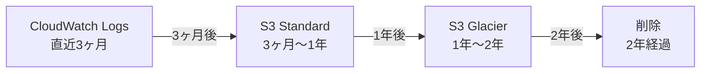

# 04_監査・コンプライアンス設計

**作成日**: 2025-10-25
**バージョン**: 1.0
**ステータス**: レビュー待ち

---

## 目次
1. [監査ログ設計](#監査ログ設計)
2. [ログ保管戦略](#ログ保管戦略)
3. [証跡管理](#証跡管理)
4. [法令準拠](#法令準拠)

---

## 監査ログ設計

### ログ種別とレベル

| ログ種別 | 保管先 | 保管期間 | 用途 | ISMAP要件 |
|---------|--------|---------|------|-----------|
| **CloudTrail** | S3 | 2年 | AWSリソース変更履歴 | 必須 |
| **VPCフローログ** | CloudWatch → S3 | 1年 | ネットワーク通信記録 | 必須 |
| **ALBアクセスログ** | S3 | 2年 | HTTPリクエスト履歴 | 必須 |
| **アプリケーションログ** | CloudWatch → S3 | 2年 | API呼び出し、エラー | 必須 |
| **RDSログ** | CloudWatch → S3 | 2年 | SQLクエリ、エラー | 必須 |
| **WAFログ** | CloudWatch Logs | 2年 | ブロックされたリクエスト | 推奨 |
| **GuardDuty検出結果** | S3（自動） | 無期限 | 脅威検出履歴 | 推奨 |
| **Config履歴** | S3（自動） | 2年 | 構成変更履歴 | 必須 |

### CloudTrail設計

#### Organizations Trail（全アカウント統合）

| 項目 | 設定値 | 備考 |
|------|--------|------|
| **Trail名** | myapp-organizations-trail |  |
| **適用範囲** | すべてのアカウント（Organizations統合） | Management, Network Shared, Service-Dev/Stg/Prod |
| **ログ保管先** | S3バケット（Network Shared Account） | s3://myapp-cloudtrail-logs-prod |
| **KMS暗号化** | 有効（myapp-prod-cloudtrail-key） | - |
| **ログファイル検証** | 有効 | 改ざん検出 |
| **多地域記録** | 有効 | すべてのリージョン |
| **管理イベント** | 読み取り・書き込み両方 | すべてのAPI呼び出し |
| **データイベント** | S3、Lambda | 必要に応じて有効化 |
| **Insights** | 有効 | 異常なAPI呼び出しパターン検出 |

#### CloudTrail ログ出力例

```json
{
  "eventVersion": "1.08",
  "userIdentity": {
    "type": "AssumedRole",
    "principalId": "AIDAI...:admin-user",
    "arn": "arn:aws:sts::123456789012:assumed-role/AdminRole/admin-user",
    "accountId": "123456789012",
    "sessionContext": {
      "sessionIssuer": {
        "type": "Role",
        "principalId": "AIDAI...",
        "arn": "arn:aws:iam::123456789012:role/AdminRole"
      }
    }
  },
  "eventTime": "2025-10-25T10:00:00Z",
  "eventSource": "rds.amazonaws.com",
  "eventName": "ModifyDBInstance",
  "awsRegion": "ap-northeast-1",
  "sourceIPAddress": "203.0.113.1",
  "userAgent": "aws-cli/2.13.0",
  "requestParameters": {
    "dBInstanceIdentifier": "myapp-prod-db",
    "allocatedStorage": 200
  },
  "responseElements": {
    "dBInstanceIdentifier": "myapp-prod-db",
    "dBInstanceStatus": "modifying"
  }
}
```

### VPCフローログ設計

#### 記録対象VPC

| VPC | 記録範囲 | フィルタ | 保管先 |
|-----|---------|---------|--------|
| VPC-Prod | すべてのENI | ACCEPT + REJECT | CloudWatch Logs → S3 |
| VPC-Stg | すべてのENI | ACCEPT + REJECT | CloudWatch Logs → S3 |
| VPC-Dev | すべてのENI | REJECT のみ | CloudWatch Logs（S3転送なし） |
| Egress VPC | すべてのENI | ACCEPT + REJECT | CloudWatch Logs → S3 |

#### フローログフォーマット

```
${srcaddr} ${dstaddr} ${srcport} ${dstport} ${protocol} ${packets} ${bytes} ${start} ${end} ${action} ${log-status}
```

#### フローログ出力例

```
203.0.113.1 10.2.10.5 443 8080 6 50 5000 1698000000 1698000060 ACCEPT OK
10.2.10.5 10.2.20.10 45678 5432 6 100 10000 1698000000 1698000060 ACCEPT OK
192.0.2.1 10.2.10.5 12345 22 6 10 600 1698000000 1698000010 REJECT OK
```

**意図**:
- 1行目: インターネット → ECS（HTTPS、許可）
- 2行目: ECS → RDS（PostgreSQL、許可）
- 3行目: 不正アクセス試行（SSH、拒否）

### ALBアクセスログ設計

| 項目 | 設定値 |
|------|--------|
| **保管先** | S3（s3://myapp-alb-logs-prod） |
| **保管期間** | 2年（S3ライフサイクルポリシー） |
| **ログフォーマット** | ELB標準フォーマット |
| **記録内容** | すべてのHTTPリクエスト（成功・失敗両方） |

#### ALBアクセスログ出力例

```
https 2025-10-25T10:00:00.123456Z app/myapp-prod-alb-public/50dc6c495c0c9188 203.0.113.1:443 10.2.10.5:8080 0.001 0.002 0.000 200 200 123 456 "POST https://api.example.jp:443/api/v1/orders HTTP/1.1" "Mozilla/5.0" ECDHE-RSA-AES128-GCM-SHA256 TLSv1.3
```

### アプリケーションログ設計

#### ログレベル

| 環境 | ログレベル | 備考 |
|------|----------|------|
| Dev | DEBUG | 詳細デバッグ情報 |
| Stg | INFO | 通常の動作ログ |
| Prod | INFO | 通常の動作ログ |

#### 構造化ログ（JSON形式）

```json
{
  "timestamp": "2025-10-25T10:00:00.123Z",
  "level": "INFO",
  "service": "staff-api",
  "event": "api_request",
  "method": "POST",
  "path": "/api/v1/orders",
  "user_id": "user-123",
  "company_id": null,
  "status_code": 200,
  "duration_ms": 45,
  "ip": "10.2.10.5",
  "user_agent": "Mozilla/5.0"
}
```

**禁止事項**:
```typescript
// ❌ Bad: パスワード、トークンをログ出力
logger.info(`User login: password=${password}`);
logger.debug(`JWT: ${token}`);

// ✅ Good: 機密情報はマスク
logger.info(`User login: user_id=${userId}`);
logger.debug(`JWT: ${token.substring(0, 10)}...`);
```

### RDSログ設計

#### 有効化するログ

| ログ種別 | 用途 | 保管先 |
|---------|------|--------|
| **Error Log** | エラー、警告 | CloudWatch Logs → S3 |
| **Slow Query Log** | 遅いクエリ（1秒以上） | CloudWatch Logs → S3 |
| **General Log** | すべてのSQL（本番では無効推奨） | - |

**設定**:
```sql
-- スロークエリログ有効化
SET log_min_duration_statement = 1000;  -- 1秒以上のクエリ
```

---

## ログ保管戦略

### S3ライフサイクルポリシー



#### ライフサイクルポリシー設定例

```yaml
LifecycleConfiguration:
  Rules:
    - Id: MoveToStandardAfter90Days
      Status: Enabled
      Transitions:
        - Days: 90
          StorageClass: STANDARD
      Filter:
        Prefix: cloudwatch-logs/

    - Id: MoveToGlacierAfter365Days
      Status: Enabled
      Transitions:
        - Days: 365
          StorageClass: GLACIER
      Filter:
        Prefix: cloudwatch-logs/

    - Id: DeleteAfter730Days
      Status: Enabled
      Expiration:
        Days: 730
      Filter:
        Prefix: cloudwatch-logs/
```

### S3バケット設計

| バケット名 | 用途 | 暗号化 | バージョニング | MFA Delete |
|----------|------|--------|-------------|-----------|
| **myapp-cloudtrail-logs-prod** | CloudTrail（全アカウント） | KMS（CMK） | 有効 | 有効 |
| **myapp-alb-logs-prod** | ALBアクセスログ | SSE-S3 | 無効 | 無効 |
| **myapp-application-logs-prod** | アプリケーションログ | SSE-S3 | 無効 | 無効 |
| **myapp-vpc-flow-logs-prod** | VPCフローログ | SSE-S3 | 無効 | 無効 |

**バケットポリシー例（CloudTrail用）**:
```json
{
  "Version": "2012-10-17",
  "Statement": [
    {
      "Sid": "AWSCloudTrailAclCheck",
      "Effect": "Allow",
      "Principal": {
        "Service": "cloudtrail.amazonaws.com"
      },
      "Action": "s3:GetBucketAcl",
      "Resource": "arn:aws:s3:::myapp-cloudtrail-logs-prod"
    },
    {
      "Sid": "AWSCloudTrailWrite",
      "Effect": "Allow",
      "Principal": {
        "Service": "cloudtrail.amazonaws.com"
      },
      "Action": "s3:PutObject",
      "Resource": "arn:aws:s3:::myapp-cloudtrail-logs-prod/*",
      "Condition": {
        "StringEquals": {
          "s3:x-amz-acl": "bucket-owner-full-control"
        }
      }
    }
  ]
}
```

---

## 証跡管理

### ログ改ざん検出

#### CloudTrailログファイル検証

**仕組み**:
- CloudTrailが各ログファイルに対してSHA-256ハッシュ値を生成
- ハッシュ値を秘密鍵で署名（デジタル署名）
- 公開鍵で署名を検証することで改ざん検出

**検証コマンド**:
```bash
aws cloudtrail validate-logs \
  --trail-arn arn:aws:cloudtrail:ap-northeast-1:123456789012:trail/myapp-organizations-trail \
  --start-time 2025-10-24T00:00:00Z \
  --end-time 2025-10-25T23:59:59Z
```

**出力例**:
```
Results requested for 2025-10-24T00:00:00Z to 2025-10-25T23:59:59Z
100/100 digest files valid
0 digest files invalid
0 log files invalid
```

### ログアクセス制限

| ログ種別 | アクセス権限 | 備考 |
|---------|-----------|------|
| **CloudTrail** | 監査部門のみ | IAMロール `AuditRole` |
| **VPCフローログ** | インフラチーム、監査部門 | IAMロール `InfraRole`, `AuditRole` |
| **アプリケーションログ** | 開発チーム、運用チーム | IAMロール `DevRole`, `OpsRole` |

**IAMポリシー例（監査部門専用）**:
```json
{
  "Version": "2012-10-17",
  "Statement": [
    {
      "Effect": "Allow",
      "Action": [
        "s3:GetObject",
        "s3:ListBucket"
      ],
      "Resource": [
        "arn:aws:s3:::myapp-cloudtrail-logs-prod",
        "arn:aws:s3:::myapp-cloudtrail-logs-prod/*"
      ]
    },
    {
      "Effect": "Deny",
      "Action": [
        "s3:DeleteObject",
        "s3:PutObject"
      ],
      "Resource": [
        "arn:aws:s3:::myapp-cloudtrail-logs-prod/*"
      ]
    }
  ]
}
```

### ログ分析ツール

| ツール | 用途 | 備考 |
|-------|------|------|
| **CloudWatch Insights** | リアルタイムログ検索 | 直近3ヶ月 |
| **Athena** | S3保存ログのSQL分析 | 過去2年分 |
| **QuickSight** | ダッシュボード可視化 | 監査レポート自動生成 |

#### Athena クエリ例（不正アクセス試行検出）

```sql
SELECT
  eventTime,
  userIdentity.principalId,
  sourceIPAddress,
  eventName,
  errorCode
FROM cloudtrail_logs
WHERE
  errorCode IN ('AccessDenied', 'UnauthorizedOperation')
  AND eventTime >= '2025-10-01'
ORDER BY eventTime DESC
LIMIT 100;
```

---

## 法令準拠

### ISMAP準拠チェックリスト

| 要件番号 | 要件内容 | 実現方法 | エビデンス |
|---------|---------|---------|----------|
| **1.2.1** | アクセスログ記録 | CloudTrail、VPCフローログ、ALBアクセスログ | S3バケット設定 |
| **1.2.2** | ログ保管期間（2年以上） | S3ライフサイクルポリシー | ポリシー設定 |
| **1.2.3** | ログ改ざん防止 | CloudTrailログファイル検証、KMS暗号化 | 検証結果 |
| **1.2.4** | ログアクセス制限 | IAMロール、S3バケットポリシー | IAMポリシー |
| **1.3.1** | 構成監査 | AWS Config | Config Rules設定 |
| **1.3.2** | 脅威検出 | GuardDuty | GuardDuty有効化 |
| **1.4.1** | 暗号化（保存時） | RDS、S3（KMS） | KMS鍵設定 |
| **1.4.2** | 暗号化（転送時） | TLS 1.3 | ALB Listener設定 |

### 政府情報システムにおけるクラウドサービス利用の基本方針

| 項目 | 要件 | 実現方法 |
|------|------|---------|
| **セキュリティ対策** | 多層防御 | WAF、Network Firewall、Security Groups |
| **監査証跡** | すべての操作を記録 | CloudTrail（Organizations Trail） |
| **データ主権** | 日本国内にデータ保管 | 東京リージョン |
| **アクセス制御** | 最小権限の原則 | IAMロール、Cognito |
| **定期監査** | 構成の継続的監査 | AWS Config（日次） |

### 個人情報保護法対応

| 要件 | 実現方法 |
|------|---------|
| **個人データ暗号化** | RDS暗号化（保存時）、TLS 1.3（転送時） |
| **アクセス制限** | Cognito認証、IAMロール、Security Groups |
| **漏洩時の対応** | GuardDuty、CloudWatch Alarms（SNS通知） |
| **保管期間制限** | S3ライフサイクルポリシー（2年後削除） |

---

## 監査レポート自動生成

### 週次セキュリティレポート

**内容**:
- Security Hub検出結果サマリー（Critical/High/Medium/Low）
- GuardDuty脅威検出件数
- WAFブロック統計
- Config非準拠リソース一覧

**配信先**: メール、Slack

**Lambda関数による自動生成**:
```python
import boto3
import json

def lambda_handler(event, context):
    securityhub = boto3.client('securityhub')
    guardduty = boto3.client('guardduty')

    # Security Hub検出結果取得
    findings = securityhub.get_findings(
        Filters={'SeverityLabel': [{'Value': 'CRITICAL', 'Comparison': 'EQUALS'}]}
    )

    # レポート生成
    report = {
        'date': event['time'],
        'critical_findings': len(findings['Findings']),
        'summary': '...'
    }

    # SNS通知
    sns = boto3.client('sns')
    sns.publish(
        TopicArn='arn:aws:sns:ap-northeast-1:123456789012:SecurityReport',
        Subject='週次セキュリティレポート',
        Message=json.dumps(report, indent=2)
    )
```

---

## 次のステップ

- [08_監視・アラート設計.md](08_監視・アラート設計.md): CloudWatch Alarmsの詳細設計
- [10_CloudFormation構成方針.md](10_CloudFormation構成方針.md): 監査ログスタックの分割方針

---

**作成者**: Architect（Claude）
**レビュー状態**: レビュー待ち
