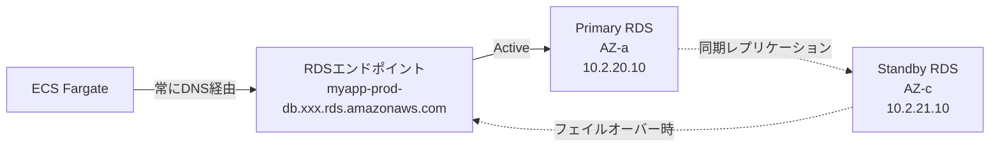
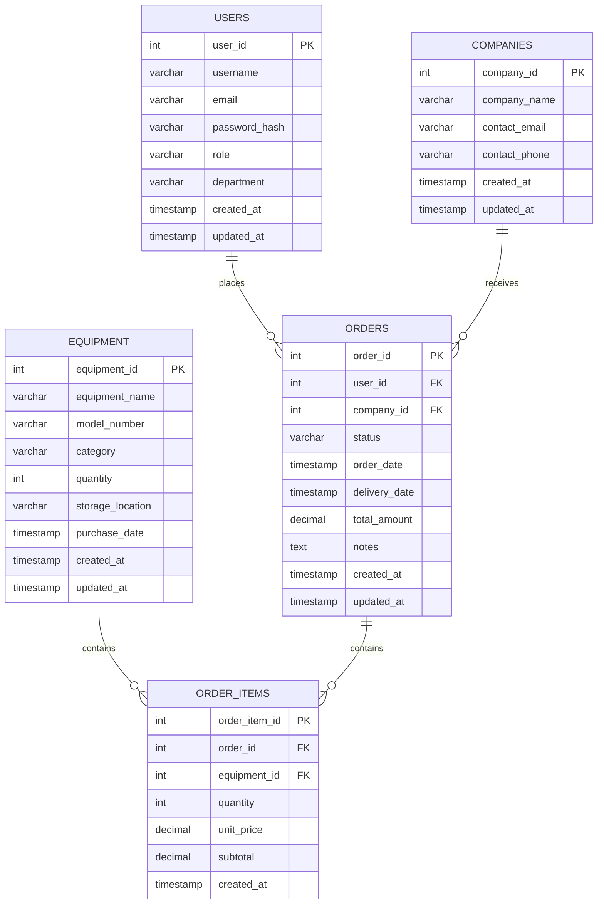

# 05_データベース設計

**作成日**: 2025-10-25
**バージョン**: 1.0
**ステータス**: レビュー待ち

---

## 目次
1. [RDS構成設計](#rds構成設計)
2. [バックアップ戦略](#バックアップ戦略)
3. [データモデル設計](#データモデル設計)
4. [パフォーマンスチューニング](#パフォーマンスチューニング)

---

## RDS構成設計

### 環境別RDS構成

| 環境 | インスタンスタイプ | ストレージ | Multi-AZ | バックアップ保持期間 | 自動マイナーバージョンアップ |
|------|------------------|----------|----------|-------------------|----------------------|
| **Dev** | db.t4g.micro | 20GB (gp3) | 無効 | 7日 | 無効（手動） |
| **Stg** | db.t4g.small | 50GB (gp3) | 有効 | 14日 | 有効 |
| **Prod** | db.t4g.medium | 100GB (gp3) | 有効 | 30日 | 有効 |

### RDS PostgreSQL 14 設定

| 項目 | 設定値 | 備考 |
|------|--------|------|
| **エンジンバージョン** | PostgreSQL 14.9 | 最新マイナーバージョン |
| **パラメータグループ** | myapp-postgres14-prod | カスタム設定 |
| **暗号化** | 有効（KMS） | CMK: myapp-prod-rds-key |
| **パブリックアクセス** | 無効 | Dataサブネット配置 |
| **TLS接続** | 必須（sslmode=require） | TLS 1.3 |
| **ポート** | 5432 | デフォルト |
| **タイムゾーン** | Asia/Tokyo | JST |
| **文字エンコーディング** | UTF-8 | - |

### Multi-AZ構成（Stg / Prod）



**フェイルオーバー**:
- **自動フェイルオーバー**: 60-120秒
- **DNSエンドポイント**: 変更不要（自動切り替え）
- **データロス**: なし（同期レプリケーション）

### パラメータグループ設定

#### 主要パラメータ

| パラメータ | Dev | Stg | Prod | 説明 |
|----------|-----|-----|------|------|
| **max_connections** | 50 | 100 | 200 | 最大同時接続数 |
| **shared_buffers** | 256MB | 512MB | 1GB | 共有バッファサイズ |
| **work_mem** | 4MB | 8MB | 16MB | ソート・ハッシュ用メモリ |
| **maintenance_work_mem** | 64MB | 128MB | 256MB | VACUUM、CREATE INDEX用 |
| **effective_cache_size** | 512MB | 1GB | 2GB | OSキャッシュ想定サイズ |
| **log_min_duration_statement** | 1000 | 1000 | 1000 | スロークエリログ（1秒以上） |
| **log_statement** | 'all' | 'ddl' | 'ddl' | DDLのみログ |
| **rds.force_ssl** | 1 | 1 | 1 | TLS必須 |

### DBサブネットグループ

| 環境 | サブネット | AZ |
|------|----------|-----|
| **Prod** | Data-AZ-a (10.2.20.0/24) | ap-northeast-1a |
| **Prod** | Data-AZ-c (10.2.21.0/24) | ap-northeast-1c |

---

## バックアップ戦略

### 自動バックアップ

| 項目 | Dev | Stg | Prod | 備考 |
|------|-----|-----|------|------|
| **バックアップウィンドウ** | 02:00-03:00 | 02:00-03:00 | 02:00-03:00 | JST |
| **保持期間** | 7日 | 14日 | 30日 | - |
| **スナップショットタイプ** | 自動 | 自動 | 自動 | - |
| **Multi-AZ影響** | N/A | なし | なし | Standbyから取得 |

### 手動スナップショット

**取得タイミング**:
- デプロイ前（必須）
- データ移行前（必須）
- 重要な変更前（推奨）

**保持期間**: 無期限（手動削除）

**命名規則**:
```
myapp-prod-db-manual-YYYYMMDD-HHMM-[reason]
例: myapp-prod-db-manual-20251025-1400-before-migration
```

### ポイントインタイムリカバリ（PITR）

| 項目 | 設定値 | 備考 |
|------|--------|------|
| **PITR有効化** | 有効 | すべての環境 |
| **復旧可能期間** | 35日（最長） | バックアップ保持期間と同じ |
| **復旧時間** | 約30分 | RDSインスタンス作成時間含む |

**PITRコマンド例**:
```bash
aws rds restore-db-instance-to-point-in-time \
  --source-db-instance-identifier myapp-prod-db \
  --target-db-instance-identifier myapp-prod-db-restored \
  --restore-time 2025-10-25T10:30:00Z \
  --db-subnet-group-name myapp-prod-db-subnet-group \
  --vpc-security-group-ids sg-xxxxx
```

### クロスリージョンスナップショットコピー

**目的**: DR（災害復旧）対策

| 項目 | 設定値 |
|------|--------|
| **コピー先リージョン** | ap-northeast-3（大阪） |
| **コピー頻度** | 毎日（自動） |
| **保持期間** | 7日 |
| **暗号化** | 有効（大阪リージョンのKMS鍵） |

---

## データモデル設計

### ER図（主要テーブル）



### テーブル定義

#### USERS（職員）

```sql
CREATE TABLE users (
    user_id         SERIAL PRIMARY KEY,
    username        VARCHAR(100) NOT NULL UNIQUE,
    email           VARCHAR(255) NOT NULL UNIQUE,
    password_hash   VARCHAR(255) NOT NULL,  -- Cognito使用時は不要
    role            VARCHAR(50) NOT NULL,   -- 'admin', 'approver', 'user'
    department      VARCHAR(100),
    created_at      TIMESTAMP NOT NULL DEFAULT CURRENT_TIMESTAMP,
    updated_at      TIMESTAMP NOT NULL DEFAULT CURRENT_TIMESTAMP
);

CREATE INDEX idx_users_email ON users(email);
CREATE INDEX idx_users_role ON users(role);
```

#### COMPANIES（事業者）

```sql
CREATE TABLE companies (
    company_id      SERIAL PRIMARY KEY,
    company_name    VARCHAR(255) NOT NULL,
    contact_email   VARCHAR(255) NOT NULL,
    contact_phone   VARCHAR(50),
    created_at      TIMESTAMP NOT NULL DEFAULT CURRENT_TIMESTAMP,
    updated_at      TIMESTAMP NOT NULL DEFAULT CURRENT_TIMESTAMP
);

CREATE INDEX idx_companies_name ON companies(company_name);
```

#### EQUIPMENT（設備機器）

```sql
CREATE TABLE equipment (
    equipment_id        SERIAL PRIMARY KEY,
    equipment_name      VARCHAR(255) NOT NULL,
    model_number        VARCHAR(100),
    category            VARCHAR(100),
    quantity            INT NOT NULL DEFAULT 0,
    storage_location    VARCHAR(255),
    purchase_date       DATE,
    created_at          TIMESTAMP NOT NULL DEFAULT CURRENT_TIMESTAMP,
    updated_at          TIMESTAMP NOT NULL DEFAULT CURRENT_TIMESTAMP
);

CREATE INDEX idx_equipment_category ON equipment(category);
CREATE INDEX idx_equipment_location ON equipment(storage_location);
```

#### ORDERS（発注）

```sql
CREATE TABLE orders (
    order_id        SERIAL PRIMARY KEY,
    user_id         INT NOT NULL REFERENCES users(user_id),
    company_id      INT NOT NULL REFERENCES companies(company_id),
    status          VARCHAR(50) NOT NULL DEFAULT 'pending',  -- 'pending', 'approved', 'sent', 'delivered'
    order_date      TIMESTAMP NOT NULL DEFAULT CURRENT_TIMESTAMP,
    delivery_date   TIMESTAMP,
    total_amount    DECIMAL(15, 2) NOT NULL,
    notes           TEXT,
    created_at      TIMESTAMP NOT NULL DEFAULT CURRENT_TIMESTAMP,
    updated_at      TIMESTAMP NOT NULL DEFAULT CURRENT_TIMESTAMP
);

CREATE INDEX idx_orders_user_id ON orders(user_id);
CREATE INDEX idx_orders_company_id ON orders(company_id);
CREATE INDEX idx_orders_status ON orders(status);
CREATE INDEX idx_orders_order_date ON orders(order_date DESC);
```

#### ORDER_ITEMS（発注明細）

```sql
CREATE TABLE order_items (
    order_item_id   SERIAL PRIMARY KEY,
    order_id        INT NOT NULL REFERENCES orders(order_id) ON DELETE CASCADE,
    equipment_id    INT NOT NULL REFERENCES equipment(equipment_id),
    quantity        INT NOT NULL,
    unit_price      DECIMAL(15, 2) NOT NULL,
    subtotal        DECIMAL(15, 2) NOT NULL,
    created_at      TIMESTAMP NOT NULL DEFAULT CURRENT_TIMESTAMP
);

CREATE INDEX idx_order_items_order_id ON order_items(order_id);
CREATE INDEX idx_order_items_equipment_id ON order_items(equipment_id);
```

### データアクセス制御

#### Row-Level Security（事業者用）

```sql
-- 事業者は自社の発注のみアクセス可能
CREATE POLICY company_isolation_policy ON orders
    FOR ALL
    TO vendor_role
    USING (company_id = current_setting('app.current_company_id')::int);

ALTER TABLE orders ENABLE ROW LEVEL SECURITY;
```

**アプリケーション側での設定**:
```typescript
// JWT から company_id を取得
const companyId = payload['custom:company_id'];

// PostgreSQLセッション変数に設定
await db.query('SET app.current_company_id = $1', [companyId]);

// 以降、このセッション内のクエリはRLSが適用される
const orders = await db.query('SELECT * FROM orders');
// → company_id = 123 の発注のみ返却される
```

---

## パフォーマンスチューニング

### インデックス戦略

#### 作成済みインデックス

- `idx_users_email`: ログイン時の高速検索
- `idx_users_role`: ロール別ユーザー検索
- `idx_companies_name`: 事業者検索
- `idx_equipment_category`: カテゴリ別機器検索
- `idx_equipment_location`: 保管場所別検索
- `idx_orders_user_id`: ユーザー別発注履歴
- `idx_orders_company_id`: 事業者別発注履歴
- `idx_orders_status`: ステータス別発注検索
- `idx_orders_order_date`: 日付別発注検索（降順）

#### クエリ最適化例

**Bad**:
```sql
-- フルテーブルスキャン
SELECT * FROM orders WHERE EXTRACT(YEAR FROM order_date) = 2025;
```

**Good**:
```sql
-- インデックス使用
SELECT * FROM orders
WHERE order_date >= '2025-01-01' AND order_date < '2026-01-01';
```

### コネクションプーリング

**アプリケーション側（TypeScript + pg）**:
```typescript
import { Pool } from 'pg';

const pool = new Pool({
  host: process.env.DB_HOST,
  port: 5432,
  database: process.env.DB_NAME,
  user: process.env.DB_USER,
  password: process.env.DB_PASSWORD,
  ssl: { rejectUnauthorized: true },
  max: 20,           // 最大接続数
  idleTimeoutMillis: 30000,  // アイドルタイムアウト
  connectionTimeoutMillis: 2000  // 接続タイムアウト
});
```

### VACUUM戦略

**自動VACUUM**:
```sql
-- パラメータグループ設定
autovacuum = on
autovacuum_vacuum_scale_factor = 0.1
autovacuum_analyze_scale_factor = 0.05
```

**手動VACUUM（月次メンテナンス）**:
```sql
-- すべてのテーブルをVACUUM ANALYZE
VACUUM ANALYZE;

-- 特定テーブルのみ
VACUUM ANALYZE orders;
```

### 監視メトリクス

| メトリクス | 閾値 | アラート |
|----------|------|---------|
| **CPUUtilization** | 80%以上 | SNS通知 |
| **DatabaseConnections** | 最大接続数の80% | SNS通知 |
| **FreeStorageSpace** | 10GB以下 | SNS通知 |
| **ReadLatency** | 10ms以上 | SNS通知 |
| **WriteLatency** | 10ms以上 | SNS通知 |

---

## 次のステップ

- [06_コンピュート設計.md](06_コンピュート設計.md): ECSからのDB接続設計
- [08_監視・アラート設計.md](08_監視・アラート設計.md): RDS監視の詳細

---

**作成者**: Architect（Claude）
**レビュー状態**: レビュー待ち
