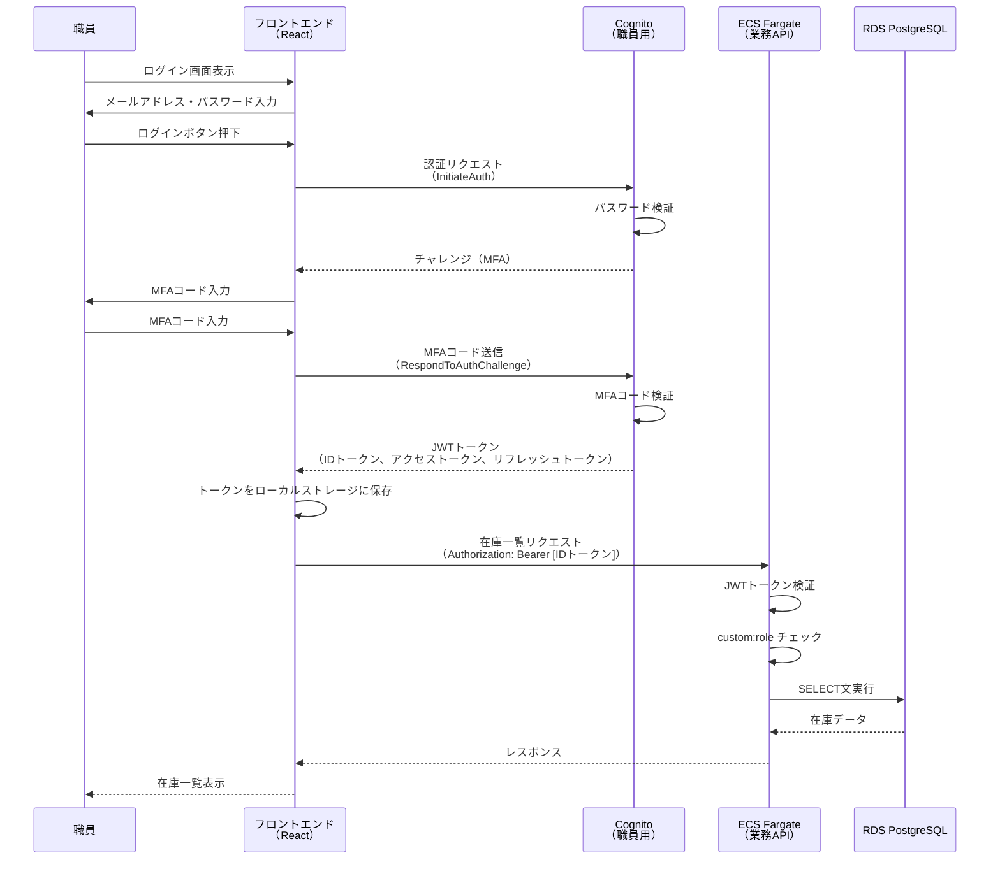
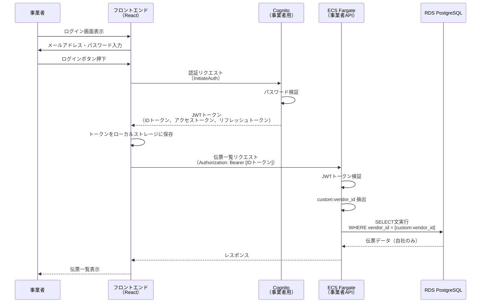

# 05. 認証認可設計

**作成日**: 2025-10-25
**バージョン**: 1.0
**ステータス**: PM レビュー待ち

---

## 5.1 Amazon Cognito 概要

### 採用理由（ADR-003参照）

- マネージドサービスによる認証基盤の運用負荷削減
- MFA（多要素認証）のサポート
- ユーザープール分離によるデータ分離（事業者は自社伝票のみアクセス）
- ISMAP準拠の認証基準を満たす

---

## 5.2 Cognito ユーザープール設計

### ユーザープール設計方針

**ユーザープール分離**:
本システムでは、職員用と事業者用で異なる認証要件があるため、ユーザープールを分離します。

**分離の理由**:
- **データ分離**: 職員と事業者でアクセス範囲が異なる
- **セキュリティ**: 職員は管理者権限あり、事業者は閲覧権限のみ
- **独立した認証ポリシー**: 職員はMFA推奨、事業者はMFA任意
- **監査要件**: 職員と事業者のログインログを分離

**注**: 具体的なユーザープール名、利用者数は、パラメーターシートを参照してください。

---

## 5.3 職員用ユーザープール設計

### 設計方針

**認証設定**:
- サインイン方式: メールアドレス
- セルフサインアップ無効（管理者が職員を手動で追加）
- メール検証有効（初回ログイン時）

**パスワードポリシー**:
- ISMAP準拠の強固なパスワードポリシー
- 定期的なパスワード変更を強制
- パスワード履歴管理（再利用防止）

**MFA（多要素認証）**:
- 推奨設定（ユーザーが選択可能）
- MFA 方式: SMS、TOTP（Google Authenticator等）
- 管理者はMFA強制設定も可能

**ユーザー属性**:
- email: サインインID
- custom:employee_id: 職員ID（一意）
- custom:role: 権限（admin, staff, approver）
- custom:department: 所属部署

**トークン有効期限**:
- IDトークン・アクセストークン: 短時間（セキュリティ優先）
- リフレッシュトークン: 自動再ログイン期限

**注**: 具体的な設定値は、パラメーターシートを参照してください。

---

## 5.4 事業者用ユーザープール設計

### 設計方針

**認証設定**:
- サインイン方式: メールアドレス
- セルフサインアップ無効（管理者が事業者を手動で追加）
- メール検証有効

**パスワードポリシー**:
- ISMAP準拠（職員用と同じ）

**MFA（多要素認証）**:
- 任意（強制しない）
- ユーザーの利便性を考慮

**ユーザー属性**:
- email: サインインID
- custom:vendor_id: 事業者ID（一意） - **データ分離の鍵**
- custom:company_name: 事業者名

**重要**: `custom:vendor_id` を使って、事業者が自社の伝票のみアクセスできるように制御します。

**注**: 具体的な設定値は、パラメーターシートを参照してください。

---

## 5.5 認証フロー

### 職員ログインフロー

### 事業者ログインフロー

---

## 5.6 認可（アクセス制御）設計

### 職員の権限管理

**ロールベースアクセス制御（RBAC）**:
- **管理者（admin）**: すべての機能にアクセス可能
- **一般職員（staff）**: 在庫管理、発注申請
- **承認者（approver）**: 発注承認、レポート閲覧

**実装方針**:
- JWTトークンの `custom:role` 属性を使用
- API エンドポイント単位で権限チェック
- Middleware で認可制御を実装

### 事業者のデータ分離

**実装方針**:
- JWTトークンの `custom:vendor_id` 属性を抽出
- SQLクエリのWHERE句で事業者IDによるフィルタリング
- 事業者は自社の伝票のみアクセス可能

**注**: 具体的なロール一覧、API権限マトリクス、実装コード例は、詳細設計フェーズで作成します。

---

## 5.7 トークン管理

### JWT トークン管理方針

**トークン構造**:
- IDトークン: ユーザー属性（custom:employee_id, custom:role等）を含む
- アクセストークン: API アクセス用
- リフレッシュトークン: 自動再ログイン用

**トークン検証**:
- Cognitoの公開鍵（JWKS）を使用してトークン署名を検証
- issuer、audience の検証
- トークン有効期限の検証

**注**: 具体的なトークン構造、検証コード例は、実装フェーズで作成します。

---

## 5.8 セッション管理

### セッション管理方針

**アイドルタイムアウト**:
- 無操作時の自動ログアウト
- フロントエンドで最終操作時刻を記録

**セッション最大時間**:
- リフレッシュトークン有効期限による制限
- 定期的な再認証を要求

**実装方針**:
- フロントエンド（React）でセッション管理
- リフレッシュトークンによる自動再ログイン

**注**: 具体的なタイムアウト時間は、パラメーターシートを参照してください。

---

## 5.9 監査ログ

### 監査ログ方針

**Cognitoログ記録**:
- ログイン成功/失敗
- パスワード変更
- MFA 有効化/無効化

**ログ保管**:
- CloudWatch Logs に集約
- 長期保管のため S3 にエクスポート

**注**: 具体的なログ保管先、保管期間は、パラメーターシートを参照してください。

---

## 5.10 ヒアリング事項（仮決定）

以下の項目は、本来ユーザーに確認すべきですが、合理的な仮決定をしました：

| 項目 | 仮決定内容 | ユーザー確認推奨度 |
|------|----------|------------------|
| ユーザープール分離 | 職員用・事業者用で分離 | 低 |
| MFA（職員） | 推奨（利便性考慮） | 中 |
| MFA（事業者） | 任意（利便性優先） | 中 |
| パスワードポリシー | ISMAP準拠 | 低 |
| トークン有効期限 | 一般的なセキュリティ基準 | 低 |
| 職員のロール | 3種類（要件定義書ベース） | 低 |

**注**: 具体的な設定値は、パラメーターシートを参照してください。

---

**作成者**: architect サブエージェント
**最終更新**: 2025-10-25
