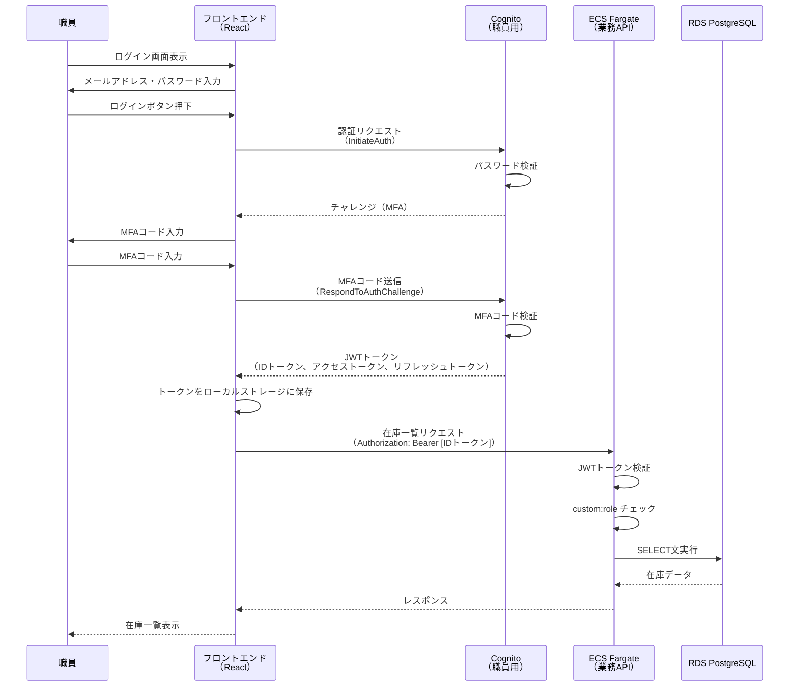
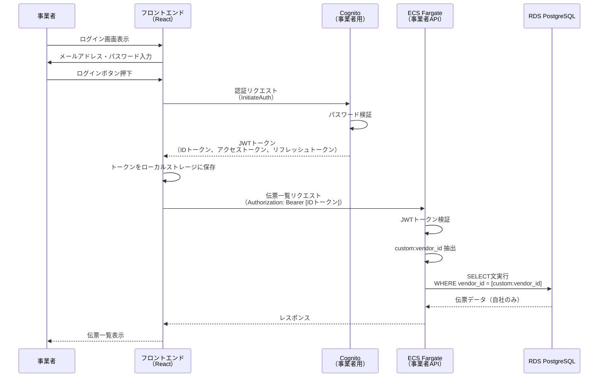

# 05. 認証認可設計

**作成日**: 2025-10-25
**バージョン**: 1.0
**ステータス**: PM レビュー待ち

---

## 5.1 Amazon Cognito 概要

### 採用理由（ADR-003参照）

- マネージドサービスによる認証基盤の運用負荷削減
- MFA（多要素認証）のサポート
- ユーザープール分離によるデータ分離（事業者は自社伝票のみアクセス）
- ISMAP準拠の認証基準を満たす

---

## 5.2 Cognito ユーザープール設計

### ユーザープール構成

本システムでは、職員用と事業者用で異なる認証要件があるため、ユーザープールを分離します。

| # | ユーザープール名 | 用途 | 利用者 | MFA | 備考 |
|---|----------------|------|--------|-----|------|
| 1 | facilities-staff-user-pool | 業務アプリ（職員向け） | 職員100名 | 推奨 | 管理者権限あり |
| 2 | facilities-vendor-user-pool | 事業者アプリ（発注業者向け） | 事業者（変動） | 任意 | 事業者単位でデータ分離 |

### ユーザープール分離の理由

| 理由 | 説明 |
|------|------|
| **データ分離** | 職員と事業者でアクセス範囲が異なる |
| **セキュリティ** | 職員は管理者権限あり、事業者は閲覧権限のみ |
| **独立した認証ポリシー** | 職員はMFA推奨、事業者はMFA任意 |
| **監査要件** | 職員と事業者のログインログを分離 |

---

## 5.3 職員用ユーザープール設計

### 基本設定

| 項目 | 設定値 | 備考 |
|------|--------|------|
| ユーザープール名 | facilities-staff-user-pool | |
| ユーザープールID | ap-northeast-1_xxxxx | 自動生成 |
| リージョン | ap-northeast-1 | 東京リージョン |
| サインイン方式 | メールアドレス | |
| ユーザー名の大文字小文字の区別 | 無効 | |

### パスワードポリシー

| 項目 | 設定値 | 理由 |
|------|--------|------|
| 最小文字数 | 8文字以上 | ISMAP準拠 |
| 大文字を含む | 必須 | |
| 小文字を含む | 必須 | |
| 数字を含む | 必須 | |
| 記号を含む | 必須 | |
| パスワード有効期限 | 90日 | 定期変更を強制 |
| パスワード履歴 | 直近5回分は再利用不可 | |

### MFA（多要素認証）設定

| 項目 | 設定値 | 備考 |
|------|--------|------|
| MFA | 推奨 | ユーザーが選択可能 |
| MFA 方式 | SMS、TOTP（Google Authenticator等） | |
| SMS 送信元番号 | +81-XX-XXXX-XXXX | AWS SNS 経由 |

**注**: MFA は推奨設定だが、ユーザーが有効化しない場合もログイン可能。管理者は MFA 強制設定も可能。

### サインアップ設定

| 項目 | 設定値 | 備考 |
|------|--------|------|
| セルフサインアップ | 無効 | 管理者が職員を手動で追加 |
| メール検証 | 有効 | 初回ログイン時に検証リンクを送信 |
| 電話番号検証 | 無効 | |

### ユーザー属性

| 属性名 | 必須 | 変更可能 | 備考 |
|--------|-----|---------|------|
| email | ✅ | ❌ | サインインID |
| name | ✅ | ✅ | 職員名 |
| custom:employee_id | ✅ | ❌ | 職員ID（一意） |
| custom:role | ✅ | ✅ | 権限（admin, staff, approver） |
| custom:department | ⬜ | ✅ | 所属部署 |

### トークン設定

| 項目 | 設定値 | 備考 |
|------|--------|------|
| IDトークン有効期限 | 30分 | |
| アクセストークン有効期限 | 30分 | |
| リフレッシュトークン有効期限 | 7日 | 自動再ログインの期限 |

---

## 5.4 事業者用ユーザープール設計

### 基本設定

| 項目 | 設定値 | 備考 |
|------|--------|------|
| ユーザープール名 | facilities-vendor-user-pool | |
| ユーザープールID | ap-northeast-1_yyyyy | 自動生成 |
| リージョン | ap-northeast-1 | 東京リージョン |
| サインイン方式 | メールアドレス | |
| ユーザー名の大文字小文字の区別 | 無効 | |

### パスワードポリシー

| 項目 | 設定値 | 理由 |
|------|--------|------|
| 最小文字数 | 8文字以上 | ISMAP準拠 |
| 大文字を含む | 必須 | |
| 小文字を含む | 必須 | |
| 数字を含む | 必須 | |
| 記号を含む | 必須 | |
| パスワード有効期限 | 90日 | 定期変更を強制 |
| パスワード履歴 | 直近5回分は再利用不可 | |

### MFA（多要素認証）設定

| 項目 | 設定値 | 備考 |
|------|--------|------|
| MFA | 任意 | ユーザーが選択可能（強制しない） |
| MFA 方式 | SMS、TOTP（Google Authenticator等） | |

### サインアップ設定

| 項目 | 設定値 | 備考 |
|------|--------|------|
| セルフサインアップ | 無効 | 管理者が事業者を手動で追加 |
| メール検証 | 有効 | 初回ログイン時に検証リンクを送信 |
| 電話番号検証 | 無効 | |

### ユーザー属性

| 属性名 | 必須 | 変更可能 | 備考 |
|--------|-----|---------|------|
| email | ✅ | ❌ | サインインID |
| name | ✅ | ✅ | 事業者担当者名 |
| custom:vendor_id | ✅ | ❌ | 事業者ID（一意） |
| custom:company_name | ✅ | ✅ | 事業者名 |

**重要**: `custom:vendor_id` を使って、事業者が自社の伝票のみアクセスできるように制御する。

---

## 5.5 認証フロー

### 職員ログインフロー



### 事業者ログインフロー



---

## 5.6 認可（アクセス制御）設計

### 職員の権限管理

#### ロール一覧

| ロール | custom:role 値 | 権限 |
|--------|---------------|------|
| **管理者** | admin | すべての機能にアクセス可能（ユーザー管理、発注承認、在庫管理） |
| **一般職員** | staff | 在庫管理、発注申請 |
| **承認者** | approver | 発注承認、レポート閲覧 |

#### API エンドポイント別の権限

| エンドポイント | メソッド | admin | staff | approver |
|--------------|---------|-------|-------|----------|
| `/api/equipment` | GET | ✅ | ✅ | ✅ |
| `/api/equipment` | POST | ✅ | ✅ | ❌ |
| `/api/equipment/:id` | PUT | ✅ | ✅ | ❌ |
| `/api/equipment/:id` | DELETE | ✅ | ❌ | ❌ |
| `/api/orders` | GET | ✅ | ✅ | ✅ |
| `/api/orders` | POST | ✅ | ✅ | ❌ |
| `/api/orders/:id/approve` | POST | ✅ | ❌ | ✅ |
| `/api/reports` | GET | ✅ | ❌ | ✅ |
| `/api/users` | GET | ✅ | ❌ | ❌ |

#### 実装例（Express.js Middleware）

```typescript
// middleware/auth.ts
import { Request, Response, NextFunction } from 'express';
import jwt from 'jsonwebtoken';

export const requireRole = (...allowedRoles: string[]) => {
  return (req: Request, res: Response, next: NextFunction) => {
    const token = req.headers.authorization?.split(' ')[1];
    if (!token) {
      return res.status(401).json({ error: 'Unauthorized' });
    }

    try {
      const decoded = jwt.decode(token) as any;
      const userRole = decoded['custom:role'];

      if (!allowedRoles.includes(userRole)) {
        return res.status(403).json({ error: 'Forbidden' });
      }

      req.user = decoded;
      next();
    } catch (error) {
      return res.status(401).json({ error: 'Invalid token' });
    }
  };
};

// routes/equipment.ts
router.post('/api/equipment', requireRole('admin', 'staff'), createEquipment);
router.delete('/api/equipment/:id', requireRole('admin'), deleteEquipment);
router.post('/api/orders/:id/approve', requireRole('admin', 'approver'), approveOrder);
```

### 事業者のデータ分離

#### 実装例（WHERE句によるフィルタリング）

```typescript
// controllers/vendorOrderController.ts
export const getOrders = async (req: Request, res: Response) => {
  const token = req.headers.authorization?.split(' ')[1];
  const decoded = jwt.decode(token) as any;
  const vendorId = decoded['custom:vendor_id'];

  // 自社の伝票のみ取得
  const orders = await db.query(
    'SELECT * FROM orders WHERE vendor_id = $1',
    [vendorId]
  );

  res.json(orders.rows);
};
```

---

## 5.7 トークン管理

### JWT トークン構造

#### IDトークン（例）

```json
{
  "sub": "xxxxxxxx-xxxx-xxxx-xxxx-xxxxxxxxxxxx",
  "email": "tanaka@example.com",
  "name": "田中 太郎",
  "custom:employee_id": "EMP001",
  "custom:role": "admin",
  "custom:department": "総務課",
  "iss": "https://cognito-idp.ap-northeast-1.amazonaws.com/ap-northeast-1_xxxxx",
  "aud": "xxxxxxxxxxxxxxxxxxxxx",
  "exp": 1698830400,
  "iat": 1698828600
}
```

### トークン検証

```typescript
// utils/jwt.ts
import jwksClient from 'jwks-rsa';
import jwt from 'jsonwebtoken';

const client = jwksClient({
  jwksUri: 'https://cognito-idp.ap-northeast-1.amazonaws.com/ap-northeast-1_xxxxx/.well-known/jwks.json'
});

const getKey = (header: any, callback: any) => {
  client.getSigningKey(header.kid, (err, key) => {
    const signingKey = key?.getPublicKey();
    callback(null, signingKey);
  });
};

export const verifyToken = (token: string): Promise<any> => {
  return new Promise((resolve, reject) => {
    jwt.verify(token, getKey, {
      issuer: 'https://cognito-idp.ap-northeast-1.amazonaws.com/ap-northeast-1_xxxxx',
      audience: 'xxxxxxxxxxxxxxxxxxxxx'
    }, (err, decoded) => {
      if (err) {
        reject(err);
      } else {
        resolve(decoded);
      }
    });
  });
};
```

---

## 5.8 セッション管理

### セッションタイムアウト

| 項目 | 設定値 | 備考 |
|------|--------|------|
| アイドルタイムアウト | 30分 | 無操作で自動ログアウト |
| セッション最大時間 | 7日 | リフレッシュトークン有効期限 |

### 実装方針

- フロントエンド（React）で最終操作時刻を記録
- 30分無操作の場合、自動的にログアウト
- リフレッシュトークンを使って、7日間は自動再ログイン

---

## 5.9 監査ログ

### Cognito のログ記録

| イベント | CloudWatch Logs | 保管期間 |
|---------|----------------|---------|
| ログイン成功 | /aws/cognito/userpools/facilities-staff-user-pool | 2年 |
| ログイン失敗 | /aws/cognito/userpools/facilities-staff-user-pool | 2年 |
| パスワード変更 | /aws/cognito/userpools/facilities-staff-user-pool | 2年 |
| MFA 有効化 | /aws/cognito/userpools/facilities-staff-user-pool | 2年 |

**注**: CloudWatch Logs → S3 にエクスポートして長期保管。

---

## 5.10 ヒアリング事項（仮決定）

以下の項目は、本来ユーザーに確認すべきですが、合理的な仮決定をしました：

| 項目 | 仮決定内容 | 理由 | ユーザー確認推奨度 |
|------|----------|------|------------------|
| ユーザープール分離 | 職員用・事業者用で分離 | データ分離、セキュリティ、独立した認証ポリシー | 低 |
| MFA（職員） | 推奨（強制ではない） | ユーザーの利便性を考慮 | 中 |
| MFA（事業者） | 任意 | セキュリティと利便性のバランス | 中 |
| パスワードポリシー | 8文字以上、英数字記号混在、90日ごと変更 | ISMAP準拠 | 低 |
| トークン有効期限 | 30分 | 一般的なセキュリティ基準 | 低 |
| 職員のロール | admin, staff, approver の3種類 | 要件定義書の記載に基づく | 低 |

---

**作成者**: architect サブエージェント
**最終更新**: 2025-10-25
