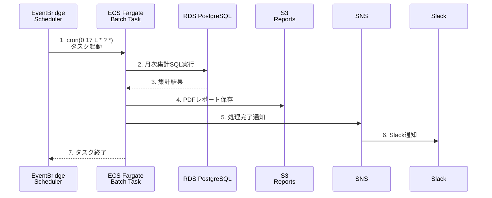

# 06_コンピュート設計

**作成日**: 2025-10-25
**バージョン**: 1.0
**ステータス**: レビュー待ち

---

## 目次
1. [ECS構成概要](#ecs構成概要)
2. [ECS Cluster設計](#ecs-cluster設計)
3. [ECS Task定義](#ecs-task定義)
4. [ECS Service設計](#ecs-service設計)
5. [ALB設計](#alb設計)
6. [Auto Scaling設計](#auto-scaling設計)
7. [バッチタスク設計](#バッチタスク設計)
8. [デプロイ戦略](#デプロイ戦略)

---

## ECS構成概要

### システム構成図

```mermaid
graph TB
    subgraph "VPC-Prod (10.2.0.0/16)"
        subgraph "Public Subnet"
            ALBInt[Internal ALB<br/>職員向け]
            ALBPub[Public ALB<br/>事業者向け]
        end

        subgraph "Private Subnet (Container)"
            subgraph "ECS Cluster"
                TaskAdmin[ECS Task<br/>業務API<br/>0.5vCPU/1GB]
                TaskVendor[ECS Task<br/>事業者API<br/>0.5vCPU/1GB]
                TaskBatch[ECS Task<br/>バッチ<br/>2vCPU/4GB]
            end
        end

        subgraph "Private Subnet (Database)"
            RDS[RDS PostgreSQL]
        end
    end

    Internet[インターネット]
    Staff[職員]
    Vendor[事業者]
    EventBridge[EventBridge<br/>Scheduler]

    Staff -->|Client VPN| ALBInt
    Internet -->|HTTPS| ALBPub
    Vendor -->|HTTPS| ALBPub

    ALBInt --> TaskAdmin
    ALBPub --> TaskVendor

    TaskAdmin --> RDS
    TaskVendor --> RDS

    EventBridge -->|cron(0 2 * * ? *)| TaskBatch
    TaskBatch --> RDS
```

### ECSコンポーネント一覧

| コンポーネント | 説明 | 数量 | AZ配置 |
|--------------|------|------|--------|
| **ECS Cluster** | コンテナ実行基盤 | 1 | リージョン |
| **Task Definition** | タスク定義（業務API、事業者API、バッチ） | 3 | - |
| **ECS Service** | 常駐タスク管理（業務API、事業者API） | 2 | マルチAZ |
| **Fargate Task** | スケジュールバッチ | 1 | 単一AZ（EventBridge起動） |
| **Internal ALB** | 職員向けトラフィック分散 | 1 | マルチAZ |
| **Public ALB** | 事業者向けトラフィック分散 | 1 | マルチAZ |
| **ECR Repository** | コンテナイメージ管理 | 3 | リージョン |

---

## ECS Cluster設計

### Cluster仕様

| 項目 | 設定値 | 備考 |
|------|--------|------|
| **Cluster名** | `${ProjectName}-${Environment}-cluster` | 例: `facility-prod-cluster` |
| **Capacity Provider** | Fargate, Fargate Spot | デフォルト: Fargate |
| **Container Insights** | 有効 | CloudWatch統合監視 |
| **CloudWatch Logs** | 有効 | 7日間保持（本番30日） |

### Container Insights設定

```yaml
ClusterSettings:
  - Name: containerInsights
    Value: enabled
```

**取得メトリクス**:
- CPU使用率（タスク別、サービス別）
- メモリ使用率
- ネットワーク送受信バイト数
- タスク起動/停止イベント

---

## ECS Task定義

### Task Definition: 業務API（職員向け）

```yaml
TaskDefinition: AdminAPI
  Family: facility-prod-admin-api
  NetworkMode: awsvpc
  RequiresCompatibilities:
    - FARGATE
  Cpu: 512          # 0.5 vCPU
  Memory: 1024      # 1 GB
  ExecutionRoleArn: !Sub arn:aws:iam::${AWS::AccountId}:role/ecsTaskExecutionRole
  TaskRoleArn: !Sub arn:aws:iam::${AWS::AccountId}:role/ecsTaskRole
  ContainerDefinitions:
    - Name: admin-api
      Image: !Sub ${AWS::AccountId}.dkr.ecr.${AWS::Region}.amazonaws.com/admin-api:latest
      Essential: true
      PortMappings:
        - ContainerPort: 3000
          Protocol: tcp
      Environment:
        - Name: NODE_ENV
          Value: production
        - Name: PORT
          Value: 3000
      Secrets:
        - Name: DATABASE_URL
          ValueFrom: !Sub arn:aws:secretsmanager:${AWS::Region}:${AWS::AccountId}:secret:facility-prod-db-secret
      LogConfiguration:
        LogDriver: awslogs
        Options:
          awslogs-group: /ecs/admin-api
          awslogs-region: !Ref AWS::Region
          awslogs-stream-prefix: ecs
      HealthCheck:
        Command:
          - CMD-SHELL
          - curl -f http://localhost:3000/health || exit 1
        Interval: 30
        Timeout: 5
        Retries: 3
        StartPeriod: 60
```

### Task Definition: 事業者API

```yaml
TaskDefinition: VendorAPI
  Family: facility-prod-vendor-api
  NetworkMode: awsvpc
  RequiresCompatibilities:
    - FARGATE
  Cpu: 512          # 0.5 vCPU
  Memory: 1024      # 1 GB
  ExecutionRoleArn: !Sub arn:aws:iam::${AWS::AccountId}:role/ecsTaskExecutionRole
  TaskRoleArn: !Sub arn:aws:iam::${AWS::AccountId}:role/ecsTaskRole
  ContainerDefinitions:
    - Name: vendor-api
      Image: !Sub ${AWS::AccountId}.dkr.ecr.${AWS::Region}.amazonaws.com/vendor-api:latest
      Essential: true
      PortMappings:
        - ContainerPort: 4000
          Protocol: tcp
      Environment:
        - Name: NODE_ENV
          Value: production
        - Name: PORT
          Value: 4000
      Secrets:
        - Name: DATABASE_URL
          ValueFrom: !Sub arn:aws:secretsmanager:${AWS::Region}:${AWS::AccountId}:secret:facility-prod-db-secret
      LogConfiguration:
        LogDriver: awslogs
        Options:
          awslogs-group: /ecs/vendor-api
          awslogs-region: !Ref AWS::Region
          awslogs-stream-prefix: ecs
      HealthCheck:
        Command:
          - CMD-SHELL
          - curl -f http://localhost:4000/health || exit 1
        Interval: 30
        Timeout: 5
        Retries: 3
        StartPeriod: 60
```

### Task Definition: バッチ処理

```yaml
TaskDefinition: Batch
  Family: facility-prod-batch
  NetworkMode: awsvpc
  RequiresCompatibilities:
    - FARGATE
  Cpu: 2048         # 2 vCPU（集計処理のため大きめ）
  Memory: 4096      # 4 GB
  ExecutionRoleArn: !Sub arn:aws:iam::${AWS::AccountId}:role/ecsTaskExecutionRole
  TaskRoleArn: !Sub arn:aws:iam::${AWS::AccountId}:role/ecsTaskRole
  ContainerDefinitions:
    - Name: batch
      Image: !Sub ${AWS::AccountId}.dkr.ecr.${AWS::Region}.amazonaws.com/batch:latest
      Essential: true
      Environment:
        - Name: NODE_ENV
          Value: production
        - Name: BATCH_TYPE
          Value: monthly_report
      Secrets:
        - Name: DATABASE_URL
          ValueFrom: !Sub arn:aws:secretsmanager:${AWS::Region}:${AWS::AccountId}:secret:facility-prod-db-secret
      LogConfiguration:
        LogDriver: awslogs
        Options:
          awslogs-group: /ecs/batch
          awslogs-region: !Ref AWS::Region
          awslogs-stream-prefix: ecs
```

**設計判断（ADR）**:
- **バッチリソース**: 2vCPU/4GB
  - 理由: 月次集計は大量データ処理のためAPIより多めに設定
  - トレードオフ: コスト増（約2倍）vs 処理時間短縮
  - 性能試験後に調整可能

### IAMロール設計

#### Task Execution Role（ECS Fargateがタスクを起動するためのロール）

```yaml
ECSTaskExecutionRole:
  Type: AWS::IAM::Role
  Properties:
    AssumeRolePolicyDocument:
      Statement:
        - Effect: Allow
          Principal:
            Service: ecs-tasks.amazonaws.com
          Action: sts:AssumeRole
    ManagedPolicyArns:
      - arn:aws:iam::aws:policy/service-role/AmazonECSTaskExecutionRolePolicy
    Policies:
      - PolicyName: SecretsManagerAccess
        PolicyDocument:
          Statement:
            - Effect: Allow
              Action:
                - secretsmanager:GetSecretValue
              Resource: !Sub arn:aws:secretsmanager:${AWS::Region}:${AWS::AccountId}:secret:facility-*
      - PolicyName: ECRAccess
        PolicyDocument:
          Statement:
            - Effect: Allow
              Action:
                - ecr:GetAuthorizationToken
                - ecr:BatchCheckLayerAvailability
                - ecr:GetDownloadUrlForLayer
                - ecr:BatchGetImage
              Resource: "*"
```

#### Task Role（タスク内のアプリケーションが使用するロール）

```yaml
ECSTaskRole:
  Type: AWS::IAM::Role
  Properties:
    AssumeRolePolicyDocument:
      Statement:
        - Effect: Allow
          Principal:
            Service: ecs-tasks.amazonaws.com
          Action: sts:AssumeRole
    Policies:
      - PolicyName: S3Access
        PolicyDocument:
          Statement:
            - Effect: Allow
              Action:
                - s3:PutObject
                - s3:GetObject
              Resource: !Sub arn:aws:s3:::facility-${Environment}-reports/*
      - PolicyName: SNSPublish
        PolicyDocument:
          Statement:
            - Effect: Allow
              Action:
                - sns:Publish
              Resource: !Sub arn:aws:sns:${AWS::Region}:${AWS::AccountId}:facility-${Environment}-alerts
```

---

## ECS Service設計

### Service: 業務API

```yaml
AdminAPIService:
  Type: AWS::ECS::Service
  Properties:
    ServiceName: admin-api
    Cluster: !Ref ECSCluster
    TaskDefinition: !Ref AdminAPITaskDefinition
    DesiredCount: 2                # 最小2タスク（マルチAZ）
    LaunchType: FARGATE
    PlatformVersion: LATEST
    NetworkConfiguration:
      AwsvpcConfiguration:
        Subnets:
          - !Ref PrivateSubnetContainer1
          - !Ref PrivateSubnetContainer2
        SecurityGroups:
          - !Ref ECSSecurityGroup
        AssignPublicIp: DISABLED
    LoadBalancers:
      - TargetGroupArn: !Ref AdminAPITargetGroup
        ContainerName: admin-api
        ContainerPort: 3000
    HealthCheckGracePeriodSeconds: 60
    DeploymentConfiguration:
      MaximumPercent: 200           # ローリングアップデート時の最大タスク数
      MinimumHealthyPercent: 100    # 最低1タスクは稼働維持
      DeploymentCircuitBreaker:
        Enable: true                # デプロイ失敗時に自動ロールバック
        Rollback: true
    EnableECSManagedTags: true
    PropagateTags: SERVICE
```

### Service: 事業者API

```yaml
VendorAPIService:
  Type: AWS::ECS::Service
  Properties:
    ServiceName: vendor-api
    Cluster: !Ref ECSCluster
    TaskDefinition: !Ref VendorAPITaskDefinition
    DesiredCount: 2
    LaunchType: FARGATE
    PlatformVersion: LATEST
    NetworkConfiguration:
      AwsvpcConfiguration:
        Subnets:
          - !Ref PrivateSubnetContainer1
          - !Ref PrivateSubnetContainer2
        SecurityGroups:
          - !Ref ECSSecurityGroup
        AssignPublicIp: DISABLED
    LoadBalancers:
      - TargetGroupArn: !Ref VendorAPITargetGroup
        ContainerName: vendor-api
        ContainerPort: 4000
    HealthCheckGracePeriodSeconds: 60
    DeploymentConfiguration:
      MaximumPercent: 200
      MinimumHealthyPercent: 100
      DeploymentCircuitBreaker:
        Enable: true
        Rollback: true
    EnableECSManagedTags: true
    PropagateTags: SERVICE
```

**DesiredCount判断**:
- **Dev**: 1タスク（コスト削減）
- **Stg**: 1タスク（検証環境）
- **Prod**: 2タスク（可用性確保、マルチAZ）

---

## ALB設計

### Internal ALB（職員向け）

```yaml
InternalALB:
  Type: AWS::ElasticLoadBalancingV2::LoadBalancer
  Properties:
    Name: !Sub ${ProjectName}-${Environment}-internal-alb
    Type: application
    Scheme: internal                    # internet-facing: false
    IpAddressType: ipv4
    Subnets:
      - !Ref PublicSubnet1              # ALBはPublic Subnetに配置
      - !Ref PublicSubnet2
    SecurityGroups:
      - !Ref ALBInternalSecurityGroup
    Tags:
      - Key: Name
        Value: !Sub ${ProjectName}-${Environment}-internal-alb
```

#### Target Group（業務API）

```yaml
AdminAPITargetGroup:
  Type: AWS::ElasticLoadBalancingV2::TargetGroup
  Properties:
    Name: admin-api-tg
    VpcId: !Ref VPC
    TargetType: ip                      # Fargateはip指定必須
    Protocol: HTTP
    Port: 3000
    HealthCheckEnabled: true
    HealthCheckProtocol: HTTP
    HealthCheckPath: /health
    HealthCheckIntervalSeconds: 30
    HealthCheckTimeoutSeconds: 5
    HealthyThresholdCount: 2
    UnhealthyThresholdCount: 2
    Matcher:
      HttpCode: 200
    TargetGroupAttributes:
      - Key: deregistration_delay.timeout_seconds
        Value: 30                       # Graceful shutdown時間
```

#### Listener（HTTPS）

```yaml
InternalALBListener:
  Type: AWS::ElasticLoadBalancingV2::Listener
  Properties:
    LoadBalancerArn: !Ref InternalALB
    Protocol: HTTPS
    Port: 443
    SslPolicy: ELBSecurityPolicy-TLS13-1-2-2021-06
    Certificates:
      - CertificateArn: !Sub arn:aws:acm:${AWS::Region}:${AWS::AccountId}:certificate/${CertificateId}
    DefaultActions:
      - Type: forward
        TargetGroupArn: !Ref AdminAPITargetGroup
```

### Public ALB（事業者向け）

```yaml
PublicALB:
  Type: AWS::ElasticLoadBalancingV2::LoadBalancer
  Properties:
    Name: !Sub ${ProjectName}-${Environment}-public-alb
    Type: application
    Scheme: internet-facing             # インターネット公開
    IpAddressType: ipv4
    Subnets:
      - !Ref PublicSubnet1
      - !Ref PublicSubnet2
    SecurityGroups:
      - !Ref ALBPublicSecurityGroup
    Tags:
      - Key: Name
        Value: !Sub ${ProjectName}-${Environment}-public-alb
```

#### Target Group（事業者API）

```yaml
VendorAPITargetGroup:
  Type: AWS::ElasticLoadBalancingV2::TargetGroup
  Properties:
    Name: vendor-api-tg
    VpcId: !Ref VPC
    TargetType: ip
    Protocol: HTTP
    Port: 4000
    HealthCheckEnabled: true
    HealthCheckProtocol: HTTP
    HealthCheckPath: /health
    HealthCheckIntervalSeconds: 30
    HealthCheckTimeoutSeconds: 5
    HealthyThresholdCount: 2
    UnhealthyThresholdCount: 2
    Matcher:
      HttpCode: 200
    TargetGroupAttributes:
      - Key: deregistration_delay.timeout_seconds
        Value: 30
```

#### Listener（HTTPS + HTTP→HTTPSリダイレクト）

```yaml
PublicALBListenerHTTPS:
  Type: AWS::ElasticLoadBalancingV2::Listener
  Properties:
    LoadBalancerArn: !Ref PublicALB
    Protocol: HTTPS
    Port: 443
    SslPolicy: ELBSecurityPolicy-TLS13-1-2-2021-06
    Certificates:
      - CertificateArn: !Sub arn:aws:acm:${AWS::Region}:${AWS::AccountId}:certificate/${CertificateId}
    DefaultActions:
      - Type: forward
        TargetGroupArn: !Ref VendorAPITargetGroup

PublicALBListenerHTTP:
  Type: AWS::ElasticLoadBalancingV2::Listener
  Properties:
    LoadBalancerArn: !Ref PublicALB
    Protocol: HTTP
    Port: 80
    DefaultActions:
      - Type: redirect                  # HTTP→HTTPS強制リダイレクト
        RedirectConfig:
          Protocol: HTTPS
          Port: 443
          StatusCode: HTTP_301
```

---

## Auto Scaling設計

### Target Tracking Scaling（CPU使用率ベース）

```yaml
AdminAPIAutoScaling:
  Type: AWS::ApplicationAutoScaling::ScalableTarget
  Properties:
    ServiceNamespace: ecs
    ResourceId: !Sub service/${ECSCluster}/${AdminAPIService.Name}
    ScalableDimension: ecs:service:DesiredCount
    MinCapacity: 2                      # 最小2タスク（マルチAZ）
    MaxCapacity: 10                     # 最大10タスク
    RoleARN: !Sub arn:aws:iam::${AWS::AccountId}:role/aws-service-role/ecs.application-autoscaling.amazonaws.com/AWSServiceRoleForApplicationAutoScaling_ECSService

AdminAPICPUScalingPolicy:
  Type: AWS::ApplicationAutoScaling::ScalingPolicy
  Properties:
    PolicyName: cpu-scaling
    PolicyType: TargetTrackingScaling
    ScalingTargetId: !Ref AdminAPIAutoScaling
    TargetTrackingScalingPolicyConfiguration:
      TargetValue: 70.0                 # CPU使用率70%でスケールアウト
      PredefinedMetricSpecification:
        PredefinedMetricType: ECSServiceAverageCPUUtilization
      ScaleInCooldown: 300              # スケールイン前の待機時間（5分）
      ScaleOutCooldown: 60              # スケールアウト前の待機時間（1分）
```

### スケーリング条件

| 環境 | 最小タスク数 | 最大タスク数 | CPU閾値 | 備考 |
|------|-----------|-----------|--------|------|
| **Dev** | 1 | 3 | 80% | 開発検証用 |
| **Stg** | 1 | 5 | 75% | 負荷テスト用 |
| **Prod** | 2 | 10 | 70% | 本番運用 |

**スケールアウト例（Prod）**:
1. CPU使用率が70%を5分間継続
2. タスク数を+1増やす（2→3）
3. CPU使用率が70%未満に低下するまで繰り返し
4. 最大10タスクまで増加

**スケールイン例（Prod）**:
1. CPU使用率が50%を5分間継続（70%の約70%）
2. タスク数を-1減らす（3→2）
3. 最小2タスクを維持

---

## バッチタスク設計

### EventBridge Scheduler

```yaml
MonthlyBatchScheduleRule:
  Type: AWS::Events::Rule
  Properties:
    Name: monthly-batch-schedule
    Description: Run monthly batch at 2:00 AM JST
    ScheduleExpression: cron(0 17 L * ? *)  # 毎月末 17:00 UTC (翌日2:00 JST)
    State: ENABLED
    Targets:
      - Arn: !GetAtt ECSCluster.Arn
        Id: monthly-batch-target
        RoleArn: !GetAtt EventBridgeECSRole.Arn
        EcsParameters:
          TaskDefinitionArn: !Ref BatchTaskDefinition
          TaskCount: 1
          LaunchType: FARGATE
          NetworkConfiguration:
            AwsVpcConfiguration:
              Subnets:
                - !Ref PrivateSubnetContainer1
              SecurityGroups:
                - !Ref ECSSecurityGroup
              AssignPublicIp: DISABLED
          PlatformVersion: LATEST
```

### EventBridge IAMロール

```yaml
EventBridgeECSRole:
  Type: AWS::IAM::Role
  Properties:
    AssumeRolePolicyDocument:
      Statement:
        - Effect: Allow
          Principal:
            Service: events.amazonaws.com
          Action: sts:AssumeRole
    Policies:
      - PolicyName: ECSRunTask
        PolicyDocument:
          Statement:
            - Effect: Allow
              Action:
                - ecs:RunTask
              Resource: !Ref BatchTaskDefinition
            - Effect: Allow
              Action:
                - iam:PassRole
              Resource:
                - !GetAtt ECSTaskExecutionRole.Arn
                - !GetAtt ECSTaskRole.Arn
```

### バッチ処理フロー



**バッチ実行時の設定**:
- CPU: 2 vCPU
- Memory: 4 GB
- Timeout: 30分（Lambda 15分制限を回避）
- Retry: 失敗時は手動再実行（EventBridge Retryは無効）

---

## デプロイ戦略

### ローリングアップデート

**設計判断（ADR-007）**:
- **採用**: ECS ローリングアップデート
- **理由**:
  - デプロイ頻度: 週1回（メンテナンス時間中）
  - 数分のダウンタイム許容
  - 運用がシンプル
- **将来の拡張**: デプロイ頻度が増えた場合、Blue/Greenに切り替え可能

### デプロイ設定

```yaml
DeploymentConfiguration:
  MaximumPercent: 200               # 新旧タスク合計で2倍まで許容
  MinimumHealthyPercent: 100        # 最低1タスクは稼働維持
  DeploymentCircuitBreaker:
    Enable: true                    # デプロイ失敗時に自動ロールバック
    Rollback: true
```

**デプロイフロー**:
1. 新しいTask Definitionをデプロイ
2. 新タスクを1つ起動（合計3タスク: 旧2 + 新1）
3. ヘルスチェック成功を確認
4. 旧タスクを1つ停止（合計2タスク: 旧1 + 新1）
5. 新タスクをもう1つ起動（合計3タスク: 旧1 + 新2）
6. 旧タスクを停止（合計2タスク: 新2）

**ロールバック条件**:
- ヘルスチェック連続失敗
- タスク起動失敗

### GitHub Actionsによる自動デプロイ

```yaml
name: Deploy to ECS

on:
  push:
    branches:
      - main
    paths:
      - 'src/**'
      - 'Dockerfile'

jobs:
  deploy:
    runs-on: ubuntu-latest
    steps:
      - uses: actions/checkout@v3

      - name: Configure AWS credentials
        uses: aws-actions/configure-aws-credentials@v2
        with:
          aws-access-key-id: ${{ secrets.AWS_ACCESS_KEY_ID }}
          aws-secret-access-key: ${{ secrets.AWS_SECRET_ACCESS_KEY }}
          aws-region: ap-northeast-1

      - name: Login to Amazon ECR
        id: login-ecr
        uses: aws-actions/amazon-ecr-login@v1

      - name: Build and push image
        run: |
          docker build -t admin-api:${{ github.sha }} .
          docker tag admin-api:${{ github.sha }} ${{ steps.login-ecr.outputs.registry }}/admin-api:latest
          docker push ${{ steps.login-ecr.outputs.registry }}/admin-api:latest

      - name: Update ECS service
        run: |
          aws ecs update-service \
            --cluster facility-prod-cluster \
            --service admin-api \
            --force-new-deployment
```

---

## 次のステップ

- [07_フロントエンド設計.md](07_フロントエンド設計.md): CloudFront、S3配信
- [08_監視・アラート設計.md](08_監視・アラート設計.md): CloudWatch、SNS
- [09_CI_CD設計.md](09_CI_CD設計.md): GitHub Actions、デプロイパイプライン

---

**作成者**: Architect（Claude）
**レビュー状態**: レビュー待ち
