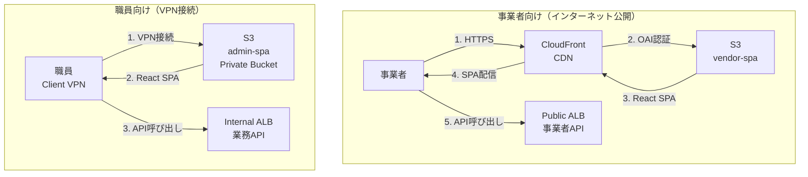
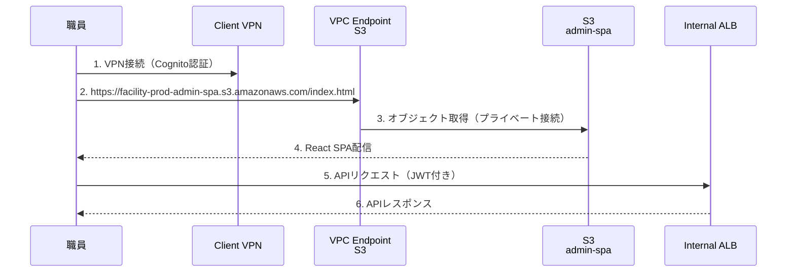
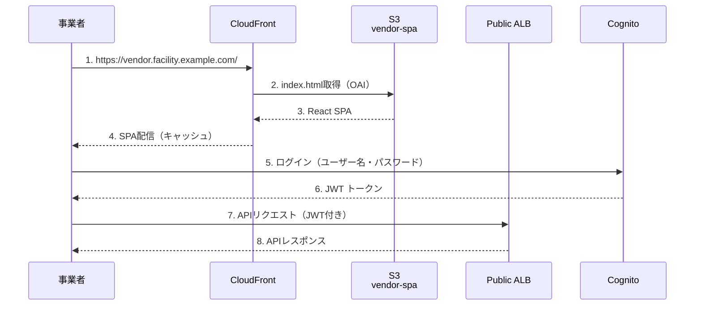

# 07_フロントエンド設計

**作成日**: 2025-10-25
**バージョン**: 1.0
**ステータス**: レビュー待ち

---

## 目次
1. [フロントエンド構成概要](#フロントエンド構成概要)
2. [CloudFront設計](#cloudfront設計)
3. [S3設計](#s3設計)
4. [職員向けフロントエンド](#職員向けフロントエンド)
5. [事業者向けフロントエンド](#事業者向けフロントエンド)
6. [デプロイフロー](#デプロイフロー)

---

## フロントエンド構成概要

### システム構成図



### フロントエンド一覧

| 対象 | 配信方法 | S3バケット | CloudFront | アクセス制御 |
|------|---------|----------|-----------|-----------|
| **職員向け（業務画面）** | S3 Direct | `facility-prod-admin-spa` | なし | VPC Endpoint経由のみ |
| **事業者向け（発注画面）** | CloudFront + S3 | `facility-prod-vendor-spa` | あり | インターネット公開（OAI） |

**設計判断**:
- **職員向け**: CloudFrontなし
  - 理由: VPN接続のみ、同一リージョン内アクセス（低レイテンシ）
  - メリット: コスト削減、シンプルな構成
- **事業者向け**: CloudFront + S3
  - 理由: インターネット公開、全国からアクセス、キャッシュによる高速化
  - メリット: エッジロケーションでの配信、DDoS対策（AWS Shield Standard）

---

## CloudFront設計

### CloudFront Distribution（事業者向け）

```yaml
VendorCloudFrontDistribution:
  Type: AWS::CloudFront::Distribution
  Properties:
    DistributionConfig:
      Comment: Vendor SPA Distribution
      Enabled: true
      HttpVersion: http2and3              # HTTP/2, HTTP/3対応
      DefaultRootObject: index.html
      PriceClass: PriceClass_All          # 全エッジロケーション使用
      Origins:
        - Id: S3-vendor-spa
          DomainName: !GetAtt VendorSPABucket.RegionalDomainName
          S3OriginConfig:
            OriginAccessIdentity: !Sub origin-access-identity/cloudfront/${CloudFrontOAI}
      DefaultCacheBehavior:
        TargetOriginId: S3-vendor-spa
        ViewerProtocolPolicy: redirect-to-https
        AllowedMethods:
          - GET
          - HEAD
          - OPTIONS
        CachedMethods:
          - GET
          - HEAD
        Compress: true                    # Gzip/Brotli圧縮
        CachePolicyId: !Ref CloudFrontCachePolicy
        OriginRequestPolicyId: !Ref CloudFrontOriginRequestPolicy
      CustomErrorResponses:
        - ErrorCode: 404
          ResponseCode: 200
          ResponsePagePath: /index.html   # React Routerのため404→index.html
        - ErrorCode: 403
          ResponseCode: 200
          ResponsePagePath: /index.html
      ViewerCertificate:
        AcmCertificateArn: !Sub arn:aws:acm:us-east-1:${AWS::AccountId}:certificate/${CertificateId}
        SslSupportMethod: sni-only
        MinimumProtocolVersion: TLSv1.2_2021
      Logging:
        Bucket: !GetAtt LogBucket.DomainName
        Prefix: cloudfront/vendor-spa/
        IncludeCookies: false
```

### Origin Access Identity（OAI）

```yaml
CloudFrontOAI:
  Type: AWS::CloudFront::CloudFrontOriginAccessIdentity
  Properties:
    CloudFrontOriginAccessIdentityConfig:
      Comment: OAI for vendor-spa bucket
```

**OAIの役割**:
- CloudFrontのみがS3バケットにアクセス可能
- 直接S3 URLでのアクセスを防止
- セキュリティ向上（S3パブリックアクセス不要）

### Cache Policy

```yaml
CloudFrontCachePolicy:
  Type: AWS::CloudFront::CachePolicy
  Properties:
    CachePolicyConfig:
      Name: vendor-spa-cache-policy
      DefaultTTL: 86400                   # 1日
      MaxTTL: 31536000                    # 1年
      MinTTL: 0
      ParametersInCacheKeyAndForwardedToOrigin:
        EnableAcceptEncodingGzip: true
        EnableAcceptEncodingBrotli: true
        QueryStringsConfig:
          QueryStringBehavior: none
        HeadersConfig:
          HeaderBehavior: none
        CookiesConfig:
          CookieBehavior: none
```

**キャッシュ戦略**:
- `index.html`: キャッシュなし（常に最新を取得）
- `*.js`, `*.css`: 1年間キャッシュ（ファイル名にハッシュ付き）
- `*.png`, `*.svg`: 1年間キャッシュ

### カスタムヘッダー（セキュリティ強化）

```yaml
CloudFrontResponseHeadersPolicy:
  Type: AWS::CloudFront::ResponseHeadersPolicy
  Properties:
    ResponseHeadersPolicyConfig:
      Name: security-headers
      SecurityHeadersConfig:
        StrictTransportSecurity:
          AccessControlMaxAgeSec: 31536000
          IncludeSubdomains: true
          Override: true
        ContentTypeOptions:
          Override: true                  # X-Content-Type-Options: nosniff
        FrameOptions:
          FrameOption: DENY
          Override: true                  # X-Frame-Options: DENY
        XSSProtection:
          ModeBlock: true
          Protection: true
          Override: true                  # X-XSS-Protection: 1; mode=block
        ReferrerPolicy:
          ReferrerPolicy: strict-origin-when-cross-origin
          Override: true
```

---

## S3設計

### S3バケット: 事業者向けSPA

```yaml
VendorSPABucket:
  Type: AWS::S3::Bucket
  Properties:
    BucketName: !Sub facility-${Environment}-vendor-spa
    PublicAccessBlockConfiguration:
      BlockPublicAcls: true
      BlockPublicPolicy: true
      IgnorePublicAcls: true
      RestrictPublicBuckets: true
    BucketEncryption:
      ServerSideEncryptionConfiguration:
        - ServerSideEncryptionByDefault:
            SSEAlgorithm: AES256
    VersioningConfiguration:
      Status: Enabled                     # バージョニング有効（誤削除対策）
    LifecycleConfiguration:
      Rules:
        - Id: DeleteOldVersions
          Status: Enabled
          NoncurrentVersionExpirationInDays: 30
    Tags:
      - Key: Name
        Value: !Sub facility-${Environment}-vendor-spa
```

### S3バケットポリシー（CloudFront OAI許可）

```yaml
VendorSPABucketPolicy:
  Type: AWS::S3::BucketPolicy
  Properties:
    Bucket: !Ref VendorSPABucket
    PolicyDocument:
      Statement:
        - Sid: AllowCloudFrontOAI
          Effect: Allow
          Principal:
            CanonicalUser: !GetAtt CloudFrontOAI.S3CanonicalUserId
          Action:
            - s3:GetObject
          Resource: !Sub ${VendorSPABucket.Arn}/*
```

### S3バケット: 職員向けSPA

```yaml
AdminSPABucket:
  Type: AWS::S3::Bucket
  Properties:
    BucketName: !Sub facility-${Environment}-admin-spa
    PublicAccessBlockConfiguration:
      BlockPublicAcls: true
      BlockPublicPolicy: true
      IgnorePublicAcls: true
      RestrictPublicBuckets: true
    BucketEncryption:
      ServerSideEncryptionConfiguration:
        - ServerSideEncryptionByDefault:
            SSEAlgorithm: AES256
    VersioningConfiguration:
      Status: Enabled
    LifecycleConfiguration:
      Rules:
        - Id: DeleteOldVersions
          Status: Enabled
          NoncurrentVersionExpirationInDays: 30
    Tags:
      - Key: Name
        Value: !Sub facility-${Environment}-admin-spa
```

### S3バケットポリシー（VPC Endpoint経由のみ）

```yaml
AdminSPABucketPolicy:
  Type: AWS::S3::BucketPolicy
  Properties:
    Bucket: !Ref AdminSPABucket
    PolicyDocument:
      Statement:
        - Sid: AllowVPCEndpointOnly
          Effect: Deny
          Principal: "*"
          Action: s3:*
          Resource:
            - !Sub ${AdminSPABucket.Arn}
            - !Sub ${AdminSPABucket.Arn}/*
          Condition:
            StringNotEquals:
              aws:SourceVpce: !Ref S3VPCEndpoint
```

**設計意図**:
- VPN接続した職員のみアクセス可能
- インターネット経由のアクセスを完全遮断
- VPC Endpoint経由でプライベート接続

---

## 職員向けフロントエンド

### アクセスフロー



### React SPA設計

**技術スタック**:
- React 18
- TypeScript
- Vite（ビルドツール）
- Tailwind CSS

**ディレクトリ構成**:
```
admin-spa/
├── src/
│   ├── components/         # UI コンポーネント
│   ├── pages/              # ページコンポーネント
│   ├── hooks/              # カスタムフック
│   ├── services/           # API呼び出し
│   ├── utils/              # ユーティリティ
│   └── App.tsx
├── public/
│   └── index.html
├── vite.config.ts
└── package.json
```

### 環境変数（ビルド時）

```bash
# .env.production
VITE_API_ENDPOINT=https://admin-api.facility.example.com
VITE_COGNITO_USER_POOL_ID=ap-northeast-1_XXXXXXXXX
VITE_COGNITO_CLIENT_ID=XXXXXXXXXXXXXXXXXXXXXXXXXX
```

---

## 事業者向けフロントエンド

### アクセスフロー



### React SPA設計

**技術スタック**:
- React 18
- TypeScript
- Vite（ビルドツール）
- Tailwind CSS

**ディレクトリ構成**:
```
vendor-spa/
├── src/
│   ├── components/
│   ├── pages/
│   ├── hooks/
│   ├── services/
│   ├── utils/
│   └── App.tsx
├── public/
│   └── index.html
├── vite.config.ts
└── package.json
```

### 環境変数（ビルド時）

```bash
# .env.production
VITE_API_ENDPOINT=https://api.facility.example.com
VITE_COGNITO_USER_POOL_ID=ap-northeast-1_YYYYYYYYY
VITE_COGNITO_CLIENT_ID=YYYYYYYYYYYYYYYYYYYYYYYYYY
```

---

## デプロイフロー

### GitHub Actions（事業者向けSPA）

```yaml
name: Deploy Vendor SPA

on:
  push:
    branches:
      - main
    paths:
      - 'vendor-spa/**'

jobs:
  deploy:
    runs-on: ubuntu-latest
    steps:
      - uses: actions/checkout@v3

      - name: Setup Node.js
        uses: actions/setup-node@v3
        with:
          node-version: 18

      - name: Install dependencies
        run: |
          cd vendor-spa
          npm ci

      - name: Build
        run: |
          cd vendor-spa
          npm run build
        env:
          VITE_API_ENDPOINT: ${{ secrets.VITE_API_ENDPOINT }}
          VITE_COGNITO_USER_POOL_ID: ${{ secrets.VITE_COGNITO_USER_POOL_ID }}
          VITE_COGNITO_CLIENT_ID: ${{ secrets.VITE_COGNITO_CLIENT_ID }}

      - name: Configure AWS credentials
        uses: aws-actions/configure-aws-credentials@v2
        with:
          aws-access-key-id: ${{ secrets.AWS_ACCESS_KEY_ID }}
          aws-secret-access-key: ${{ secrets.AWS_SECRET_ACCESS_KEY }}
          aws-region: ap-northeast-1

      - name: Sync to S3
        run: |
          aws s3 sync vendor-spa/dist s3://facility-prod-vendor-spa --delete

      - name: Invalidate CloudFront cache
        run: |
          aws cloudfront create-invalidation \
            --distribution-id ${{ secrets.CLOUDFRONT_DISTRIBUTION_ID }} \
            --paths "/*"
```

### GitHub Actions（職員向けSPA）

```yaml
name: Deploy Admin SPA

on:
  push:
    branches:
      - main
    paths:
      - 'admin-spa/**'

jobs:
  deploy:
    runs-on: ubuntu-latest
    steps:
      - uses: actions/checkout@v3

      - name: Setup Node.js
        uses: actions/setup-node@v3
        with:
          node-version: 18

      - name: Install dependencies
        run: |
          cd admin-spa
          npm ci

      - name: Build
        run: |
          cd admin-spa
          npm run build
        env:
          VITE_API_ENDPOINT: ${{ secrets.VITE_API_ENDPOINT_ADMIN }}
          VITE_COGNITO_USER_POOL_ID: ${{ secrets.VITE_COGNITO_USER_POOL_ID_ADMIN }}
          VITE_COGNITO_CLIENT_ID: ${{ secrets.VITE_COGNITO_CLIENT_ID_ADMIN }}

      - name: Configure AWS credentials
        uses: aws-actions/configure-aws-credentials@v2
        with:
          aws-access-key-id: ${{ secrets.AWS_ACCESS_KEY_ID }}
          aws-secret-access-key: ${{ secrets.AWS_SECRET_ACCESS_KEY }}
          aws-region: ap-northeast-1

      - name: Sync to S3
        run: |
          aws s3 sync admin-spa/dist s3://facility-prod-admin-spa --delete
```

### デプロイ手順（手動）

**事業者向けSPA**:
```bash
# 1. ビルド
cd vendor-spa
npm run build

# 2. S3にアップロード
aws s3 sync dist/ s3://facility-prod-vendor-spa --delete

# 3. CloudFrontキャッシュ削除
aws cloudfront create-invalidation \
  --distribution-id E1XXXXXXXXXX \
  --paths "/*"
```

**職員向けSPA**:
```bash
# 1. ビルド
cd admin-spa
npm run build

# 2. S3にアップロード
aws s3 sync dist/ s3://facility-prod-admin-spa --delete
```

### Blue/Green デプロイ（将来拡張）

**現状**: S3 Sync + CloudFront Invalidation
**将来**: S3バケットを2つ用意し、CloudFrontのOriginを切り替え

```yaml
# Blue環境（現行）
- facility-prod-vendor-spa-blue

# Green環境（新バージョン）
- facility-prod-vendor-spa-green

# CloudFrontのOriginを切り替え
# 問題があればすぐにBlueに戻せる
```

---

## パフォーマンス最適化

### CloudFrontキャッシュ戦略

| ファイル種類 | キャッシュTTL | Cache-Control | 備考 |
|-----------|-------------|--------------|------|
| `index.html` | 0秒（キャッシュなし） | `no-cache` | 常に最新を取得 |
| `*.js`, `*.css` | 1年 | `max-age=31536000, immutable` | ファイル名にハッシュ付き |
| `*.png`, `*.svg` | 1年 | `max-age=31536000, immutable` | 画像アセット |

### Vite設定（ファイル名ハッシュ化）

```typescript
// vite.config.ts
export default defineConfig({
  build: {
    rollupOptions: {
      output: {
        entryFileNames: 'assets/[name].[hash].js',
        chunkFileNames: 'assets/[name].[hash].js',
        assetFileNames: 'assets/[name].[hash].[ext]',
      },
    },
  },
});
```

**効果**:
- コード変更時、ファイル名が変わる → ブラウザキャッシュを無効化
- 変更なしのファイルは長期キャッシュ → 高速表示

---

## 次のステップ

- [08_監視・アラート設計.md](08_監視・アラート設計.md): CloudWatch、SNS通知
- [09_CI_CD設計.md](09_CI_CD設計.md): GitHub Actions、デプロイパイプライン

---

**作成者**: Architect（Claude）
**レビュー状態**: レビュー待ち
