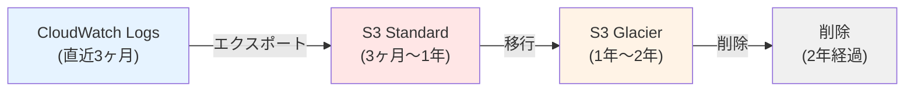
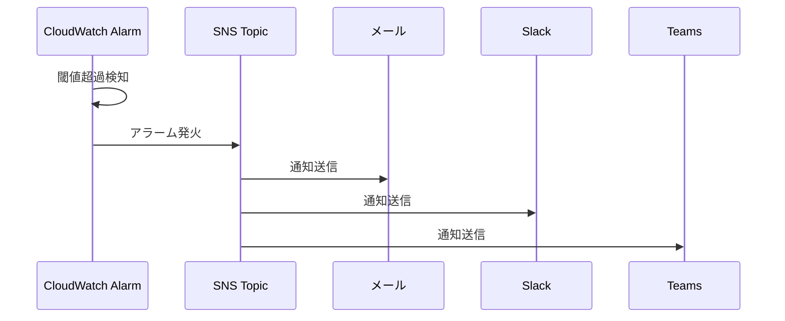
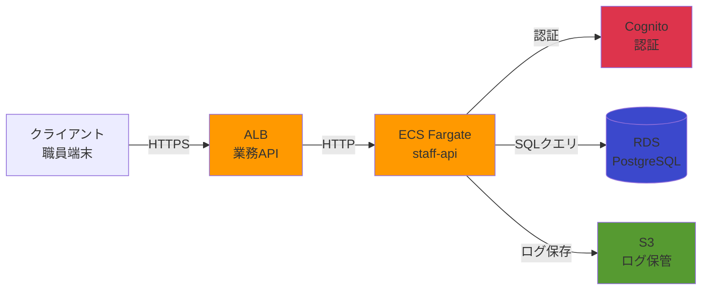

# 07. 監視ログ設計

**作成日**: 2025-10-25
**バージョン**: 1.2
**ステータス**: PM レビュー待ち

**更新履歴**:
- v1.2 (2025-10-25): AWS X-Ray 設計を追加（分散トレーシング、パフォーマンス分析）
- v1.1 (2025-10-25): 設定値を削除、設計理由と設計アプローチのみに簡潔化
- v1.0 (2025-10-25): 初版作成

---

## 7.1 監視設計概要

### 監視の目的

1. **障害の早期検知**: システム障害を即座に検知し、迅速に対応
2. **性能監視**: レスポンスタイム、スループットの継続的な監視
3. **コスト監視**: AWS利用料の予算超過を防止
4. **セキュリティ監視**: 不正アクセスや異常なアクセスパターンの検知
5. **分散トレーシング**: マイクロサービス間の呼び出しを追跡し、ボトルネックを特定（X-Ray）

### 設計方針

**5つの監視レイヤー**:
1. **アプリケーション層**: ECS タスクのCPU、メモリ、ログ
2. **データベース層**: RDS のCPU、接続数、スロークエリ
3. **ネットワーク層**: ALB のレスポンスタイム、エラー率
4. **セキュリティ層**: VPCフローログ、CloudTrail、不正アクセス検知
5. **トレーシング層**: AWS X-Ray による分散トレーシング、エラー追跡、依存関係可視化

---

## 7.2 CloudWatch メトリクス監視

### 監視設計の考え方

**監視対象の選定基準**:
- **Critical**: サービス停止に直結するメトリクス（ECS タスク数、RDS 接続不可等）
- **High**: パフォーマンス劣化を示すメトリクス（CPU 80%、メモリ 80%等）
- **Medium**: コスト最適化に関連するメトリクス（予算超過警告）

**閾値の考え方**:
- CPU/メモリ: 80%（スケールアウト検討のタイミング）
- レスポンスタイム: 95%ile > 1秒（ユーザー体験悪化の指標）
- エラー率: 5%（アプリケーション異常の指標）

**アラート評価期間**:
- ECS: 2分間連続（一時的なスパイクを無視）
- RDS: 5分間連続（より慎重な判断）
- ALB: 2分間連続（ユーザー影響が大きいため早期検知）

**具体的な閾値、評価期間の詳細は、`05_実装準備/パラメーターシート.xlsx` を参照してください。**

---

## 7.3 CloudWatch Logs 設計

### ログ設計の考え方

**ログ保管の方針**:
- **直近3ヶ月**: CloudWatch Logs に保持（リアルタイム検索）
- **3ヶ月以降**: S3 にエクスポート（長期保管、コスト削減）
- **2年経過**: 削除（監査要件を満たしたら削除）

**ログのライフサイクル**:


**具体的なロググループ名、保管期間の日数等は、パラメーターシートを参照してください。**

---

## 7.4 アプリケーションログの構造化

### 構造化ログの設計方針

**JSON形式のログ**を推奨します：

```json
{
  "timestamp": "2025-10-25T10:30:00.123Z",
  "level": "INFO",
  "service": "staff-api",
  "traceId": "abc123def456",
  "userId": "EMP001",
  "action": "equipment.create",
  "method": "POST",
  "path": "/api/equipment",
  "statusCode": 201,
  "responseTime": 150,
  "message": "Equipment created successfully"
}
```

**構造化ログのメリット**:
- CloudWatch Logs Insights で高速検索
- 特定のユーザー、エンドポイント、エラーに絞り込み可能
- トレーシング（traceId）による分散トレーシング
- X-Ray トレースIDとの連携が可能

**ログレベルの使い分け**:
- **DEBUG**: 開発時のデバッグ情報
- **INFO**: 通常の動作ログ（本番環境はINFO以上）
- **WARN**: 警告（エラーではない）
- **ERROR**: エラー
- **FATAL**: 致命的エラー

---

## 7.5 CloudWatch Alarms 設計

### アラーム設計の考え方

**アラーム作成の基準**:
- **Critical**: サービス停止に直結（ECS タスク数 0、RDS 接続不可）
- **High**: パフォーマンス劣化（CPU 80%、メモリ 80%、レスポンスタイム 1秒超）
- **Medium**: 予算超過警告（コスト監視）

**通知先の設計**:
- SNS Topic 経由でメール、Slack、Teams に通知
- 複数の通知手段により、見逃しを防止

**具体的なアラーム定義（CloudFormation YAML）、閾値、評価期間等は、パラメーターシートを参照してください。**

---

## 7.6 SNS 通知設計

### 通知設計の考え方

**3つのSNS Topic**:
1. **facilities-prod-alerts**: 障害・警告アラート（インフラチーム）
2. **facilities-prod-billing**: コスト関連アラート（財務担当）
3. **facilities-prod-security**: セキュリティアラート（セキュリティチーム）

**通知手段の多様化**:
- メール: 正式な通知（記録に残る）
- Slack: リアルタイム通知（チームでの共有）
- Microsoft Teams: 組織標準のツール

**通知フロー**:


**具体的なSNS Topic ARN、サブスクリプションのメールアドレス、Webhook URL等は、パラメーターシートを参照してください。**

---

## 7.7 VPCフローログ設計

### VPCフローログの設計方針

**監視目的**:
1. **不正アクセスの検知**: 異常なIPアドレスからのアクセス
2. **ネットワークトラブルシューティング**: 通信失敗の原因調査
3. **セキュリティ監査**: すべてのネットワーク通信の記録

**設計アプローチ**:
- VPC全体を監視対象とする
- すべてのトラフィック（許可・拒否）を記録
- CloudWatch Logs に送信（リアルタイム監視）

**具体的なVPCフローログ設定、ロググループ名、保管期間等は、パラメーターシートを参照してください。**

---

## 7.8 CloudTrail 設計

### CloudTrail の設計方針

**監査目的**:
1. **監査**: すべてのAWS API呼び出しを記録
2. **セキュリティインシデント調査**: 不正なAPI呼び出しの検出
3. **コンプライアンス**: ISMAP準拠の証跡管理

**設計アプローチ**:
- すべてのリージョンで有効化（マルチリージョン対応）
- ログファイル検証有効化（改ざん検知）
- S3 に保存、CloudWatch Logs にも配信（リアルタイム監視）
- データイベント記録（S3、Lambda のオブジェクトレベルのAPI呼び出し）

**具体的なCloudTrail 証跡名、S3バケット名、保管期間等は、パラメーターシートを参照してください。**

---

## 7.9 AWS Billing Alerts

### コスト監視の設計方針

**予算超過の早期検知**:
- 予算の50%、80%、100%で段階的にアラート
- 財務担当にメール通知
- コスト最適化の検討タイミングを明確化

**具体的な予算額、閾値、通知先等は、パラメーターシートを参照してください。**

---

## 7.10 ダッシュボード設計

### CloudWatch Dashboard の設計方針

**1つのメインダッシュボードに統合**:
- ECS: CPU使用率、メモリ使用率、タスク数
- RDS: CPU使用率、接続数、フリーストレージ容量
- ALB: レスポンスタイム、5xxエラー数、リクエスト数
- X-Ray: サービスマップ、トレース統計、エラー率

**ダッシュボードのメリット**:
- システム全体の状態を一目で把握
- 障害発生時の迅速な原因特定
- 性能監視（パフォーマンスチューニングの材料）

**具体的なダッシュボード名、ウィジェット構成等は、パラメーターシートを参照してください。**

---

## 7.11 AWS X-Ray 設計（ADR-010: AWS X-Ray 採用）

### X-Ray 設計方針

**目的**:
- 分散トレーシングによるパフォーマンス分析
- エラーの根本原因分析
- サービス間の依存関係可視化
- 非機能要件（レスポンスタイム 95%ile < 500ms）の達成確認

**採用理由**:
- ECS Fargate、RDS、S3、Cognito等のAWSサービスとの統合が容易
- サイドカーコンテナでアプリケーションコードへの影響を最小化
- X-Ray Service Mapで依存関係を視覚化（ECS → RDS、ECS → S3、ECS → Cognito の呼び出しフロー）
- CloudWatch と統合してアラート可能（エラー率、レスポンスタイム）

**設計アプローチ**:
- ECS Fargate タスクにX-Rayサイドカーコンテナを追加
- アプリケーションコードに X-Ray SDK を組み込み（Node.js）
- RDS、S3、Cognito等のAWSサービス呼び出しを自動トレース
- X-Ray Service Mapでサービス間の依存関係を可視化

### X-Ray トレース対象

**対象サービス**:
- ECS Fargate（業務API、事業者API、バッチ）
- ALB（リクエスト受信）
- RDS PostgreSQL（SQLクエリ）
- S3（ログ保存、ファイルアップロード）
- Cognito（認証）

**トレース内容**:
- リクエスト→レスポンスの全体フロー
- 各サービスの処理時間（業務API: ALB → ECS → RDS → 応答）
- エラー発生箇所（どのコンポーネントでエラーが発生したか）
- SQLクエリの実行時間（スロークエリ検知）

### X-Ray サンプリングルール

**サンプリング戦略**:
- **本番環境（prod）**: 5%サンプリング（コスト削減）
- **ステージング環境（stg）**: 10%サンプリング（検証用）
- **開発環境（dev）**: 100%サンプリング（デバッグ用）

**理由**:
- 本番環境は大量のリクエストがあるため、5%サンプリングで十分な統計データを取得可能
- コスト最適化（X-Rayはトレース数に応じて課金）
- サンプリングでも95%ileの統計値は正確に取得可能

**サンプリングルールのカスタマイズ**:
- エラーリクエスト: 100%サンプリング（すべてのエラーをトレース）
- 高レイテンシーリクエスト（> 1秒）: 100%サンプリング（パフォーマンス問題の特定）
- 通常リクエスト: 環境別サンプリング率

### X-Ray データ保持期間

**保持期間**: 30日（X-Rayのデフォルト）

**理由**:
- 30日あれば、パフォーマンス問題やエラーの分析に十分
- それ以上長期保存が必要な場合は、CloudWatch Logs Insightsを使用
- コスト最適化（長期保存は不要）

### X-Ray アラート設計

**CloudWatch Alarms との連携**:
- エラー率が5%を超えた場合にアラート（X-Ray メトリクス: `ErrorRate`）
- レスポンスタイム（95%ile）が500msを超えた場合にアラート（X-Ray メトリクス: `ApproximateLatency`）
- 異常なトレース数増加（急激なトラフィック増加）

**通知先**:
- SNS Topic（`facilities-{env}-alerts`）経由でSlack、メール通知

### X-Ray サービスマップ

**サービスマップの可視化内容**:


**サービスマップのメリット**:
- 依存関係の可視化（ECS → RDS、ECS → S3 等の呼び出し関係）
- ボトルネックの特定（どのサービスが遅いか一目瞭然）
- エラー発生箇所の特定（どのサービスでエラーが発生したか）

### X-Ray とアプリケーションログの連携

**トレースIDの連携**:
- X-Ray トレースIDをアプリケーションログに含める
- CloudWatch Logs Insights でトレースIDを検索すると、関連するすべてのログを取得可能

**連携のメリット**:
- X-Ray でエラーを検知 → トレースIDでログ検索 → 詳細なエラーメッセージを取得

**具体的なサンプリングルール、トレースIDの実装方法は、パラメーターシートを参照してください。**

---

## 7.12 ヒアリング結果と仮決定

### 仮決定事項

以下の項目は、本来ユーザーに確認すべきですが、合理的な仮決定をしました：

| 項目 | 仮決定内容 | 理由 | ユーザー確認推奨度 |
|------|----------|------|------------------|
| アラート閾値（CPU） | 80% | 一般的な閾値、スケールアウト検討のタイミング | 中 |
| アラート閾値（メモリ） | 80% | 一般的な閾値、メモリリーク検知 | 中 |
| ログ保管期間（CloudWatch） | 3ヶ月 | コストとリアルタイム検索のバランス | 低 |
| ログ保管期間（S3） | 2年 | ISMAP監査要件を考慮 | 低 |
| SNS 通知先 | メール、Slack、Teams | 多様な通知手段で見逃し防止 | 中 |
| CloudWatch Dashboard 構成 | メインダッシュボード1つ | シンプルな構成、運用しやすい | 低 |
| **X-Ray サンプリング率（prod）** | **5%** | **コスト最適化、統計的に十分** | **中** |
| **X-Ray サンプリング率（stg）** | **10%** | **検証用、コスト削減** | **低** |
| **X-Ray サンプリング率（dev）** | **100%** | **デバッグ用、全トレース** | **低** |
| **X-Ray データ保持期間** | **30日** | **X-Rayデフォルト、コスト最適化** | **低** |

---

**作成者**: architect サブエージェント
**最終更新**: 2025-10-25
