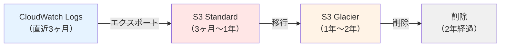
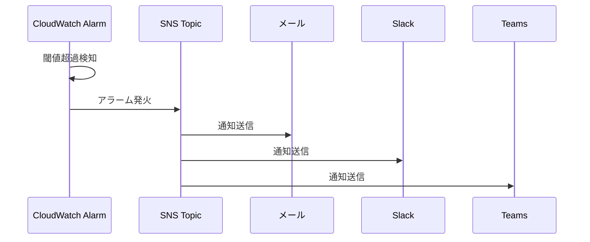

# 07. 監視ログ設計

**作成日**: 2025-10-25
**バージョン**: 1.0
**ステータス**: PM レビュー待ち

---

## 7.1 監視設計概要

### 監視の目的

1. **障害の早期検知**: システム障害を即座に検知し、迅速に対応
2. **性能監視**: レスポンスタイム、スループットの継続的な監視
3. **コスト監視**: AWS利用料の予算超過を防止
4. **セキュリティ監視**: 不正アクセスや異常なアクセスパターンの検知

---

## 7.2 CloudWatch メトリクス監視

### ECS Fargate メトリクス

| メトリクス | 閾値 | アラート通知 | 備考 |
|-----------|------|------------|------|
| CPU使用率 | 80%以上（2分間連続） | SNS → メール、Slack、Teams | スケールアウト検討 |
| メモリ使用率 | 80%以上（2分間連続） | SNS → メール、Slack、Teams | メモリリーク疑い |
| タスク数 | 0（すべてのタスクが停止） | SNS → メール、Slack、Teams | サービス停止 |
| DesiredCount vs RunningCount | 差が1以上（5分間連続） | SNS → メール、Slack、Teams | タスク起動失敗 |

### RDS PostgreSQL メトリクス

| メトリクス | 閾値 | アラート通知 | 備考 |
|-----------|------|------------|------|
| CPU使用率 | 80%以上（5分間連続） | SNS → メール、Slack、Teams | インスタンスタイプ見直し検討 |
| フリーストレージ容量 | 10GB以下 | SNS → メール、Slack、Teams | ストレージ不足警告 |
| データベース接続数 | 160以上（最大200の80%） | SNS → メール、Slack、Teams | 接続数上限に近づいた |
| レプリカラグ | 60秒以上 | SNS → メール、Slack、Teams | マルチAZレプリケーション遅延 |
| スワップ使用量 | 256MB以上 | SNS → メール、Slack、Teams | メモリ不足警告 |
| FreeableMemory | 256MB以下 | SNS → メール、Slack、Teams | メモリ不足警告 |

### ALB メトリクス

| メトリクス | 閾値 | アラート通知 | 備考 |
|-----------|------|------------|------|
| TargetResponseTime | 95%ile > 1秒 | SNS → メール、Slack、Teams | レスポンスタイム悪化 |
| HTTPCode_Target_5XX_Count | 5%以上 | SNS → メール、Slack、Teams | アプリケーションエラー |
| HTTPCode_ELB_5XX_Count | 1件以上 | SNS → メール、Slack、Teams | ALB自体のエラー |
| HealthyHostCount | 0（すべて異常） | SNS → メール、Slack、Teams | サービス停止 |
| UnHealthyHostCount | 1以上 | SNS → メール、Slack、Teams | ターゲット異常 |

### Lambda メトリクス（将来の拡張）

現時点ではLambdaは使用しないが、将来的に以下のメトリクスを監視：

| メトリクス | 閾値 | アラート通知 | 備考 |
|-----------|------|------------|------|
| Errors | 1件以上 | SNS | 実行エラー |
| Duration | タイムアウト値の80% | SNS | タイムアウト近い |

---

## 7.3 CloudWatch Logs 設計

### ログ一覧

| ログ種別 | ロググループ名 | 保管期間（CloudWatch） | 保管期間（S3） | 備考 |
|---------|--------------|---------------------|--------------|------|
| ECS アプリケーションログ（業務API） | /ecs/facilities-staff-api | 3ヶ月 | 2年 | API呼び出し、認証、エラー |
| ECS アプリケーションログ（事業者API） | /ecs/facilities-vendor-api | 3ヶ月 | 2年 | API呼び出し、認証、エラー |
| ECS アプリケーションログ（バッチ） | /ecs/facilities-batch | 3ヶ月 | 2年 | バッチ処理ログ |
| RDS PostgreSQL ログ | /aws/rds/instance/facilities-prod-db/postgresql | 3ヶ月 | 2年 | スロークエリ、エラー |
| ALB アクセスログ（業務） | S3（facilities-prod-logs/alb/staff-alb/） | - | 2年 | すべてのHTTPリクエスト |
| ALB アクセスログ（事業者） | S3（facilities-prod-logs/alb/vendor-alb/） | - | 2年 | すべてのHTTPリクエスト |
| VPCフローログ | /aws/vpc/facilities-prod-vpc | 1ヶ月 | 1年 | ネットワーク通信 |
| CloudTrail | S3（facilities-prod-logs/cloudtrail/） | - | 2年 | AWSリソース変更ログ |
| Lambda ログ（将来） | /aws/lambda/[function-name] | 3ヶ月 | 2年 | Lambda実行ログ |

### ログ保管のライフサイクル



---

## 7.4 アプリケーションログの構造化

### 推奨ログフォーマット（JSON）

```json
{
  "timestamp": "2025-10-25T10:30:00.123Z",
  "level": "INFO",
  "service": "staff-api",
  "traceId": "abc123def456",
  "userId": "EMP001",
  "action": "equipment.create",
  "method": "POST",
  "path": "/api/equipment",
  "statusCode": 201,
  "responseTime": 150,
  "message": "Equipment created successfully",
  "details": {
    "equipmentId": "EQ12345"
  }
}
```

### ログレベル

| レベル | 用途 | 例 |
|--------|------|---|
| **DEBUG** | 開発時のデバッグ情報 | 変数の値、関数の引数 |
| **INFO** | 通常の動作ログ | API呼び出し、ログイン成功 |
| **WARN** | 警告（エラーではない） | リトライ処理、非推奨APIの使用 |
| **ERROR** | エラー | API呼び出し失敗、データベースエラー |
| **FATAL** | 致命的エラー | サービス停止 |

**本番環境のログレベル**: INFO 以上

---

## 7.5 CloudWatch Alarms 設計

### アラーム設定（prod環境）

#### ECS CPU使用率アラーム

```yaml
ECSCPUAlarm:
  Type: AWS::CloudWatch::Alarm
  Properties:
    AlarmName: facilities-prod-ecs-staff-api-cpu-high
    AlarmDescription: ECS CPU使用率が80%を超えています
    MetricName: CPUUtilization
    Namespace: AWS/ECS
    Statistic: Average
    Period: 60
    EvaluationPeriods: 2
    Threshold: 80
    ComparisonOperator: GreaterThanThreshold
    Dimensions:
      - Name: ClusterName
        Value: facilities-prod-cluster
      - Name: ServiceName
        Value: facilities-staff-api-service
    AlarmActions:
      - !Ref SNSTopic
```

#### RDS フリーストレージ容量アラーム

```yaml
RDSStorageAlarm:
  Type: AWS::CloudWatch::Alarm
  Properties:
    AlarmName: facilities-prod-rds-storage-low
    AlarmDescription: RDS ストレージ容量が10GB以下です
    MetricName: FreeStorageSpace
    Namespace: AWS/RDS
    Statistic: Average
    Period: 300
    EvaluationPeriods: 1
    Threshold: 10737418240  # 10GB in bytes
    ComparisonOperator: LessThanThreshold
    Dimensions:
      - Name: DBInstanceIdentifier
        Value: facilities-prod-db
    AlarmActions:
      - !Ref SNSTopic
```

#### ALB 5xxエラー率アラーム

```yaml
ALB5xxAlarm:
  Type: AWS::CloudWatch::Alarm
  Properties:
    AlarmName: facilities-prod-alb-5xx-high
    AlarmDescription: ALB 5xxエラー率が5%を超えています
    MetricName: HTTPCode_Target_5XX_Count
    Namespace: AWS/ApplicationELB
    Statistic: Sum
    Period: 60
    EvaluationPeriods: 2
    Threshold: 5
    ComparisonOperator: GreaterThanThreshold
    Dimensions:
      - Name: LoadBalancer
        Value: !GetAtt StaffALB.LoadBalancerFullName
    AlarmActions:
      - !Ref SNSTopic
```

---

## 7.6 SNS 通知設計

### SNS Topic 構成

| SNS Topic 名 | 用途 | サブスクリプション |
|-------------|------|------------------|
| facilities-prod-alerts | 障害・警告アラート | メール、Slack、Teams |
| facilities-prod-billing | コスト関連アラート | メール |
| facilities-prod-security | セキュリティアラート | メール |

### SNS サブスクリプション設定

#### メール通知

| SNS Topic | メールアドレス | 備考 |
|-----------|--------------|------|
| facilities-prod-alerts | infra-team@example.go.jp | インフラチーム |
| facilities-prod-billing | finance-team@example.go.jp | 財務担当 |
| facilities-prod-security | security-team@example.go.jp | セキュリティチーム |

#### Slack 通知

| SNS Topic | Slack Webhook URL | Slack チャンネル |
|-----------|------------------|----------------|
| facilities-prod-alerts | https://hooks.slack.com/services/XXX/YYY/ZZZ | #facilities-alerts |

#### Microsoft Teams 通知

| SNS Topic | Teams Webhook URL | Teams チャンネル |
|-----------|-----------------|----------------|
| facilities-prod-alerts | https://outlook.office.com/webhook/XXX/IncomingWebhook/YYY | Facilities Alerts |

### 通知フロー



---

## 7.7 VPCフローログ設計

### VPCフローログ設定

| 項目 | 設定値 | 備考 |
|------|--------|------|
| 対象 | facilities-prod-vpc | VPC全体 |
| フィルター | すべて（許可・拒否） | |
| ログ送信先 | CloudWatch Logs | /aws/vpc/facilities-prod-vpc |
| ログフォーマット | デフォルト | |
| 集約間隔 | 1分 | |

### VPCフローログの活用

1. **不正アクセスの検知**: 異常なIPアドレスからのアクセス
2. **ネットワークトラブルシューティング**: 通信失敗の原因調査
3. **セキュリティ監査**: すべてのネットワーク通信の記録

---

## 7.8 CloudTrail 設計

### CloudTrail 設定

| 項目 | 設定値 | 備考 |
|------|--------|------|
| 証跡名 | facilities-prod-trail | |
| 対象リージョン | すべてのリージョン | マルチリージョン対応 |
| ログ保存先 | S3（facilities-prod-logs/cloudtrail/） | |
| ログファイル検証 | 有効 | 改ざん検知 |
| CloudWatch Logs への配信 | 有効 | /aws/cloudtrail/facilities-prod-trail |
| データイベント | S3、Lambda（将来） | オブジェクトレベルのAPI呼び出し記録 |

### CloudTrail の活用

1. **監査**: すべてのAWS API呼び出しを記録
2. **セキュリティインシデント調査**: 不正なAPI呼び出しの検出
3. **コンプライアンス**: 法令準拠の証跡管理

---

## 7.9 AWS Billing Alerts

### Billing Alerts 設定

| アラート名 | 閾値 | 通知先 |
|----------|------|--------|
| facilities-prod-billing-50% | 50万円（予算の50%） | facilities-prod-billing SNS Topic |
| facilities-prod-billing-80% | 80万円（予算の80%） | facilities-prod-billing SNS Topic |
| facilities-prod-billing-100% | 100万円（予算） | facilities-prod-billing SNS Topic（緊急） |

---

## 7.10 ダッシュボード設計

### CloudWatch Dashboard 構成

#### メインダッシュボード（facilities-prod-dashboard）

| ウィジェット | 表示内容 | 更新頻度 |
|------------|---------|---------|
| ECS CPU使用率 | 業務API、事業者API のCPU使用率 | 1分 |
| ECS メモリ使用率 | 業務API、事業者API のメモリ使用率 | 1分 |
| ECS タスク数 | 業務API、事業者API のタスク数 | 1分 |
| RDS CPU使用率 | RDS PostgreSQL のCPU使用率 | 5分 |
| RDS 接続数 | RDS PostgreSQL の接続数 | 5分 |
| ALB レスポンスタイム | 95%ile レスポンスタイム | 1分 |
| ALB 5xxエラー数 | 5xxエラー数 | 1分 |
| ALB リクエスト数 | リクエスト数（req/min） | 1分 |

---

## 7.11 ヒアリング事項（仮決定）

以下の項目は、本来ユーザーに確認すべきですが、合理的な仮決定をしました：

| 項目 | 仮決定内容 | 理由 | ユーザー確認推奨度 |
|------|----------|------|------------------|
| アラート閾値（CPU） | 80% | 一般的な閾値 | 中 |
| アラート閾値（メモリ） | 80% | 一般的な閾値 | 中 |
| ログ保管期間（CloudWatch） | 3ヶ月 | コストとバランス | 低 |
| ログ保管期間（S3） | 2年 | 監査要件を考慮 | 低 |
| SNS 通知先 | メール、Slack、Teams | 多様な通知手段 | 中 |
| CloudWatch Dashboard 構成 | メインダッシュボード1つ | シンプルな構成 | 低 |

---

**作成者**: architect サブエージェント
**最終更新**: 2025-10-25
