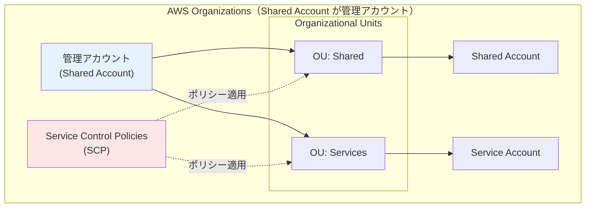
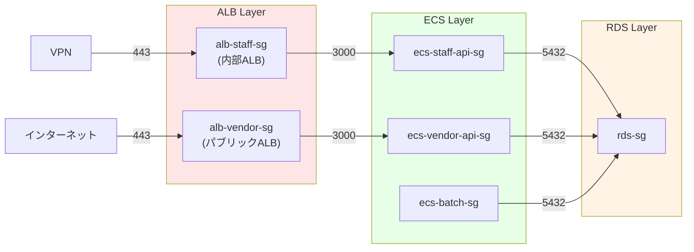
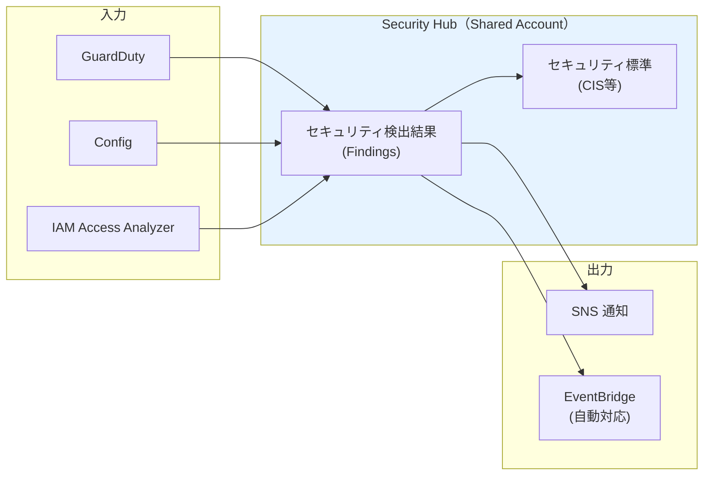
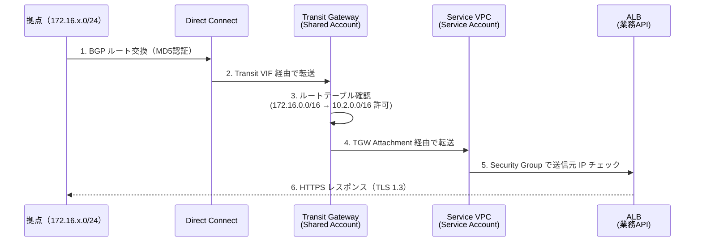
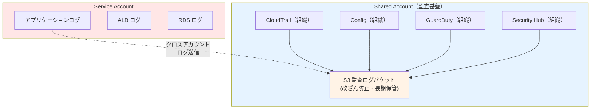

# 08. セキュリティ設計

**作成日**: 2025-10-25
**バージョン**: 1.2
**ステータス**: PM レビュー待ち

**更新履歴**:
- v1.2 (2025-10-25): 設定値を削除、設計理由と設計アプローチのみに簡潔化
- v1.1 (2025-10-25): マルチアカウントセキュリティ設計追加
- v1.0 (2025-10-25): 初版作成

---

## 8.0 マルチアカウントセキュリティ概要

### アカウント分離によるセキュリティ強化

本システムは、**Shared Account（共有基盤）** と **Service Account（サービスアカウント）** の2アカウント構成を採用し、以下のセキュリティ上の利点を実現します：

| セキュリティ上の利点 | 実現方法 |
|------------------|---------|
| **攻撃面の分離** | Service Account が侵害されても、Shared Account のネットワークインフラと監査基盤は保護される |
| **権限の分離** | 各アカウントで異なるIAMポリシーとSCPを適用 |
| **監査の一元化** | Shared Account で組織全体の監査ログを集約（改ざん防止） |
| **セキュリティ管理の一元化** | GuardDuty、Security Hub、Config を組織レベルで管理 |

### AWS Organizations によるセキュリティガバナンス

**SCP（Service Control Policies）の役割**:
- 東京リージョン以外でのリソース作成禁止
- CloudTrail の停止・削除禁止
- GuardDuty の無効化禁止

**具体的なSCP定義は、`05_実装準備/パラメーターシート.xlsx` を参照してください。**

---

## 8.1 セキュリティ設計概要

### セキュリティ要件

- **機密性レベル**: 機密性3（機微情報）
- **準拠規格**: ISMAP、政府情報システムにおけるクラウドサービス利用の基本方針

### セキュリティ設計の8つの柱

1. **マルチアカウントガバナンス**: AWS Organizations、SCP
2. **ネットワークセキュリティ**: VPC、Security Group、WAF、Transit Gateway
3. **データ暗号化**: 転送時・保存時の暗号化（TLS 1.3、AES-256）
4. **認証・認可**: Cognito、JWT、RBAC
5. **監査ログ**: CloudTrail（組織）、CloudWatch Logs
6. **脅威検知**: GuardDuty（組織）、Security Hub（組織）
7. **設定管理**: Config（組織）
8. **脆弱性対策**: パッチ適用、セキュリティスキャン

---

## 8.2 ネットワークセキュリティ設計

### Security Group 設計方針

**最小権限の原則**:
- 必要最小限のポート、プロトコル、送信元のみ許可
- 不要なアウトバウンドは遮断
- RDS は完全閉域（アウトバウンドなし）

**Security Group の依存関係**:

**具体的なSecurity Group ルール（ポート、送信元CIDR等）は、パラメーターシートを参照してください。**

---

## 8.3 AWS WAF 設計

### WAF 適用方針

**ADR-010: 事業者アプリALBのみWAF適用**

| リソース | WAF適用 | 理由 |
|---------|--------|------|
| ALB（業務アプリ） | 無効 | VPN経由のみアクセス、内部ALB |
| ALB（事業者アプリ） | **有効** | インターネット公開、攻撃リスクが高い |
| CloudFront | 無効 | 静的ファイルのみ、攻撃リスクが低い |

### WAF ルールセット設計方針

**OWASP Top 10 対策**:
- AWSManagedRulesCommonRuleSet: SQLインジェクション、XSS等
- AWSManagedRulesKnownBadInputsRuleSet: 既知の脆弱性
- AWSManagedRulesAnonymousIpList: Tor、プロキシからのアクセス遮断
- AWSManagedRulesAmazonIpReputationList: AWS IPレピュテーションリスト

**DDoS対策**:
- Rate Limiting: 同一IPから1分間に1000リクエスト以上を遮断

**具体的なWAF ルール定義（CloudFormation YAML）、Rate Limiting 閾値等は、パラメーターシートを参照してください。**

---

## 8.4 データ暗号化設計

### 暗号化方針

**転送時の暗号化**:
- すべての通信でTLS 1.3を使用
- TLS 1.2以下を拒否（ALB リスナーポリシー、CloudFront）

**保存時の暗号化**:
- すべてのデータをAES-256で暗号化
- RDS、S3、Secrets Manager、CloudWatch Logs

**ADR-011: AWS マネージドキー採用**

| 決定事項 | 理由 |
|---------|------|
| **AWS マネージドキー** を採用 | ✅ 運用コスト削減、AWS が鍵管理、自動ローテーション |
| **代替案: カスタマーマネージドキー（CMK）** | ❌ 運用コスト増、鍵管理の複雑化、今回の要件では不要 |

**具体的な暗号化設定（KMS キーID、TLSポリシー名等）は、パラメーターシートを参照してください。**

---

## 8.5 シークレット管理設計

### Secrets Manager 設計方針

**ハードコード禁止**:
- すべてのシークレット（DB接続情報、JWT Secret Key等）をSecrets Managerで管理
- 環境変数ではなく、ECS タスク定義の `secrets` セクションから参照

**シークレットローテーション**:
- DB接続情報: 90日ごと（手動）
- JWT Secret Key: 180日ごと（手動）

**具体的なシークレット名、ARN、ローテーション設定等は、パラメーターシートを参照してください。**

---

## 8.6 IAM ロール設計

### IAM 設計方針

**最小権限の原則**:
- 各タスクに必要最小限の権限のみ付与
- ワイルドカード（`*`）の使用を避ける
- リソースARNを明示的に指定

**タスクロールの分離**:
- facilitiesStaffApiTaskRole: 業務API専用
- facilitiesVendorApiTaskRole: 事業者API専用
- facilitiesBatchTaskRole: バッチ専用

**具体的なIAMポリシーJSON、ARN等は、パラメーターシートを参照してください。**

---

## 8.7 組織レベルのセキュリティサービス（Shared Account）

### CloudTrail（組織全体）

**設計方針**:
- 組織内のすべてのアカウントのAWS API呼び出しを記録
- Shared Account で一元管理（Service Account 管理者でも削除不可）
- ログファイル検証有効化（改ざん検知）

**利点**:
- Service Account が侵害されても、Shared Account のログは保護される
- 組織全体の監査証跡を一元管理

### Config（組織全体）

**設計方針**:
- 組織内のすべてのリソース設定変更を記録
- Config Rules でコンプライアンスチェック
- 自動是正はせず、アラートのみ（人間の判断を尊重）

**Config Rules の例**:
- encrypted-volumes: EBS ボリュームが暗号化されているか
- rds-encryption-enabled: RDS が暗号化されているか
- s3-bucket-public-read-prohibited: S3 バケットがパブリック読み取り不可か

### GuardDuty（組織全体）

**設計方針**:
- Shared Account を GuardDuty 管理者アカウントに設定
- 組織内のすべてのアカウントで自動的に有効化
- CloudTrail ログ、VPC フローログ、DNS ログを分析

**検知例**:
- EC2 インスタンスのクレデンシャル漏洩
- C&C サーバーとの通信
- 既知の悪意のある IP からのアクセス
- 仮想通貨マイニングの疑い

### Security Hub（組織全体）

**設計方針**:
- GuardDuty、Config、IAM Access Analyzer の検出結果を統合
- セキュリティ標準（CIS AWS Foundations Benchmark）に準拠
- 重要度（Critical、High、Medium、Low）で優先順位付け

**具体的なCloudTrail証跡名、Config Aggregator名、GuardDuty設定、Security Hub標準等は、パラメーターシートを参照してください。**

---

## 8.8 拠点接続のセキュリティ設計

### Direct Connect のセキュリティ

**設計方針**:
- 専用線（Direct Connect）によりインターネットを経由しない閉域接続
- BGP MD5認証有効化（BGP セッションの認証）
- 将来的にMACsec（レイヤー2暗号化）を検討

### Transit Gateway のセキュリティ

**設計方針**:
- ルート分離（拠点 ⇔ Service VPC のみ許可）
- VPC Attachment の手動承認（不正な VPC Attachment を防止）
- AWS RAM で Service Account に最小限の共有

**拠点 ⇔ AWS 通信のセキュリティフロー**:

**具体的なBGP MD5認証設定、Transit Gateway ルートテーブル等は、パラメーターシートを参照してください。**

---

## 8.9 監査ログ設計

### 監査ログの要件（ISMAP準拠）

| 項目 | 要件 | 実装方法 |
|------|------|---------|
| ログの種類 | アプリケーションログ、アクセスログ、データベースログ、AWSリソース変更ログ | CloudWatch Logs、ALB ログ、RDS ログ、CloudTrail |
| 保管期間 | 2年間 | S3 に保存、ライフサイクルポリシーで2年後削除 |
| ログの改ざん防止 | ログファイル検証 | CloudTrail ログファイル検証有効化、Shared Account で権限分離 |
| ログの完全性 | すべての操作を記録 | CloudTrail（すべてのリージョン）、VPCフローログ |

### ログ集約のメリット

**具体的な監査ログ一覧、保管先S3バケット名、保管期間等は、パラメーターシートを参照してください。**

---

## 8.10 脆弱性対策

### コンテナイメージスキャン

**設計方針**:
- ECR Image Scanning: イメージPush時に自動スキャン
- Trivy: CI/CDパイプライン（GitHub Actions）で実行
- Critical、High の脆弱性があればデプロイ中止

### 依存関係の脆弱性管理

**設計方針**:
- npm audit: CI/CDパイプラインで実行
- Dependabot: GitHub で毎週依存関係をチェック
- セキュリティパッチの自動PR作成

**具体的なスキャン設定、Trivy設定、Dependabot設定等は、パラメーターシートを参照してください。**

---

## 8.11 セキュリティベストプラクティス

### AWS Well-Architected Framework - セキュリティの柱

| 項目 | 実装内容 |
|------|---------|
| **マルチアカウント戦略** | ✅ Shared Account と Service Account で権限・攻撃面を分離 |
| **組織レベルのガバナンス** | ✅ AWS Organizations + SCP で組織全体のポリシー適用 |
| **最小権限の原則** | ✅ IAM ロールで必要最小限の権限のみ付与 |
| **多層防御** | ✅ ネットワーク層（SG、TGW）、アプリケーション層（WAF）、データ層（暗号化） |
| **監査ログの一元化** | ✅ CloudTrail（組織）、Config（組織）で Shared Account に集約 |
| **脅威検知の一元化** | ✅ GuardDuty（組織）、Security Hub（組織）で統合監視 |
| **データ暗号化** | ✅ 転送時・保存時の暗号化（TLS 1.3、AES-256） |
| **脆弱性管理** | ✅ ECR Image Scanning、Trivy、Dependabot |
| **シークレット管理** | ✅ Secrets Manager でハードコード禁止 |
| **ネットワーク分離** | ✅ プライベートサブネットでECS配置、DB Subnetは完全閉域、拠点はDirect Connect閉域接続 |

### ISMAP 準拠

| ISMAP 管理基準 | 実装内容 |
|-------------|---------|
| **1.2.1 ログ取得** | ✅ CloudTrail、CloudWatch Logs で全操作を記録 |
| **1.2.2 ログ保管** | ✅ S3 で2年間保管、ライフサイクルポリシー設定 |
| **1.2.3 ログ改ざん防止** | ✅ CloudTrail ログファイル検証、Shared Account で権限分離 |
| **1.3.1 暗号化** | ✅ TLS 1.3、AES-256 で転送時・保存時の暗号化 |
| **1.4.1 アクセス制御** | ✅ Security Group、IAM、Cognito で多層的なアクセス制御 |
| **1.5.1 脆弱性管理** | ✅ ECR Scanning、Trivy、Dependabot で継続的な脆弱性管理 |
| **1.6.1 監視** | ✅ CloudWatch、GuardDuty、Security Hub で24時間監視 |

---

## 8.12 ヒアリング結果と仮決定

### ユーザー確認済み事項

以下の項目は、ユーザーとのヒアリングで確定しました：

| 項目 | 確定内容 | 確認日 |
|------|---------|-------|
| マルチアカウント構成 | Shared Account + Service Account | 2025-10-25 |
| 組織レベルの監査ログ集約 | Shared Account で一元管理 | 2025-10-25 |
| AWS Organizations | 使用する（Shared Account を管理アカウントに設定） | 2025-10-25 |
| Direct Connect セキュリティ | BGP MD5認証有効化、閉域接続 | 2025-10-25 |

### 仮決定事項

以下の項目は、本来ユーザーに確認すべきですが、合理的な仮決定をしました：

| 項目 | 仮決定内容 | 理由 | ユーザー確認推奨度 |
|------|----------|------|------------------|
| SCP（Service Control Policies） | 東京リージョン制限、CloudTrail削除禁止等 | セキュリティガバナンス強化 | 中 |
| GuardDuty 有効化 | 組織全体で有効化 | 脅威検知必須 | 低 |
| Security Hub 有効化 | 組織全体で有効化 | セキュリティ統合管理 | 低 |
| Config Rules | 暗号化チェック、パブリックアクセス禁止等 | コンプライアンス確保 | 低 |
| TLS 最小バージョン | TLSv1.3 | ISMAP準拠、セキュリティ強化 | 低 |
| WAF 適用対象 | 事業者アプリALBのみ | インターネット公開リソース | 低 |
| WAF ルールセット | AWSマネージドルール + Rate Limiting | OWASP Top 10 対策 | 低 |
| Rate Limiting 閾値 | 1000 req/min/IP | DDoS対策 | 中 |
| Security Group ルール | 最小権限の原則 | ベストプラクティス | 低 |
| 監査ログ保管期間 | 2年 | ISMAP準拠 | 低 |
| シークレットローテーション頻度 | DB: 90日、JWT: 180日 | セキュリティバランス | 中 |
| BGP MD5認証 | 有効 | Direct Connect セキュリティ強化 | 低 |
| IPsec VPN over DX | 将来的に検討（初期は未実装） | コストとセキュリティのバランス | 中 |

---

**作成者**: architect サブエージェント
**最終更新**: 2025-10-25
