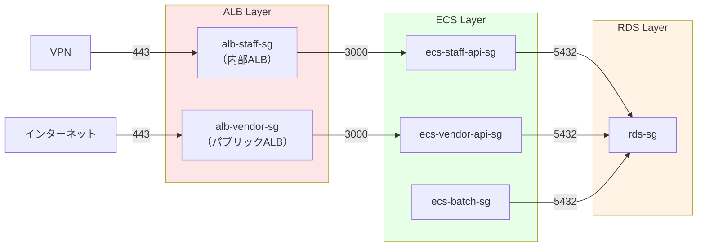

# 08. セキュリティ設計

**作成日**: 2025-10-25
**バージョン**: 1.0
**ステータス**: PM レビュー待ち

---

## 8.1 セキュリティ設計概要

### セキュリティ要件

- **機密性レベル**: 機密性3（機微情報）
- **準拠規格**: ISMAP、政府情報システムにおけるクラウドサービス利用の基本方針

### セキュリティ設計の柱

1. **ネットワークセキュリティ**: VPC、Security Group、WAF
2. **データ暗号化**: 転送時・保存時の暗号化
3. **認証・認可**: Cognito、JWT、RBAC
4. **監査ログ**: CloudTrail、CloudWatch Logs
5. **脆弱性対策**: パッチ適用、セキュリティスキャン

---

## 8.2 ネットワークセキュリティ設計

### Security Group 設計

#### ALB Security Group（業務アプリ: alb-staff-sg）

| ルール | プロトコル | ポート | ソース | 説明 |
|--------|----------|--------|--------|------|
| **Inbound** | TCP | 443 | VPN CIDR（xx.xx.xx.xx/xx） | VPN経由のHTTPSアクセス |
| **Outbound** | TCP | 3000 | ecs-staff-api-sg | ECS タスクへの転送 |

#### ALB Security Group（事業者アプリ: alb-vendor-sg）

| ルール | プロトコル | ポート | ソース | 説明 |
|--------|----------|--------|--------|------|
| **Inbound** | TCP | 443 | 0.0.0.0/0 | インターネットからのHTTPSアクセス |
| **Outbound** | TCP | 3000 | ecs-vendor-api-sg | ECS タスクへの転送 |

#### ECS Security Group（業務API: ecs-staff-api-sg）

| ルール | プロトコル | ポート | ソース | 説明 |
|--------|----------|--------|--------|------|
| **Inbound** | TCP | 3000 | alb-staff-sg | ALBからのリクエスト |
| **Outbound** | TCP | 5432 | rds-sg | RDS PostgreSQL への接続 |
| **Outbound** | TCP | 443 | 0.0.0.0/0 | AWS API呼び出し（Secrets Manager、Cognito等） |

#### ECS Security Group（事業者API: ecs-vendor-api-sg）

| ルール | プロトコル | ポート | ソース | 説明 |
|--------|----------|--------|--------|------|
| **Inbound** | TCP | 3000 | alb-vendor-sg | ALBからのリクエスト |
| **Outbound** | TCP | 5432 | rds-sg | RDS PostgreSQL への接続 |
| **Outbound** | TCP | 443 | 0.0.0.0/0 | AWS API呼び出し（Secrets Manager、Cognito等） |

#### ECS Security Group（バッチ: ecs-batch-sg）

| ルール | プロトコル | ポート | ソース | 説明 |
|--------|----------|--------|--------|------|
| **Inbound** | - | - | - | 受信なし |
| **Outbound** | TCP | 5432 | rds-sg | RDS PostgreSQL への接続 |
| **Outbound** | TCP | 443 | 0.0.0.0/0 | AWS API呼び出し（S3、Secrets Manager等） |

#### RDS Security Group（rds-sg）

| ルール | プロトコル | ポート | ソース | 説明 |
|--------|----------|--------|--------|------|
| **Inbound** | TCP | 5432 | ecs-staff-api-sg | 業務APIからの接続 |
| **Inbound** | TCP | 5432 | ecs-vendor-api-sg | 事業者APIからの接続 |
| **Inbound** | TCP | 5432 | ecs-batch-sg | バッチからの接続 |
| **Outbound** | - | - | - | アウトバウンドなし（完全閉域） |

### Security Group 依存関係図



---

## 8.3 AWS WAF 設計

### WAF 適用対象

| リソース | WAF適用 | 理由 |
|---------|--------|------|
| ALB（業務アプリ） | 無効 | VPN経由のみアクセス、内部ALB |
| ALB（事業者アプリ） | **有効** | インターネット公開、攻撃リスクが高い |
| CloudFront | 無効 | 静的ファイルのみ、攻撃リスクが低い |

### WAF ルールセット（事業者アプリ用）

| ルール | 説明 | アクション |
|--------|------|----------|
| **AWSManagedRulesCommonRuleSet** | 一般的な攻撃（SQLインジェクション、XSS等） | Block |
| **AWSManagedRulesKnownBadInputsRuleSet** | 既知の脆弱性を悪用する攻撃 | Block |
| **AWSManagedRulesAnonymousIpList** | Tor、プロキシ等からのアクセス | Block |
| **AWSManagedRulesAmazonIpReputationList** | AWS IPレピュテーションリスト | Block |
| **Rate Limiting** | 同一IPから1分間に1000リクエスト以上 | Block |

### WAF 設定（CloudFormation）

```yaml
VendorWAFWebACL:
  Type: AWS::WAFv2::WebACL
  Properties:
    Name: facilities-vendor-waf
    Scope: REGIONAL
    DefaultAction:
      Allow: {}
    Rules:
      - Name: AWSManagedRulesCommonRuleSet
        Priority: 1
        OverrideAction:
          None: {}
        Statement:
          ManagedRuleGroupStatement:
            VendorName: AWS
            Name: AWSManagedRulesCommonRuleSet
        VisibilityConfig:
          SampledRequestsEnabled: true
          CloudWatchMetricsEnabled: true
          MetricName: AWSManagedRulesCommonRuleSetMetric
      - Name: RateLimitRule
        Priority: 2
        Action:
          Block: {}
        Statement:
          RateBasedStatement:
            Limit: 1000
            AggregateKeyType: IP
        VisibilityConfig:
          SampledRequestsEnabled: true
          CloudWatchMetricsEnabled: true
          MetricName: RateLimitMetric
    VisibilityConfig:
      SampledRequestsEnabled: true
      CloudWatchMetricsEnabled: true
      MetricName: VendorWAFMetric
```

---

## 8.4 データ暗号化設計

### 転送時の暗号化

| 項目 | 暗号化方式 | TLS バージョン | 備考 |
|------|----------|--------------|------|
| ALB → ECS | TLS 1.3 | TLS 1.3 | ALB でTLS終端 |
| ECS → RDS | TLS 1.3 | TLS 1.3 | RDS接続時にSSL必須 |
| ECS → Secrets Manager | TLS 1.3 | TLS 1.3 | AWS API はすべてTLS 1.3 |
| CloudFront → ユーザー | TLS 1.3 | TLS 1.3 | CloudFront でTLS終端 |

**TLS 1.2以下の拒否**:
- ALB のリスナーポリシー: `ELBSecurityPolicy-TLS13-1-2-2021-06`
- CloudFront: TLSv1.3_2021

### 保存時の暗号化

| リソース | 暗号化方式 | KMS キー | 備考 |
|---------|----------|---------|------|
| RDS PostgreSQL | AES-256 | AWS マネージド (aws/rds) | 有効 |
| S3（すべてのバケット） | AES-256 | AWS マネージド (aws/s3) | SSE-S3 |
| EBS（Fargateは不要） | - | - | Fargate はEBS使用しない |
| Secrets Manager | AES-256 | AWS マネージド (aws/secretsmanager) | デフォルト |
| CloudWatch Logs | AES-256 | AWS マネージド | デフォルト |

---

## 8.5 シークレット管理設計

### Secrets Manager 設計

#### シークレット一覧

| シークレット名 | 内容 | 参照元 |
|-------------|------|--------|
| facilities/prod/database | RDS接続情報（ホスト、ポート、ユーザー、パスワード、DB名） | ECS タスク |
| facilities/prod/jwt | JWT Secret Key | ECS タスク |
| facilities/prod/cognito/staff | Cognito ユーザープールID、クライアントID | ECS タスク |
| facilities/prod/cognito/vendor | Cognito ユーザープールID、クライアントID | ECS タスク |

#### シークレットローテーション

| シークレット | ローテーション | 頻度 | 備考 |
|------------|-------------|------|------|
| facilities/prod/database | 手動 | 90日ごと | RDS パスワード変更 |
| facilities/prod/jwt | 手動 | 180日ごと | JWT Secret Key 変更 |

### 環境変数の使用禁止

**❌ 悪い例（ハードコード）**:
```yaml
environment:
  - name: DATABASE_PASSWORD
    value: "MySecretPassword123"
```

**✅ 良い例（Secrets Manager）**:
```yaml
secrets:
  - name: DATABASE_PASSWORD
    valueFrom: "arn:aws:secretsmanager:ap-northeast-1:ACCOUNT_ID:secret:facilities/prod/database:password::"
```

---

## 8.6 IAM ロール設計

### IAM ロール一覧

| ロール名 | 用途 | 付与するポリシー |
|---------|------|----------------|
| ecsTaskExecutionRole | ECS タスク実行ロール | AmazonECSTaskExecutionRolePolicy |
| facilitiesStaffApiTaskRole | 業務API タスクロール | カスタムポリシー（最小権限） |
| facilitiesVendorApiTaskRole | 事業者API タスクロール | カスタムポリシー（最小権限） |
| facilitiesBatchTaskRole | バッチ タスクロール | カスタムポリシー（最小権限） |
| EventBridgeECSRole | EventBridge がECSタスクを起動 | カスタムポリシー |

### 最小権限の原則（facilitiesStaffApiTaskRole の例）

```json
{
  "Version": "2012-10-17",
  "Statement": [
    {
      "Effect": "Allow",
      "Action": [
        "secretsmanager:GetSecretValue"
      ],
      "Resource": [
        "arn:aws:secretsmanager:ap-northeast-1:ACCOUNT_ID:secret:facilities/prod/database*",
        "arn:aws:secretsmanager:ap-northeast-1:ACCOUNT_ID:secret:facilities/prod/jwt*"
      ]
    },
    {
      "Effect": "Allow",
      "Action": [
        "cognito-idp:AdminGetUser",
        "cognito-idp:AdminInitiateAuth"
      ],
      "Resource": "arn:aws:cognito-idp:ap-northeast-1:ACCOUNT_ID:userpool/ap-northeast-1_xxxxx"
    },
    {
      "Effect": "Allow",
      "Action": [
        "logs:CreateLogStream",
        "logs:PutLogEvents"
      ],
      "Resource": "arn:aws:logs:ap-northeast-1:ACCOUNT_ID:log-group:/ecs/facilities-staff-api:*"
    }
  ]
}
```

---

## 8.7 監査ログ設計

### 監査ログの要件（ISMAP準拠）

| 項目 | 要件 | 実装方法 |
|------|------|---------|
| ログの種類 | アプリケーションログ、アクセスログ、データベースログ、AWSリソース変更ログ | CloudWatch Logs、ALB ログ、RDS ログ、CloudTrail |
| 保管期間 | 2年間 | S3 に保存、ライフサイクルポリシーで2年後削除 |
| ログの改ざん防止 | ログファイル検証 | CloudTrail ログファイル検証有効化 |
| ログの完全性 | すべての操作を記録 | CloudTrail（すべてのリージョン）、VPCフローログ |

### 監査ログ一覧

| ログ種別 | 記録内容 | 保管先 | 保管期間 |
|---------|---------|--------|---------|
| アプリケーションログ | API呼び出し、認証、エラー | CloudWatch Logs → S3 | 2年 |
| ALB アクセスログ | すべてのHTTPリクエスト | S3 | 2年 |
| RDS ログ | スロークエリ、エラー | CloudWatch Logs → S3 | 2年 |
| CloudTrail | すべてのAWS API呼び出し | S3 | 2年 |
| VPCフローログ | すべてのネットワーク通信 | CloudWatch Logs → S3 | 1年 |
| Cognito ログ | ログイン成功、失敗、パスワード変更 | CloudWatch Logs → S3 | 2年 |

---

## 8.8 脆弱性対策

### コンテナイメージスキャン

| ツール | タイミング | 対象 |
|--------|----------|------|
| **ECR Image Scanning** | イメージPush時 | すべてのコンテナイメージ |
| **Trivy** | CI/CDパイプライン | すべてのコンテナイメージ |

**GitHub Actions での実装例**:
```yaml
- name: Run Trivy vulnerability scanner
  uses: aquasecurity/trivy-action@master
  with:
    image-ref: ${{ steps.login-ecr.outputs.registry }}/facilities-staff-api:latest
    format: 'sarif'
    output: 'trivy-results.sarif'
    severity: 'CRITICAL,HIGH'
```

### 依存関係の脆弱性管理

| ツール | タイミング | 対象 |
|--------|----------|------|
| **npm audit** | CI/CDパイプライン | Node.js 依存関係 |
| **Dependabot** | 毎週 | GitHub リポジトリ |

---

## 8.9 セキュリティベストプラクティス

### AWS Well-Architected Framework - セキュリティの柱

| 項目 | 実装内容 |
|------|---------|
| **最小権限の原則** | ✅ IAM ロールで必要最小限の権限のみ付与 |
| **多層防御** | ✅ ネットワーク層（SG）、アプリケーション層（WAF）、データ層（暗号化） |
| **監査ログ** | ✅ CloudTrail、CloudWatch Logs で2年間保管 |
| **データ暗号化** | ✅ 転送時・保存時の暗号化 |
| **脆弱性管理** | ✅ ECR Image Scanning、Trivy、Dependabot |
| **シークレット管理** | ✅ Secrets Manager でハードコード禁止 |
| **ネットワーク分離** | ✅ プライベートサブネットでECS配置、DB Subnetは完全閉域 |

---

## 8.10 ヒアリング事項（仮決定）

以下の項目は、本来ユーザーに確認すべきですが、合理的な仮決定をしました：

| 項目 | 仮決定内容 | 理由 | ユーザー確認推奨度 |
|------|----------|------|------------------|
| TLS 最小バージョン | TLSv1.3 | ISMAP準拠、セキュリティ強化 | 低 |
| WAF 適用対象 | 事業者アプリALBのみ | インターネット公開リソース | 低 |
| WAF ルールセット | AWSマネージドルール + Rate Limiting | OWASP Top 10 対策 | 低 |
| Rate Limiting 閾値 | 1000 req/min/IP | DDoS対策 | 中 |
| Security Group ルール | 最小権限の原則 | ベストプラクティス | 低 |
| 監査ログ保管期間 | 2年 | ISMAP準拠 | 低 |
| シークレットローテーション頻度 | DB: 90日、JWT: 180日 | セキュリティバランス | 中 |

---

**作成者**: architect サブエージェント
**最終更新**: 2025-10-25
