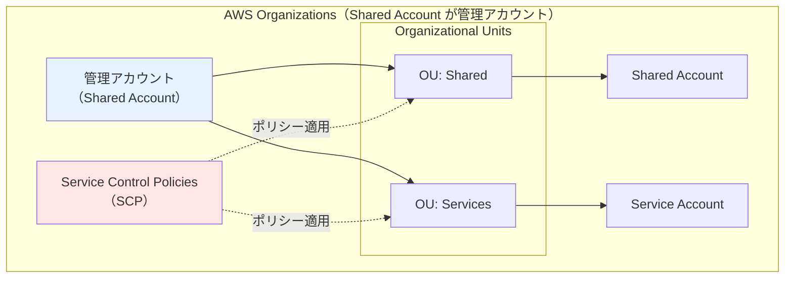
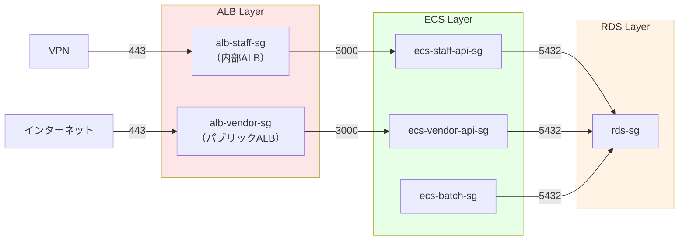
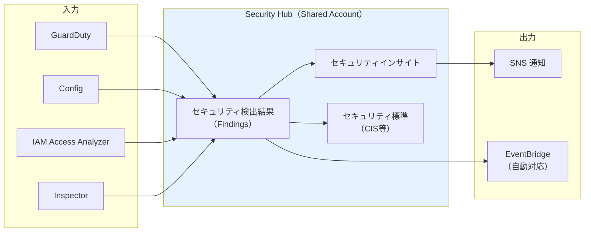
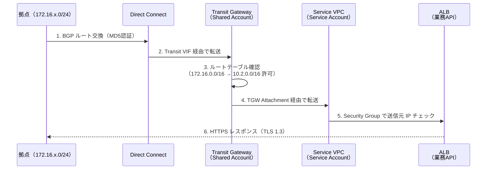
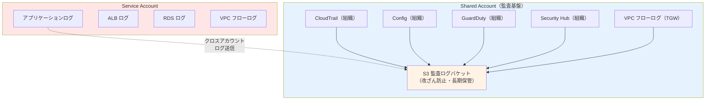

# 08. セキュリティ設計

**作成日**: 2025-10-25
**バージョン**: 1.1
**ステータス**: PM レビュー待ち

**更新履歴**:
- v1.1 (2025-10-25): マルチアカウントセキュリティ設計追加（Organizations、GuardDuty、Security Hub、Config、CloudTrail組織対応）
- v1.0 (2025-10-25): 初版作成

---

## 8.0 マルチアカウントセキュリティ概要

### アカウント分離によるセキュリティ強化

本システムは、**Shared Account（共有基盤）** と **Service Account（サービスアカウント）** の2アカウント構成を採用し、以下のセキュリティ上の利点を実現します：

| セキュリティ上の利点 | 実現方法 |
|------------------|---------|
| **攻撃面の分離** | Service Account が侵害されても、Shared Account のネットワークインフラと監査基盤は保護される |
| **権限の分離** | 各アカウントで異なるIAMポリシーとSCPを適用 |
| **監査の一元化** | Shared Account で組織全体の監査ログを集約（改ざん防止） |
| **セキュリティ管理の一元化** | GuardDuty、Security Hub、Config を組織レベルで管理 |

### AWS Organizations によるセキュリティガバナンス



### SCP（Service Control Policies）による制限例

```json
{
  "Version": "2012-10-17",
  "Statement": [
    {
      "Effect": "Deny",
      "Action": [
        "ec2:RunInstances"
      ],
      "Resource": "*",
      "Condition": {
        "StringNotEquals": {
          "ec2:Region": ["ap-northeast-1"]
        }
      }
    },
    {
      "Effect": "Deny",
      "Action": [
        "cloudtrail:StopLogging",
        "cloudtrail:DeleteTrail"
      ],
      "Resource": "*"
    }
  ]
}
```

**SCP の用途**:
- 東京リージョン以外でのリソース作成禁止
- CloudTrail の停止・削除禁止
- GuardDuty の無効化禁止

---

## 8.1 セキュリティ設計概要

### セキュリティ要件

- **機密性レベル**: 機密性3（機微情報）
- **準拠規格**: ISMAP、政府情報システムにおけるクラウドサービス利用の基本方針

### セキュリティ設計の柱

1. **マルチアカウントガバナンス**: AWS Organizations、SCP
2. **ネットワークセキュリティ**: VPC、Security Group、WAF、Transit Gateway
3. **データ暗号化**: 転送時・保存時の暗号化
4. **認証・認可**: Cognito、JWT、RBAC
5. **監査ログ**: CloudTrail（組織）、CloudWatch Logs
6. **脅威検知**: GuardDuty（組織）、Security Hub（組織）
7. **設定管理**: Config（組織）
8. **脆弱性対策**: パッチ適用、セキュリティスキャン

---

## 8.2 ネットワークセキュリティ設計

### Security Group 設計

#### ALB Security Group（業務アプリ: alb-staff-sg）

| ルール | プロトコル | ポート | ソース | 説明 |
|--------|----------|--------|--------|------|
| **Inbound** | TCP | 443 | VPN CIDR（xx.xx.xx.xx/xx） | VPN経由のHTTPSアクセス |
| **Outbound** | TCP | 3000 | ecs-staff-api-sg | ECS タスクへの転送 |

#### ALB Security Group（事業者アプリ: alb-vendor-sg）

| ルール | プロトコル | ポート | ソース | 説明 |
|--------|----------|--------|--------|------|
| **Inbound** | TCP | 443 | 0.0.0.0/0 | インターネットからのHTTPSアクセス |
| **Outbound** | TCP | 3000 | ecs-vendor-api-sg | ECS タスクへの転送 |

#### ECS Security Group（業務API: ecs-staff-api-sg）

| ルール | プロトコル | ポート | ソース | 説明 |
|--------|----------|--------|--------|------|
| **Inbound** | TCP | 3000 | alb-staff-sg | ALBからのリクエスト |
| **Outbound** | TCP | 5432 | rds-sg | RDS PostgreSQL への接続 |
| **Outbound** | TCP | 443 | 0.0.0.0/0 | AWS API呼び出し（Secrets Manager、Cognito等） |

#### ECS Security Group（事業者API: ecs-vendor-api-sg）

| ルール | プロトコル | ポート | ソース | 説明 |
|--------|----------|--------|--------|------|
| **Inbound** | TCP | 3000 | alb-vendor-sg | ALBからのリクエスト |
| **Outbound** | TCP | 5432 | rds-sg | RDS PostgreSQL への接続 |
| **Outbound** | TCP | 443 | 0.0.0.0/0 | AWS API呼び出し（Secrets Manager、Cognito等） |

#### ECS Security Group（バッチ: ecs-batch-sg）

| ルール | プロトコル | ポート | ソース | 説明 |
|--------|----------|--------|--------|------|
| **Inbound** | - | - | - | 受信なし |
| **Outbound** | TCP | 5432 | rds-sg | RDS PostgreSQL への接続 |
| **Outbound** | TCP | 443 | 0.0.0.0/0 | AWS API呼び出し（S3、Secrets Manager等） |

#### RDS Security Group（rds-sg）

| ルール | プロトコル | ポート | ソース | 説明 |
|--------|----------|--------|--------|------|
| **Inbound** | TCP | 5432 | ecs-staff-api-sg | 業務APIからの接続 |
| **Inbound** | TCP | 5432 | ecs-vendor-api-sg | 事業者APIからの接続 |
| **Inbound** | TCP | 5432 | ecs-batch-sg | バッチからの接続 |
| **Outbound** | - | - | - | アウトバウンドなし（完全閉域） |

### Security Group 依存関係図



---

## 8.3 AWS WAF 設計

### WAF 適用対象

| リソース | WAF適用 | 理由 |
|---------|--------|------|
| ALB（業務アプリ） | 無効 | VPN経由のみアクセス、内部ALB |
| ALB（事業者アプリ） | **有効** | インターネット公開、攻撃リスクが高い |
| CloudFront | 無効 | 静的ファイルのみ、攻撃リスクが低い |

### WAF ルールセット（事業者アプリ用）

| ルール | 説明 | アクション |
|--------|------|----------|
| **AWSManagedRulesCommonRuleSet** | 一般的な攻撃（SQLインジェクション、XSS等） | Block |
| **AWSManagedRulesKnownBadInputsRuleSet** | 既知の脆弱性を悪用する攻撃 | Block |
| **AWSManagedRulesAnonymousIpList** | Tor、プロキシ等からのアクセス | Block |
| **AWSManagedRulesAmazonIpReputationList** | AWS IPレピュテーションリスト | Block |
| **Rate Limiting** | 同一IPから1分間に1000リクエスト以上 | Block |

### WAF 設定（CloudFormation）

```yaml
VendorWAFWebACL:
  Type: AWS::WAFv2::WebACL
  Properties:
    Name: facilities-vendor-waf
    Scope: REGIONAL
    DefaultAction:
      Allow: {}
    Rules:
      - Name: AWSManagedRulesCommonRuleSet
        Priority: 1
        OverrideAction:
          None: {}
        Statement:
          ManagedRuleGroupStatement:
            VendorName: AWS
            Name: AWSManagedRulesCommonRuleSet
        VisibilityConfig:
          SampledRequestsEnabled: true
          CloudWatchMetricsEnabled: true
          MetricName: AWSManagedRulesCommonRuleSetMetric
      - Name: RateLimitRule
        Priority: 2
        Action:
          Block: {}
        Statement:
          RateBasedStatement:
            Limit: 1000
            AggregateKeyType: IP
        VisibilityConfig:
          SampledRequestsEnabled: true
          CloudWatchMetricsEnabled: true
          MetricName: RateLimitMetric
    VisibilityConfig:
      SampledRequestsEnabled: true
      CloudWatchMetricsEnabled: true
      MetricName: VendorWAFMetric
```

---

## 8.4 データ暗号化設計

### 転送時の暗号化

| 項目 | 暗号化方式 | TLS バージョン | 備考 |
|------|----------|--------------|------|
| ALB → ECS | TLS 1.3 | TLS 1.3 | ALB でTLS終端 |
| ECS → RDS | TLS 1.3 | TLS 1.3 | RDS接続時にSSL必須 |
| ECS → Secrets Manager | TLS 1.3 | TLS 1.3 | AWS API はすべてTLS 1.3 |
| CloudFront → ユーザー | TLS 1.3 | TLS 1.3 | CloudFront でTLS終端 |

**TLS 1.2以下の拒否**:
- ALB のリスナーポリシー: `ELBSecurityPolicy-TLS13-1-2-2021-06`
- CloudFront: TLSv1.3_2021

### 保存時の暗号化

| リソース | 暗号化方式 | KMS キー | 備考 |
|---------|----------|---------|------|
| RDS PostgreSQL | AES-256 | AWS マネージド (aws/rds) | 有効 |
| S3（すべてのバケット） | AES-256 | AWS マネージド (aws/s3) | SSE-S3 |
| EBS（Fargateは不要） | - | - | Fargate はEBS使用しない |
| Secrets Manager | AES-256 | AWS マネージド (aws/secretsmanager) | デフォルト |
| CloudWatch Logs | AES-256 | AWS マネージド | デフォルト |

---

## 8.5 シークレット管理設計

### Secrets Manager 設計

#### シークレット一覧

| シークレット名 | 内容 | 参照元 |
|-------------|------|--------|
| facilities/prod/database | RDS接続情報（ホスト、ポート、ユーザー、パスワード、DB名） | ECS タスク |
| facilities/prod/jwt | JWT Secret Key | ECS タスク |
| facilities/prod/cognito/staff | Cognito ユーザープールID、クライアントID | ECS タスク |
| facilities/prod/cognito/vendor | Cognito ユーザープールID、クライアントID | ECS タスク |

#### シークレットローテーション

| シークレット | ローテーション | 頻度 | 備考 |
|------------|-------------|------|------|
| facilities/prod/database | 手動 | 90日ごと | RDS パスワード変更 |
| facilities/prod/jwt | 手動 | 180日ごと | JWT Secret Key 変更 |

### 環境変数の使用禁止

**❌ 悪い例（ハードコード）**:
```yaml
environment:
  - name: DATABASE_PASSWORD
    value: "MySecretPassword123"
```

**✅ 良い例（Secrets Manager）**:
```yaml
secrets:
  - name: DATABASE_PASSWORD
    valueFrom: "arn:aws:secretsmanager:ap-northeast-1:ACCOUNT_ID:secret:facilities/prod/database:password::"
```

---

## 8.6 IAM ロール設計

### IAM ロール一覧

| ロール名 | 用途 | 付与するポリシー |
|---------|------|----------------|
| ecsTaskExecutionRole | ECS タスク実行ロール | AmazonECSTaskExecutionRolePolicy |
| facilitiesStaffApiTaskRole | 業務API タスクロール | カスタムポリシー（最小権限） |
| facilitiesVendorApiTaskRole | 事業者API タスクロール | カスタムポリシー（最小権限） |
| facilitiesBatchTaskRole | バッチ タスクロール | カスタムポリシー（最小権限） |
| EventBridgeECSRole | EventBridge がECSタスクを起動 | カスタムポリシー |

### 最小権限の原則（facilitiesStaffApiTaskRole の例）

```json
{
  "Version": "2012-10-17",
  "Statement": [
    {
      "Effect": "Allow",
      "Action": [
        "secretsmanager:GetSecretValue"
      ],
      "Resource": [
        "arn:aws:secretsmanager:ap-northeast-1:ACCOUNT_ID:secret:facilities/prod/database*",
        "arn:aws:secretsmanager:ap-northeast-1:ACCOUNT_ID:secret:facilities/prod/jwt*"
      ]
    },
    {
      "Effect": "Allow",
      "Action": [
        "cognito-idp:AdminGetUser",
        "cognito-idp:AdminInitiateAuth"
      ],
      "Resource": "arn:aws:cognito-idp:ap-northeast-1:ACCOUNT_ID:userpool/ap-northeast-1_xxxxx"
    },
    {
      "Effect": "Allow",
      "Action": [
        "logs:CreateLogStream",
        "logs:PutLogEvents"
      ],
      "Resource": "arn:aws:logs:ap-northeast-1:ACCOUNT_ID:log-group:/ecs/facilities-staff-api:*"
    }
  ]
}
```

---

## 8.7 組織レベルのセキュリティサービス（Shared Account）

### AWS CloudTrail（組織全体）

#### 設定

| 項目 | 設定値 | 備考 |
|------|--------|------|
| **証跡名** | facilities-org-trail | 組織全体の証跡 |
| **対象** | 組織内のすべてのアカウント | Shared Account + Service Account |
| **対象リージョン** | すべてのリージョン | マルチリージョン対応 |
| **ログ保存先** | S3（Shared Account） | s3://facilities-shared-logs/cloudtrail/ |
| **ログファイル検証** | 有効 | 改ざん検知 |
| **CloudWatch Logs 配信** | 有効 | リアルタイム監視 |
| **データイベント** | S3、Lambda | オブジェクトレベルのAPI呼び出し記録 |

#### 利点

- **一元管理**: Service Account で CloudTrail を無効化されても、Shared Account で記録継続
- **改ざん防止**: Service Account 管理者でも Shared Account のログは削除不可
- **監査証跡**: すべてのAWS API呼び出しを組織レベルで記録

### AWS Config（組織全体）

#### 設定

| 項目 | 設定値 | 備考 |
|------|--------|------|
| **Config Aggregator** | facilities-org-config-aggregator | 組織全体の設定を集約 |
| **対象** | 組織内のすべてのアカウント | Shared Account + Service Account |
| **記録対象リソース** | すべてのリソース | EC2、RDS、Security Group、IAM等 |
| **保存先** | S3（Shared Account） | s3://facilities-shared-logs/config/ |

#### Config Rules（コンプライアンスチェック）

| ルール名 | チェック内容 | 是正アクション |
|---------|------------|--------------|
| **encrypted-volumes** | EBS ボリュームが暗号化されているか | アラート（自動是正なし） |
| **rds-encryption-enabled** | RDS が暗号化されているか | アラート（自動是正なし） |
| **s3-bucket-public-read-prohibited** | S3 バケットがパブリック読み取り不可か | アラート（自動是正なし） |
| **root-account-mfa-enabled** | ルートアカウントで MFA 有効化されているか | アラート（自動是正なし） |
| **cloudtrail-enabled** | CloudTrail が有効化されているか | アラート（自動是正なし） |

### AWS GuardDuty（組織全体）

#### 設定

| 項目 | 設定値 | 備考 |
|------|--------|------|
| **GuardDuty 管理者アカウント** | Shared Account | 組織全体の脅威検知を管理 |
| **対象アカウント** | 組織内のすべてのアカウント | 自動的にメンバーアカウントを追加 |
| **検知対象** | CloudTrail ログ、VPC フローログ、DNS ログ | |\n| **通知先** | SNS Topic（Shared Account） | facilities-shared-security-alerts |

#### GuardDuty 検知例

| 検知タイプ | 説明 | 対応 |
|-----------|------|------|
| **UnauthorizedAccess:IAMUser/InstanceCredentialExfiltration** | EC2 インスタンスのクレデンシャルが外部に漏洩 | インスタンス停止、調査 |
| **Backdoor:EC2/C&CActivity.B!DNS** | C&C サーバーとの通信検知 | インスタンス隔離、調査 |
| **Recon:IAMUser/MaliciousIPCaller** | 既知の悪意のある IP からのアクセス | IP ブロック、調査 |
| **CryptoCurrency:EC2/BitcoinTool.B!DNS** | 仮想通貨マイニングの疑い | インスタンス停止、調査 |

### AWS Security Hub（組織全体）

#### 設定

| 項目 | 設定値 | 備考 |
|------|--------|------|
| **Security Hub 管理者アカウント** | Shared Account | 組織全体のセキュリティ統合 |
| **対象アカウント** | 組織内のすべてのアカウント | 自動的にメンバーアカウントを追加 |
| **セキュリティ標準** | AWS Foundational Security Best Practices、CIS AWS Foundations Benchmark | ISMAP準拠 |
| **統合サービス** | GuardDuty、Config、IAM Access Analyzer | |

#### Security Hub のダッシュボード



#### Security Hub のメリット

- **一元的なセキュリティビュー**: すべてのセキュリティサービスの検出結果を統合
- **優先度付け**: 重要度（Critical、High、Medium、Low）で優先順位付け
- **自動対応**: EventBridge と連携して自動是正

---

## 8.8 拠点接続のセキュリティ設計

### Direct Connect のセキュリティ

| 項目 | 設定値 | 備考 |
|------|--------|------|
| **接続方式** | 専用線（Direct Connect） | インターネットを経由しない閉域接続 |
| **暗号化** | IPsec VPN over Direct Connect（オプション） | 追加の暗号化レイヤー |
| **BGP MD5認証** | 有効 | BGP セッションの認証 |
| **MACsec** | 検討中 | レイヤー2の暗号化（将来的に検討） |

### Transit Gateway のセキュリティ

| 項目 | 設定値 | 備考 |
|------|--------|------|
| **ルート分離** | Transit Gateway Route Table で拠点 ⇔ Service VPC のみ許可 | 不要なルートは拒否 |
| **VPC Attachment の承認** | 手動承認 | 不正な VPC Attachment を防止 |
| **リソース共有** | AWS RAM で Service Account に共有 | 必要最小限の共有 |

### 拠点 ⇔ AWS 通信のセキュリティフロー



---

## 8.9 監査ログ設計

### 監査ログの要件（ISMAP準拠）

| 項目 | 要件 | 実装方法 |
|------|------|---------|
| ログの種類 | アプリケーションログ、アクセスログ、データベースログ、AWSリソース変更ログ | CloudWatch Logs、ALB ログ、RDS ログ、CloudTrail |
| 保管期間 | 2年間 | S3 に保存、ライフサイクルポリシーで2年後削除 |
| ログの改ざん防止 | ログファイル検証 | CloudTrail ログファイル検証有効化 |
| ログの完全性 | すべての操作を記録 | CloudTrail（すべてのリージョン）、VPCフローログ |

### 監査ログ一覧（マルチアカウント対応）

#### Shared Account のログ

| ログ種別 | 記録内容 | 保管先 | 保管期間 | アカウント |
|---------|---------|--------|---------|----------|
| **CloudTrail（組織）** | 組織内すべてのAWS API呼び出し | S3（Shared Account） | 2年 | Shared + Service |
| **Config（組織）** | 組織内すべてのリソース設定変更 | S3（Shared Account） | 2年 | Shared + Service |
| **GuardDuty** | 組織内すべての脅威検知 | S3（Shared Account） | 2年 | Shared + Service |
| **Security Hub** | 組織内すべてのセキュリティ検出結果 | S3（Shared Account） | 2年 | Shared + Service |
| **VPCフローログ（TGW）** | Transit Gateway のネットワーク通信 | CloudWatch Logs → S3（Shared） | 1年 | Shared |

#### Service Account のログ

| ログ種別 | 記録内容 | 保管先 | 保管期間 | アカウント |
|---------|---------|--------|---------|----------|
| アプリケーションログ | API呼び出し、認証、エラー | CloudWatch Logs → S3（Service） | 2年 | Service |
| ALB アクセスログ | すべてのHTTPリクエスト | S3（Service） | 2年 | Service |
| RDS ログ | スロークエリ、エラー | CloudWatch Logs → S3（Service） | 2年 | Service |
| VPCフローログ（Service VPC） | Service VPC のネットワーク通信 | CloudWatch Logs → S3（Service） | 1年 | Service |
| Cognito ログ | ログイン成功、失敗、パスワード変更 | CloudWatch Logs → S3（Service） | 2年 | Service |

### ログ集約のメリット



**メリット**:
- Service Account が侵害されても、Shared Account のログは保護される
- 組織全体の監査ログを一元管理
- ISMAP の監査要件を満たす

---

## 8.8 脆弱性対策

### コンテナイメージスキャン

| ツール | タイミング | 対象 |
|--------|----------|------|
| **ECR Image Scanning** | イメージPush時 | すべてのコンテナイメージ |
| **Trivy** | CI/CDパイプライン | すべてのコンテナイメージ |

**GitHub Actions での実装例**:
```yaml
- name: Run Trivy vulnerability scanner
  uses: aquasecurity/trivy-action@master
  with:
    image-ref: ${{ steps.login-ecr.outputs.registry }}/facilities-staff-api:latest
    format: 'sarif'
    output: 'trivy-results.sarif'
    severity: 'CRITICAL,HIGH'
```

### 依存関係の脆弱性管理

| ツール | タイミング | 対象 |
|--------|----------|------|
| **npm audit** | CI/CDパイプライン | Node.js 依存関係 |
| **Dependabot** | 毎週 | GitHub リポジトリ |

---

## 8.10 セキュリティベストプラクティス

### AWS Well-Architected Framework - セキュリティの柱

| 項目 | 実装内容 |
|------|---------|
| **マルチアカウント戦略** | ✅ Shared Account と Service Account で権限・攻撃面を分離 |
| **組織レベルのガバナンス** | ✅ AWS Organizations + SCP で組織全体のポリシー適用 |
| **最小権限の原則** | ✅ IAM ロールで必要最小限の権限のみ付与 |
| **多層防御** | ✅ ネットワーク層（SG、TGW）、アプリケーション層（WAF）、データ層（暗号化） |
| **監査ログの一元化** | ✅ CloudTrail（組織）、Config（組織）で Shared Account に集約 |
| **脅威検知の一元化** | ✅ GuardDuty（組織）、Security Hub（組織）で統合監視 |
| **データ暗号化** | ✅ 転送時・保存時の暗号化（TLS 1.3、AES-256） |
| **脆弱性管理** | ✅ ECR Image Scanning、Trivy、Dependabot |
| **シークレット管理** | ✅ Secrets Manager でハードコード禁止 |
| **ネットワーク分離** | ✅ プライベートサブネットでECS配置、DB Subnetは完全閉域、拠点はDirect Connect閉域接続 |

### ISMAP 準拠

| ISMAP 管理基準 | 実装内容 |
|-------------|---------|
| **1.2.1 ログ取得** | ✅ CloudTrail、CloudWatch Logs で全操作を記録 |
| **1.2.2 ログ保管** | ✅ S3 で2年間保管、ライフサイクルポリシー設定 |
| **1.2.3 ログ改ざん防止** | ✅ CloudTrail ログファイル検証、Shared Account で権限分離 |
| **1.3.1 暗号化** | ✅ TLS 1.3、AES-256 で転送時・保存時の暗号化 |
| **1.4.1 アクセス制御** | ✅ Security Group、IAM、Cognito で多層的なアクセス制御 |
| **1.5.1 脆弱性管理** | ✅ ECR Scanning、Trivy、Dependabot で継続的な脆弱性管理 |
| **1.6.1 監視** | ✅ CloudWatch、GuardDuty、Security Hub で24時間監視 |

---

## 8.11 ヒアリング結果と仮決定

### ユーザー確認済み事項

以下の項目は、ユーザーとのヒアリングで確定しました：

| 項目 | 確定内容 | 確認日 |
|------|---------|-------|
| マルチアカウント構成 | Shared Account + Service Account | 2025-10-25 |
| 組織レベルの監査ログ集約 | Shared Account で一元管理 | 2025-10-25 |
| AWS Organizations | 使用する（Shared Account を管理アカウントに設定） | 2025-10-25 |
| Direct Connect セキュリティ | BGP MD5認証有効化、閉域接続 | 2025-10-25 |

### 仮決定事項

以下の項目は、本来ユーザーに確認すべきですが、合理的な仮決定をしました：

| 項目 | 仮決定内容 | 理由 | ユーザー確認推奨度 |
|------|----------|------|------------------|
| SCP（Service Control Policies） | 東京リージョン制限、CloudTrail削除禁止等 | セキュリティガバナンス強化 | 中 |
| GuardDuty 有効化 | 組織全体で有効化 | 脅威検知必須 | 低 |
| Security Hub 有効化 | 組織全体で有効化 | セキュリティ統合管理 | 低 |
| Config Rules | 暗号化チェック、パブリックアクセス禁止等 | コンプライアンス確保 | 低 |
| TLS 最小バージョン | TLSv1.3 | ISMAP準拠、セキュリティ強化 | 低 |
| WAF 適用対象 | 事業者アプリALBのみ | インターネット公開リソース | 低 |
| WAF ルールセット | AWSマネージドルール + Rate Limiting | OWASP Top 10 対策 | 低 |
| Rate Limiting 閾値 | 1000 req/min/IP | DDoS対策 | 中 |
| Security Group ルール | 最小権限の原則 | ベストプラクティス | 低 |
| 監査ログ保管期間 | 2年 | ISMAP準拠 | 低 |
| シークレットローテーション頻度 | DB: 90日、JWT: 180日 | セキュリティバランス | 中 |
| BGP MD5認証 | 有効 | Direct Connect セキュリティ強化 | 低 |
| IPsec VPN over DX | 将来的に検討（初期は未実装） | コストとセキュリティのバランス | 中 |

---

**作成者**: architect サブエージェント
**最終更新**: 2025-10-25
