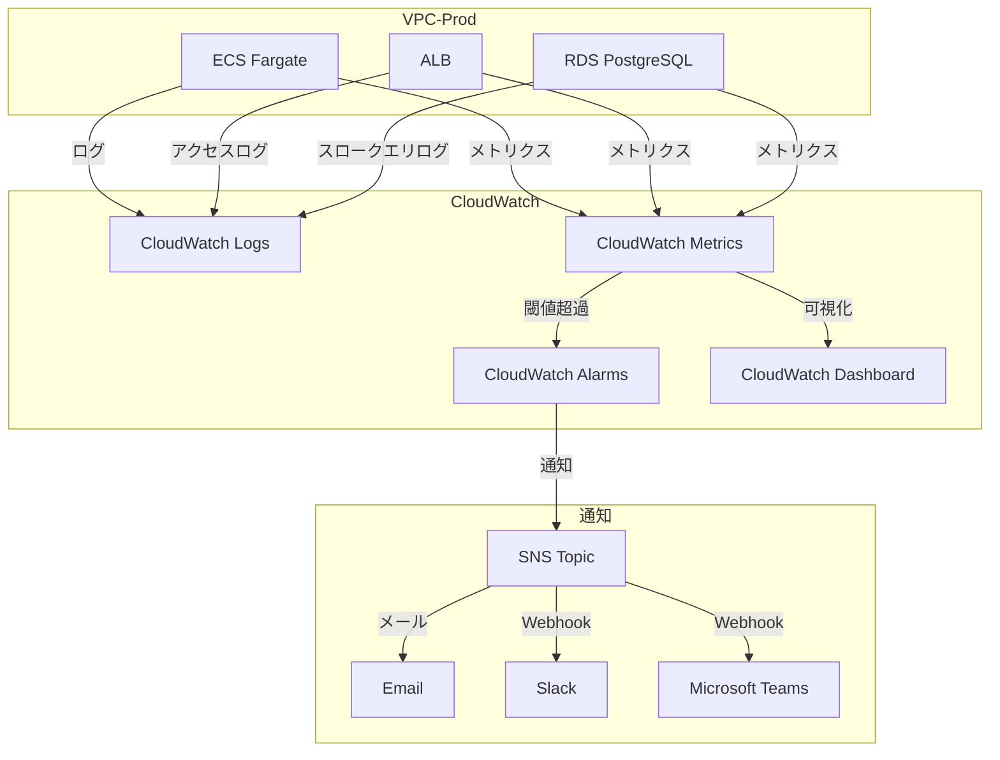
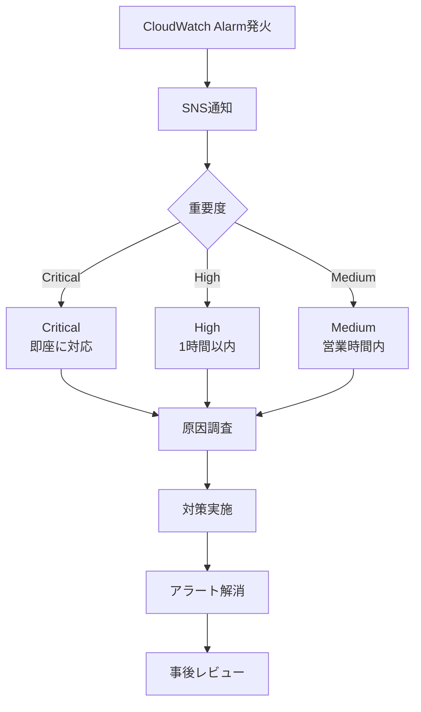

# 08_監視・アラート設計

**作成日**: 2025-10-25
**バージョン**: 1.0
**ステータス**: レビュー待ち

---

## 目次
1. [監視・アラート概要](#監視・アラート概要)
2. [CloudWatch Logs設計](#cloudwatch-logs設計)
3. [CloudWatch Metrics設計](#cloudwatch-metrics設計)
4. [CloudWatch Alarms設計](#cloudwatch-alarms設計)
5. [SNS通知設計](#sns通知設計)
6. [ダッシュボード設計](#ダッシュボード設計)
7. [運用手順](#運用手順)

---

## 監視・アラート概要

### システム構成図



### 監視対象一覧

| カテゴリ | 監視対象 | 監視項目 | アラート基準 |
|---------|---------|---------|------------|
| **ECS** | Fargate Task | CPU使用率、メモリ使用率、タスク数 | CPU 80%、メモリ 80% |
| **ALB** | Load Balancer | リクエスト数、レイテンシ、5xxエラー | 5xxエラー率 5%、レイテンシ 1秒 |
| **RDS** | PostgreSQL | CPU使用率、接続数、ディスク使用率 | CPU 80%、接続数 80%、ディスク 80% |
| **Network** | Transit Gateway | データ転送量、パケットドロップ | パケットドロップ率 1% |
| **Security** | GuardDuty | 脅威検出、異常検知 | 中以上の検出 |
| **Cost** | AWS Cost | 日次コスト | 予算の80%超過 |

---

## CloudWatch Logs設計

### ロググループ一覧

| ロググループ名 | 説明 | 保持期間 | 暗号化 |
|--------------|------|---------|--------|
| `/ecs/admin-api` | 業務APIコンテナログ | 30日（本番）、7日（Dev/Stg） | KMS |
| `/ecs/vendor-api` | 事業者APIコンテナログ | 30日（本番）、7日（Dev/Stg） | KMS |
| `/ecs/batch` | バッチ処理ログ | 90日 | KMS |
| `/aws/lambda/*` | Lambda関数ログ | 14日 | KMS |
| `/aws/rds/instance/facility-prod-db/slowquery` | RDSスロークエリログ | 30日 | KMS |
| `/aws/elasticloadbalancing/alb/internal-alb` | Internal ALBアクセスログ | 30日 | KMS |
| `/aws/elasticloadbalancing/alb/public-alb` | Public ALBアクセスログ | 30日 | KMS |
| `/aws/vpc/flowlogs` | VPCフローログ | 7日 | KMS |

### ロググループ定義（CloudFormation）

```yaml
AdminAPILogGroup:
  Type: AWS::Logs::LogGroup
  Properties:
    LogGroupName: /ecs/admin-api
    RetentionInDays: !If [IsProduction, 30, 7]
    KmsKeyId: !GetAtt LogsKMSKey.Arn

VendorAPILogGroup:
  Type: AWS::Logs::LogGroup
  Properties:
    LogGroupName: /ecs/vendor-api
    RetentionInDays: !If [IsProduction, 30, 7]
    KmsKeyId: !GetAtt LogsKMSKey.Arn

BatchLogGroup:
  Type: AWS::Logs::LogGroup
  Properties:
    LogGroupName: /ecs/batch
    RetentionInDays: 90
    KmsKeyId: !GetAtt LogsKMSKey.Arn
```

### ログフォーマット（構造化ログ）

**推奨フォーマット（JSON）**:
```json
{
  "timestamp": "2025-10-25T12:34:56.789Z",
  "level": "INFO",
  "service": "admin-api",
  "traceId": "abc123...",
  "userId": "staff-001",
  "method": "POST",
  "path": "/api/orders",
  "statusCode": 200,
  "duration": 123,
  "message": "Order created successfully"
}
```

**Node.js実装例（Winston）**:
```javascript
const winston = require('winston');

const logger = winston.createLogger({
  level: 'info',
  format: winston.format.combine(
    winston.format.timestamp(),
    winston.format.json()
  ),
  defaultMeta: { service: 'admin-api' },
  transports: [
    new winston.transports.Console()
  ]
});

// 使用例
logger.info('Order created', {
  userId: 'staff-001',
  orderId: 'order-123',
  duration: 123
});
```

### CloudWatch Logs Insights クエリ例

**5xxエラーの集計**:
```sql
fields @timestamp, level, message, statusCode
| filter statusCode >= 500
| stats count() as errorCount by statusCode
| sort errorCount desc
```

**レイテンシ分析**:
```sql
fields @timestamp, path, duration
| filter method = "POST"
| stats avg(duration), max(duration), pct(duration, 95) by path
```

---

## CloudWatch Metrics設計

### ECS Metrics

```yaml
ECSCPUUtilization:
  Type: AWS::CloudWatch::Alarm
  Properties:
    AlarmName: !Sub ${ProjectName}-${Environment}-ecs-cpu-high
    AlarmDescription: ECS CPU utilization is too high
    MetricName: CPUUtilization
    Namespace: AWS/ECS
    Statistic: Average
    Period: 300                         # 5分間
    EvaluationPeriods: 2                # 2回連続
    Threshold: 80                       # 80%
    ComparisonOperator: GreaterThanThreshold
    Dimensions:
      - Name: ClusterName
        Value: !Ref ECSCluster
      - Name: ServiceName
        Value: !GetAtt AdminAPIService.Name
    AlarmActions:
      - !Ref SNSTopic
    TreatMissingData: notBreaching

ECSMemoryUtilization:
  Type: AWS::CloudWatch::Alarm
  Properties:
    AlarmName: !Sub ${ProjectName}-${Environment}-ecs-memory-high
    AlarmDescription: ECS Memory utilization is too high
    MetricName: MemoryUtilization
    Namespace: AWS/ECS
    Statistic: Average
    Period: 300
    EvaluationPeriods: 2
    Threshold: 80
    ComparisonOperator: GreaterThanThreshold
    Dimensions:
      - Name: ClusterName
        Value: !Ref ECSCluster
      - Name: ServiceName
        Value: !GetAtt AdminAPIService.Name
    AlarmActions:
      - !Ref SNSTopic
    TreatMissingData: notBreaching
```

### ALB Metrics

```yaml
ALBTargetResponseTime:
  Type: AWS::CloudWatch::Alarm
  Properties:
    AlarmName: !Sub ${ProjectName}-${Environment}-alb-latency-high
    AlarmDescription: ALB response time is too high
    MetricName: TargetResponseTime
    Namespace: AWS/ApplicationELB
    Statistic: Average
    Period: 300
    EvaluationPeriods: 2
    Threshold: 1.0                      # 1秒
    ComparisonOperator: GreaterThanThreshold
    Dimensions:
      - Name: LoadBalancer
        Value: !GetAtt InternalALB.LoadBalancerFullName
    AlarmActions:
      - !Ref SNSTopic

ALB5XXErrorRate:
  Type: AWS::CloudWatch::Alarm
  Properties:
    AlarmName: !Sub ${ProjectName}-${Environment}-alb-5xx-error-rate
    AlarmDescription: ALB 5xx error rate is too high
    MetricName: HTTPCode_Target_5XX_Count
    Namespace: AWS/ApplicationELB
    Statistic: Sum
    Period: 300
    EvaluationPeriods: 1
    Threshold: 10                       # 5分間で10回以上
    ComparisonOperator: GreaterThanThreshold
    Dimensions:
      - Name: LoadBalancer
        Value: !GetAtt InternalALB.LoadBalancerFullName
    AlarmActions:
      - !Ref SNSTopic
```

### RDS Metrics

```yaml
RDSCPUUtilization:
  Type: AWS::CloudWatch::Alarm
  Properties:
    AlarmName: !Sub ${ProjectName}-${Environment}-rds-cpu-high
    AlarmDescription: RDS CPU utilization is too high
    MetricName: CPUUtilization
    Namespace: AWS/RDS
    Statistic: Average
    Period: 300
    EvaluationPeriods: 2
    Threshold: 80
    ComparisonOperator: GreaterThanThreshold
    Dimensions:
      - Name: DBInstanceIdentifier
        Value: !Ref RDSInstance
    AlarmActions:
      - !Ref SNSTopic

RDSDatabaseConnections:
  Type: AWS::CloudWatch::Alarm
  Properties:
    AlarmName: !Sub ${ProjectName}-${Environment}-rds-connections-high
    AlarmDescription: RDS database connections are too high
    MetricName: DatabaseConnections
    Namespace: AWS/RDS
    Statistic: Average
    Period: 300
    EvaluationPeriods: 2
    Threshold: 80                       # max_connections の80%
    ComparisonOperator: GreaterThanThreshold
    Dimensions:
      - Name: DBInstanceIdentifier
        Value: !Ref RDSInstance
    AlarmActions:
      - !Ref SNSTopic

RDSFreeStorageSpace:
  Type: AWS::CloudWatch::Alarm
  Properties:
    AlarmName: !Sub ${ProjectName}-${Environment}-rds-storage-low
    AlarmDescription: RDS free storage space is too low
    MetricName: FreeStorageSpace
    Namespace: AWS/RDS
    Statistic: Average
    Period: 300
    EvaluationPeriods: 1
    Threshold: 10737418240              # 10GB
    ComparisonOperator: LessThanThreshold
    Dimensions:
      - Name: DBInstanceIdentifier
        Value: !Ref RDSInstance
    AlarmActions:
      - !Ref SNSTopic
```

---

## CloudWatch Alarms設計

### アラート重要度レベル

| レベル | 説明 | 対応SLA | 通知先 |
|-------|------|---------|--------|
| **Critical** | サービス停止、データ損失リスク | 即座（15分以内） | Email + Slack + 電話 |
| **High** | 性能劣化、一部機能停止 | 1時間以内 | Email + Slack |
| **Medium** | 性能低下の兆候 | 営業時間内 | Email |
| **Low** | 情報提供 | - | ログのみ |

### アラーム一覧

#### Critical（重大）

| アラーム名 | 条件 | 閾値 | 説明 |
|----------|------|------|------|
| `rds-instance-down` | RDS DatabaseConnections = 0 | 5分間 | DB停止 |
| `ecs-service-running-count-zero` | ECS RunningTaskCount = 0 | 5分間 | API停止 |
| `alb-unhealthy-host-count` | UnHealthyHostCount > 0 | 5分間 | ヘルスチェック失敗 |

#### High（高）

| アラーム名 | 条件 | 閾値 | 説明 |
|----------|------|------|------|
| `rds-cpu-high` | RDS CPUUtilization > 80% | 2回連続 | DB高負荷 |
| `ecs-cpu-high` | ECS CPUUtilization > 80% | 2回連続 | API高負荷 |
| `alb-5xx-error-rate` | HTTPCode_Target_5XX_Count > 10 | 5分間 | サーバーエラー |
| `rds-storage-low` | FreeStorageSpace < 10GB | 1回 | ディスク不足 |

#### Medium（中）

| アラーム名 | 条件 | 閾値 | 説明 |
|----------|------|------|------|
| `alb-latency-high` | TargetResponseTime > 1.0s | 2回連続 | レスポンス遅延 |
| `rds-connections-high` | DatabaseConnections > 80 | 2回連続 | 接続数増加 |

### 複合アラーム（Composite Alarm）

```yaml
ServiceHealthCompositeAlarm:
  Type: AWS::CloudWatch::CompositeAlarm
  Properties:
    AlarmName: !Sub ${ProjectName}-${Environment}-service-health
    AlarmDescription: Overall service health check
    AlarmRule: !Sub |
      ALARM(${RDSCPUUtilization}) OR
      ALARM(${ECSCPUUtilization}) OR
      ALARM(${ALB5XXErrorRate})
    ActionsEnabled: true
    AlarmActions:
      - !Ref CriticalSNSTopic
```

---

## SNS通知設計

### SNS Topic構成

```yaml
CriticalSNSTopic:
  Type: AWS::SNS::Topic
  Properties:
    DisplayName: Critical Alerts
    TopicName: !Sub ${ProjectName}-${Environment}-critical-alerts
    KmsMasterKeyId: !Ref SNSKMSKey

HighSNSTopic:
  Type: AWS::SNS::Topic
  Properties:
    DisplayName: High Priority Alerts
    TopicName: !Sub ${ProjectName}-${Environment}-high-alerts
    KmsMasterKeyId: !Ref SNSKMSKey

MediumSNSTopic:
  Type: AWS::SNS::Topic
  Properties:
    DisplayName: Medium Priority Alerts
    TopicName: !Sub ${ProjectName}-${Environment}-medium-alerts
    KmsMasterKeyId: !Ref SNSKMSKey
```

### Email購読

```yaml
CriticalEmailSubscription:
  Type: AWS::SNS::Subscription
  Properties:
    Protocol: email
    TopicArn: !Ref CriticalSNSTopic
    Endpoint: ops-critical@example.com

HighEmailSubscription:
  Type: AWS::SNS::Subscription
  Properties:
    Protocol: email
    TopicArn: !Ref HighSNSTopic
    Endpoint: ops-team@example.com
```

### Slack通知（Lambda経由）

```yaml
SlackNotificationFunction:
  Type: AWS::Lambda::Function
  Properties:
    FunctionName: !Sub ${ProjectName}-${Environment}-slack-notification
    Runtime: python3.11
    Handler: index.lambda_handler
    Role: !GetAtt LambdaExecutionRole.Arn
    Environment:
      Variables:
        SLACK_WEBHOOK_URL: !Ref SlackWebhookURL
    Code:
      ZipFile: |
        import json
        import urllib.request
        import os

        def lambda_handler(event, context):
            message = json.loads(event['Records'][0]['Sns']['Message'])
            alarm_name = message['AlarmName']
            new_state = message['NewStateValue']
            reason = message['NewStateReason']

            slack_message = {
                'text': f'🚨 CloudWatch Alarm: {alarm_name}',
                'attachments': [
                    {
                        'color': 'danger' if new_state == 'ALARM' else 'good',
                        'fields': [
                            {'title': 'State', 'value': new_state, 'short': True},
                            {'title': 'Reason', 'value': reason, 'short': False}
                        ]
                    }
                ]
            }

            req = urllib.request.Request(
                os.environ['SLACK_WEBHOOK_URL'],
                data=json.dumps(slack_message).encode('utf-8'),
                headers={'Content-Type': 'application/json'}
            )
            urllib.request.urlopen(req)
            return {'statusCode': 200}

SlackSubscription:
  Type: AWS::SNS::Subscription
  Properties:
    Protocol: lambda
    TopicArn: !Ref CriticalSNSTopic
    Endpoint: !GetAtt SlackNotificationFunction.Arn
```

---

## ダッシュボード設計

### CloudWatch Dashboard

```yaml
MainDashboard:
  Type: AWS::CloudWatch::Dashboard
  Properties:
    DashboardName: !Sub ${ProjectName}-${Environment}-main
    DashboardBody: !Sub |
      {
        "widgets": [
          {
            "type": "metric",
            "properties": {
              "metrics": [
                ["AWS/ECS", "CPUUtilization", {"stat": "Average"}],
                [".", "MemoryUtilization", {"stat": "Average"}]
              ],
              "period": 300,
              "stat": "Average",
              "region": "${AWS::Region}",
              "title": "ECS CPU & Memory"
            }
          },
          {
            "type": "metric",
            "properties": {
              "metrics": [
                ["AWS/ApplicationELB", "TargetResponseTime", {"stat": "Average"}],
                [".", "RequestCount", {"stat": "Sum"}]
              ],
              "period": 300,
              "stat": "Average",
              "region": "${AWS::Region}",
              "title": "ALB Performance"
            }
          },
          {
            "type": "metric",
            "properties": {
              "metrics": [
                ["AWS/RDS", "CPUUtilization", {"stat": "Average"}],
                [".", "DatabaseConnections", {"stat": "Average"}]
              ],
              "period": 300,
              "stat": "Average",
              "region": "${AWS::Region}",
              "title": "RDS Performance"
            }
          }
        ]
      }
```

### ダッシュボード構成

**メインダッシュボード**:
1. ECS: CPU使用率、メモリ使用率、タスク数
2. ALB: リクエスト数、レイテンシ、5xxエラー率
3. RDS: CPU使用率、接続数、ディスク使用率
4. Network: データ転送量、パケットドロップ率

**セキュリティダッシュボード**:
1. GuardDuty: 脅威検出件数
2. WAF: ブロックされたリクエスト数
3. CloudTrail: 異常なAPI呼び出し

---

## 運用手順

### アラート対応フロー



### 障害対応手順書

**ECS CPU高負荷時**:
1. CloudWatch Logsで直近のエラーログを確認
2. Auto Scalingが正常に動作しているか確認
3. 必要に応じて手動でタスク数を増やす
4. 原因特定後、コード修正またはリソース増強

**RDS接続数増加時**:
1. CloudWatch Logsでスロークエリログを確認
2. 長時間実行されているクエリをKILL
3. コネクションプールの設定を確認
4. インデックス追加を検討

**ALB 5xxエラー時**:
1. ECS Task Definitionのヘルスチェックパスを確認
2. アプリケーションログで例外を確認
3. 必要に応じてロールバック
4. 根本原因の修正

---

## 次のステップ

- [09_CI_CD設計.md](09_CI_CD設計.md): GitHub Actions、デプロイパイプライン
- [10_CloudFormation構成方針.md](10_CloudFormation構成方針.md): ファイル分割3原則

---

**作成者**: Architect（Claude）
**レビュー状態**: レビュー待ち
