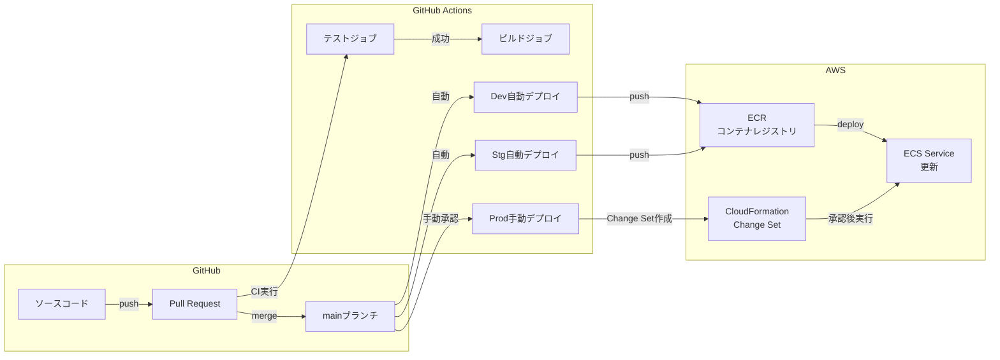
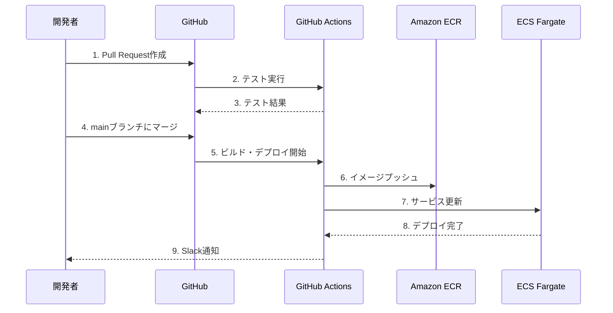
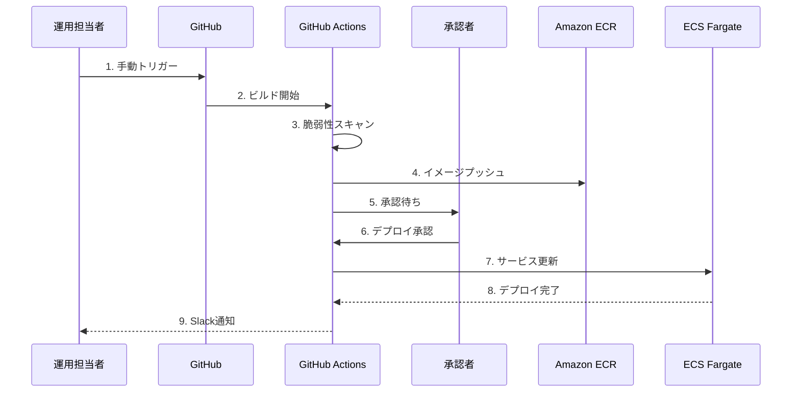

# 09_CI_CD設計

**作成日**: 2025-10-25
**バージョン**: 1.0
**ステータス**: レビュー待ち

---

## 目次
1. [CI/CD概要](#cicd概要)
2. [GitHub Actions設計](#github-actions設計)
3. [デプロイパイプライン](#デプロイパイプライン)
4. [環境別デプロイフロー](#環境別デプロイフロー)
5. [ロールバック戦略](#ロールバック戦略)
6. [セキュリティ](#セキュリティ)

---

## CI/CD概要

### システム構成図



### CI/CDツール選定

| カテゴリ | ツール | 理由 |
|---------|--------|------|
| **CI/CD** | GitHub Actions | GitHubとの統合、無料枠、OIDC対応 |
| **IaC** | CloudFormation | AWSネイティブ、Change Sets、ドリフト検出 |
| **コンテナレジストリ** | Amazon ECR | プライベートレジストリ、イメージスキャン |
| **シークレット管理** | GitHub Secrets | GitHub Actions統合 |

---

## GitHub Actions設計

### ワークフロー一覧

| ワークフロー名 | トリガー | 実行内容 | 環境 |
|--------------|---------|---------|------|
| `test.yml` | Pull Request | Lint、テスト | - |
| `build-and-deploy-dev.yml` | main ブランチ push | ビルド、Dev自動デプロイ | Dev |
| `build-and-deploy-stg.yml` | main ブランチ push | ビルド、Stg自動デプロイ | Stg |
| `build-and-deploy-prod.yml` | 手動トリガー | ビルド、Prod手動デプロイ | Prod |
| `cloudformation-deploy.yml` | CloudFormation変更 | インフラデプロイ | Dev/Stg/Prod |

### ディレクトリ構成

```
.github/
├── workflows/
│   ├── test.yml                        # Pull Request時のテスト
│   ├── build-and-deploy-dev.yml        # Dev自動デプロイ
│   ├── build-and-deploy-stg.yml        # Stg自動デプロイ
│   ├── build-and-deploy-prod.yml       # Prod手動デプロイ
│   └── cloudformation-deploy.yml       # CloudFormation デプロイ
└── actions/
    ├── build-docker-image/             # カスタムアクション: Docker ビルド
    └── deploy-ecs/                     # カスタムアクション: ECS デプロイ
```

---

## デプロイパイプライン

### Pull Request時（test.yml）

```yaml
name: Test

on:
  pull_request:
    paths:
      - 'src/**'
      - 'tests/**'
      - 'package.json'
      - 'Dockerfile'

jobs:
  lint:
    runs-on: ubuntu-latest
    steps:
      - uses: actions/checkout@v3

      - name: Setup Node.js
        uses: actions/setup-node@v3
        with:
          node-version: 18

      - name: Install dependencies
        run: npm ci

      - name: Lint
        run: npm run lint

  test:
    runs-on: ubuntu-latest
    needs: lint
    steps:
      - uses: actions/checkout@v3

      - name: Setup Node.js
        uses: actions/setup-node@v3
        with:
          node-version: 18

      - name: Install dependencies
        run: npm ci

      - name: Run tests
        run: npm test

      - name: Upload coverage
        uses: codecov/codecov-action@v3
        with:
          files: ./coverage/lcov.info

  security-scan:
    runs-on: ubuntu-latest
    steps:
      - uses: actions/checkout@v3

      - name: Run Trivy vulnerability scanner
        uses: aquasecurity/trivy-action@master
        with:
          scan-type: 'fs'
          scan-ref: '.'
          format: 'sarif'
          output: 'trivy-results.sarif'

      - name: Upload Trivy results to GitHub Security
        uses: github/codeql-action/upload-sarif@v2
        with:
          sarif_file: 'trivy-results.sarif'
```

### Dev自動デプロイ（build-and-deploy-dev.yml）

```yaml
name: Build and Deploy to Dev

on:
  push:
    branches:
      - main
    paths:
      - 'src/**'
      - 'Dockerfile'

jobs:
  build-and-deploy:
    runs-on: ubuntu-latest
    permissions:
      id-token: write           # OIDC認証用
      contents: read
    steps:
      - uses: actions/checkout@v3

      - name: Configure AWS credentials (OIDC)
        uses: aws-actions/configure-aws-credentials@v4
        with:
          role-to-assume: arn:aws:iam::123456789012:role/GitHubActionsRole
          aws-region: ap-northeast-1

      - name: Login to Amazon ECR
        id: login-ecr
        uses: aws-actions/amazon-ecr-login@v2

      - name: Build Docker image
        run: |
          docker build -t admin-api:${{ github.sha }} .
          docker tag admin-api:${{ github.sha }} ${{ steps.login-ecr.outputs.registry }}/admin-api:dev
          docker tag admin-api:${{ github.sha }} ${{ steps.login-ecr.outputs.registry }}/admin-api:dev-${{ github.sha }}

      - name: Scan Docker image
        uses: aquasecurity/trivy-action@master
        with:
          image-ref: admin-api:${{ github.sha }}
          format: 'sarif'
          output: 'trivy-results.sarif'

      - name: Push to ECR
        run: |
          docker push ${{ steps.login-ecr.outputs.registry }}/admin-api:dev
          docker push ${{ steps.login-ecr.outputs.registry }}/admin-api:dev-${{ github.sha }}

      - name: Update ECS service
        run: |
          aws ecs update-service \
            --cluster facility-dev-cluster \
            --service admin-api \
            --force-new-deployment \
            --region ap-northeast-1

      - name: Wait for deployment
        run: |
          aws ecs wait services-stable \
            --cluster facility-dev-cluster \
            --services admin-api \
            --region ap-northeast-1

      - name: Notify Slack
        if: always()
        uses: slackapi/slack-github-action@v1
        with:
          webhook-url: ${{ secrets.SLACK_WEBHOOK_URL }}
          payload: |
            {
              "text": "Dev Deployment ${{ job.status }}",
              "blocks": [
                {
                  "type": "section",
                  "text": {
                    "type": "mrkdwn",
                    "text": "Dev環境へのデプロイ: *${{ job.status }}*\nCommit: ${{ github.sha }}"
                  }
                }
              ]
            }
```

### Prod手動デプロイ（build-and-deploy-prod.yml）

```yaml
name: Build and Deploy to Production

on:
  workflow_dispatch:            # 手動トリガーのみ
    inputs:
      service:
        description: 'Service to deploy'
        required: true
        type: choice
        options:
          - admin-api
          - vendor-api
          - batch

jobs:
  build-and-deploy:
    runs-on: ubuntu-latest
    environment:
      name: production          # GitHub環境保護ルール適用
    permissions:
      id-token: write
      contents: read
    steps:
      - uses: actions/checkout@v3

      - name: Configure AWS credentials (OIDC)
        uses: aws-actions/configure-aws-credentials@v4
        with:
          role-to-assume: arn:aws:iam::123456789012:role/GitHubActionsRoleProd
          aws-region: ap-northeast-1

      - name: Login to Amazon ECR
        id: login-ecr
        uses: aws-actions/amazon-ecr-login@v2

      - name: Build Docker image
        run: |
          docker build -t ${{ github.event.inputs.service }}:${{ github.sha }} .
          docker tag ${{ github.event.inputs.service }}:${{ github.sha }} \
            ${{ steps.login-ecr.outputs.registry }}/${{ github.event.inputs.service }}:prod
          docker tag ${{ github.event.inputs.service }}:${{ github.sha }} \
            ${{ steps.login-ecr.outputs.registry }}/${{ github.event.inputs.service }}:prod-${{ github.sha }}

      - name: Scan Docker image
        uses: aquasecurity/trivy-action@master
        with:
          image-ref: ${{ github.event.inputs.service }}:${{ github.sha }}
          format: 'table'
          exit-code: '1'          # 脆弱性があれば失敗
          severity: 'CRITICAL,HIGH'

      - name: Push to ECR
        run: |
          docker push ${{ steps.login-ecr.outputs.registry }}/${{ github.event.inputs.service }}:prod
          docker push ${{ steps.login-ecr.outputs.registry }}/${{ github.event.inputs.service }}:prod-${{ github.sha }}

      - name: Create ECS Task Definition
        id: task-def
        run: |
          TASK_DEF=$(aws ecs describe-task-definition \
            --task-definition facility-prod-${{ github.event.inputs.service }} \
            --query 'taskDefinition' \
            --region ap-northeast-1)

          NEW_TASK_DEF=$(echo $TASK_DEF | jq --arg IMAGE "${{ steps.login-ecr.outputs.registry }}/${{ github.event.inputs.service }}:prod" \
            '.containerDefinitions[0].image = $IMAGE | del(.taskDefinitionArn, .revision, .status, .requiresAttributes, .compatibilities, .registeredAt, .registeredBy)')

          echo $NEW_TASK_DEF > task-definition.json

      - name: Register new Task Definition
        id: register-task-def
        run: |
          NEW_TASK_ARN=$(aws ecs register-task-definition \
            --cli-input-json file://task-definition.json \
            --query 'taskDefinition.taskDefinitionArn' \
            --output text \
            --region ap-northeast-1)
          echo "task_arn=$NEW_TASK_ARN" >> $GITHUB_OUTPUT

      - name: Update ECS service
        run: |
          aws ecs update-service \
            --cluster facility-prod-cluster \
            --service ${{ github.event.inputs.service }} \
            --task-definition ${{ steps.register-task-def.outputs.task_arn }} \
            --region ap-northeast-1

      - name: Wait for deployment
        run: |
          aws ecs wait services-stable \
            --cluster facility-prod-cluster \
            --services ${{ github.event.inputs.service }} \
            --region ap-northeast-1

      - name: Notify Slack
        if: always()
        uses: slackapi/slack-github-action@v1
        with:
          webhook-url: ${{ secrets.SLACK_WEBHOOK_URL }}
          payload: |
            {
              "text": "Production Deployment ${{ job.status }}",
              "blocks": [
                {
                  "type": "section",
                  "text": {
                    "type": "mrkdwn",
                    "text": "本番環境へのデプロイ: *${{ job.status }}*\nService: ${{ github.event.inputs.service }}\nCommit: ${{ github.sha }}"
                  }
                }
              ]
            }
```

### CloudFormation デプロイ（cloudformation-deploy.yml）

```yaml
name: CloudFormation Deploy

on:
  push:
    branches:
      - main
    paths:
      - 'infra/cloudformation/**'
  workflow_dispatch:
    inputs:
      environment:
        description: 'Environment to deploy'
        required: true
        type: choice
        options:
          - dev
          - stg
          - prod
      stack-type:
        description: 'Stack type to deploy'
        required: true
        type: choice
        options:
          - network
          - database
          - compute
          - monitoring

jobs:
  deploy:
    runs-on: ubuntu-latest
    permissions:
      id-token: write
      contents: read
    steps:
      - uses: actions/checkout@v3

      - name: Configure AWS credentials
        uses: aws-actions/configure-aws-credentials@v4
        with:
          role-to-assume: arn:aws:iam::123456789012:role/GitHubActionsRole
          aws-region: ap-northeast-1

      - name: Validate CloudFormation template
        run: |
          cd infra/cloudformation
          ./scripts/validate.sh

      - name: Create Change Set
        run: |
          cd infra/cloudformation
          ./scripts/create-changeset.sh ${{ github.event.inputs.environment }} ${{ github.event.inputs.stack-type }}

      - name: Describe Change Set (dry-run)
        run: |
          cd infra/cloudformation
          ./scripts/describe-changeset.sh ${{ github.event.inputs.environment }} ${{ github.event.inputs.stack-type }}

      # 本番環境のみ手動承認
      - name: Wait for approval (Production only)
        if: github.event.inputs.environment == 'prod'
        uses: trstringer/manual-approval@v1
        with:
          secret: ${{ github.token }}
          approvers: ops-team
          minimum-approvals: 2

      - name: Execute Change Set
        run: |
          cd infra/cloudformation
          ./scripts/execute-changeset.sh ${{ github.event.inputs.environment }} ${{ github.event.inputs.stack-type }}

      - name: Save Change Set log to S3
        run: |
          cd infra/cloudformation
          ./scripts/save-changeset-log.sh ${{ github.event.inputs.environment }} ${{ github.event.inputs.stack-type }}
```

---

## 環境別デプロイフロー

### Dev環境（自動デプロイ）



**特徴**:
- mainブランチへのマージで自動デプロイ
- 承認不要（開発検証環境）
- デプロイ時間: 約5分

### Stg環境（自動デプロイ）

**特徴**:
- mainブランチへのマージで自動デプロイ
- Dev環境デプロイ成功後に実行
- 本番前の最終検証環境
- デプロイ時間: 約5分

### Prod環境（手動デプロイ + 承認）



**特徴**:
- 手動トリガーのみ（workflow_dispatch）
- GitHub環境保護ルール適用
- 2名以上の承認必須
- 脆弱性スキャン（CRITICAL/HIGH は失敗）
- デプロイ時間: 約10分（承認除く）

---

## ロールバック戦略

### ECS サービスロールバック

#### 方法1: 以前のTask Definitionに戻す

```bash
# 1. 以前のTask Definition リビジョンを確認
aws ecs list-task-definitions \
  --family-prefix facility-prod-admin-api \
  --sort DESC \
  --max-items 5

# 2. 以前のリビジョンに戻す
aws ecs update-service \
  --cluster facility-prod-cluster \
  --service admin-api \
  --task-definition facility-prod-admin-api:5  # 1つ前のリビジョン
```

#### 方法2: GitHub Actionsで以前のコミットを再デプロイ

```yaml
name: Rollback Production

on:
  workflow_dispatch:
    inputs:
      service:
        description: 'Service to rollback'
        required: true
        type: choice
        options:
          - admin-api
          - vendor-api
      commit-sha:
        description: 'Commit SHA to rollback to'
        required: true
        type: string

jobs:
  rollback:
    runs-on: ubuntu-latest
    environment:
      name: production
    steps:
      - uses: actions/checkout@v3
        with:
          ref: ${{ github.event.inputs.commit-sha }}

      - name: Configure AWS credentials
        uses: aws-actions/configure-aws-credentials@v4
        with:
          role-to-assume: arn:aws:iam::123456789012:role/GitHubActionsRoleProd
          aws-region: ap-northeast-1

      - name: Login to Amazon ECR
        id: login-ecr
        uses: aws-actions/amazon-ecr-login@v2

      - name: Pull existing image
        run: |
          docker pull ${{ steps.login-ecr.outputs.registry }}/${{ github.event.inputs.service }}:prod-${{ github.event.inputs.commit-sha }}
          docker tag ${{ steps.login-ecr.outputs.registry }}/${{ github.event.inputs.service }}:prod-${{ github.event.inputs.commit-sha }} \
            ${{ steps.login-ecr.outputs.registry }}/${{ github.event.inputs.service }}:prod

      - name: Push as latest
        run: |
          docker push ${{ steps.login-ecr.outputs.registry }}/${{ github.event.inputs.service }}:prod

      - name: Update ECS service
        run: |
          aws ecs update-service \
            --cluster facility-prod-cluster \
            --service ${{ github.event.inputs.service }} \
            --force-new-deployment
```

### CloudFormation ロールバック

```bash
# スタック全体をロールバック
cd infra/cloudformation
./scripts/rollback.sh prod compute
```

---

## セキュリティ

### OIDC認証（IAMユーザー不要）

**IAM Role設定**:
```yaml
GitHubActionsRole:
  Type: AWS::IAM::Role
  Properties:
    RoleName: GitHubActionsRole
    AssumeRolePolicyDocument:
      Statement:
        - Effect: Allow
          Principal:
            Federated: !Sub arn:aws:iam::${AWS::AccountId}:oidc-provider/token.actions.githubusercontent.com
          Action: sts:AssumeRoleWithWebIdentity
          Condition:
            StringEquals:
              token.actions.githubusercontent.com:aud: sts.amazonaws.com
            StringLike:
              token.actions.githubusercontent.com:sub: repo:your-org/your-repo:*
    ManagedPolicyArns:
      - arn:aws:iam::aws:policy/AmazonEC2ContainerRegistryPowerUser
      - arn:aws:iam::aws:policy/AmazonECS_FullAccess
    Policies:
      - PolicyName: CloudFormationAccess
        PolicyDocument:
          Statement:
            - Effect: Allow
              Action:
                - cloudformation:*
              Resource: "*"
```

**メリット**:
- AWS Access Key不要（漏洩リスクゼロ）
- 一時的な認証情報のみ使用
- GitHubリポジトリとの紐付けで制限

### シークレット管理

**GitHub Secrets**:
```
SLACK_WEBHOOK_URL               # Slack通知用Webhook URL
AWS_ACCOUNT_ID                  # AWSアカウントID
CLOUDFRONT_DISTRIBUTION_ID      # CloudFront Distribution ID
```

**重要**: AWS Access KeyはGitHub Secretsに保存しない（OIDC使用）

### コンテナイメージスキャン

**Trivy による脆弱性スキャン**:
- Pull Request時: レポート生成のみ
- Prod デプロイ時: CRITICAL/HIGHがあれば失敗

---

## 次のステップ

- [10_CloudFormation構成方針.md](10_CloudFormation構成方針.md): ファイル分割3原則、ディレクトリ構造
- [11_非機能要件実現方針.md](11_非機能要件実現方針.md): 性能、可用性

---

**作成者**: Architect（Claude）
**レビュー状態**: レビュー待ち
