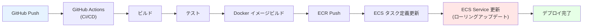
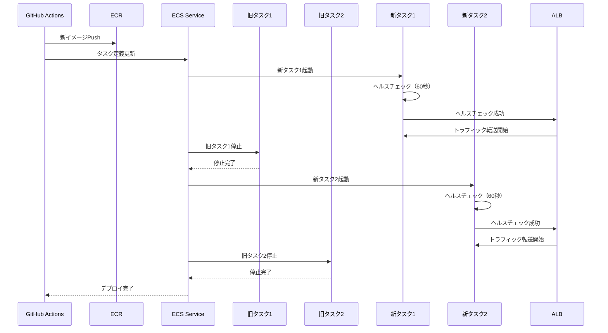

# 09. デプロイ設計

**作成日**: 2025-10-25
**バージョン**: 1.1
**ステータス**: PM レビュー待ち

**更新履歴**:
- v1.1 (2025-10-25): 設定値を削除、設計理由と設計アプローチのみに簡潔化
- v1.0 (2025-10-25): 初版作成

---

## 9.1 デプロイ設計概要

### デプロイ方式（ADR-004参照）

**採用方式**: ECS ローリングアップデート（シンプル方式）

**採用理由**:
- デプロイ頻度が週1回と低い
- メンテナンス時間中（日曜日または平日夜間）のデプロイのため、数分のダウンタイムは許容可能
- 運用がシンプル（Blue/Green デプロイは不要）
- ロールバックが容易（前のタスク定義に戻すだけ）

**トレードオフ**:
- ✅ シンプルな運用
- ✅ コスト削減（追加インフラ不要）
- ❌ 数分のダウンタイム（メンテナンス時間中のため許容）

---

## 9.2 CI/CD パイプライン設計

### GitHub Actions によるCI/CD

**設計方針**:
- **Pull Request時**: ビルド、テスト、リント、脆弱性スキャン（Trivy）
- **dev環境**: main ブランチへのpush時に自動デプロイ
- **stg/prod環境**: 手動トリガー、承認必須（GitHub Environments）

**CI/CDフロー**:


**ワークフローファイル構成**:
```
.github/workflows/
├── ci-build.yml          # Pull Request時のCI（ビルド、テスト）
├── deploy-dev.yml        # dev環境へのデプロイ（main ブランチへのpush時）
├── deploy-stg.yml        # stg環境へのデプロイ（手動トリガー）
└── deploy-prod.yml       # prod環境へのデプロイ（手動トリガー、承認必須）
```

**具体的なワークフローYAML、GitHub Secrets、承認者設定等は、`05_実装準備/パラメーターシート.xlsx` を参照してください。**

---

## 9.3 GitHub Actions ワークフロー設計

### 設計アプローチ

**Pull Request時のCI（ci-build.yml）**:
- Node.js 18 セットアップ
- 依存関係インストール（`npm ci`）
- テスト実行（`npm test`）
- リント実行（`npm run lint`）
- Docker イメージビルド
- Trivy 脆弱性スキャン（Critical、High）

**dev環境へのデプロイ（deploy-dev.yml）**:
- AWS クレデンシャル設定
- ECR ログイン
- Docker イメージビルド、タグ付け、ECR プッシュ
- ECS タスク定義更新
- ECS Service 更新（ローリングアップデート）
- Slack 通知

**prod環境へのデプロイ（deploy-prod.yml）**:
- GitHub Environments による承認フロー（production環境）
- デプロイ前にRDSスナップショット作成（自動）
- ECR ログイン
- ECS タスク定義更新
- ECS Service 更新（ローリングアップデート）
- Slack、Teams 通知

**具体的なワークフローYAML、AWS Secrets、Slack/Teams Webhook URL等は、パラメーターシートを参照してください。**

---

## 9.4 デプロイ戦略

### ローリングアップデートのフロー

**設計アプローチ**:
- 最小ヘルス率: 100%（デプロイ中もすべてのタスクが稼働）
- 最大率: 200%（新旧タスクが同時稼働）
- ヘルスチェック猶予期間: 60秒（アプリケーション起動時間を考慮）

**ローリングアップデートのフロー**:


**ダウンタイム**:
- 最小ヘルス率100%により、新タスクが起動してから旧タスクを停止
- メンテナンス時間中のデプロイのため、数分のダウンタイムは許容

**具体的なデプロイメント設定値（最小ヘルス率、最大率、ヘルスチェック猶予期間）は、パラメーターシートを参照してください。**

---

## 9.5 ロールバック設計

### ロールバック設計方針

**ロールバック手順**:
1. 前のタスク定義リビジョンに戻す（`aws ecs update-service`）
2. サービスの安定化を待つ（`aws ecs wait services-stable`）

**ロールバック目標時間**:
- dev環境: 3分以内
- stg環境: 5分以内
- prod環境: 5分以内

**具体的なロールバックコマンド、スクリプト等は、パラメーターシートを参照してください。**

---

## 9.6 デプロイスケジュール

### デプロイ頻度と時間帯

| 環境 | デプロイ頻度 | デプロイ時間帯 |
|------|-----------|--------------|
| **dev** | 随時（main ブランチへのpush時） | 営業時間中 |
| **stg** | 週1回（手動トリガー） | 金曜日 17:00-18:00 |
| **prod** | 週1回（手動トリガー、承認必須） | 日曜日 02:00-03:00 または 平日夜間 22:00-23:00 |

**メンテナンスウィンドウ**:
- 日曜日 02:00-03:00（JST）: システム停止日
- 平日夜間 22:00-23:00（JST）: 緊急デプロイ時

---

## 9.7 デプロイ前のチェックリスト

### 設計アプローチ

**dev環境デプロイ前**:
- [ ] Pull Request がマージされている
- [ ] CI（ビルド、テスト、リント）が成功している
- [ ] Trivy スキャンで Critical、High の脆弱性がない

**stg環境デプロイ前**:
- [ ] dev環境で動作確認済み
- [ ] デプロイするイメージタグを確認
- [ ] stg環境のRDSスナップショット作成済み

**prod環境デプロイ前**:
- [ ] stg環境で動作確認済み
- [ ] デプロイするイメージタグを確認
- [ ] prod環境のRDSスナップショット作成済み（自動実行）
- [ ] デプロイ承認者の承認を取得
- [ ] ロールバック手順を確認
- [ ] メンテナンス時間帯であることを確認

---

## 9.8 CloudFormation デプロイ設計

### Change Sets によるデプロイ（安全性確保）

**設計方針**:
- CloudFormation の Change Sets を使用して、変更内容を事前確認（dry-run）
- 承認後に Change Set を実行
- ロールバック可能（前のスタックに戻す）

**デプロイフロー**:
```bash
# 1. Change Set作成
./scripts/create-changeset.sh prod network

# 2. Change Set詳細表示（dry-run）
./scripts/describe-changeset.sh prod network

# 3. 承認後、Change Set実行
./scripts/execute-changeset.sh prod network
```

**詳細は `13_CloudFormation構成方針.md` を参照してください。**

---

## 9.9 デプロイ通知設計

### 通知設計方針

**通知先**:
- Slack (#facilities-alerts): デプロイ成功、失敗
- Microsoft Teams (Facilities Alerts): デプロイ成功、失敗
- メール（infra-team@example.go.jp）: デプロイ失敗のみ

**通知内容の設計**:
- 環境名、イメージタグ、デプロイ時刻、実行者を含める
- 失敗時はエラーメッセージとロールバック手順を含める

**具体的な通知先Webhook URL、メールアドレス、通知内容テンプレート等は、パラメーターシートを参照してください。**

---

## 9.10 ヒアリング結果と仮決定

### 仮決定事項

以下の項目は、本来ユーザーに確認すべきですが、合理的な仮決定をしました：

| 項目 | 仮決定内容 | 理由 | ユーザー確認推奨度 |
|------|----------|------|------------------|
| デプロイ方式 | ローリングアップデート | シンプル、メンテナンス時間中のデプロイ | 低 |
| デプロイ頻度（prod） | 週1回 | 要件定義書の記載に基づく | 低 |
| デプロイ時間帯（prod） | 日曜日 02:00-03:00 | システム停止日、業務時間外 | 低 |
| ロールバック目標時間 | 5分以内 | 迅速な復旧 | 低 |
| prod環境デプロイ | 手動トリガー、承認必須 | 本番環境の慎重な運用 | 低 |
| デプロイ通知先 | Slack、Teams、メール | 多様な通知手段 | 中 |

---

**作成者**: architect サブエージェント
**最終更新**: 2025-10-25
