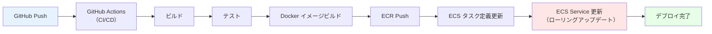
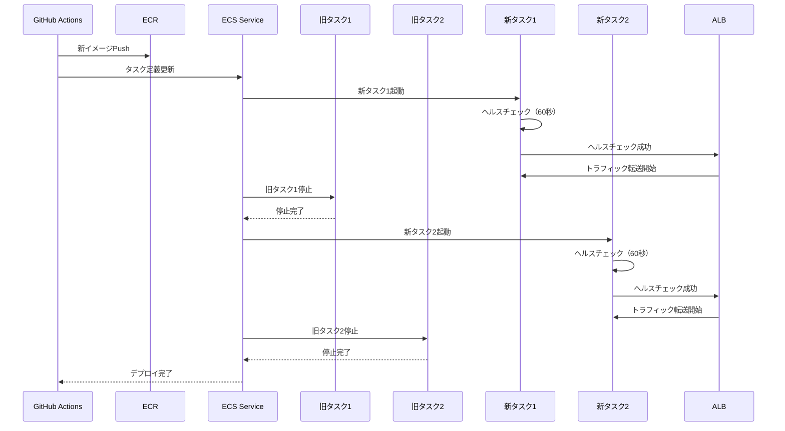

# 09. デプロイ設計

**作成日**: 2025-10-25
**バージョン**: 1.0
**ステータス**: PM レビュー待ち

---

## 9.1 デプロイ設計概要

### デプロイ方式（ADR-004参照）

- **採用方式**: ECS ローリングアップデート（シンプル方式）
- **理由**:
  - デプロイ頻度が週1回と低い
  - メンテナンス時間中（日曜日または平日夜間）のデプロイのため、数分のダウンタイムは許容可能
  - 運用がシンプル（Blue/Green デプロイは不要）
  - ロールバックが容易（前のタスク定義に戻すだけ）

---

## 9.2 CI/CD パイプライン設計

### GitHub Actions によるCI/CD



### ワークフローファイル構成

```
.github/workflows/
├── ci-build.yml          # Pull Request時のCI（ビルド、テスト）
├── deploy-dev.yml        # dev環境へのデプロイ（main ブランチへのpush時）
├── deploy-stg.yml        # stg環境へのデプロイ（手動トリガー）
└── deploy-prod.yml       # prod環境へのデプロイ（手動トリガー、承認必須）
```

---

## 9.3 GitHub Actions ワークフロー設計

### Pull Request時のCI（ci-build.yml）

```yaml
name: CI Build and Test

on:
  pull_request:
    branches:
      - main
    paths:
      - 'src/**'
      - 'package.json'
      - 'Dockerfile'

jobs:
  build-and-test:
    runs-on: ubuntu-latest
    steps:
      - uses: actions/checkout@v3

      - name: Set up Node.js
        uses: actions/setup-node@v3
        with:
          node-version: '18'
          cache: 'npm'

      - name: Install dependencies
        run: npm ci

      - name: Run tests
        run: npm test

      - name: Run lint
        run: npm run lint

      - name: Build Docker image
        run: docker build -t facilities-staff-api:test .

      - name: Run Trivy vulnerability scanner
        uses: aquasecurity/trivy-action@master
        with:
          image-ref: facilities-staff-api:test
          format: 'sarif'
          output: 'trivy-results.sarif'
          severity: 'CRITICAL,HIGH'

      - name: Upload Trivy results to GitHub Security
        uses: github/codeql-action/upload-sarif@v2
        with:
          sarif_file: 'trivy-results.sarif'
```

### dev環境へのデプロイ（deploy-dev.yml）

```yaml
name: Deploy to Dev

on:
  push:
    branches:
      - main
    paths:
      - 'src/**'
      - 'package.json'
      - 'Dockerfile'

jobs:
  deploy-dev:
    runs-on: ubuntu-latest
    steps:
      - uses: actions/checkout@v3

      - name: Configure AWS credentials
        uses: aws-actions/configure-aws-credentials@v2
        with:
          aws-access-key-id: ${{ secrets.AWS_ACCESS_KEY_ID }}
          aws-secret-access-key: ${{ secrets.AWS_SECRET_ACCESS_KEY }}
          aws-region: ap-northeast-1

      - name: Login to Amazon ECR
        id: login-ecr
        uses: aws-actions/amazon-ecr-login@v1

      - name: Build, tag, and push image to Amazon ECR
        id: build-image
        env:
          ECR_REGISTRY: ${{ steps.login-ecr.outputs.registry }}
          ECR_REPOSITORY: facilities-staff-api
          IMAGE_TAG: ${{ github.sha }}
        run: |
          docker build -t $ECR_REGISTRY/$ECR_REPOSITORY:$IMAGE_TAG .
          docker push $ECR_REGISTRY/$ECR_REPOSITORY:$IMAGE_TAG
          docker tag $ECR_REGISTRY/$ECR_REPOSITORY:$IMAGE_TAG $ECR_REGISTRY/$ECR_REPOSITORY:latest
          docker push $ECR_REGISTRY/$ECR_REPOSITORY:latest
          echo "image=$ECR_REGISTRY/$ECR_REPOSITORY:$IMAGE_TAG" >> $GITHUB_OUTPUT

      - name: Update ECS task definition
        id: task-def
        uses: aws-actions/amazon-ecs-render-task-definition@v1
        with:
          task-definition: infra/ecs/task-definitions/staff-api-dev.json
          container-name: staff-api
          image: ${{ steps.build-image.outputs.image }}

      - name: Deploy to Amazon ECS
        uses: aws-actions/amazon-ecs-deploy-task-definition@v1
        with:
          task-definition: ${{ steps.task-def.outputs.task-definition }}
          service: facilities-staff-api-service
          cluster: facilities-dev-cluster
          wait-for-service-stability: true

      - name: Notify Slack
        uses: 8398a7/action-slack@v3
        with:
          status: ${{ job.status }}
          text: 'Dev環境へのデプロイが完了しました'
          webhook_url: ${{ secrets.SLACK_WEBHOOK }}
```

### prod環境へのデプロイ（deploy-prod.yml）

```yaml
name: Deploy to Production

on:
  workflow_dispatch:
    inputs:
      image_tag:
        description: 'Image tag to deploy'
        required: true
        type: string

jobs:
  deploy-prod:
    runs-on: ubuntu-latest
    environment:
      name: production
    steps:
      - uses: actions/checkout@v3

      - name: Configure AWS credentials
        uses: aws-actions/configure-aws-credentials@v2
        with:
          aws-access-key-id: ${{ secrets.AWS_ACCESS_KEY_ID_PROD }}
          aws-secret-access-key: ${{ secrets.AWS_SECRET_ACCESS_KEY_PROD }}
          aws-region: ap-northeast-1

      - name: Login to Amazon ECR
        id: login-ecr
        uses: aws-actions/amazon-ecr-login@v1

      - name: Create manual snapshot before deployment
        run: |
          aws rds create-db-snapshot \
            --db-instance-identifier facilities-prod-db \
            --db-snapshot-identifier facilities-prod-db-pre-deploy-$(date +%Y%m%d-%H%M%S)

      - name: Update ECS task definition
        id: task-def
        uses: aws-actions/amazon-ecs-render-task-definition@v1
        with:
          task-definition: infra/ecs/task-definitions/staff-api-prod.json
          container-name: staff-api
          image: ${{ steps.login-ecr.outputs.registry }}/facilities-staff-api:${{ github.event.inputs.image_tag }}

      - name: Deploy to Amazon ECS
        uses: aws-actions/amazon-ecs-deploy-task-definition@v1
        with:
          task-definition: ${{ steps.task-def.outputs.task-definition }}
          service: facilities-staff-api-service
          cluster: facilities-prod-cluster
          wait-for-service-stability: true

      - name: Notify Slack
        uses: 8398a7/action-slack@v3
        with:
          status: ${{ job.status }}
          text: 'Production環境へのデプロイが完了しました'
          webhook_url: ${{ secrets.SLACK_WEBHOOK }}
        if: always()

      - name: Notify Teams
        uses: neonidian/teams-notify-build-status@v3
        with:
          webhookUrl: ${{ secrets.TEAMS_WEBHOOK }}
          status: ${{ job.status }}
          message: 'Production環境へのデプロイが完了しました'
        if: always()
```

**GitHub Environments による承認フロー**:
- `production` 環境を作成
- 承認者を設定（インフラ担当者、プロジェクトマネージャー）
- デプロイ前に承認が必要

---

## 9.4 デプロイ戦略

### ローリングアップデートのフロー



### デプロイ設定

| 項目 | 設定値 | 備考 |
|------|--------|------|
| デプロイメント構成タイプ | ローリングアップデート | |
| 最小ヘルス率 | 100% | デプロイ中もすべてのタスクが稼働 |
| 最大率 | 200% | 新旧タスクが同時稼働 |
| ヘルスチェック猶予期間 | 60秒 | アプリケーション起動時間を考慮 |

**ダウンタイム**:
- 最小ヘルス率100%により、新タスクが起動してから旧タスクを停止
- メンテナンス時間中のデプロイのため、数分のダウンタイムは許容

---

## 9.5 ロールバック設計

### ロールバック手順

#### 手順1: 前のタスク定義に戻す

```bash
# 現在のタスク定義を確認
aws ecs describe-services \
  --cluster facilities-prod-cluster \
  --services facilities-staff-api-service \
  --query 'services[0].taskDefinition'

# 前のタスク定義に戻す
aws ecs update-service \
  --cluster facilities-prod-cluster \
  --service facilities-staff-api-service \
  --task-definition facilities-staff-api:PREVIOUS_REVISION
```

#### 手順2: ロールバック完了を確認

```bash
# サービスの安定化を待つ
aws ecs wait services-stable \
  --cluster facilities-prod-cluster \
  --services facilities-staff-api-service
```

### ロールバック時間

| 環境 | 目標時間 | 備考 |
|------|---------|------|
| dev | 3分以内 | |
| stg | 5分以内 | |
| prod | 5分以内 | |

---

## 9.6 デプロイスケジュール

### デプロイ頻度

| 環境 | デプロイ頻度 | デプロイ時間帯 |
|------|-----------|--------------|
| **dev** | 随時（main ブランチへのpush時） | 営業時間中 |
| **stg** | 週1回（手動トリガー） | 金曜日 17:00-18:00 |
| **prod** | 週1回（手動トリガー、承認必須） | 日曜日 02:00-03:00 または 平日夜間 22:00-23:00 |

### メンテナンスウィンドウ

| 項目 | 設定値 | 備考 |
|------|--------|------|
| メンテナンス時間帯 | 日曜日 02:00-03:00（JST） | システム停止日 |
| 代替時間帯 | 平日夜間 22:00-23:00（JST） | 緊急デプロイ時 |

---

## 9.7 デプロイ前のチェックリスト

### dev環境デプロイ前

- [ ] Pull Request がマージされている
- [ ] CI（ビルド、テスト、リント）が成功している
- [ ] Trivy スキャンで Critical、High の脆弱性がない

### stg環境デプロイ前

- [ ] dev環境で動作確認済み
- [ ] デプロイするイメージタグを確認
- [ ] stg環境のRDSスナップショット作成済み

### prod環境デプロイ前

- [ ] stg環境で動作確認済み
- [ ] デプロイするイメージタグを確認
- [ ] prod環境のRDSスナップショット作成済み（自動実行）
- [ ] デプロイ承認者の承認を取得
- [ ] ロールバック手順を確認
- [ ] メンテナンス時間帯であることを確認

---

## 9.8 CloudFormation デプロイ設計

### Change Sets によるデプロイ（安全性確保）

```bash
# 1. Change Set作成
./scripts/create-changeset.sh prod network

# 2. Change Set詳細表示（dry-run）
./scripts/describe-changeset.sh prod network

# 3. 承認後、Change Set実行
./scripts/execute-changeset.sh prod network
```

**詳細は `13_CloudFormation構成方針.md` を参照**

---

## 9.9 デプロイ通知設計

### 通知先

| 通知先 | デプロイ成功 | デプロイ失敗 |
|--------|------------|------------|
| Slack (#facilities-alerts) | ✅ | ✅ |
| Microsoft Teams (Facilities Alerts) | ✅ | ✅ |
| メール（infra-team@example.go.jp） | ⬜ | ✅ |

### 通知内容

#### デプロイ成功通知

```
🎉 Production環境へのデプロイが完了しました

- 環境: production
- イメージタグ: abc123def456
- デプロイ時刻: 2025-10-25 02:15:00 JST
- タスク定義リビジョン: facilities-staff-api:42
- 実行者: tanaka-taro
```

#### デプロイ失敗通知

```
❌ Production環境へのデプロイが失敗しました

- 環境: production
- イメージタグ: abc123def456
- デプロイ時刻: 2025-10-25 02:15:00 JST
- エラー: Task failed to start: ECS service update timed out
- 実行者: tanaka-taro

ロールバック手順:
./scripts/rollback-ecs.sh prod staff-api
```

---

## 9.10 ヒアリング事項（仮決定）

以下の項目は、本来ユーザーに確認すべきですが、合理的な仮決定をしました：

| 項目 | 仮決定内容 | 理由 | ユーザー確認推奨度 |
|------|----------|------|------------------|
| デプロイ方式 | ローリングアップデート | シンプル、メンテナンス時間中のデプロイ | 低 |
| デプロイ頻度（prod） | 週1回 | 要件定義書の記載に基づく | 低 |
| デプロイ時間帯（prod） | 日曜日 02:00-03:00 | システム停止日、業務時間外 | 低 |
| ロールバック目標時間 | 5分以内 | 迅速な復旧 | 低 |
| prod環境デプロイ | 手動トリガー、承認必須 | 本番環境の慎重な運用 | 低 |
| デプロイ通知先 | Slack、Teams、メール | 多様な通知手段 | 中 |

---

**作成者**: architect サブエージェント
**最終更新**: 2025-10-25
