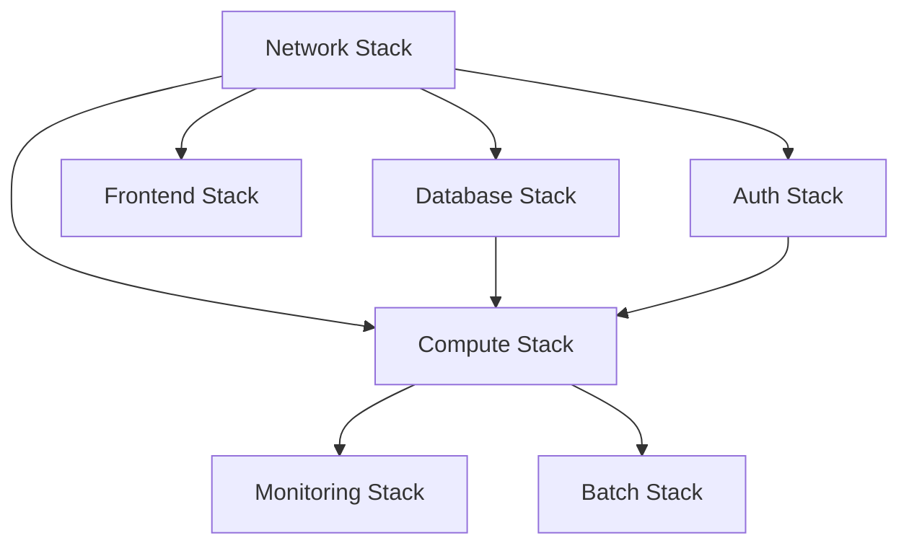

# 10_CloudFormation構成方針

**作成日**: 2025-10-25
**バージョン**: 1.0
**ステータス**: レビュー待ち

---

## 目次
1. [CloudFormation戦略概要](#cloudformation戦略概要)
2. [ファイル分割の3原則](#ファイル分割の3原則)
3. [ディレクトリ構成](#ディレクトリ構成)
4. [スタック分割戦略](#スタック分割戦略)
5. [環境差分管理](#環境差分管理)
6. [デプロイ順序](#デプロイ順序)
7. [スクリプト設計](#スクリプト設計)

---

## CloudFormation戦略概要

### 基本方針

| 項目 | 方針 | 理由 |
|------|------|------|
| **Change Sets必須** | すべてのデプロイでChange Setsを使用 | dry-run、変更内容の事前確認 |
| **ネスト構成** | 親スタック + ネステッドスタック | ファイル分割、再利用性 |
| **環境差分集約** | `parameters/` ディレクトリで一元管理 | 環境別の設定を1ファイルで管理 |
| **責務分離** | ライフサイクル別にファイル分割 | 変更リスク最小化 |

### 技術標準準拠

この設計は、以下の技術標準に準拠しています：
- `.claude/docs/40_standards/45_cloudformation.md`（CloudFormation規約）
- ファイル分割の3原則
- Change Sets必須
- Well-Architected Framework準拠

---

## ファイル分割の3原則

### 原則1: AWS コンソールの分け方（基本）

**AWS コンソールで別メニュー → 別ファイル**

| リソース | コンソール構造 | 判定 | ファイル |
|---------|--------------|------|---------|
| VPC + IGW | VPC作成時に一緒に作る | 同じファイル | `vpc-and-igw.yaml` |
| Subnets | 別メニュー | 別ファイル | `subnets.yaml` |
| Security Groups | 別メニュー | ディレクトリ | `security-groups/*.yaml` |
| ECS Cluster | 別メニュー | 別ファイル | `ecs-cluster.yaml` |
| Task Definition | 同じメニュー（頻繁に変更） | サービス別 | `ecs-task-admin-api.yaml` |

### 原則2: ライフサイクル（変更頻度）

**初回のみ作成 vs 頻繁に変更 → 分ける**

| 更新頻度 | リソース例 | 分離推奨 |
|---------|----------|--------|
| 年単位 | VPC, Subnet, RouteTable | `network/` |
| 月単位 | RDS, DynamoDB, S3 | `database/` |
| 週単位 | ECS Service, ALB, Auto Scaling | `compute/` |
| 日単位 | Task Definition | `compute/ecs-task-*.yaml` |

### 原則3: 設定数（増減の可能性）

**1個で固定 vs 継続的に増える → 分ける**

| リソース | 設定数 | 増減 | 判定 |
|---------|--------|------|------|
| VPC + IGW | 1個 | 固定 | 同じファイルOK |
| Security Groups | 3個→激増 | 継続的に増加 | ディレクトリ分割 |
| CloudWatch Alarms | 10個→激増 | 継続的に増加 | サービス別ファイル |
| Route53 Records | 5個→増える | たまに追加 | 用途別ファイル |

### 判断フロー

```
1. AWS コンソールで別メニュー？
   ├─ Yes → 分割候補
   └─ No → 同じファイル候補

2. ライフサイクルが異なる？
   ├─ Yes → 分割推奨
   └─ No → 次へ

3. 設定が継続的に増える？
   ├─ Yes → 分割推奨（ディレクトリ化も検討）
   └─ No → 同じファイルでOK
```

---

## ディレクトリ構成

### 全体構成（マルチアカウント対応）

```
infra/cloudformation/
├── README.md                           # インデックス、使い方
├── shared/                             # 共通系アカウント（Network Shared）
│   ├── stack.yaml                      # 親スタック（ネスト構成）
│   ├── parameters/
│   │   └── prod.json                   # 環境差分（共通系は本番のみ）
│   ├── nested/
│   │   ├── network/
│   │   │   ├── README.md
│   │   │   ├── transit-gateway.yaml
│   │   │   ├── egress-vpc.yaml
│   │   │   ├── nat-gateways.yaml
│   │   │   ├── network-firewall.yaml
│   │   │   └── client-vpn.yaml
│   │   ├── security/
│   │   │   ├── README.md
│   │   │   ├── security-hub.yaml
│   │   │   ├── guardduty.yaml
│   │   │   └── config.yaml
│   │   └── monitoring/
│   │       ├── README.md
│   │       ├── cloudtrail-org.yaml
│   │       └── cloudwatch-logs.yaml
│   └── scripts/
│       ├── create-changeset.sh
│       ├── describe-changeset.sh
│       ├── execute-changeset.sh
│       ├── deploy.sh
│       └── validate.sh
│
└── service/                            # サービスアカウント（Dev/Stg/Prod）
    ├── README.md
    ├── stack.yaml                      # 親スタック（ネスト構成）
    ├── parameters/
    │   ├── dev.json
    │   ├── stg.json
    │   └── prod.json
    ├── nested/
    │   ├── network/
    │   │   ├── README.md               # ネットワーク層のインデックス
    │   │   ├── vpc-and-igw.yaml        # VPC + IGW（密結合）
    │   │   ├── subnets.yaml            # Subnets（増える可能性）
    │   │   ├── route-tables.yaml       # Route Tables
    │   │   ├── transit-gateway-attachment.yaml
    │   │   ├── vpc-endpoints.yaml      # S3, ECR等
    │   │   └── security-groups/        # ★ ディレクトリ（激増）
    │   │       ├── alb-internal-sg.yaml
    │   │       ├── alb-public-sg.yaml
    │   │       ├── ecs-sg.yaml
    │   │       └── rds-sg.yaml
    │   ├── database/
    │   │   ├── README.md
    │   │   ├── rds-subnet-group.yaml
    │   │   ├── rds-parameter-group.yaml
    │   │   └── rds-instance.yaml
    │   ├── compute/
    │   │   ├── README.md
    │   │   ├── ecr-repositories.yaml
    │   │   ├── ecs-cluster.yaml
    │   │   ├── ecs-task-admin-api.yaml      # タスク定義（頻繁に変更）
    │   │   ├── ecs-service-admin-api.yaml   # サービス定義
    │   │   ├── ecs-task-vendor-api.yaml
    │   │   ├── ecs-service-vendor-api.yaml
    │   │   ├── ecs-task-batch.yaml
    │   │   ├── alb-internal.yaml            # ALB + TG + Listener
    │   │   ├── alb-public.yaml
    │   │   └── auto-scaling.yaml
    │   ├── frontend/
    │   │   ├── README.md
    │   │   ├── s3-admin-spa.yaml
    │   │   ├── s3-vendor-spa.yaml
    │   │   └── cloudfront.yaml
    │   ├── auth/
    │   │   ├── README.md
    │   │   ├── cognito-admin.yaml
    │   │   └── cognito-vendor.yaml
    │   ├── monitoring/
    │   │   ├── README.md
    │   │   ├── cloudwatch-log-groups.yaml
    │   │   ├── cloudwatch-alarms-ecs.yaml
    │   │   ├── cloudwatch-alarms-rds.yaml
    │   │   ├── cloudwatch-alarms-alb.yaml
    │   │   ├── cloudwatch-dashboard.yaml
    │   │   └── sns-topics.yaml
    │   └── batch/
    │       ├── README.md
    │       └── eventbridge-schedules.yaml
    └── scripts/
        ├── create-changeset.sh
        ├── describe-changeset.sh
        ├── execute-changeset.sh
        ├── deploy.sh
        ├── deploy-all.sh
        ├── validate.sh
        └── rollback.sh
```

### README.md インデックスの例

**`service/README.md`**:
```markdown
# Service Account CloudFormation Templates

## 📁 構成（3原則ベース）

### ネットワーク層 (`nested/network/`)
- **VPC と IGW** → `vpc-and-igw.yaml` （密結合、初回のみ、1個）
- **Subnets** → `subnets.yaml` （別メニュー、たまに追加、増える）
- **Security Groups** → `security-groups/*.yaml` （別メニュー、継続的に追加、激増）

### データベース層 (`nested/database/`)
- **RDS Subnet Group** → `rds-subnet-group.yaml` （初回のみ）
- **RDS Parameter Group** → `rds-parameter-group.yaml` （たまに変更）
- **RDS Instance** → `rds-instance.yaml` （たまに変更）

### コンピュート層 (`nested/compute/`)
- **ECS Cluster** → `ecs-cluster.yaml` （初回のみ、1個）
- **ECS Task** → `ecs-task-*.yaml` （頻繁に変更、サービス別）
- **ECS Service** → `ecs-service-*.yaml` （たまに変更、サービス別）
- **ALB** → `alb-*.yaml` （ALB+TG+Listener、密結合）

### フロントエンド層 (`nested/frontend/`)
- **S3** → `s3-*.yaml` （用途別、増える）
- **CloudFront** → `cloudfront.yaml` （たまに変更）

### 認証層 (`nested/auth/`)
- **Cognito** → `cognito-*.yaml` （用途別、増える）

### 監視層 (`nested/monitoring/`)
- **CloudWatch Log Groups** → `cloudwatch-log-groups.yaml` （増える）
- **CloudWatch Alarms** → `cloudwatch-alarms-*.yaml` （激増、サービス別）
- **SNS Topics** → `sns-topics.yaml` （たまに追加）

### バッチ層 (`nested/batch/`)
- **EventBridge** → `eventbridge-schedules.yaml` （たまに追加）

## 🔍 よくある変更

| やりたいこと | 編集するファイル |
|------------|----------------|
| VPC の CIDR を変更 | `nested/network/vpc-and-igw.yaml` |
| Subnet を追加 | `nested/network/subnets.yaml` |
| Security Group を追加 | `nested/network/security-groups/` に新規ファイル作成 |
| ECS のタスク定義変更 | `nested/compute/ecs-task-admin-api.yaml` |
| ALB のリスナールール追加 | `nested/compute/alb-internal.yaml` |
| CloudWatch アラーム追加 | `nested/monitoring/cloudwatch-alarms-ecs.yaml` |
| RDS のインスタンスタイプ変更 | `parameters/prod.json` の `DBInstanceClass` を変更 |

## 📦 デプロイ方法

### 前提条件
- AWS CLI設定済み (`aws configure`)
- 適切なIAMロール

### 個別スタックデプロイ

```bash
# dry-run（Change Set確認のみ）
./scripts/diff.sh dev network

# dev環境にデプロイ
./scripts/deploy.sh dev network
./scripts/deploy.sh dev database
./scripts/deploy.sh dev compute

# prod環境にデプロイ（確認プロンプトあり）
./scripts/deploy.sh prod network
```

### 全スタック一括デプロイ

```bash
# すべてのスタックを依存関係順にデプロイ
./scripts/deploy-all.sh dev
```

### テンプレート検証

```bash
./scripts/validate.sh
```

### ロールバック

```bash
./scripts/rollback.sh dev compute
```

## 🔗 スタック依存関係

```
network (VPC, Subnets, Security Groups, TGW Attachment)
  ↓
database (RDS)
  ↓
compute (ECS, ALB)
  ↓
frontend (S3, CloudFront)
  ↓
monitoring (CloudWatch, SNS)
```
```

---

## スタック分割戦略

### 親スタック（stack.yaml）

```yaml
AWSTemplateFormatVersion: '2010-09-09'
Description: Parent stack for Service Account

Parameters:
  Environment:
    Type: String
    AllowedValues:
      - dev
      - stg
      - prod
    Description: Environment name

  ProjectName:
    Type: String
    Default: facility
    Description: Project name

  TemplatesBucketName:
    Type: String
    Description: S3 bucket name for nested templates

Resources:
  NetworkStack:
    Type: AWS::CloudFormation::Stack
    Properties:
      TemplateURL: !Sub https://${TemplatesBucketName}.s3.amazonaws.com/nested/network/main.yaml
      Parameters:
        Environment: !Ref Environment
        ProjectName: !Ref ProjectName

  DatabaseStack:
    Type: AWS::CloudFormation::Stack
    DependsOn: NetworkStack
    Properties:
      TemplateURL: !Sub https://${TemplatesBucketName}.s3.amazonaws.com/nested/database/main.yaml
      Parameters:
        Environment: !Ref Environment
        ProjectName: !Ref ProjectName
        VpcId: !GetAtt NetworkStack.Outputs.VpcId
        PrivateSubnetIds: !GetAtt NetworkStack.Outputs.PrivateSubnetIds

  ComputeStack:
    Type: AWS::CloudFormation::Stack
    DependsOn:
      - NetworkStack
      - DatabaseStack
    Properties:
      TemplateURL: !Sub https://${TemplatesBucketName}.s3.amazonaws.com/nested/compute/main.yaml
      Parameters:
        Environment: !Ref Environment
        ProjectName: !Ref ProjectName
        VpcId: !GetAtt NetworkStack.Outputs.VpcId
        PrivateSubnetIds: !GetAtt NetworkStack.Outputs.PrivateSubnetIds
        DBEndpoint: !GetAtt DatabaseStack.Outputs.DBEndpoint

Outputs:
  VpcId:
    Value: !GetAtt NetworkStack.Outputs.VpcId
    Export:
      Name: !Sub ${ProjectName}-${Environment}-VpcId
```

### クロススタック参照（Export/Import）

**network-stack** (Exportする側):
```yaml
Outputs:
  VpcId:
    Value: !Ref VPC
    Export:
      Name: !Sub ${ProjectName}-${Environment}-VpcId

  PrivateSubnetIds:
    Value: !Join [",", [!Ref PrivateSubnet1, !Ref PrivateSubnet2]]
    Export:
      Name: !Sub ${ProjectName}-${Environment}-PrivateSubnetIds
```

**compute-stack** (Importする側):
```yaml
Resources:
  ECSService:
    Type: AWS::ECS::Service
    Properties:
      NetworkConfiguration:
        AwsvpcConfiguration:
          Subnets: !Split
            - ","
            - !ImportValue
                Fn::Sub: ${ProjectName}-${Environment}-PrivateSubnetIds
```

---

## 環境差分管理

### parameters/prod.json

```json
[
  {
    "ParameterKey": "Environment",
    "ParameterValue": "prod"
  },
  {
    "ParameterKey": "ProjectName",
    "ParameterValue": "facility"
  },
  {
    "ParameterKey": "VpcCidr",
    "ParameterValue": "10.2.0.0/16"
  },
  {
    "ParameterKey": "DBInstanceClass",
    "ParameterValue": "db.t3.medium"
  },
  {
    "ParameterKey": "DBAllocatedStorage",
    "ParameterValue": "100"
  },
  {
    "ParameterKey": "DBMultiAZ",
    "ParameterValue": "true"
  },
  {
    "ParameterKey": "ECSTaskCpu",
    "ParameterValue": "512"
  },
  {
    "ParameterKey": "ECSTaskMemory",
    "ParameterValue": "1024"
  },
  {
    "ParameterKey": "ECSDesiredCount",
    "ParameterValue": "2"
  },
  {
    "ParameterKey": "ALBScheme",
    "ParameterValue": "internal"
  }
]
```

### 環境別差分比較

| パラメータ | Dev | Stg | Prod | 理由 |
|----------|-----|-----|------|------|
| `VpcCidr` | 10.0.0.0/16 | 10.1.0.0/16 | 10.2.0.0/16 | 環境分離 |
| `DBInstanceClass` | db.t3.micro | db.t3.small | db.t3.medium | コスト vs 性能 |
| `DBMultiAZ` | false | false | true | 可用性（本番のみ） |
| `ECSDesiredCount` | 1 | 1 | 2 | 可用性（本番のみ） |
| `ECSTaskCpu` | 256 | 512 | 512 | 性能 |
| `ECSTaskMemory` | 512 | 1024 | 1024 | 性能 |

---

## デプロイ順序

### 依存関係図



### デプロイスクリプト（deploy-all.sh）

```bash
#!/bin/bash
set -euo pipefail

# ==============================================================================
# 全スタックデプロイ（依存関係順）
# ==============================================================================
# 使い方:
#   ./scripts/deploy-all.sh dev
# ==============================================================================

ENVIRONMENT=$1

if [ -z "$ENVIRONMENT" ]; then
  echo "Usage: $0 <environment>"
  exit 1
fi

echo "===================================="
echo "Deploying all stacks to ${ENVIRONMENT}"
echo "===================================="

# 1. Network Stack（他のスタックが依存）
echo "🔧 Deploying Network Stack..."
./scripts/deploy.sh ${ENVIRONMENT} network

# 2. Database Stack（Network Stackに依存）
echo "🔧 Deploying Database Stack..."
./scripts/deploy.sh ${ENVIRONMENT} database

# 3. Auth Stack（Network Stackに依存）
echo "🔧 Deploying Auth Stack..."
./scripts/deploy.sh ${ENVIRONMENT} auth

# 4. Compute Stack（Network, Database, Auth Stackに依存）
echo "🔧 Deploying Compute Stack..."
./scripts/deploy.sh ${ENVIRONMENT} compute

# 5. Frontend Stack（Network Stackに依存）
echo "🔧 Deploying Frontend Stack..."
./scripts/deploy.sh ${ENVIRONMENT} frontend

# 6. Monitoring Stack（Compute Stackに依存）
echo "🔧 Deploying Monitoring Stack..."
./scripts/deploy.sh ${ENVIRONMENT} monitoring

# 7. Batch Stack（Compute Stackに依存）
echo "🔧 Deploying Batch Stack..."
./scripts/deploy.sh ${ENVIRONMENT} batch

echo "===================================="
echo "✅ All stacks deployed successfully"
echo "===================================="
```

---

## スクリプト設計

### 責務分離パターン

| スクリプト | 責務 | 使い方 |
|----------|------|--------|
| `create-changeset.sh` | Change Set作成のみ | `./scripts/create-changeset.sh dev network` |
| `describe-changeset.sh` | Change Set詳細表示（dry-run） | `./scripts/describe-changeset.sh dev network` |
| `execute-changeset.sh` | Change Set実行のみ | `./scripts/execute-changeset.sh dev network` |
| `deploy.sh` | 上記3つを順番に実行 | `./scripts/deploy.sh dev network` |
| `deploy-all.sh` | 全スタック一括デプロイ | `./scripts/deploy-all.sh dev` |
| `validate.sh` | テンプレート検証 | `./scripts/validate.sh` |
| `rollback.sh` | ロールバック | `./scripts/rollback.sh dev compute` |
| `diff.sh` | Change Set確認のみ（実行しない） | `./scripts/diff.sh dev network` |

### create-changeset.sh

```bash
#!/bin/bash
set -euo pipefail

# ==============================================================================
# CloudFormation Change Set作成
# ==============================================================================
# 使い方:
#   ./scripts/create-changeset.sh dev network
# ==============================================================================

ENVIRONMENT=$1
STACK_TYPE=$2

if [ -z "$ENVIRONMENT" ] || [ -z "$STACK_TYPE" ]; then
  echo "Usage: $0 <environment> <stack-type>"
  exit 1
fi

PROJECT_NAME="facility"
STACK_NAME="${PROJECT_NAME}-${ENVIRONMENT}-${STACK_TYPE}"
TEMPLATE_FILE="nested/${STACK_TYPE}/main.yaml"
PARAMETERS_FILE="parameters/${ENVIRONMENT}.json"
CHANGE_SET_NAME="deploy-$(date +%Y%m%d-%H%M%S)"

echo "Creating Change Set: ${CHANGE_SET_NAME}"

# 1. S3にネステッドテンプレートをアップロード
TEMPLATES_BUCKET="${PROJECT_NAME}-cloudformation-templates"
aws s3 sync nested/ s3://${TEMPLATES_BUCKET}/nested/ --exclude "*.md"

# 2. テンプレート検証
aws cloudformation validate-template \
  --template-body file://${TEMPLATE_FILE} \
  > /dev/null

# 3. Change Set作成
aws cloudformation create-change-set \
  --stack-name ${STACK_NAME} \
  --change-set-name ${CHANGE_SET_NAME} \
  --template-body file://${TEMPLATE_FILE} \
  --parameters file://${PARAMETERS_FILE} \
  --capabilities CAPABILITY_NAMED_IAM \
  --change-set-type $(aws cloudformation describe-stacks --stack-name ${STACK_NAME} &>/dev/null && echo "UPDATE" || echo "CREATE")

# 4. 待機
aws cloudformation wait change-set-create-complete \
  --stack-name ${STACK_NAME} \
  --change-set-name ${CHANGE_SET_NAME}

echo "✅ Change Set created: ${CHANGE_SET_NAME}"
echo "${CHANGE_SET_NAME}" > /tmp/changeset-${STACK_NAME}.txt
```

---

## 重要な注意事項

### 1. ファイル分割3原則を守る

- **中見出し (`# ----`) が3個以上** → 分割を検討
- 理由なく1ファイルに詰め込まない
- README.md に「なぜこの構成か」を必ず記載

### 2. Change Sets必須

```bash
# ❌ Bad: 直接デプロイ
aws cloudformation deploy --template-file template.yaml --stack-name myapp-prd

# ✅ Good: Change Setsで確認
./scripts/deploy.sh prod network
```

### 3. 環境差分はパラメータファイルで管理

```bash
# ❌ Bad: 環境別にテンプレートをコピー
# network-dev.yaml, network-prod.yaml

# ✅ Good: パラメータファイルで差分管理
# network.yaml + parameters/dev.json + parameters/prod.json
```

### 4. ネステッドテンプレートはS3経由

```yaml
# CloudFormation親スタックから参照
TemplateURL: !Sub https://${TemplatesBucketName}.s3.amazonaws.com/nested/network/main.yaml
```

---

## 次のステップ

- [11_非機能要件実現方針.md](11_非機能要件実現方針.md): 性能、可用性
- [12_災害対策・BCP.md](12_災害対策・BCP.md): DR戦略、バックアップ
- [13_移行計画.md](13_移行計画.md): スケジュール、データ移行

---

**作成者**: Architect（Claude）
**レビュー状態**: レビュー待ち
