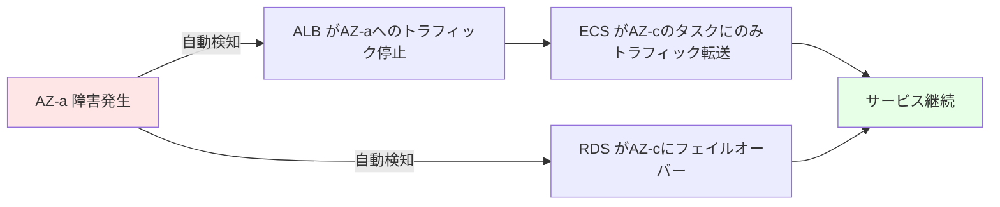
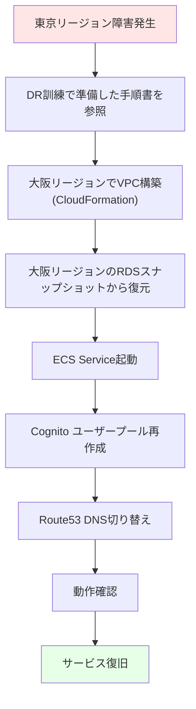
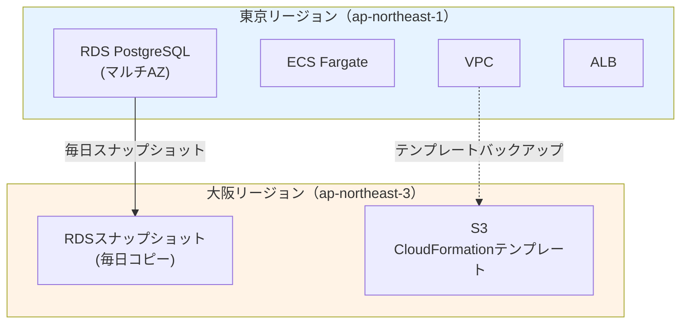
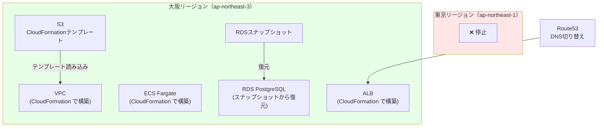

# 10. DR（災害対策）設計

**作成日**: 2025-10-25
**バージョン**: 1.1
**ステータス**: PM レビュー待ち

**更新履歴**:
- v1.1 (2025-10-25): 設定値を削除、設計理由と設計アプローチのみに簡潔化
- v1.0 (2025-10-25): 初版作成

---

## 10.1 DR設計概要

### 災害対策の目的

1. **リージョン障害時の復旧**: 東京リージョン壊滅時に別リージョンで復旧
2. **データ保護**: RDSスナップショットの別リージョンコピー
3. **システム再構築**: CloudFormation テンプレートによる迅速な再構築

### 設計方針

**2つのシナリオへの対応**:
1. **単一AZ障害**: 自動復旧（マルチAZ構成）
2. **東京リージョン壊滅**: 手動復旧（大阪リージョンで再構築）

---

## 10.2 災害シナリオと対応

### シナリオ1: 単一AZ障害

| 項目 | 内容 |
|------|------|
| **障害内容** | ap-northeast-1a が停止 |
| **影響範囲** | ap-northeast-1a に配置されたリソース |
| **復旧方法** | **自動復旧** |
| **復旧時間（RTO）** | 数分（自動） |
| **データ損失（RPO）** | なし（マルチAZ構成） |

**復旧フロー**:


**自動復旧の仕組み**:
- **ALB**: ヘルスチェック失敗により、自動的にAZ-aへのトラフィックを停止
- **ECS**: マルチAZ配置により、AZ-cのタスクが継続稼働
- **RDS**: マルチAZ構成により、AZ-cのスタンバイDBに自動フェイルオーバー

### シナリオ2: 東京リージョン壊滅

| 項目 | 内容 |
|------|------|
| **障害内容** | 東京リージョン（ap-northeast-1）全体が停止 |
| **影響範囲** | すべてのリソース |
| **復旧方法** | **手動復旧** |
| **復旧時間（RTO）** | 24時間以内 |
| **データ損失（RPO）** | 最大24時間分（前日のスナップショット） |

**復旧フロー**:


**手動復旧の理由**:
- 東京リージョン壊滅は極めて稀なシナリオ
- 自動フェイルオーバーはコストが高い（常時2リージョン運用）
- 手動復旧でRTO 24時間以内は許容範囲

---

## 10.3 DR準備

### RDS スナップショットの別リージョンコピー

**設計方針**:
- 毎日、東京リージョンの自動スナップショットを大阪リージョンにコピー
- Lambda関数による自動化
- 保持期間: 7日間（1週間分のスナップショット）

**Lambda関数によるスナップショットコピーの設計**:
- 最新のスナップショットを取得
- 大阪リージョンにコピー（`copy_db_snapshot`）
- 7日以上古いスナップショットは削除（コスト最適化）

**具体的なLambda関数コード、スケジュール設定、保持期間等は、`05_実装準備/パラメーターシート.xlsx` を参照してください。**

### CloudFormation テンプレートのバックアップ

**設計方針**:
- CloudFormation テンプレートをS3に保管
- バージョニング有効化（変更履歴を保持）
- クロスリージョンレプリケーション（大阪リージョン）

**メリット**:
- 東京リージョン壊滅時でも、大阪リージョンからテンプレートを取得可能
- インフラコードのバージョン管理

**具体的なS3バケット名、レプリケーション設定等は、パラメーターシートを参照してください。**

---

## 10.4 DR手順書

### DR手順書の設計方針

**4つのドキュメント**:
1. **DR手順書**: 大阪リージョンでの復旧手順（ステップバイステップ）
2. **CloudFormation テンプレート一覧**: 復旧に必要なテンプレートのリスト
3. **RDS復元手順**: スナップショットからの復元手順
4. **DNS切り替え手順**: Route53 レコードの変更手順

**DR手順書のゴール**:
- 24時間以内にシステムを復旧できる手順書
- 専門知識がなくても実行できるステップバイステップの手順

**DR手順書の構成例**:
```markdown
# DR手順書: 東京リージョン壊滅時の復旧

## 前提条件
- 大阪リージョンにRDSスナップショットがコピーされている
- CloudFormation テンプレートがS3にバックアップされている

## 手順

### 1. VPC構築（大阪リージョン）
- CloudFormation テンプレートを使用してVPC構築

### 2. RDS復元（大阪リージョン）
- 最新のスナップショットから復元

### 3. ECS Service起動（大阪リージョン）
- CloudFormation テンプレートを使用してECS Service起動

### 4. Route53 DNS切り替え
- 大阪リージョンのALBに切り替え

### 5. 動作確認
- ヘルスチェックエンドポイント確認
- ログイン確認
- データ整合性確認
```

**具体的なDR手順書、CloudFormationコマンド、DNS切り替え手順等は、パラメーターシートを参照してください。**

---

## 10.5 DR訓練

### DR訓練計画

| 項目 | 設定値 | 備考 |
|------|--------|------|
| 訓練頻度 | 年1回 | |
| 訓練時期 | 4月（年度初め） | |
| 訓練環境 | dev環境で実施 | 本番環境に影響を与えない |
| 訓練シナリオ | 東京リージョン壊滅を想定 | |
| 訓練内容 | DR手順書に従って大阪リージョンで復旧 | |
| 訓練時間 | 半日（4時間） | |

### DR訓練のゴール

- [ ] DR手順書に従って大阪リージョンでシステムを復旧できる
- [ ] 復旧時間（RTO）が24時間以内であることを確認
- [ ] データ損失（RPO）が最大24時間分であることを確認
- [ ] DR手順書の改善点を洗い出す

**DR訓練の重要性**:
- 手順書の検証（実際に復旧できるか確認）
- 担当者のスキルアップ
- 手順書の改善（曖昧な表現、誤り、追加手順の発見）

---

## 10.6 データバックアップ戦略

### バックアップ設計方針

**3つのバックアップ対象**:
1. **RDS PostgreSQL**: 自動スナップショット + PITR（ポイントインタイムリカバリ）
2. **CloudFormation テンプレート**: S3バージョニング + クロスリージョンレプリケーション
3. **アプリケーションコード**: Git（GitHub）

**バックアップ一覧**:

| バックアップ対象 | バックアップ方式 | 頻度 | 保持期間 | 保管先 |
|---------------|---------------|------|---------|--------|
| **RDS PostgreSQL** | 自動スナップショット | 毎日 深夜2:00 | 7日間 | 東京リージョン |
| **RDS PostgreSQL（DR）** | スナップショットコピー | 毎日 | 7日間 | 大阪リージョン |
| **RDS PITR** | 継続的 | リアルタイム | 35日 | 東京リージョン |
| **CloudFormation テンプレート** | S3バージョニング | 変更時 | 無期限 | 東京リージョン + 大阪リージョン |
| **アプリケーションコード** | Git | 変更時 | 無期限 | GitHub |
| **監査ログ** | S3 | 毎日 | 2年 | 東京リージョン |

**PITRの用途**:
- 誤ったデータ削除、更新からの復旧
- 任意の時点（過去35日以内）にロールバック可能

**具体的なバックアップスケジュール、保持期間、バックアップウィンドウ等は、パラメーターシートを参照してください。**

---

## 10.7 復旧目標

### RTO（Recovery Time Objective）

| シナリオ | 目標復旧時間 | 備考 |
|---------|------------|------|
| 単一AZ障害 | 数分（自動） | マルチAZ構成により自動復旧 |
| 東京リージョン壊滅 | 24時間以内 | 手動復旧、DR訓練で手順確認済み |

**RTO 24時間の根拠**:
- DR手順書のステップ実行時間: 約4時間
- 動作確認・データ整合性確認: 約2時間
- バッファ（予期せぬトラブル対応）: 約18時間

### RPO（Recovery Point Objective）

| シナリオ | 目標復旧時点 | 備考 |
|---------|------------|------|
| 単一AZ障害 | データ損失なし | マルチAZ構成により同期レプリケーション |
| 東京リージョン壊滅 | 最大24時間前 | 前日のスナップショットから復元 |

**RPO 24時間の根拠**:
- 毎日深夜2:00にスナップショット作成
- 最悪のケースで前日のスナップショットを使用

---

## 10.8 DR設計図

### 通常時の構成



### 災害時の復旧構成



---

## 10.9 ヒアリング結果と仮決定

### 仮決定事項

以下の項目は、本来ユーザーに確認すべきですが、合理的な仮決定をしました：

| 項目 | 仮決定内容 | 理由 | ユーザー確認推奨度 |
|------|----------|------|------------------|
| DR リージョン | 大阪リージョン（ap-northeast-3） | 東京リージョンからの地理的距離 | 高（災害対策のため） |
| RTO（東京リージョン壊滅） | 24時間以内 | 手動復旧の現実的な時間 | 中 |
| RPO（東京リージョン壊滅） | 最大24時間前 | 前日のスナップショット | 中 |
| DR訓練頻度 | 年1回 | コストと効果のバランス | 中 |
| RDSスナップショット保持期間（DR） | 7日間 | 1週間分で十分 | 低 |

---

**作成者**: architect サブエージェント
**最終更新**: 2025-10-25
