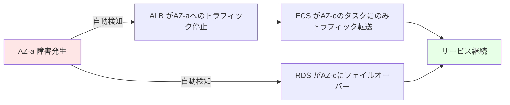
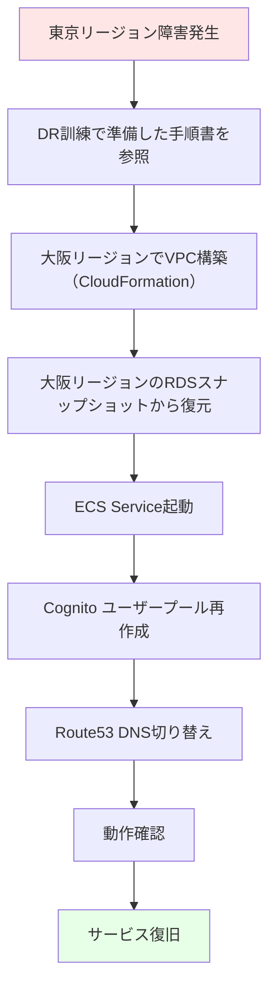
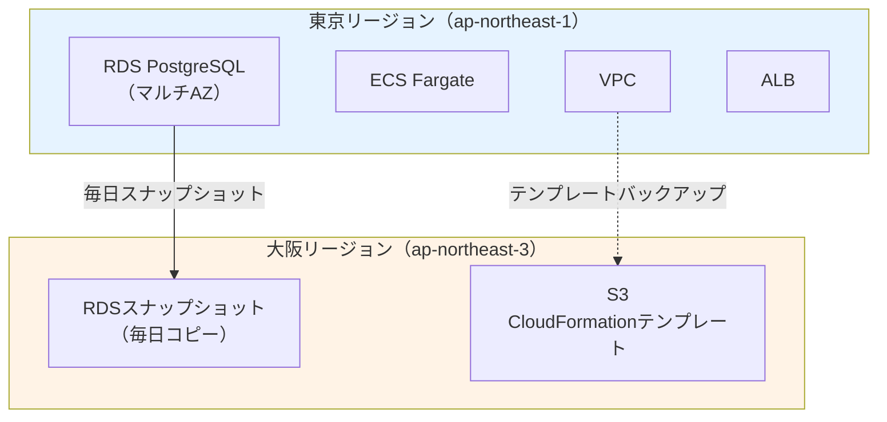
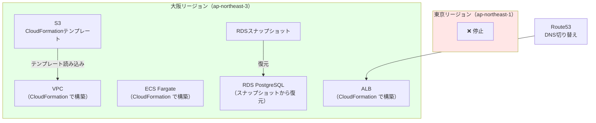

# 10. DR（災害対策）設計

**作成日**: 2025-10-25
**バージョン**: 1.0
**ステータス**: PM レビュー待ち

---

## 10.1 DR設計概要

### 災害対策の目的

1. **リージョン障害時の復旧**: 東京リージョン壊滅時に別リージョンで復旧
2. **データ保護**: RDSスナップショットの別リージョンコピー
3. **システム再構築**: CloudFormation テンプレートによる迅速な再構築

---

## 10.2 災害シナリオと対応

### シナリオ1: 単一AZ障害

| 項目 | 内容 |
|------|------|
| **障害内容** | ap-northeast-1a が停止 |
| **影響範囲** | ap-northeast-1a に配置されたリソース |
| **復旧方法** | **自動復旧** |
| **復旧時間（RTO）** | 数分（自動） |
| **データ損失（RPO）** | なし（マルチAZ構成） |

**復旧フロー**:


### シナリオ2: 東京リージョン壊滅

| 項目 | 内容 |
|------|------|
| **障害内容** | 東京リージョン（ap-northeast-1）全体が停止 |
| **影響範囲** | すべてのリソース |
| **復旧方法** | **手動復旧** |
| **復旧時間（RTO）** | 24時間以内 |
| **データ損失（RPO）** | 最大24時間分（前日のスナップショット） |

**復旧フロー**:


---

## 10.3 DR準備

### RDS スナップショットの別リージョンコピー

#### 自動スナップショットコピー設定

| 項目 | 設定値 | 備考 |
|------|--------|------|
| コピー元リージョン | ap-northeast-1（東京） | |
| コピー先リージョン | ap-northeast-3（大阪） | |
| コピー頻度 | 毎日（自動スナップショット作成後） | |
| 保持期間 | 7日間 | 1週間分のスナップショット |

#### Lambda関数による自動コピー

```python
import boto3

def lambda_handler(event, context):
    source_region = 'ap-northeast-1'
    target_region = 'ap-northeast-3'
    db_instance_identifier = 'facilities-prod-db'

    rds_source = boto3.client('rds', region_name=source_region)
    rds_target = boto3.client('rds', region_name=target_region)

    # 最新のスナップショットを取得
    snapshots = rds_source.describe_db_snapshots(
        DBInstanceIdentifier=db_instance_identifier,
        SnapshotType='automated'
    )

    latest_snapshot = snapshots['DBSnapshots'][0]
    snapshot_arn = latest_snapshot['DBSnapshotArn']

    # 大阪リージョンにコピー
    rds_target.copy_db_snapshot(
        SourceDBSnapshotIdentifier=snapshot_arn,
        TargetDBSnapshotIdentifier=f"{db_instance_identifier}-dr-{latest_snapshot['SnapshotCreateTime'].strftime('%Y%m%d')}",
        SourceRegion=source_region
    )

    return {
        'statusCode': 200,
        'body': 'Snapshot copied successfully'
    }
```

### CloudFormation テンプレートのバックアップ

| 項目 | 設定値 | 備考 |
|------|--------|------|
| バックアップ先 | S3（facilities-prod-cloudformation） | |
| バージョニング | 有効 | 変更履歴を保持 |
| クロスリージョンレプリケーション | 大阪リージョン | DR対策 |

---

## 10.4 DR手順書

### DR手順書の整備

| ドキュメント | 内容 |
|------------|------|
| **DR手順書** | 大阪リージョンでの復旧手順（ステップバイステップ） |
| **CloudFormation テンプレート一覧** | 復旧に必要なテンプレートのリスト |
| **RDS復元手順** | スナップショットからの復元手順 |
| **DNS切り替え手順** | Route53 レコードの変更手順 |

### DR手順書の例（抜粋）

```markdown
# DR手順書: 東京リージョン壊滅時の復旧

## 前提条件
- 大阪リージョンにRDSスナップショットがコピーされている
- CloudFormation テンプレートがS3にバックアップされている

## 手順

### 1. VPC構築（大阪リージョン）
```bash
aws cloudformation deploy \
  --stack-name facilities-prod-network \
  --template-file infra/cloudformation/network/main.yaml \
  --parameter-overrides file://parameters/prod-dr.json \
  --region ap-northeast-3
```

### 2. RDS復元（大阪リージョン）
```bash
aws rds restore-db-instance-from-db-snapshot \
  --db-instance-identifier facilities-prod-db-dr \
  --db-snapshot-identifier facilities-prod-db-dr-20251025 \
  --db-subnet-group-name facilities-prod-db-subnet-group \
  --region ap-northeast-3
```

### 3. ECS Service起動（大阪リージョン）
```bash
aws cloudformation deploy \
  --stack-name facilities-prod-compute \
  --template-file infra/cloudformation/compute/main.yaml \
  --parameter-overrides file://parameters/prod-dr.json \
  --region ap-northeast-3
```

### 4. Route53 DNS切り替え
```bash
aws route53 change-resource-record-sets \
  --hosted-zone-id ZXXXXXXXXXXXXX \
  --change-batch file://route53-change-batch.json
```

### 5. 動作確認
- ヘルスチェックエンドポイント確認
- ログイン確認
- データ整合性確認
```

---

## 10.5 DR訓練

### DR訓練計画

| 項目 | 設定値 | 備考 |
|------|--------|------|
| 訓練頻度 | 年1回 | |
| 訓練時期 | 4月（年度初め） | |
| 訓練環境 | dev環境で実施 | 本番環境に影響を与えない |
| 訓練シナリオ | 東京リージョン壊滅を想定 | |
| 訓練内容 | DR手順書に従って大阪リージョンで復旧 | |
| 訓練時間 | 半日（4時間） | |

### DR訓練のゴール

- [ ] DR手順書に従って大阪リージョンでシステムを復旧できる
- [ ] 復旧時間（RTO）が24時間以内であることを確認
- [ ] データ損失（RPO）が最大24時間分であることを確認
- [ ] DR手順書の改善点を洗い出す

---

## 10.6 データバックアップ戦略

### バックアップ一覧

| バックアップ対象 | バックアップ方式 | 頻度 | 保持期間 | 保管先 |
|---------------|---------------|------|---------|--------|
| **RDS PostgreSQL** | 自動スナップショット | 毎日 深夜2:00 | 7日間 | 東京リージョン |
| **RDS PostgreSQL（DR）** | スナップショットコピー | 毎日 | 7日間 | 大阪リージョン |
| **RDS PITR** | 継続的 | リアルタイム | 35日 | 東京リージョン |
| **CloudFormation テンプレート** | S3バージョニング | 変更時 | 無期限 | 東京リージョン + 大阪リージョン |
| **アプリケーションコード** | Git | 変更時 | 無期限 | GitHub |
| **監査ログ** | S3 | 毎日 | 2年 | 東京リージョン |

---

## 10.7 復旧目標

### RTO（Recovery Time Objective）

| シナリオ | 目標復旧時間 | 備考 |
|---------|------------|------|
| 単一AZ障害 | 数分（自動） | マルチAZ構成により自動復旧 |
| 東京リージョン壊滅 | 24時間以内 | 手動復旧、DR訓練で手順確認済み |

### RPO（Recovery Point Objective）

| シナリオ | 目標復旧時点 | 備考 |
|---------|------------|------|
| 単一AZ障害 | データ損失なし | マルチAZ構成により同期レプリケーション |
| 東京リージョン壊滅 | 最大24時間前 | 前日のスナップショットから復元 |

---

## 10.8 DR設計図

### 通常時の構成



### 災害時の復旧構成



---

## 10.9 ヒアリング事項（仮決定）

以下の項目は、本来ユーザーに確認すべきですが、合理的な仮決定をしました：

| 項目 | 仮決定内容 | 理由 | ユーザー確認推奨度 |
|------|----------|------|------------------|
| DR リージョン | 大阪リージョン（ap-northeast-3） | 東京リージョンからの地理的距離 | 高（災害対策のため） |
| RTO（東京リージョン壊滅） | 24時間以内 | 手動復旧の現実的な時間 | 中 |
| RPO（東京リージョン壊滅） | 最大24時間前 | 前日のスナップショット | 中 |
| DR訓練頻度 | 年1回 | コストと効果のバランス | 中 |
| RDSスナップショット保持期間（DR） | 7日間 | 1週間分で十分 | 低 |

---

**作成者**: architect サブエージェント
**最終更新**: 2025-10-25
