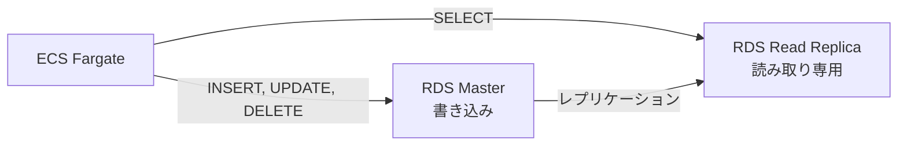
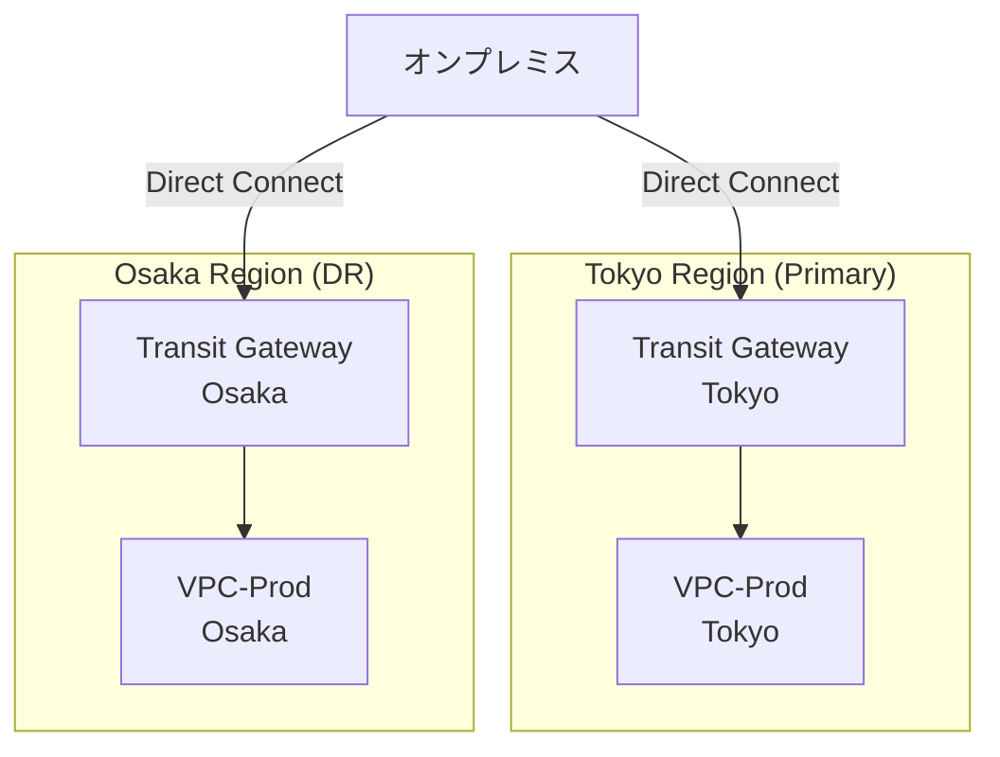

# 11_非機能要件実現方針

**作成日**: 2025-10-25
**バージョン**: 1.0
**ステータス**: レビュー待ち

---

## 目次
1. [非機能要件サマリー](#非機能要件サマリー)
2. [性能要件実現方針](#性能要件実現方針)
3. [可用性要件実現方針](#可用性要件実現方針)
4. [拡張性要件実現方針](#拡張性要件実現方針)
5. [保守性要件実現方針](#保守性要件実現方針)
6. [セキュリティ要件実現方針](#セキュリティ要件実現方針)

---

## 非機能要件サマリー

### 要件一覧

| カテゴリ | 要件 | 目標値 | 実現方法 |
|---------|------|--------|---------|
| **可用性** | システム稼働率 | 99.9% | マルチAZ構成、自動フェイルオーバー |
| **性能** | 応答時間（95%ile） | 500ms以内 | オートスケーリング、RDSチューニング、CloudFront |
| **性能** | 同時接続ユーザー数 | 100名（職員）+ 100社（事業者） | ECS Auto Scaling、RDS接続プール |
| **拡張性** | ユーザー数増加対応 | 500名まで | ECS Auto Scaling、RDSスケールアップ |
| **保守性** | 運用工数削減 | 75%削減（月20時間 → 月5時間） | Fargateによるサーバーレス化 |
| **セキュリティ** | ISMAP準拠 | 準拠 | 暗号化、監査ログ、多層防御 |
| **災害対策** | RTO（復旧時間目標） | 1時間以内 | マルチAZ自動フェイルオーバー |
| **災害対策** | RPO（復旧ポイント目標） | 5分以内 | RDS PITR（ポイントインタイムリカバリ） |

---

## 性能要件実現方針

### 応答時間目標

| 処理 | 目標値 | 測定方法 |
|------|--------|---------|
| **一覧画面表示** | 300ms以内（95%ile） | CloudWatch TargetResponseTime |
| **詳細画面表示** | 500ms以内（95%ile） | CloudWatch TargetResponseTime |
| **登録・更新処理** | 1秒以内（95%ile） | CloudWatch TargetResponseTime |
| **PDFレポート生成** | 3秒以内 | アプリケーションログ |
| **バッチ処理（月次集計）** | 30分以内 | CloudWatch Logs |

### 実現方法1: ECS Auto Scaling

```yaml
AdminAPIAutoScaling:
  Type: AWS::ApplicationAutoScaling::ScalableTarget
  Properties:
    MinCapacity: 2                      # 最小2タスク（マルチAZ）
    MaxCapacity: 10                     # 最大10タスク
    TargetTrackingScalingPolicyConfiguration:
      TargetValue: 70.0                 # CPU使用率70%でスケールアウト
      ScaleInCooldown: 300              # スケールイン前の待機時間（5分）
      ScaleOutCooldown: 60              # スケールアウト前の待機時間（1分）
```

**性能シミュレーション**:
- **平常時**: 2タスク（CPU 30%）
- **ピーク時**: CPU 70%到達 → 3タスクに増加 → CPU 47%に低下
- **高負荷時**: CPU 70%継続 → 10タスクまで段階的に増加

### 実現方法2: RDS接続プール

**Node.js（pg-pool）設定**:
```javascript
const { Pool } = require('pg');

const pool = new Pool({
  host: process.env.DB_HOST,
  port: 5432,
  database: process.env.DB_NAME,
  user: process.env.DB_USER,
  password: process.env.DB_PASSWORD,
  max: 20,                      // 最大接続数（ECSタスク数 × 10）
  idleTimeoutMillis: 30000,     // アイドル接続の保持時間（30秒）
  connectionTimeoutMillis: 2000, // 接続タイムアウト（2秒）
});
```

**設計判断**:
- ECSタスク1つあたり最大10接続
- タスク数2（平常時）× 10接続 = 20接続
- RDS max_connections: 100（デフォルト）→ 余裕あり

### 実現方法3: データベースインデックス

**重要なインデックス**:
```sql
-- 1. 伝票検索（事業者ID + 作成日）
CREATE INDEX idx_orders_vendor_created ON orders(vendor_id, created_at DESC);

-- 2. 伝票検索（職員用、ステータス + 作成日）
CREATE INDEX idx_orders_status_created ON orders(status, created_at DESC);

-- 3. 設備検索（設備番号）
CREATE UNIQUE INDEX idx_facilities_code ON facilities(facility_code);

-- 4. 月次集計（年月 + ステータス）
CREATE INDEX idx_orders_yearmonth_status ON orders(
  EXTRACT(YEAR FROM created_at),
  EXTRACT(MONTH FROM created_at),
  status
);
```

### 実現方法4: CloudFrontキャッシュ

**事業者向けSPA**:
- `index.html`: キャッシュなし（常に最新）
- `*.js`, `*.css`: 1年間キャッシュ（ファイル名にハッシュ付き）
- エッジロケーション: 全世界（PriceClass_All）

**効果**:
- 初回アクセス: 500ms（S3からダウンロード）
- 2回目以降: 50ms（エッジロケーションから配信）

### 実現方法5: RDSリードレプリカ（将来拡張）

**現状**: マスターDBのみ
**将来**: リードレプリカ追加（参照クエリ分離）



**導入タイミング**:
- ユーザー数が200名を超えた時
- RDS CPU使用率が60%を超えた時

---

## 可用性要件実現方針

### 可用性目標: 99.9%

**計算**:
- 99.9% = 年間ダウンタイム 8.76時間以内
- 月間ダウンタイム 約43分以内

### 実現方法1: マルチAZ構成

| コンポーネント | 構成 | フェイルオーバー時間 | 備考 |
|--------------|------|------------------|------|
| **ECS Fargate** | 2タスク（AZ-a, AZ-c） | 即座 | ALBが自動的に健全なタスクにルーティング |
| **RDS PostgreSQL** | マルチAZ（Prod/Stgのみ） | 約2分 | 自動フェイルオーバー |
| **ALB** | マルチAZ（AZ-a, AZ-c） | 即座 | AWSマネージド |
| **NAT Gateway** | 2個（AZ-a, AZ-c） | 即座 | 各AZに配置 |

### 実現方法2: ヘルスチェック

**ALB Target Group ヘルスチェック**:
```yaml
HealthCheckEnabled: true
HealthCheckProtocol: HTTP
HealthCheckPath: /health
HealthCheckIntervalSeconds: 30        # 30秒ごと
HealthCheckTimeoutSeconds: 5          # 5秒でタイムアウト
HealthyThresholdCount: 2              # 2回連続成功で正常
UnhealthyThresholdCount: 2            # 2回連続失敗で異常
```

**ECS Task ヘルスチェック**:
```yaml
HealthCheck:
  Command:
    - CMD-SHELL
    - curl -f http://localhost:3000/health || exit 1
  Interval: 30
  Timeout: 5
  Retries: 3
  StartPeriod: 60                     # 起動後60秒は失敗を許容
```

### 実現方法3: デプロイメントサーキットブレーカー

```yaml
DeploymentConfiguration:
  DeploymentCircuitBreaker:
    Enable: true                      # デプロイ失敗時に自動ロールバック
    Rollback: true
```

**動作**:
1. 新しいタスクをデプロイ
2. ヘルスチェック連続失敗
3. 自動ロールバック（以前のタスク定義に戻す）

### 実現方法4: Transit Gateway冗長化

**現状**: 単一Transit Gateway（リージョン内冗長）
**将来**: マルチリージョン構成（DR対策）



**導入タイミング**: フェーズ2（リージョン障害対策が必要な場合）

---

## 拡張性要件実現方針

### 拡張性目標

| 項目 | 現状 | 1年後 | 3年後 | 対応方法 |
|------|------|------|------|---------|
| **職員ユーザー数** | 100名 | 200名 | 500名 | ECS Auto Scaling、RDSスケールアップ |
| **事業者ユーザー数** | 100社 | 300社 | 1000社 | ECS Auto Scaling、RDSスケールアップ |
| **データ量（伝票）** | 10万件/年 | 30万件/年 | 100万件/年 | RDSストレージ拡張、パーティショニング |
| **同時接続数** | 50 | 100 | 300 | ECS Auto Scaling（最大30タスク） |

### 実現方法1: 垂直スケーリング（RDS）

**現状**:
- Prod: db.t3.medium（2vCPU, 4GB）
- ストレージ: 100GB

**拡張例**:
1. db.t3.large（2vCPU, 8GB）
2. db.r6g.large（2vCPU, 16GB、メモリ最適化）
3. db.r6g.xlarge（4vCPU, 32GB）

**拡張手順**:
```bash
# CloudFormationパラメータ変更
# parameters/prod.json の DBInstanceClass を変更
{
  "ParameterKey": "DBInstanceClass",
  "ParameterValue": "db.t3.large"
}

# Change Set作成→実行（約5分のダウンタイム）
./scripts/deploy.sh prod database
```

### 実現方法2: 水平スケーリング（ECS）

**現状**:
- 最小: 2タスク
- 最大: 10タスク

**拡張例**:
```yaml
# CloudFormationパラメータ変更
ECSMaxCapacity: 30                    # 10 → 30タスク
```

**効果**:
- 10タスク: 同時接続100名
- 30タスク: 同時接続300名

### 実現方法3: データパーティショニング（将来）

**導入タイミング**: データ量が100万件を超えた場合

**テーブルパーティショニング例**:
```sql
-- 年月別パーティショニング
CREATE TABLE orders (
  id SERIAL,
  vendor_id INT,
  created_at TIMESTAMP,
  ...
) PARTITION BY RANGE (created_at);

-- パーティション作成
CREATE TABLE orders_2025_01 PARTITION OF orders
  FOR VALUES FROM ('2025-01-01') TO ('2025-02-01');

CREATE TABLE orders_2025_02 PARTITION OF orders
  FOR VALUES FROM ('2025-02-01') TO ('2025-03-01');
```

**効果**:
- 古いデータへのクエリ高速化
- 月別にアーカイブ可能

---

## 保守性要件実現方針

### 運用工数削減目標: 75%削減

| 作業 | 現行（EC2） | 移行後（Fargate） | 削減率 |
|------|-----------|-----------------|-------|
| **OSパッチ適用** | 月4時間 | 0時間 | 100% |
| **サーバー監視** | 月8時間 | 月2時間 | 75% |
| **スケーリング作業** | 月4時間 | 0時間（自動） | 100% |
| **デプロイ作業** | 月4時間 | 月3時間 | 25% |
| **合計** | 月20時間 | 月5時間 | **75%** |

### 実現方法1: Fargateによるサーバーレス化

**メリット**:
- OSレベルの管理不要
- セキュリティパッチ自動適用
- インスタンス障害時の自動復旧

### 実現方法2: CloudWatch自動監視

**自動化される監視**:
- CPU/メモリ使用率監視
- ヘルスチェック失敗検知
- アラート自動通知（Slack/Email）

**人手が不要**:
- 平常時の監視（ダッシュボード確認のみ）
- アラート発生時のみ対応

### 実現方法3: CI/CD自動化

**自動化されるプロセス**:
- コードのビルド
- コンテナイメージのビルド・プッシュ
- ECS サービスの更新
- デプロイ成功/失敗の通知

**人手が必要な作業**:
- Pull Requestのレビュー
- 本番デプロイの承認

### 実現方法4: Infrastructure as Code

**CloudFormation による管理**:
- 設定変更はコードで管理
- Change Sets で事前確認
- ロールバック容易

**メリット**:
- 手作業によるミス削減
- 変更履歴の追跡
- 複数環境への展開が容易

---

## セキュリティ要件実現方針

### ISMAP準拠

| 要件 | 実現方法 | 参照 |
|------|---------|------|
| **アクセス制御** | Cognito認証、IAMロール、Security Groups | [03_セキュリティ設計.md](03_セキュリティ設計.md) |
| **暗号化（保存時）** | RDS暗号化、S3暗号化、EBS暗号化 | [03_セキュリティ設計.md](03_セキュリティ設計.md) |
| **暗号化（転送時）** | TLS 1.3、HTTPS強制 | [03_セキュリティ設計.md](03_セキュリティ設計.md) |
| **監査ログ** | CloudTrail、VPCフローログ、ALBアクセスログ（2年保管） | [04_監査・コンプライアンス設計.md](04_監査・コンプライアンス設計.md) |
| **構成監査** | AWS Config、Security Hub | [04_監査・コンプライアンス設計.md](04_監査・コンプライアンス設計.md) |
| **脅威検出** | GuardDuty | [03_セキュリティ設計.md](03_セキュリティ設計.md) |

### 詳細な実現方法

詳細は以下のドキュメントを参照してください：
- [03_セキュリティ設計.md](03_セキュリティ設計.md): Security Groups、WAF、認証、暗号化
- [04_監査・コンプライアンス設計.md](04_監査・コンプライアンス設計.md): ログ保管、証跡管理、法令準拠

---

## 性能試験計画

### 負荷テスト

**実施タイミング**: ステージング環境構築後

**テストシナリオ**:
1. **通常負荷テスト**: 同時接続50名、30分間
2. **ピーク負荷テスト**: 同時接続100名、10分間
3. **ストレステスト**: 同時接続200名、5分間（限界値確認）

**測定項目**:
- 応答時間（平均、95%ile、99%ile）
- CPU使用率（ECS、RDS）
- メモリ使用率（ECS、RDS）
- Auto Scalingの動作確認

**合格基準**:
- 応答時間（95%ile）: 500ms以内
- エラー率: 0.1%以下
- Auto Scaling発動: CPU 70%到達時

---

## 次のステップ

- [12_災害対策・BCP.md](12_災害対策・BCP.md): DR戦略、バックアップ
- [13_移行計画.md](13_移行計画.md): スケジュール、データ移行

---

**作成者**: Architect（Claude）
**レビュー状態**: レビュー待ち
