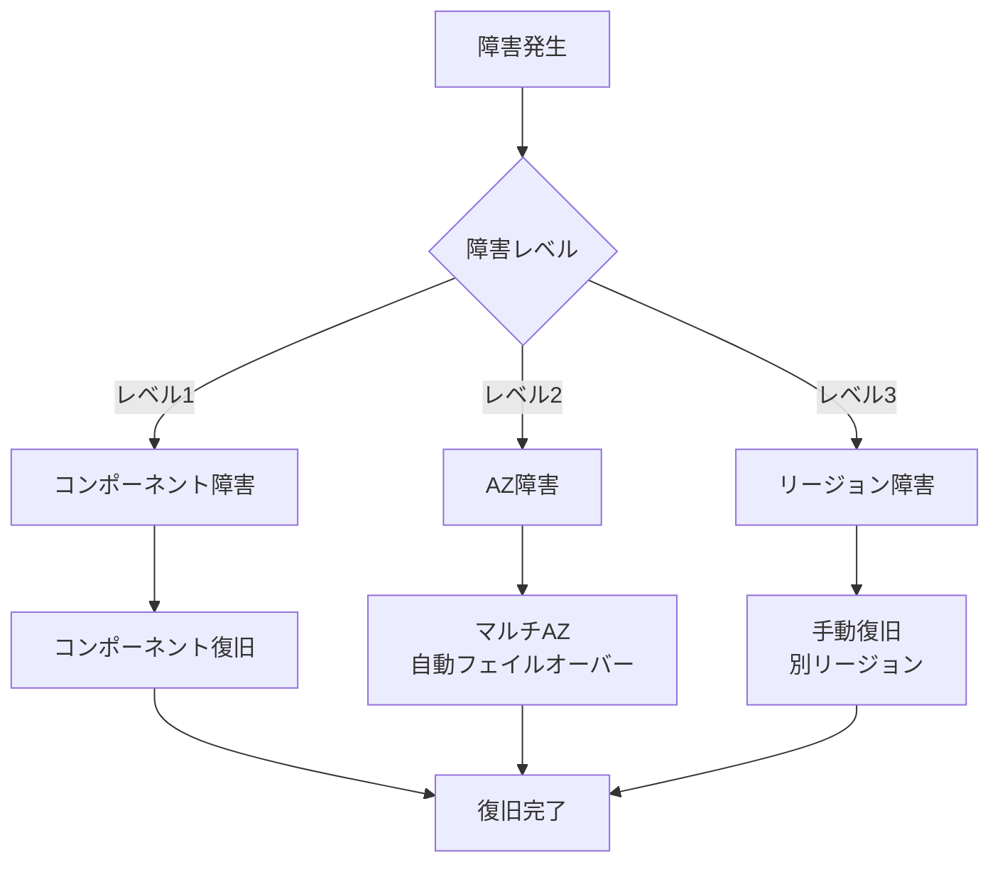

# 12_災害対策・BCP

**作成日**: 2025-10-25
**バージョン**: 1.0
**ステータス**: レビュー待ち

---

## 目次
1. [DR戦略概要](#dr戦略概要)
2. [バックアップ戦略](#バックアップ戦略)
3. [復旧手順](#復旧手順)
4. [BCP（事業継続計画）](#bcp事業継続計画)
5. [定期訓練計画](#定期訓練計画)

---

## DR戦略概要

### RTO/RPO目標

| 項目 | 目標値 | 実現方法 |
|------|--------|---------|
| **RTO（復旧時間目標）** | 1時間以内 | マルチAZ自動フェイルオーバー、手順書整備 |
| **RPO（復旧ポイント目標）** | 5分以内 | RDS PITR（ポイントインタイムリカバリ） |

### 障害シナリオ別DR戦略



### 障害レベル定義

| レベル | 障害内容 | 影響範囲 | 復旧方法 | RTO |
|-------|---------|---------|---------|-----|
| **レベル1** | 単一コンポーネント障害（ECS Task、RDSスタンバイ） | 一部機能 | 自動復旧、手動再起動 | 5分 |
| **レベル2** | AZ障害 | 単一AZ | マルチAZ自動フェイルオーバー | 5分 |
| **レベル3** | リージョン障害 | Tokyo全体 | 別リージョン手動復旧 | 4時間 |

---

## バックアップ戦略

### RDSバックアップ

#### 自動バックアップ

```yaml
DBInstance:
  Type: AWS::RDS::DBInstance
  Properties:
    BackupRetentionPeriod: 7            # 7日間保持（本番）
    PreferredBackupWindow: "17:00-18:00" # 深夜2:00-3:00 JST
    CopyTagsToSnapshot: true
    EnableCloudwatchLogsExports:
      - postgresql
      - upgrade
```

**バックアップスケジュール**:
- **自動スナップショット**: 毎日深夜2:00（JST）
- **保持期間**: 7日間
- **バックアップウィンドウ**: 1時間（トラフィック最少時）

#### 手動スナップショット

**タイミング**:
- 本番リリース前
- 大規模データ変更前
- 月次（定期バックアップ）

**作成方法**:
```bash
# 手動スナップショット作成
aws rds create-db-snapshot \
  --db-instance-identifier facility-prod-db \
  --db-snapshot-identifier facility-prod-db-manual-$(date +%Y%m%d) \
  --tags Key=Type,Value=Manual Key=Purpose,Value=MonthlyBackup
```

#### ポイントインタイムリカバリ（PITR）

**設定**:
```yaml
DBInstance:
  Properties:
    BackupRetentionPeriod: 7            # PITRは7日間有効
```

**復旧例**:
```bash
# 5分前の状態に復旧
aws rds restore-db-instance-to-point-in-time \
  --source-db-instance-identifier facility-prod-db \
  --target-db-instance-identifier facility-prod-db-pitr-restore \
  --restore-time 2025-10-25T12:30:00Z
```

**RPO**: 5分以内（トランザクションログから復元）

### S3バックアップ

#### バージョニング

```yaml
AdminSPABucket:
  Properties:
    VersioningConfiguration:
      Status: Enabled                   # バージョニング有効
    LifecycleConfiguration:
      Rules:
        - Id: DeleteOldVersions
          Status: Enabled
          NoncurrentVersionExpirationInDays: 30  # 旧バージョンは30日後削除
```

**効果**:
- 誤削除・上書きから保護
- 過去のバージョンに復元可能

#### クロスリージョンレプリケーション（将来）

**現状**: 単一リージョン
**将来**: Osakaリージョンにレプリケーション

```yaml
ReplicationConfiguration:
  Role: !GetAtt S3ReplicationRole.Arn
  Rules:
    - Id: ReplicateToOsaka
      Status: Enabled
      Destination:
        Bucket: arn:aws:s3:::facility-prod-vendor-spa-osaka
        ReplicationTime:
          Status: Enabled
          Time:
            Minutes: 15               # 15分以内にレプリケーション
```

### CloudFormationバックアップ

**バックアップ対象**:
- CloudFormation テンプレート
- パラメータファイル
- デプロイスクリプト

**バックアップ方法**:
- GitHub リポジトリ（バージョン管理）
- S3バケット（定期アップロード）

```bash
# 1日1回、CloudFormationテンプレートをS3にバックアップ
aws s3 sync infra/cloudformation/ s3://facility-cloudformation-backup/$(date +%Y%m%d)/
```

### ログバックアップ

#### CloudWatch Logs → S3アーカイブ

```yaml
LogsExportToS3:
  Type: AWS::Logs::SubscriptionFilter
  Properties:
    LogGroupName: /ecs/admin-api
    FilterPattern: ""
    DestinationArn: !GetAtt LogArchiveBucket.Arn
```

**アーカイブスケジュール**:
- CloudWatch Logs: 30日間保持
- S3アーカイブ: 2年間保持（ISMAP要件）
- S3 Glacier: 2年後に移行（長期保管）

---

## 復旧手順

### シナリオ1: ECS Task障害（レベル1）

**想定**: 単一ECS Taskのクラッシュ

**自動復旧**:
1. ECS Service が異常を検知（ヘルスチェック失敗）
2. 新しいTaskを自動起動
3. ALBが新しいTaskにトラフィックをルーティング

**RTO**: 約2分（Task起動時間）

**手動対応不要**（自動復旧）

### シナリオ2: RDS AZ障害（レベル2）

**想定**: Primary DBが配置されているAZの障害

**自動フェイルオーバー**:
1. RDS Multi-AZが障害を検知
2. Standby DBに自動フェイルオーバー
3. DNS Endpointが新しいPrimaryに自動更新
4. アプリケーションは自動的に新しいPrimaryに接続

**RTO**: 約2分（AWSマネージド）

**手動対応不要**（自動フェイルオーバー）

### シナリオ3: ECS Service完全停止（レベル1-2）

**想定**: すべてのECS Taskが停止

**手動復旧手順**:

```bash
# 1. ECS Service状態確認
aws ecs describe-services \
  --cluster facility-prod-cluster \
  --services admin-api

# 2. Task Definition確認
aws ecs describe-task-definition \
  --task-definition facility-prod-admin-api

# 3. Service更新（強制再デプロイ）
aws ecs update-service \
  --cluster facility-prod-cluster \
  --service admin-api \
  --force-new-deployment

# 4. サービス安定化待機
aws ecs wait services-stable \
  --cluster facility-prod-cluster \
  --services admin-api

# 5. ヘルスチェック確認
curl -f https://admin-api.facility.example.com/health
```

**RTO**: 約10分

### シナリオ4: RDSデータ誤削除（レベル1）

**想定**: アプリケーションバグによるデータ誤削除

**復旧手順（PITR使用）**:

```bash
# 1. 誤削除時刻の特定（CloudWatch Logsから確認）
# 例: 2025-10-25 12:35:00に誤削除

# 2. 誤削除直前（12:30:00）の状態に復旧
aws rds restore-db-instance-to-point-in-time \
  --source-db-instance-identifier facility-prod-db \
  --target-db-instance-identifier facility-prod-db-pitr-20251025-1230 \
  --restore-time 2025-10-25T12:30:00Z \
  --vpc-security-group-ids sg-xxxxxxxxx \
  --db-subnet-group-name facility-prod-db-subnet-group

# 3. 復旧完了待機（約15分）
aws rds wait db-instance-available \
  --db-instance-identifier facility-prod-db-pitr-20251025-1230

# 4. 誤削除されたデータを抽出
pg_dump -h facility-prod-db-pitr-20251025-1230.xxxxxxxx.ap-northeast-1.rds.amazonaws.com \
  -U admin -d facility -t orders --data-only > recovered_data.sql

# 5. 本番DBに復元
psql -h facility-prod-db.xxxxxxxx.ap-northeast-1.rds.amazonaws.com \
  -U admin -d facility -f recovered_data.sql

# 6. 復旧DBを削除（コスト削減）
aws rds delete-db-instance \
  --db-instance-identifier facility-prod-db-pitr-20251025-1230 \
  --skip-final-snapshot
```

**RTO**: 約30分
**RPO**: 5分以内

### シナリオ5: Tokyoリージョン全障害（レベル3）

**想定**: Tokyo全体の障害（極めて稀）

**前提条件**:
- Osakaリージョンに待機環境なし（現状）
- バックアップからの復旧

**復旧手順**:

```bash
# ===== Osakaリージョンでの復旧作業 =====

# 1. 最新のRDSスナップショットをOsakaにコピー
aws rds copy-db-snapshot \
  --source-db-snapshot-identifier arn:aws:rds:ap-northeast-1:123456789012:snapshot:facility-prod-db-automated-2025-10-25 \
  --target-db-snapshot-identifier facility-prod-db-dr-20251025 \
  --source-region ap-northeast-1 \
  --region ap-northeast-3 \
  --kms-key-id arn:aws:kms:ap-northeast-3:123456789012:key/xxxxxxxx

# 2. Osakaリージョンにネットワークスタックをデプロイ
cd infra/cloudformation/service
aws cloudformation create-stack \
  --stack-name facility-prod-network-osaka \
  --template-body file://nested/network/main.yaml \
  --parameters file://parameters/prod-osaka.json \
  --region ap-northeast-3

# 3. RDSスナップショットから復元
aws rds restore-db-instance-from-db-snapshot \
  --db-instance-identifier facility-prod-db-osaka \
  --db-snapshot-identifier facility-prod-db-dr-20251025 \
  --vpc-security-group-ids sg-yyyyyyyyy \
  --db-subnet-group-name facility-prod-db-subnet-group-osaka \
  --region ap-northeast-3

# 4. ECS + ALB + その他リソースをデプロイ
./scripts/deploy-all.sh prod-osaka

# 5. Route53でフェイルオーバー
aws route53 change-resource-record-sets \
  --hosted-zone-id Z1234567890ABC \
  --change-batch file://osaka-failover.json
```

**RTO**: 約4時間（手動作業含む）
**RPO**: 最大24時間（最新スナップショット）

**課題**:
- 現状、Osakaリージョンに待機環境なし
- フェーズ2でマルチリージョン構成を検討

---

## BCP（事業継続計画）

### 業務影響度分析

| システム機能 | 業務影響度 | 停止許容時間 | 復旧優先度 |
|------------|----------|------------|----------|
| **職員向け業務画面（伝票登録）** | 高 | 1時間 | 最優先 |
| **事業者向け発注画面** | 高 | 1時間 | 最優先 |
| **バッチ処理（月次集計）** | 中 | 24時間 | 中 |
| **レポート生成** | 低 | 48時間 | 低 |

### 緊急連絡体制

**連絡フロー**:
```mermaid
graph TD
    Alert[CloudWatch Alarm発火]
    SNS[SNS通知]
    Slack[Slack #ops-alerts]
    Email[Email<br/>ops-team@example.com]
    OnCall[当番担当者]
    Manager[システム管理者]
    Escalation[エスカレーション<br/>（1時間対応なし）]

    Alert --> SNS
    SNS --> Slack
    SNS --> Email
    Email --> OnCall
    Slack --> OnCall
    OnCall --> Manager
    OnCall --> Escalation
    Escalation --> Manager
```

**連絡先リスト**:
- 当番担当者: [未定]
- システム管理者: [未定]
- ベンダー緊急連絡先: [未定]

### 代替手段

**システム停止時の業務継続策**:

| 業務 | 代替手段 | データ同期方法 |
|------|---------|--------------|
| **伝票登録** | Excel入力 → 復旧後一括登録 | Excel形式のCSV一括インポート機能 |
| **発注確認** | メール/電話確認 | 復旧後に手動登録 |
| **月次集計** | 延期（システム復旧後に実施） | - |

**重要**: 代替手段の定期訓練（年1回）

---

## 定期訓練計画

### DR訓練スケジュール

| 訓練内容 | 頻度 | 実施時期 | 所要時間 |
|---------|------|---------|---------|
| **バックアップ復元訓練** | 四半期ごと | 4月、7月、10月、1月 | 2時間 |
| **RDS PITR訓練** | 半年ごと | 4月、10月 | 1時間 |
| **フェイルオーバー訓練** | 年1回 | 4月 | 3時間 |
| **リージョン障害訓練** | 年1回 | 10月 | 4時間 |

### バックアップ復元訓練手順

**目的**: RDSスナップショットから復旧できることを確認

**手順**:
1. 本番DBの最新スナップショットを取得
2. 訓練用DBインスタンスとして復元
3. アプリケーションから接続確認
4. データ整合性確認
5. 訓練用DBを削除

**チェックリスト**:
- [ ] スナップショット復元成功
- [ ] 接続確認成功
- [ ] データ整合性確認
- [ ] 所要時間記録（RTO検証）
- [ ] 手順書更新

### フェイルオーバー訓練手順

**目的**: RDS Multi-AZフェイルオーバーが正常に動作することを確認

**手順**:
1. メンテナンスウィンドウ設定
2. 手動フェイルオーバー実行
3. アプリケーション動作確認
4. 切り戻し

**実施コマンド**:
```bash
# 1. 手動フェイルオーバー実行
aws rds reboot-db-instance \
  --db-instance-identifier facility-prod-db \
  --force-failover

# 2. フェイルオーバー完了待機
aws rds wait db-instance-available \
  --db-instance-identifier facility-prod-db

# 3. 接続確認
curl -f https://admin-api.facility.example.com/health
```

**チェックリスト**:
- [ ] フェイルオーバー成功
- [ ] ダウンタイム測定（目標: 2分以内）
- [ ] アプリケーション自動復旧確認
- [ ] 手順書更新

---

## 次のステップ

- [13_移行計画.md](13_移行計画.md): スケジュール、データ移行

---

**作成者**: Architect（Claude）
**レビュー状態**: レビュー待ち
