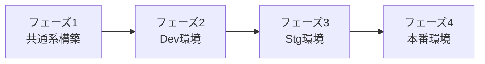
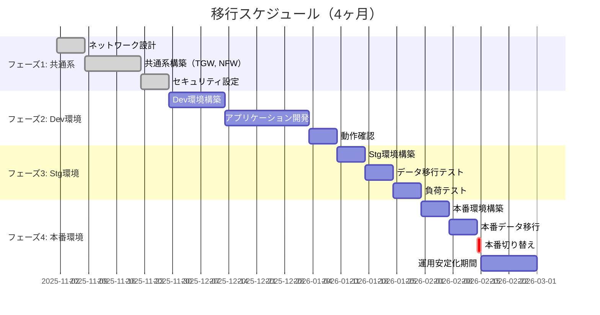

# 13_移行計画

**作成日**: 2025-10-25
**バージョン**: 1.0
**ステータス**: レビュー待ち

---

## 目次
1. [移行戦略概要](#移行戦略概要)
2. [移行スケジュール](#移行スケジュール)
3. [データ移行計画](#データ移行計画)
4. [切り替え手順](#切り替え手順)
5. [リスクと対策](#リスクと対策)
6. [ロールバック計画](#ロールバック計画)

---

## 移行戦略概要

### 移行方針

**段階的移行（Big Bang方式ではない）**



**理由**:
- リスク最小化（段階的検証）
- 問題発見の早期化
- ロールバック容易性

### 移行対象システム

| システム | 現行 | 移行後 | 移行方式 |
|---------|------|--------|---------|
| **インフラ** | EC2 + RDS（単一AZ） | ECS Fargate + RDS（Multi-AZ） | リビルド |
| **アプリケーション** | Node.js（EC2直接実行） | Node.js（Dockerコンテナ） | コンテナ化 |
| **データベース** | PostgreSQL 12（RDS） | PostgreSQL 14（RDS） | ダンプ&リストア |
| **認証** | 独自実装 | Amazon Cognito | データ移行 |
| **ネットワーク** | 単一VPC | マルチアカウント + Transit Gateway | 新規構築 |

### 移行完了基準

| 項目 | 完了基準 |
|------|---------|
| **機能** | すべての既存機能が動作すること |
| **性能** | 応答時間が現行以下（95%ile: 500ms以内） |
| **可用性** | 99.9%の稼働率を達成すること |
| **データ** | データ損失ゼロ、整合性確認完了 |
| **運用** | 運用手順書整備、訓練完了 |

---

## 移行スケジュール

### 全体スケジュール（4ヶ月）



### フェーズ1: 共通系構築（3週間）

**期間**: 2025年11月1日 - 11月28日

| No | タスク | 担当 | 期間 | 成果物 |
|----|--------|------|------|--------|
| 1.1 | ネットワーク設計レビュー | Architect | 1週 | ネットワーク設計書 |
| 1.2 | Management Account構築 | SRE | 3日 | AWS Organizations |
| 1.3 | Network Shared Account構築 | SRE | 1週 | Transit Gateway、Egress VPC |
| 1.4 | Network Firewall設定 | SRE | 3日 | ファイアウォールルール |
| 1.5 | Client VPN構築 | SRE | 2日 | VPN接続手順書 |
| 1.6 | Security Hub、GuardDuty有効化 | SRE | 1日 | セキュリティ監視 |
| 1.7 | CloudTrail（Org Trail）設定 | SRE | 1日 | 監査ログ |

**完了基準**:
- [ ] Transit Gatewayが正常に動作
- [ ] オンプレミスからVPN接続可能
- [ ] Network Firewallのフィルタリング動作確認
- [ ] Security Hub、GuardDutyが正常に動作

### フェーズ2: Dev環境構築（6週間）

**期間**: 2025年11月29日 - 2026年1月9日

| No | タスク | 担当 | 期間 | 成果物 |
|----|--------|------|------|--------|
| 2.1 | Service-Dev Account作成 | SRE | 1日 | AWSアカウント |
| 2.2 | VPC構築（10.0.0.0/16） | SRE | 3日 | VPC、Subnet、Route Table |
| 2.3 | Transit Gateway Attachment | SRE | 1日 | ネットワーク接続 |
| 2.4 | RDS構築（Dev） | SRE | 2日 | PostgreSQL 14 |
| 2.5 | ECS Cluster構築 | SRE | 2日 | ECS Fargate環境 |
| 2.6 | ECR作成、サンプルイメージpush | Coder | 1日 | コンテナレジストリ |
| 2.7 | ALB構築 | SRE | 2日 | ロードバランサー |
| 2.8 | Cognito構築 | SRE | 2日 | 認証基盤 |
| 2.9 | アプリケーション開発（業務API） | Coder | 2週 | Node.js + Express |
| 2.10 | アプリケーション開発（事業者API） | Coder | 2週 | Node.js + Express |
| 2.11 | フロントエンド開発（React SPA） | Coder | 2週 | React 18 |
| 2.12 | 統合テスト | QA | 1週 | テスト結果報告書 |

**完了基準**:
- [ ] すべてのコンポーネントが正常に動作
- [ ] アプリケーション基本機能が動作
- [ ] API エンドポイントが正常にレスポンス
- [ ] フロントエンドから API 呼び出し成功

### フェーズ3: Stg環境構築（3週間）

**期間**: 2026年1月10日 - 1月30日

| No | タスク | 担当 | 期間 | 成果物 |
|----|--------|------|------|--------|
| 3.1 | Service-Stg Account作成 | SRE | 1日 | AWSアカウント |
| 3.2 | Stg環境構築（CloudFormation） | SRE | 3日 | インフラ一式 |
| 3.3 | テストデータ投入 | QA | 2日 | テストデータセット |
| 3.4 | データ移行ツール開発 | Coder | 1週 | 移行スクリプト |
| 3.5 | データ移行リハーサル | QA | 2日 | 移行手順書 |
| 3.6 | 負荷テスト実施 | QA | 1週 | 負荷テスト結果報告書 |
| 3.7 | 性能チューニング | Coder, SRE | 3日 | チューニング結果 |

**完了基準**:
- [ ] 負荷テスト合格（応答時間500ms以内）
- [ ] データ移行手順確立
- [ ] 性能要件達成

### フェーズ4: 本番環境構築・切り替え（3週間）

**期間**: 2026年1月31日 - 2月28日

| No | タスク | 担当 | 期間 | 成果物 |
|----|--------|------|------|--------|
| 4.1 | Service-Prod Account作成 | SRE | 1日 | AWSアカウント |
| 4.2 | Prod環境構築（CloudFormation） | SRE | 1週 | インフラ一式 |
| 4.3 | セキュリティレビュー | Security | 2日 | セキュリティレビュー報告書 |
| 4.4 | 本番データ移行（リハーサル） | Coder, SRE | 1日 | 移行手順最終確認 |
| 4.5 | **本番データ移行（本番）** | Coder, SRE | 1日 | データ移行完了 |
| 4.6 | **本番切り替え** | PM, SRE | 1日 | 新システム稼働 |
| 4.7 | 運用監視（1週間） | SRE | 1週 | 安定稼働確認 |
| 4.8 | 旧システム停止 | SRE | 1日 | リソース削除 |

**完了基準**:
- [ ] データ移行完了（データ損失ゼロ）
- [ ] 新システム正常稼働
- [ ] ユーザーからの重大な問題報告なし
- [ ] 旧システム停止完了

---

## データ移行計画

### 移行対象データ

| テーブル | レコード数（推定） | データサイズ | 移行方式 |
|---------|---------------|------------|---------|
| `users` | 200件（職員100名 + 事業者100社） | 100KB | pg_dump/restore |
| `facilities` | 10,000件 | 50MB | pg_dump/restore |
| `orders` | 100,000件 | 500MB | pg_dump/restore |
| `attachments` | 50,000件 | 10GB | S3 sync |

**合計データサイズ**: 約10.5GB

### 移行方式: pg_dump/restore

**理由**:
- データサイズが小さい（10.5GB）
- ダウンタイム許容（メンテナンス時間中）
- PostgreSQLバージョンアップ（12 → 14）

### データ移行手順

#### ステップ1: 事前準備

```bash
# 1. 新RDSの接続情報確認
NEW_DB_HOST="facility-prod-db.xxxxxxxx.ap-northeast-1.rds.amazonaws.com"
NEW_DB_NAME="facility"
NEW_DB_USER="admin"

# 2. 移行ツールインストール（EC2踏み台サーバー）
sudo yum install -y postgresql14

# 3. 新RDSにスキーマ作成
psql -h $NEW_DB_HOST -U $NEW_DB_USER -d postgres -c "CREATE DATABASE facility;"
psql -h $NEW_DB_HOST -U $NEW_DB_USER -d facility -f schema.sql
```

#### ステップ2: データダンプ（旧システム）

**実施タイミング**: メンテナンス時間開始（2026年2月14日 23:00）

```bash
# 1. 旧システム停止（アプリケーション停止）
systemctl stop nodejs-app

# 2. データダンプ（約10分）
pg_dump -h old-db.example.com -U postgres -d facility \
  --format=custom \
  --file=facility_dump_20260214.backup \
  --verbose

# 3. ダンプファイルをS3にアップロード（バックアップ）
aws s3 cp facility_dump_20260214.backup s3://facility-migration-backup/

# 4. ダンプファイルを踏み台サーバーにコピー
scp facility_dump_20260214.backup ec2-user@bastion-server:/tmp/
```

#### ステップ3: データリストア（新システム）

```bash
# 1. データリストア（約15分）
pg_restore -h $NEW_DB_HOST -U $NEW_DB_USER -d facility \
  --format=custom \
  --verbose \
  --jobs=4 \
  /tmp/facility_dump_20260214.backup

# 2. データ整合性確認
psql -h $NEW_DB_HOST -U $NEW_DB_USER -d facility <<EOF
SELECT 'users', COUNT(*) FROM users
UNION ALL
SELECT 'facilities', COUNT(*) FROM facilities
UNION ALL
SELECT 'orders', COUNT(*) FROM orders;
EOF

# 期待値:
# users       | 200
# facilities  | 10000
# orders      | 100000
```

#### ステップ4: ファイル移行（S3）

```bash
# 添付ファイルを旧S3から新S3にコピー
aws s3 sync s3://old-facility-attachments/ s3://facility-prod-attachments/ \
  --region ap-northeast-1

# ファイル数確認
aws s3 ls s3://facility-prod-attachments/ --recursive --summarize | grep "Total Objects"
# 期待値: Total Objects: 50000
```

#### ステップ5: Cognito ユーザー移行

**方式**: CSV一括インポート

```bash
# 1. 旧システムからユーザー情報エクスポート
psql -h old-db.example.com -U postgres -d facility -c \
  "COPY (SELECT email, name FROM users) TO STDOUT WITH CSV HEADER" > users.csv

# 2. Cognito一括インポートジョブ作成
aws cognito-idp create-user-import-job \
  --user-pool-id ap-northeast-1_XXXXXXXXX \
  --job-name facility-user-import \
  --cloud-watch-logs-role-arn arn:aws:iam::123456789012:role/CognitoImportRole

# 3. CSVアップロード（Pre-signed URLから）
# ユーザーは初回ログイン時にパスワード再設定
```

### データ移行タイムライン

| 時刻 | 作業 | 所要時間 | 累計 |
|------|------|---------|------|
| 23:00 | メンテナンス開始、旧システム停止 | - | 0分 |
| 23:05 | データダンプ（pg_dump） | 10分 | 10分 |
| 23:15 | ダンプファイルS3アップロード | 5分 | 15分 |
| 23:20 | データリストア（pg_restore） | 15分 | 30分 |
| 23:35 | データ整合性確認 | 5分 | 35分 |
| 23:40 | ファイル移行（S3 sync） | 10分 | 45分 |
| 23:50 | Cognitoユーザー移行 | 5分 | 50分 |
| 23:55 | アプリケーション起動 | 3分 | 53分 |
| 23:58 | 動作確認 | 2分 | 55分 |
| **00:00** | **新システム稼働開始** | - | **60分** |

**ダウンタイム**: 約1時間（許容範囲内）

---

## 切り替え手順

### 切り替え方式: DNS切り替え

**Route53によるDNS切り替え**

```bash
# 1. 切り替え前のDNS確認
dig admin-api.facility.example.com
# → 旧システムのIPアドレス

# 2. Route53レコード更新
aws route53 change-resource-record-sets \
  --hosted-zone-id Z1234567890ABC \
  --change-batch file://new-system-dns.json

# new-system-dns.json:
{
  "Changes": [
    {
      "Action": "UPSERT",
      "ResourceRecordSet": {
        "Name": "admin-api.facility.example.com",
        "Type": "CNAME",
        "TTL": 60,
        "ResourceRecords": [
          {
            "Value": "facility-prod-internal-alb-xxxxxxxxx.ap-northeast-1.elb.amazonaws.com"
          }
        ]
      }
    }
  ]
}

# 3. DNS浸透待機（TTL 60秒）
sleep 60

# 4. 切り替え確認
dig admin-api.facility.example.com
# → 新システムのALBアドレス
```

### 切り替えチェックリスト

**切り替え前**:
- [ ] 新システムの動作確認完了
- [ ] データ移行完了、整合性確認済み
- [ ] 負荷テスト合格
- [ ] ロールバック手順確認
- [ ] 関係者への事前通知完了

**切り替え中**:
- [ ] 旧システム停止
- [ ] データ移行実施
- [ ] DNS切り替え実施
- [ ] 新システム起動

**切り替え後**:
- [ ] ヘルスチェック確認
- [ ] ユーザー動作確認（職員、事業者）
- [ ] 監視アラート確認
- [ ] 性能確認（応答時間）

---

## リスクと対策

### リスク一覧

| リスク | 影響度 | 発生確率 | 対策 |
|-------|--------|---------|------|
| **データ移行失敗** | 高 | 低 | リハーサル実施、ロールバック手順整備 |
| **性能劣化** | 中 | 中 | 負荷テスト実施、性能チューニング |
| **ダウンタイム超過** | 中 | 低 | リハーサルで所要時間確認 |
| **認証移行失敗** | 中 | 低 | Cognito移行テスト実施 |
| **ネットワーク接続失敗** | 高 | 低 | 事前接続確認、代替経路確保 |

### 対策詳細

#### リスク1: データ移行失敗

**対策**:
1. Stg環境でリハーサル実施（3回）
2. データ整合性チェックスクリプト作成
3. ロールバック手順書整備

**整合性チェックスクリプト**:
```bash
#!/bin/bash
# データ整合性チェック

echo "=== データ整合性チェック ==="

# 1. レコード数確認
OLD_USERS=$(psql -h old-db -U postgres -d facility -t -c "SELECT COUNT(*) FROM users")
NEW_USERS=$(psql -h $NEW_DB_HOST -U $NEW_DB_USER -d facility -t -c "SELECT COUNT(*) FROM users")

if [ "$OLD_USERS" -ne "$NEW_USERS" ]; then
  echo "❌ usersテーブルのレコード数が一致しません: Old=$OLD_USERS, New=$NEW_USERS"
  exit 1
fi

echo "✅ usersテーブル: $NEW_USERS件"

# 2. 合計金額確認（抜き取りチェック）
OLD_TOTAL=$(psql -h old-db -U postgres -d facility -t -c "SELECT SUM(amount) FROM orders")
NEW_TOTAL=$(psql -h $NEW_DB_HOST -U $NEW_DB_USER -d facility -t -c "SELECT SUM(amount) FROM orders")

if [ "$OLD_TOTAL" != "$NEW_TOTAL" ]; then
  echo "❌ ordersテーブルの合計金額が一致しません"
  exit 1
fi

echo "✅ ordersテーブル合計金額一致"
echo "=== データ整合性チェック完了 ==="
```

#### リスク2: 性能劣化

**対策**:
1. Stg環境で負荷テスト実施
2. CloudWatch メトリクス監視
3. 性能劣化時のチューニング計画

**チューニング項目**:
- ECS Task数の増加
- RDS インスタンスタイプのスケールアップ
- データベースインデックスの追加

---

## ロールバック計画

### ロールバック判断基準

以下のいずれかが発生した場合、ロールバックを実施：

| 条件 | 判断 |
|------|------|
| データ移行失敗（整合性チェックNG） | 即座にロールバック |
| 応答時間が1秒以上（95%ile） | 30分以内に改善しなければロールバック |
| システム停止（Critical障害） | 15分以内に復旧しなければロールバック |
| データ損失発覚 | 即座にロールバック |

### ロールバック手順

**所要時間**: 約15分

```bash
# ===== ロールバック手順 =====

# 1. DNS を旧システムに戻す
aws route53 change-resource-record-sets \
  --hosted-zone-id Z1234567890ABC \
  --change-batch file://rollback-dns.json

# rollback-dns.json:
{
  "Changes": [
    {
      "Action": "UPSERT",
      "ResourceRecordSet": {
        "Name": "admin-api.facility.example.com",
        "Type": "A",
        "TTL": 60,
        "ResourceRecords": [
          {
            "Value": "192.0.2.1"  # 旧システムのIPアドレス
          }
        ]
      }
    }
  ]
}

# 2. 旧システム再起動
ssh old-server
sudo systemctl start nodejs-app

# 3. 旧システム動作確認
curl -f http://192.0.2.1:3000/health

# 4. 関係者に通知
# Slack #ops-alerts にロールバック実施を通知

# 5. 新システム一時停止
aws ecs update-service \
  --cluster facility-prod-cluster \
  --service admin-api \
  --desired-count 0
```

### ロールバック後の対応

1. 原因調査
2. 修正実施
3. 再度移行計画立案
4. 再移行日の調整

---

## 次のステップ

このドキュメントの承認後、以下を実施してください：

1. **フェーズ1（共通系構築）開始**
   - `.claude/docs/10_facilitation/2.4_実装フェーズ/PHASE_GUIDE.md` を参照
   - CloudFormation テンプレート作成

2. **移行リハーサル実施**
   - Stg環境でデータ移行リハーサル（最低3回）
   - 所要時間測定、手順書更新

3. **関係者への説明会**
   - 移行スケジュール共有
   - ダウンタイムの説明
   - ユーザーへの周知

---

**作成者**: Architect（Claude）
**レビュー状態**: レビュー待ち
