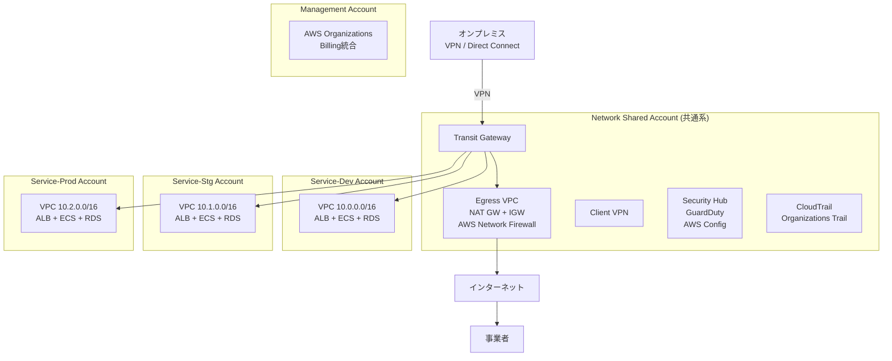

# 基本設計書 INDEX

**プロジェクト名**: 役所設備管理システム AWS ECS 移行プロジェクト
**作成日**: 2025-10-25
**バージョン**: 1.0
**ステータス**: レビュー待ち

---

## プロジェクト概要

### 目的
現行の設備管理システム（EC2ベース）をAWS ECS（Fargate）に移行し、以下を実現する：
- サーバー管理の負荷削減（月20時間 → 月5時間、75%削減）
- 可用性向上（99.9%目標）
- 自動スケーリング対応
- ISMAP準拠のセキュアなシステム基盤

### スコープ
- **インフラ構築**: マルチアカウント構成（共通系、dev、stg、prod）
- **コンテナ化**: ECS Fargate（業務API、事業者API、バッチ）
- **ネットワーク**: Transit Gateway + Egress VPC（AWS Network Firewall）
- **認証**: Amazon Cognito（職員用・事業者用）
- **CI/CD**: GitHub Actions
- **サンプルアプリ**: 動作確認用の最小限実装（Node.js + Express + React）

---

## ドキュメント構成

| No | ドキュメント | 概要 | ページ数 | レビュー状況 |
|----|------------|------|---------|-------------|
| 1 | [01_システムアーキテクチャ.md](01_システムアーキテクチャ.md) | 全体構成図、システム構成要素、マルチアカウント戦略 | - | 🔄 レビュー待ち |
| 2 | [02_ネットワーク設計.md](02_ネットワーク設計.md) | VPC、サブネット、Transit Gateway、ルーティング | - | 🔄 レビュー待ち |
| 3 | [03_セキュリティ設計.md](03_セキュリティ設計.md) | Security Groups、WAF、認証、暗号化、ISMAP準拠 | - | 🔄 レビュー待ち |
| 4 | [04_監査・コンプライアンス設計.md](04_監査・コンプライアンス設計.md) | CloudTrail、ログ保管、証跡管理、法令準拠 | - | 🔄 レビュー待ち |
| 5 | [05_データベース設計.md](05_データベース設計.md) | RDS構成、バックアップ戦略、マルチAZ | - | 🔄 レビュー待ち |
| 6 | [06_コンピュート設計.md](06_コンピュート設計.md) | ECS、ALB、AutoScaling、タスク定義 | - | 🔄 レビュー待ち |
| 7 | [07_フロントエンド設計.md](07_フロントエンド設計.md) | CloudFront、S3、職員用・事業者用配信 | - | 🔄 レビュー待ち |
| 8 | [08_監視・アラート設計.md](08_監視・アラート設計.md) | CloudWatch、SNS、通知（Slack/Teams） | - | 🔄 レビュー待ち |
| 9 | [09_CI_CD設計.md](09_CI_CD設計.md) | GitHub Actions、デプロイフロー、Change Set | - | 🔄 レビュー待ち |
| 10 | [10_CloudFormation構成方針.md](10_CloudFormation構成方針.md) | ファイル分割3原則、スタック分割戦略 | - | 🔄 レビュー待ち |
| 11 | [11_非機能要件実現方針.md](11_非機能要件実現方針.md) | 性能、可用性、スケーラビリティ | - | 🔄 レビュー待ち |
| 12 | [12_災害対策・BCP.md](12_災害対策・BCP.md) | DR戦略、バックアップ、復旧手順 | - | 🔄 レビュー待ち |
| 13 | [13_移行計画.md](13_移行計画.md) | スケジュール、データ移行、切り替え | - | 🔄 レビュー待ち |

---

## 重要な設計判断（ADR サマリー）

### ADR-001: マルチアカウント構成の採用
**決定**: AWS Organizationsによるマルチアカウント構成（共通系 + サービス系3環境）
**理由**:
- セキュリティ境界の明確化（環境間の完全分離）
- 請求の分離（環境別コスト把握）
- ISMAP準拠（政府情報システムの推奨構成）

**代替案との比較**:
- 単一アカウント + 複数VPC: セキュリティ境界が弱い
- アカウント完全分離（TGWなし）: ネットワーク管理が煩雑

### ADR-002: Transit Gatewayによるネットワークハブ構成
**決定**: Transit Gatewayを共通系アカウントに配置し、すべてのVPCを接続
**理由**:
- 拡張性（新規VPCの追加が容易）
- 集中管理（ルーティング、ファイアウォール）
- オンプレミス接続の一元化（Direct Connect Gateway / VPN）

### ADR-003: ECS Fargateの採用
**決定**: EC2ではなくECS Fargateを採用
**理由**:
- サーバー管理工数削減（OSレベルの管理不要）
- 自動スケーリング対応
- セキュリティパッチ適用の自動化

**トレードオフ**:
- コスト: EC2より割高だが、運用工数削減で総コストは削減
- 制約: インスタンスへの直接SSHアクセス不可（Systems Manager Session Manager使用）

### ADR-004: RDS PostgreSQL 14の採用
**決定**: PostgreSQL 14をRDSで運用
**理由**:
- 既存システムとの互換性（現行もPostgreSQL）
- トランザクション整合性（ACID保証）
- RDSマネージド運用（バックアップ、パッチ適用自動化）

### ADR-005: Amazon Cognitoによる認証
**決定**: 職員用・事業者用でCognitoユーザープールを分離
**理由**:
- データ分離（事業者は自社の伝票のみアクセス）
- マネージド認証サービス（MFA、パスワードポリシー、JWT発行）
- IAMとの統合

### ADR-006: CloudFormationの採用
**決定**: TerraformではなくAWS CloudFormationを採用
**理由**:
- AWSネイティブ（Change Sets、ドリフト検出）
- 運用担当者のスキルセット（AWS CLI / CloudFormation経験あり）
- ISMAP準拠のセキュリティレビューが容易

### ADR-007: ローリングアップデートの採用
**決定**: Blue/GreenではなくECSローリングアップデートを採用
**理由**:
- 週1回のデプロイ頻度（メンテナンス時間中）
- シンプルな運用（Blue/Greenの複雑性が不要）
- 数分のダウンタイム許容（メンテナンス時間中のため問題なし）

**将来の拡張**:
- デプロイ頻度が増えた場合、Blue/Greenに切り替え可能

---

## アーキテクチャ概要図

---

## 非機能要件サマリー

| 項目 | 目標値 | 実現方法 |
|------|--------|---------|
| 可用性 | 99.9% | マルチAZ構成（ECS、RDS、ALB） |
| 応答時間（95%ile） | 500ms以内 | オートスケーリング、RDSチューニング |
| RTO（復旧時間目標） | 1時間以内 | マルチAZ自動フェイルオーバー |
| RPO（復旧ポイント目標） | 5分以内 | RDS PITR（ポイントインタイムリカバリ） |
| セキュリティ | ISMAP準拠 | 暗号化（保存時・転送時）、監査ログ2年保管 |
| 運用工数削減 | 75%削減 | Fargateによるサーバーレス化 |

---

## デプロイ戦略

### フェーズ1: 共通系アカウント構築
- Transit Gateway、Egress VPC、Network Firewall、Client VPN
- Security Hub、CloudTrail（Organizations Trail）

### フェーズ2: 開発環境構築（service-dev）
- 動作確認、ルーティング検証、アプリケーション開発

### フェーズ3: ステージング環境構築（service-stg）
- 本番前検証、負荷テスト

### フェーズ4: 本番環境構築（service-prod）
- 本番稼働

---

## レビュー・承認

### レビュー担当者
- インフラ担当者: （未定）
- セキュリティ担当者: （未定）
- アプリケーション開発チーム: （未定）

### 承認者
- （未定）

### 承認日
- （未定）

---

## 変更履歴

| 日付 | バージョン | 変更内容 | 変更者 |
|------|----------|---------|--------|
| 2025-10-25 | 1.0 | 初版作成 | Architect（Claude） |

---

**次のステップ**: 各ドキュメントのレビューを実施し、承認後に実装フェーズへ進む。
