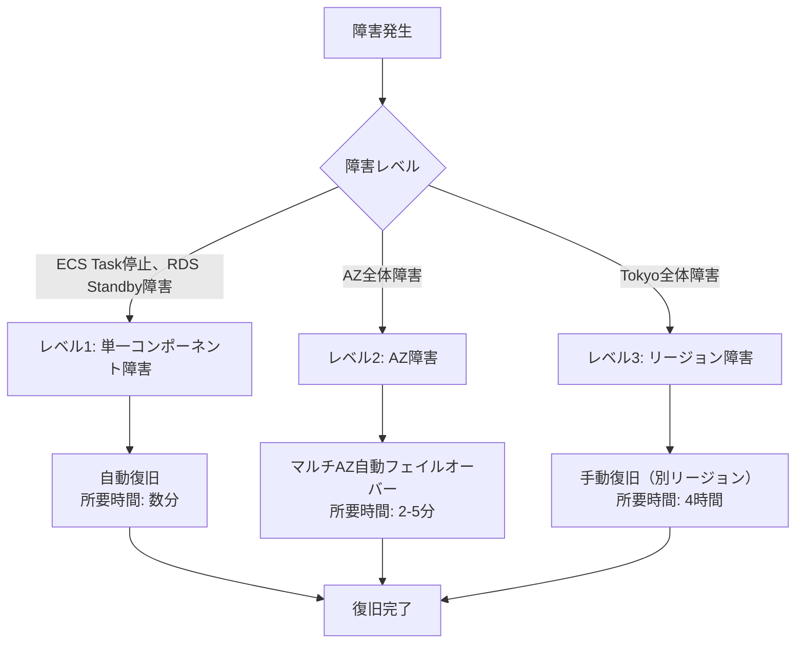
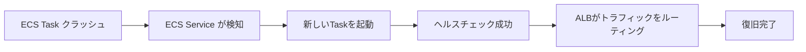
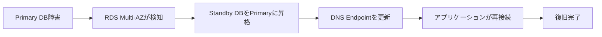

# DR手順書（Disaster Recovery）: 役所設備管理システム

**作成日**: 2025-10-25
**バージョン**: 1.0
**対象読者**: SRE、システム管理者、運用担当者

---

## 目次

1. [DR戦略概要](#dr戦略概要)
2. [災害時の復旧手順](#災害時の復旧手順)
3. [RTO/RPO](#rtorpo)
4. [定期的な復旧訓練計画](#定期的な復旧訓練計画)
5. [チェックリスト](#チェックリスト)

---

## DR戦略概要

### 災害シナリオと復旧方針



### 障害レベル定義

| レベル | 障害内容 | 影響範囲 | 復旧方法 | RTO | RPO |
|-------|---------|---------|---------|-----|-----|
| **レベル1** | 単一コンポーネント障害（ECS Task、RDS Standby） | 一部機能 | 自動復旧 | 5分 | 0（データ損失なし） |
| **レベル2** | AZ障害 | 単一AZ | マルチAZ自動フェイルオーバー | 5分 | 0（データ損失なし） |
| **レベル3** | リージョン障害（Tokyo全体） | 全サービス | 別リージョン手動復旧 | 4時間 | 1時間 |

---

## 災害時の復旧手順

### シナリオ1: ECS Task障害（レベル1）

#### 想定

- 単一ECS Taskのクラッシュ
- メモリ不足、アプリケーションエラー等

#### 自動復旧フロー



#### 手動対応（自動復旧失敗時）

```bash
# ステップ1: ECS Service状態確認
aws ecs describe-services \
  --cluster facility-prod-cluster \
  --services staff-api \
  --query 'services[0].{RunningCount:runningCount,DesiredCount:desiredCount}'

# ステップ2: 強制再デプロイ
aws ecs update-service \
  --cluster facility-prod-cluster \
  --service staff-api \
  --force-new-deployment

# ステップ3: 復旧確認
aws ecs wait services-stable \
  --cluster facility-prod-cluster \
  --services staff-api

# ステップ4: ヘルスチェック
curl -f https://admin-api.facility.example.com/health
```

**RTO**: 約5分
**RPO**: 0（データ損失なし）

---

### シナリオ2: RDS AZ障害（レベル2）

#### 想定

- Primary DBが配置されているAZの障害
- ネットワーク障害、データセンター障害

#### 自動フェイルオーバーフロー



#### 手動確認

```bash
# ステップ1: RDS状態確認
aws rds describe-db-instances \
  --db-instance-identifier facility-prod-db \
  --query 'DBInstances[0].{Status:DBInstanceStatus,MultiAZ:MultiAZ,AvailabilityZone:AvailabilityZone}'

# ステップ2: フェイルオーバーイベント確認
aws rds describe-events \
  --source-identifier facility-prod-db \
  --source-type db-instance \
  --duration 60

# ステップ3: アプリケーション接続確認
curl -f https://admin-api.facility.example.com/health
```

**RTO**: 約2-5分（AWSマネージド）
**RPO**: 0（データ損失なし、同期レプリケーション）

**重要**: フェイルオーバー中、数十秒～数分の接続断が発生。アプリケーションは自動リトライで復旧。

---

### シナリオ3: データ誤削除（レベル1）

#### 想定

- アプリケーションバグによるデータ誤削除
- 人為的ミス（DELETE文の誤実行）

#### PITR（ポイントインタイムリカバリ）による復旧

```bash
# ステップ1: 誤削除時刻の特定
# CloudWatch Logsから誤削除が発生した時刻を確認
aws logs filter-log-events \
  --log-group-name /ecs/staff-api \
  --filter-pattern "DELETE FROM orders"

# 例: 2025-10-25 12:35:00 に誤削除

# ステップ2: 誤削除直前（12:30:00）の状態に復元
aws rds restore-db-instance-to-point-in-time \
  --source-db-instance-identifier facility-prod-db \
  --target-db-instance-identifier facility-prod-db-pitr-20251025-1230 \
  --restore-time 2025-10-25T12:30:00Z \
  --vpc-security-group-ids sg-xxxxx \
  --db-subnet-group-name facility-prod-db-subnet-group

# ステップ3: 復元完了待機（約15分）
aws rds wait db-instance-available \
  --db-instance-identifier facility-prod-db-pitr-20251025-1230

# ステップ4: 復元されたDBに接続してデータ確認
psql -h facility-prod-db-pitr-20251025-1230.xxxxxxxx.ap-northeast-1.rds.amazonaws.com \
  -U admin -d facility

# ステップ5: 誤削除されたデータをエクスポート
pg_dump -h facility-prod-db-pitr-20251025-1230.xxxxxxxx.ap-northeast-1.rds.amazonaws.com \
  -U admin -d facility -t orders --data-only > recovered_data.sql

# ステップ6: 本番DBにインポート
psql -h facility-prod-db.xxxxxxxx.ap-northeast-1.rds.amazonaws.com \
  -U admin -d facility -f recovered_data.sql

# ステップ7: データ整合性確認
psql -h facility-prod-db.xxxxxxxx.ap-northeast-1.rds.amazonaws.com \
  -U admin -d facility -c "SELECT COUNT(*) FROM orders WHERE created_at >= '2025-10-25';"

# ステップ8: 復元用DBを削除（コスト削減）
aws rds delete-db-instance \
  --db-instance-identifier facility-prod-db-pitr-20251025-1230 \
  --skip-final-snapshot
```

**RTO**: 約30分
**RPO**: 5分以内（トランザクションログから復元）

**重要**: PITRは35日間有効。それ以前のデータは手動スナップショットから復元。

---

### シナリオ4: Tokyoリージョン全障害（レベル3）

#### 想定

- Tokyo（ap-northeast-1）全体の障害（極めて稀）
- 地震、大規模停電等

#### 前提条件

- **現状**: Osakaリージョンに待機環境なし
- **復旧方法**: バックアップから別リージョンに再構築

#### 復旧手順（Osakaリージョンへのフェイルオーバー）

**注意**: 以下は訓練を想定した手順です。実際の災害時は状況に応じて調整してください。

```bash
# ===== フェーズ1: 準備（平時） =====

# 1. CloudFormationテンプレートをGitHubにバックアップ（完了済み）
# 2. RDSスナップショットを毎日Osakaリージョンにコピー
aws rds copy-db-snapshot \
  --source-db-snapshot-identifier arn:aws:rds:ap-northeast-1:123456789012:snapshot:facility-prod-db-automated-2025-10-25-02-00 \
  --target-db-snapshot-identifier facility-prod-db-dr-20251025 \
  --source-region ap-northeast-1 \
  --region ap-northeast-3 \
  --kms-key-id arn:aws:kms:ap-northeast-3:123456789012:key/xxxxxxxx


# ===== フェーズ2: 災害発生時の復旧（Osakaリージョン） =====

# ステップ1: S3バケット作成（ネステッドテンプレート保管用）
aws s3 mb s3://facility-cloudformation-templates-dr --region ap-northeast-3

# ステップ2: CloudFormationテンプレートをアップロード
cd infra/cloudformation/service
aws s3 sync nested/ s3://facility-cloudformation-templates-dr/nested/ --region ap-northeast-3

# ステップ3: ネットワークスタックをデプロイ
aws cloudformation create-stack \
  --stack-name facility-dr-network \
  --template-body file://nested/network/main.yaml \
  --parameters file://parameters/dr-osaka.json \
  --region ap-northeast-3

# 待機（約10分）
aws cloudformation wait stack-create-complete \
  --stack-name facility-dr-network \
  --region ap-northeast-3

# ステップ4: RDSスナップショットから復元
aws rds restore-db-instance-from-db-snapshot \
  --db-instance-identifier facility-dr-db \
  --db-snapshot-identifier facility-prod-db-dr-20251025 \
  --db-instance-class db.t4g.medium \
  --vpc-security-group-ids sg-yyyyyyyyy \
  --db-subnet-group-name facility-dr-db-subnet-group \
  --region ap-northeast-3 \
  --publicly-accessible false

# 待機（約15分）
aws rds wait db-instance-available \
  --db-instance-identifier facility-dr-db \
  --region ap-northeast-3

# ステップ5: Cognito User Pool作成
aws cloudformation create-stack \
  --stack-name facility-dr-auth \
  --template-body file://nested/auth/main.yaml \
  --parameters file://parameters/dr-osaka.json \
  --region ap-northeast-3

# ステップ6: ECS + ALB スタックをデプロイ
aws cloudformation create-stack \
  --stack-name facility-dr-compute \
  --template-body file://nested/compute/main.yaml \
  --parameters file://parameters/dr-osaka.json \
  --capabilities CAPABILITY_IAM \
  --region ap-northeast-3

# 待機（約20分）
aws cloudformation wait stack-create-complete \
  --stack-name facility-dr-compute \
  --region ap-northeast-3

# ステップ7: フロントエンド（S3 + CloudFront）デプロイ
aws cloudformation create-stack \
  --stack-name facility-dr-frontend \
  --template-body file://nested/frontend/main.yaml \
  --parameters file://parameters/dr-osaka.json \
  --region ap-northeast-3

# ステップ8: Dockerイメージをプッシュ（Osaka ECRに）
aws ecr get-login-password --region ap-northeast-3 | \
  docker login --username AWS --password-stdin <AWS_ACCOUNT_ID>.dkr.ecr.ap-northeast-3.amazonaws.com

docker tag staff-api:latest <AWS_ACCOUNT_ID>.dkr.ecr.ap-northeast-3.amazonaws.com/staff-api:latest
docker push <AWS_ACCOUNT_ID>.dkr.ecr.ap-northeast-3.amazonaws.com/staff-api:latest

# ステップ9: Route53でフェイルオーバー（DNSを大阪に向ける）
aws route53 change-resource-record-sets \
  --hosted-zone-id Z1234567890ABC \
  --change-batch file://osaka-failover.json
```

**osaka-failover.json**:

```json
{
  "Changes": [
    {
      "Action": "UPSERT",
      "ResourceRecordSet": {
        "Name": "admin-api.facility.example.com",
        "Type": "A",
        "AliasTarget": {
          "HostedZoneId": "Z2YQB5RD63NC85",
          "DNSName": "facility-dr-alb-xxxxxxxx.ap-northeast-3.elb.amazonaws.com",
          "EvaluateTargetHealth": true
        }
      }
    }
  ]
}
```

```bash
# ステップ10: 動作確認
curl -f https://admin-api.facility.example.com/health

# ステップ11: ユーザーに復旧通知
echo "システムが復旧しました。大阪リージョンで稼働中です。" | mail -s "緊急メンテナンス完了" staff@example.com
```

**RTO**: 約4時間（手動作業含む）
**RPO**: 最大24時間（最新スナップショット）

**データ損失**:
- 最新のスナップショット（深夜2:00作成）から復元
- 最大24時間分のデータ損失リスク
- **改善策**: Osakaリージョンにリードレプリカを配置（フェーズ2で検討）

---

## RTO/RPO

### RTO（Recovery Time Objective）: 目標復旧時間

| 障害シナリオ | RTO目標 | 実際の復旧時間 |
|------------|--------|--------------|
| ECS Task障害（レベル1） | 5分以内 | 2-5分（自動） |
| AZ障害（レベル2） | 5分以内 | 2-5分（自動） |
| データ誤削除（レベル1） | 1時間以内 | 30分（手動） |
| Tokyoリージョン障害（レベル3） | 4時間以内 | 4時間（手動） |

### RPO（Recovery Point Objective）: 目標復旧時点

| 障害シナリオ | RPO目標 | データ損失 |
|------------|--------|-----------|
| ECS Task障害（レベル1） | 0 | なし |
| AZ障害（レベル2） | 0 | なし（同期レプリケーション） |
| データ誤削除（レベル1） | 5分以内 | 最大5分（PITR） |
| Tokyoリージョン障害（レベル3） | 1時間以内 | 最大24時間（最新スナップショット） |

**重要**: レベル3のRPO改善にはクロスリージョンレプリケーションが必要（フェーズ2で検討）。

---

## 定期的な復旧訓練計画

### 訓練の目的

- DR手順書の有効性確認
- 復旧手順の習熟
- RTOの検証
- 手順書の更新

### 訓練スケジュール

| 訓練内容 | 頻度 | 実施時期 | 所要時間 | 参加者 |
|---------|------|---------|---------|--------|
| **バックアップ復元訓練** | 四半期ごと | 4月、7月、10月、1月 | 2時間 | SRE、運用担当者 |
| **RDS PITR訓練** | 半年ごと | 4月、10月 | 1時間 | SRE |
| **RDSフェイルオーバー訓練** | 年1回 | 4月 | 3時間 | SRE、開発チーム、PM |
| **リージョン障害訓練** | 年1回 | 10月 | 4時間 | SRE、開発チーム、PM、ベンダー |

### 訓練1: バックアップ復元訓練

**目的**: RDSスナップショットから復旧できることを確認

**手順**:

1. 本番DBの最新スナップショットを取得
2. 訓練用DBインスタンスとして復元（`facility-prod-db-drill`）
3. アプリケーションから接続確認
4. データ整合性確認（レコード数、サンプルデータ）
5. 訓練用DBを削除

**チェックリスト**:

- [ ] スナップショット取得成功
- [ ] 復元成功（約15分）
- [ ] 接続確認成功
- [ ] データ整合性確認
- [ ] RTO目標達成（1時間以内）
- [ ] 手順書更新（改善点を記録）

**実施コマンド**:

```bash
# 1. 手動スナップショット作成
aws rds create-db-snapshot \
  --db-instance-identifier facility-prod-db \
  --db-snapshot-identifier facility-prod-db-drill-$(date +%Y%m%d)

# 2. スナップショットから復元
aws rds restore-db-instance-from-db-snapshot \
  --db-instance-identifier facility-prod-db-drill \
  --db-snapshot-identifier facility-prod-db-drill-$(date +%Y%m%d) \
  --db-subnet-group-name facility-prod-db-subnet-group \
  --vpc-security-group-ids sg-xxxxx

# 3. 接続確認
psql -h facility-prod-db-drill.xxxxxxxx.ap-northeast-1.rds.amazonaws.com \
  -U admin -d facility -c "SELECT COUNT(*) FROM orders;"

# 4. 訓練用DBを削除
aws rds delete-db-instance \
  --db-instance-identifier facility-prod-db-drill \
  --skip-final-snapshot
```

---

### 訓練2: RDS PITR訓練

**目的**: ポイントインタイムリカバリが正常に動作することを確認

**手順**:

1. 現在時刻を記録
2. 1時間前の時点に復元（`facility-prod-db-pitr-drill`）
3. データ差分確認
4. 訓練用DBを削除

**実施コマンド**:

```bash
# 1時間前の状態に復元
aws rds restore-db-instance-to-point-in-time \
  --source-db-instance-identifier facility-prod-db \
  --target-db-instance-identifier facility-prod-db-pitr-drill \
  --restore-time $(date -u -d '1 hour ago' +%Y-%m-%dT%H:%M:%S)

# データ確認
psql -h facility-prod-db-pitr-drill.xxxxxxxx.ap-northeast-1.rds.amazonaws.com \
  -U admin -d facility -c "SELECT MAX(created_at) FROM orders;"

# 削除
aws rds delete-db-instance \
  --db-instance-identifier facility-prod-db-pitr-drill \
  --skip-final-snapshot
```

---

### 訓練3: RDSフェイルオーバー訓練

**目的**: Multi-AZフェイルオーバーが正常に動作することを確認

**手順**:

1. メンテナンスウィンドウ設定（日曜日 深夜2:00）
2. 手動フェイルオーバー実行
3. ダウンタイム測定
4. アプリケーション動作確認
5. Primary/Standby が入れ替わったことを確認

**実施コマンド**:

```bash
# 1. 現在のAZ確認
aws rds describe-db-instances \
  --db-instance-identifier facility-prod-db \
  --query 'DBInstances[0].AvailabilityZone'

# 2. 手動フェイルオーバー実行
aws rds reboot-db-instance \
  --db-instance-identifier facility-prod-db \
  --force-failover

# 3. フェイルオーバー完了待機
aws rds wait db-instance-available \
  --db-instance-identifier facility-prod-db

# 4. 新しいAZ確認
aws rds describe-db-instances \
  --db-instance-identifier facility-prod-db \
  --query 'DBInstances[0].AvailabilityZone'

# 5. アプリケーション接続確認
curl -f https://admin-api.facility.example.com/health
```

**チェックリスト**:

- [ ] フェイルオーバー成功
- [ ] ダウンタイム測定（目標: 2分以内）
- [ ] アプリケーション自動復旧確認
- [ ] AZ切り替わり確認
- [ ] 手順書更新

---

### 訓練4: リージョン障害訓練

**目的**: Tokyoリージョン障害時に別リージョンで復旧できることを確認

**手順**:

1. Osakaリージョンにネットワークスタックをデプロイ
2. RDSスナップショットから復元
3. ECS + ALB をデプロイ
4. Route53でフェイルオーバー（テスト用FQDN）
5. 動作確認
6. すべてのリソースを削除（コスト削減）

**注意**: 本番環境には影響しないようにテスト用のFQDNを使用。

**チェックリスト**:

- [ ] Osakaリージョンへのデプロイ成功
- [ ] RTO目標達成（4時間以内）
- [ ] アプリケーション動作確認
- [ ] 手順書更新

---

## チェックリスト

### 災害発生時の初動対応

- [ ] 障害レベルの判定（レベル1/2/3）
- [ ] 関係者への連絡（PM、開発チーム、ベンダー）
- [ ] CloudWatch Alarms、Dashboard の確認
- [ ] 障害状況の記録開始（発生時刻、影響範囲）

### 復旧作業中

- [ ] 復旧手順に従って作業
- [ ] 作業ログを記録（コマンド、結果、時刻）
- [ ] 進捗を定期的に報告（30分ごと）

### 復旧完了後

- [ ] 全機能の動作確認
- [ ] ユーザーへの復旧通知
- [ ] ポストモーテム作成（根本原因、対策）
- [ ] DR手順書の更新

---

**作成者**: SRE（Claude）
**承認者**: （未定）
**最終更新**: 2025-10-25

---

## 付録: 緊急連絡先

| 役割 | 連絡先 | 対応内容 |
|------|--------|---------|
| PM（プロジェクトマネージャー） | （未定） | 意思決定、ユーザーへの説明 |
| システム管理者 | （未定） | 復旧作業の指揮 |
| SRE（当番） | （未定） | 復旧作業の実施 |
| 開発チーム | （未定） | アプリケーションエラー対応 |
| AWSサポート（プレミアムサポート） | AWSコンソールからチケット作成 | インフラ障害対応 |
